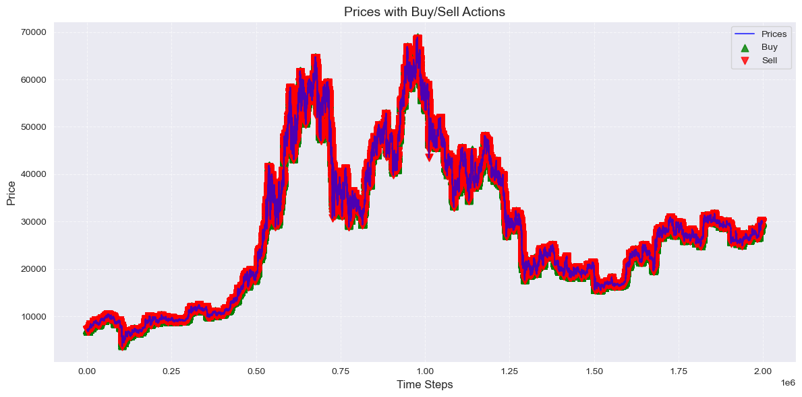
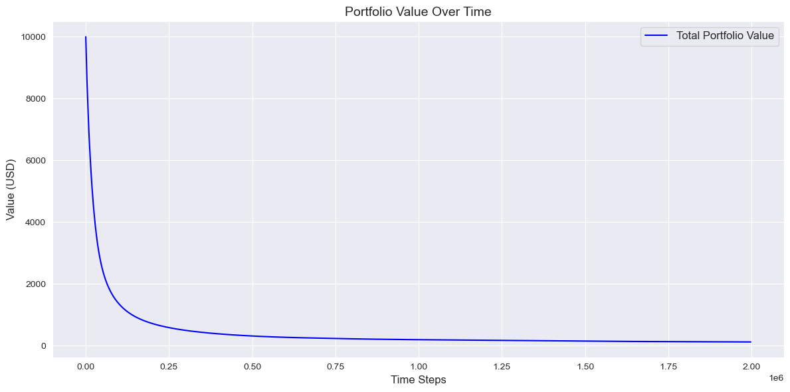
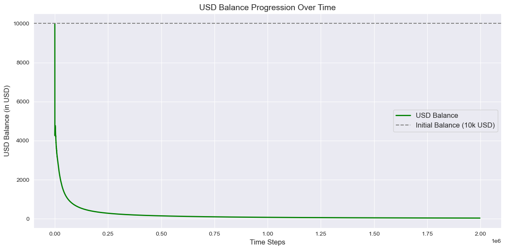
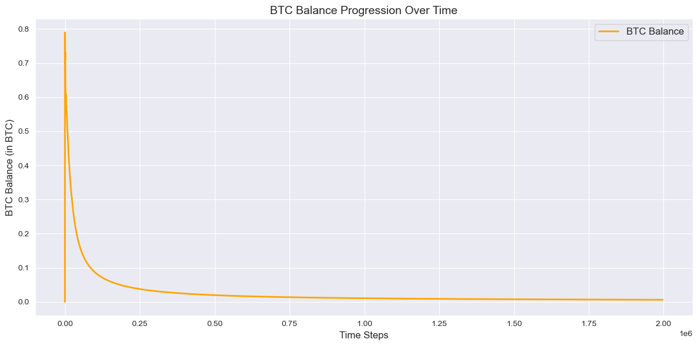
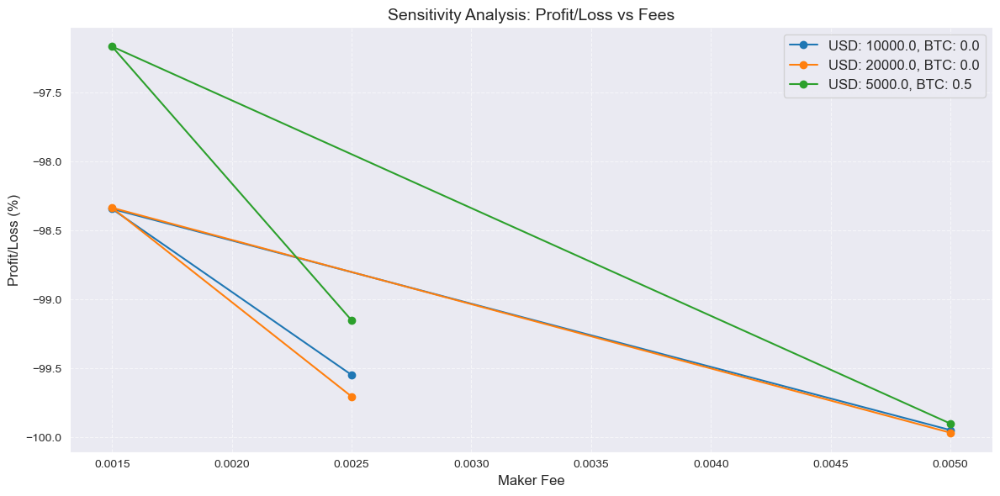

```python
import builtins
from tqdm import tqdm
```


```python
# Output path
output_path = '../export/simulators/emotional_trader/'
```


```python
# Run the input processing notebook to prepare input
%run "../helpers/data-processing.ipynb"
```

    Missing values in the dataset


<div>
<style scoped>
    .dataframe tbody tr th:only-of-type {
        vertical-align: middle;
    }

    .dataframe tbody tr th {
        vertical-align: top;
    }

    .dataframe thead th {
        text-align: right;
    }
</style>
<table border="1" class="dataframe">
  <thead>
    <tr style="text-align: right;">
      <th></th>
      <th>Column</th>
      <th>Missing Count</th>
      <th>Missing Percentage</th>
      <th>Action</th>
    </tr>
  </thead>
  <tbody>
    <tr>
      <th>0</th>
      <td>date</td>
      <td>0</td>
      <td>0.000000</td>
      <td>No Missing Values</td>
    </tr>
    <tr>
      <th>1</th>
      <td>open</td>
      <td>0</td>
      <td>0.000000</td>
      <td>No Missing Values</td>
    </tr>
    <tr>
      <th>2</th>
      <td>high</td>
      <td>0</td>
      <td>0.000000</td>
      <td>No Missing Values</td>
    </tr>
    <tr>
      <th>3</th>
      <td>low</td>
      <td>0</td>
      <td>0.000000</td>
      <td>No Missing Values</td>
    </tr>
    <tr>
      <th>4</th>
      <td>close</td>
      <td>0</td>
      <td>0.000000</td>
      <td>No Missing Values</td>
    </tr>
    <tr>
      <th>5</th>
      <td>Volume USDT</td>
      <td>0</td>
      <td>0.000000</td>
      <td>No Missing Values</td>
    </tr>
    <tr>
      <th>6</th>
      <td>tradecount</td>
      <td>0</td>
      <td>0.000000</td>
      <td>No Missing Values</td>
    </tr>
    <tr>
      <th>7</th>
      <td>ema_5</td>
      <td>0</td>
      <td>0.000000</td>
      <td>No Missing Values</td>
    </tr>
    <tr>
      <th>8</th>
      <td>ema_15</td>
      <td>0</td>
      <td>0.000000</td>
      <td>No Missing Values</td>
    </tr>
    <tr>
      <th>9</th>
      <td>ema_30</td>
      <td>0</td>
      <td>0.000000</td>
      <td>No Missing Values</td>
    </tr>
    <tr>
      <th>10</th>
      <td>ema_60</td>
      <td>0</td>
      <td>0.000000</td>
      <td>No Missing Values</td>
    </tr>
    <tr>
      <th>11</th>
      <td>ema_100</td>
      <td>0</td>
      <td>0.000000</td>
      <td>No Missing Values</td>
    </tr>
    <tr>
      <th>12</th>
      <td>ema_200</td>
      <td>0</td>
      <td>0.000000</td>
      <td>No Missing Values</td>
    </tr>
    <tr>
      <th>13</th>
      <td>WMA</td>
      <td>13</td>
      <td>0.000651</td>
      <td>Filled with median (26752.13)</td>
    </tr>
    <tr>
      <th>14</th>
      <td>MACD</td>
      <td>25</td>
      <td>0.001252</td>
      <td>Filled with median (-0.08)</td>
    </tr>
    <tr>
      <th>15</th>
      <td>MACD_Signal</td>
      <td>33</td>
      <td>0.001652</td>
      <td>Filled with median (0.00)</td>
    </tr>
    <tr>
      <th>16</th>
      <td>MACD_Hist</td>
      <td>33</td>
      <td>0.001652</td>
      <td>Filled with median (-0.10)</td>
    </tr>
    <tr>
      <th>17</th>
      <td>ATR</td>
      <td>14</td>
      <td>0.000701</td>
      <td>Filled with median (25.15)</td>
    </tr>
    <tr>
      <th>18</th>
      <td>HMA</td>
      <td>11</td>
      <td>0.000551</td>
      <td>Filled with median (26751.02)</td>
    </tr>
    <tr>
      <th>19</th>
      <td>KAMA</td>
      <td>9</td>
      <td>0.000451</td>
      <td>Filled with median (26751.57)</td>
    </tr>
    <tr>
      <th>20</th>
      <td>CMO</td>
      <td>14</td>
      <td>0.000701</td>
      <td>Filled with median (-0.12)</td>
    </tr>
    <tr>
      <th>21</th>
      <td>Z-Score</td>
      <td>154</td>
      <td>0.007711</td>
      <td>Filled with median (-0.01)</td>
    </tr>
    <tr>
      <th>22</th>
      <td>QStick</td>
      <td>9</td>
      <td>0.000451</td>
      <td>Filled with median (0.01)</td>
    </tr>
  </tbody>
</table>
</div>


    
    Dropped features with correlation higher than 90%: {'ema_15', 'Z-Score', 'ema_60', 'ema_200', 'WMA', 'ema_100', 'ema_30', 'MACD_Hist', 'KAMA', 'HMA', 'ema_5'}
    
    Shape of X: (1997210, 12)


<div>
<style scoped>
    .dataframe tbody tr th:only-of-type {
        vertical-align: middle;
    }

    .dataframe tbody tr th {
        vertical-align: top;
    }

    .dataframe thead th {
        text-align: right;
    }
</style>
<table border="1" class="dataframe">
  <thead>
    <tr style="text-align: right;">
      <th></th>
      <th>date</th>
      <th>price</th>
      <th>Volume USDT</th>
      <th>tradecount</th>
      <th>MACD</th>
      <th>MACD_Signal</th>
      <th>ATR</th>
      <th>CMO</th>
      <th>QStick</th>
      <th>price_change_ratio</th>
      <th>trade_volume_ratio</th>
      <th>high_low_spread</th>
    </tr>
  </thead>
  <tbody>
    <tr>
      <th>0</th>
      <td>1.577837e+09</td>
      <td>7180.720</td>
      <td>509146.0</td>
      <td>140.0</td>
      <td>0.728704</td>
      <td>-0.152219</td>
      <td>4.684925</td>
      <td>4.193879</td>
      <td>0.120</td>
      <td>0.000000</td>
      <td>3636.757143</td>
      <td>0.000</td>
    </tr>
    <tr>
      <th>1</th>
      <td>1.577837e+09</td>
      <td>7178.470</td>
      <td>713540.0</td>
      <td>148.0</td>
      <td>0.736887</td>
      <td>-0.182091</td>
      <td>4.698380</td>
      <td>0.859360</td>
      <td>0.528</td>
      <td>-0.000313</td>
      <td>4821.216216</td>
      <td>-2.250</td>
    </tr>
    <tr>
      <th>2</th>
      <td>1.577837e+09</td>
      <td>7179.440</td>
      <td>497793.0</td>
      <td>104.0</td>
      <td>0.846578</td>
      <td>-0.117923</td>
      <td>4.609025</td>
      <td>11.466626</td>
      <td>0.493</td>
      <td>0.000135</td>
      <td>4786.471154</td>
      <td>0.970</td>
    </tr>
    <tr>
      <th>3</th>
      <td>1.577837e+09</td>
      <td>7177.175</td>
      <td>698627.0</td>
      <td>193.0</td>
      <td>0.650488</td>
      <td>-0.343494</td>
      <td>4.398181</td>
      <td>-7.962104</td>
      <td>-0.425</td>
      <td>-0.000315</td>
      <td>3619.829016</td>
      <td>-2.265</td>
    </tr>
    <tr>
      <th>4</th>
      <td>1.577837e+09</td>
      <td>7175.160</td>
      <td>241980.0</td>
      <td>124.0</td>
      <td>0.987398</td>
      <td>-0.092457</td>
      <td>4.262656</td>
      <td>-6.795307</td>
      <td>-0.131</td>
      <td>-0.000281</td>
      <td>1951.451613</td>
      <td>-2.015</td>
    </tr>
    <tr>
      <th>...</th>
      <td>...</td>
      <td>...</td>
      <td>...</td>
      <td>...</td>
      <td>...</td>
      <td>...</td>
      <td>...</td>
      <td>...</td>
      <td>...</td>
      <td>...</td>
      <td>...</td>
      <td>...</td>
    </tr>
    <tr>
      <th>1997205</th>
      <td>1.698019e+09</td>
      <td>29966.285</td>
      <td>482950.0</td>
      <td>635.0</td>
      <td>-4056.925846</td>
      <td>-1909.922487</td>
      <td>926.278065</td>
      <td>-97.689989</td>
      <td>13.189</td>
      <td>-0.000401</td>
      <td>760.551181</td>
      <td>-12.020</td>
    </tr>
    <tr>
      <th>1997206</th>
      <td>1.698019e+09</td>
      <td>29970.500</td>
      <td>169682.0</td>
      <td>450.0</td>
      <td>-3657.565528</td>
      <td>-1988.042791</td>
      <td>996.882531</td>
      <td>-97.688910</td>
      <td>24.399</td>
      <td>0.000141</td>
      <td>377.071111</td>
      <td>4.215</td>
    </tr>
    <tr>
      <th>1997207</th>
      <td>1.698019e+09</td>
      <td>29975.100</td>
      <td>111271.0</td>
      <td>303.0</td>
      <td>-3095.229187</td>
      <td>-1922.717147</td>
      <td>1072.856572</td>
      <td>-97.688328</td>
      <td>32.045</td>
      <td>0.000153</td>
      <td>367.231023</td>
      <td>4.600</td>
    </tr>
    <tr>
      <th>1997208</th>
      <td>1.698019e+09</td>
      <td>29980.890</td>
      <td>169741.0</td>
      <td>631.0</td>
      <td>-2332.807178</td>
      <td>-1640.974425</td>
      <td>1154.492462</td>
      <td>-97.687019</td>
      <td>22.669</td>
      <td>0.000193</td>
      <td>269.003170</td>
      <td>5.790</td>
    </tr>
    <tr>
      <th>1997209</th>
      <td>1.698019e+09</td>
      <td>29988.730</td>
      <td>321595.0</td>
      <td>861.0</td>
      <td>-1326.581600</td>
      <td>-1044.992454</td>
      <td>1242.094190</td>
      <td>-97.685909</td>
      <td>18.319</td>
      <td>0.000261</td>
      <td>373.513357</td>
      <td>7.840</td>
    </tr>
  </tbody>
</table>
<p>1997210 rows × 12 columns</p>
</div>


    
    Shape of y: (1997210,)


<div>
<style scoped>
    .dataframe tbody tr th:only-of-type {
        vertical-align: middle;
    }

    .dataframe tbody tr th {
        vertical-align: top;
    }

    .dataframe thead th {
        text-align: right;
    }
</style>
<table border="1" class="dataframe">
  <thead>
    <tr style="text-align: right;">
      <th></th>
      <th>price_direction</th>
    </tr>
  </thead>
  <tbody>
    <tr>
      <th>0</th>
      <td>1</td>
    </tr>
    <tr>
      <th>1</th>
      <td>0</td>
    </tr>
    <tr>
      <th>2</th>
      <td>1</td>
    </tr>
    <tr>
      <th>3</th>
      <td>0</td>
    </tr>
    <tr>
      <th>4</th>
      <td>0</td>
    </tr>
  </tbody>
</table>
</div>


```python
# Convert `X` and `y` back to a DataFrame for easier manipulation
features = pd.DataFrame(X, columns=features.columns)  # Features from preprocessing
target = pd.Series(y, name="price_direction")         # Target column
```


```python
# Ensure the features and target align
prices = features['price'].values
predictions = target.values        # Binary predictions from target
```


```python
# Parameters
rolling_window = 14  # Rolling window for metrics
buy_fee = 0.0025  # 0.25% buy fee
sell_fee = 0.004  # 0.40% sell fee
```


```python
# Calculate rolling metrics using only prior input
rolling_mean = pd.Series(prices).rolling(window=rolling_window, min_periods=1).mean().values
rolling_std = pd.Series(prices).rolling(window=rolling_window, min_periods=1).std().fillna(0).values
momentum = prices - rolling_mean  # Positive or negative trend
```


```python
# Adjust probabilities based on current and prior input
P_buy = 0.5 + 0.3 * (momentum > 0)  # Higher buy probability for positive momentum
P_sell = 0.5 + 0.3 * (momentum < 0)  # Higher sell probability for negative momentum
```


```python
# Normalize probabilities so they sum to 1
total_probs = P_buy + P_sell
P_buy /= total_probs
P_sell /= total_probs
```


```python
# Initialize portfolio values
initial_capital = 10000.0  # USD
usd_balance = initial_capital  # Start with all USD
btc_balance = 0.0  # Start with no BTC
```


```python
# Tracking Variables
actions = []
trade_percentages = []
usd_balances = []
btc_balances = []
```


```python
# Iterate through each row to simulate trades with tqdm for progress tracking
for i in tqdm(range(len(prices)), desc="Simulating Trades", unit="trade"):
    # Set default action and trade percentage
    action = 'None'
    trade_percentage = 0.0

    # Skip early rows where rolling metrics aren't available
    if i < rolling_window:
        usd_balances.append(usd_balance)
        btc_balances.append(btc_balance)
        actions.append(action)
        trade_percentages.append(trade_percentage)
        continue

    # Use rolling metrics within the defined rolling window
    mean_price = rolling_mean[i - rolling_window:i].mean() if i >= rolling_window else rolling_mean[i]
    std_price = rolling_std[i - rolling_window:i].std() if i >= rolling_window else rolling_std[i]

    # Determine trade action and percentage
    if P_buy[i] > P_sell[i] and usd_balance > 0:
        # Buy decision
        trade_percentage = min(0.1 * P_buy[i], usd_balance / prices[i])
        usd_spent = trade_percentage * usd_balance
        btc_bought = (usd_spent * (1 - buy_fee)) / prices[i]  # Deduct fees
        usd_balance -= usd_spent
        btc_balance += btc_bought
        action = 'Buy'
    elif P_sell[i] > P_buy[i] and btc_balance > 0:
        # Sell decision
        trade_percentage = min(0.1 * P_sell[i], btc_balance)
        btc_to_sell = trade_percentage * btc_balance
        usd_gained = btc_to_sell * prices[i] * (1 - sell_fee)  # Deduct fees
        btc_balance -= btc_to_sell
        usd_balance += usd_gained
        action = 'Sell'

    # Record balances and actions
    usd_balances.append(usd_balance)
    btc_balances.append(btc_balance)
    actions.append(action)
    trade_percentages.append(trade_percentage)
```

    Simulating Trades: 100%|██████████| 1997210/1997210 [00:21<00:00, 93538.17trade/s]


```python
# Ensure all arrays have consistent length with `prices`
assert len(actions) == len(prices)
assert len(trade_percentages) == len(prices)
assert len(usd_balances) == len(prices)
assert len(btc_balances) == len(prices)
```


```python
# Export results
builtins.data = monte_carlo_df = pd.DataFrame({
    'prices': prices,  # Use real price input
    'rolling_mean': rolling_mean,
    'rolling_volatility': rolling_std,
    'momentum': momentum,
    'P_buy': P_buy,
    'P_sell': P_sell,
    'Action': actions,
    'Trade_Percentage': trade_percentages,
    'USD_Balance': usd_balances,
    'BTC_Balance': btc_balances
})
```


```python
%run "../helpers/trades.ipynb"
```

    Trading Log:


<div>
<style scoped>
    .dataframe tbody tr th:only-of-type {
        vertical-align: middle;
    }

    .dataframe tbody tr th {
        vertical-align: top;
    }

    .dataframe thead th {
        text-align: right;
    }
</style>
<table border="1" class="dataframe">
  <thead>
    <tr style="text-align: right;">
      <th></th>
      <th>prices</th>
      <th>rolling_mean</th>
      <th>rolling_volatility</th>
      <th>momentum</th>
      <th>P_buy</th>
      <th>P_sell</th>
      <th>Action</th>
      <th>Trade_Percentage</th>
      <th>USD_Balance</th>
      <th>BTC_Balance</th>
      <th>Total_Capital</th>
    </tr>
  </thead>
  <tbody>
    <tr>
      <th>0</th>
      <td>7180.720</td>
      <td>7180.720000</td>
      <td>0.000000</td>
      <td>0.000000</td>
      <td>0.500000</td>
      <td>0.500000</td>
      <td>None</td>
      <td>0.000000</td>
      <td>10000.000000</td>
      <td>0.000000</td>
      <td>10000.000000</td>
    </tr>
    <tr>
      <th>1</th>
      <td>7178.470</td>
      <td>7179.595000</td>
      <td>1.590990</td>
      <td>-1.125000</td>
      <td>0.384615</td>
      <td>0.615385</td>
      <td>None</td>
      <td>0.000000</td>
      <td>10000.000000</td>
      <td>0.000000</td>
      <td>10000.000000</td>
    </tr>
    <tr>
      <th>2</th>
      <td>7179.440</td>
      <td>7179.543333</td>
      <td>1.128554</td>
      <td>-0.103333</td>
      <td>0.384615</td>
      <td>0.615385</td>
      <td>None</td>
      <td>0.000000</td>
      <td>10000.000000</td>
      <td>0.000000</td>
      <td>10000.000000</td>
    </tr>
    <tr>
      <th>3</th>
      <td>7177.175</td>
      <td>7178.951250</td>
      <td>1.500446</td>
      <td>-1.776250</td>
      <td>0.384615</td>
      <td>0.615385</td>
      <td>None</td>
      <td>0.000000</td>
      <td>10000.000000</td>
      <td>0.000000</td>
      <td>10000.000000</td>
    </tr>
    <tr>
      <th>4</th>
      <td>7175.160</td>
      <td>7178.193000</td>
      <td>2.136169</td>
      <td>-3.033000</td>
      <td>0.384615</td>
      <td>0.615385</td>
      <td>None</td>
      <td>0.000000</td>
      <td>10000.000000</td>
      <td>0.000000</td>
      <td>10000.000000</td>
    </tr>
    <tr>
      <th>...</th>
      <td>...</td>
      <td>...</td>
      <td>...</td>
      <td>...</td>
      <td>...</td>
      <td>...</td>
      <td>...</td>
      <td>...</td>
      <td>...</td>
      <td>...</td>
      <td>...</td>
    </tr>
    <tr>
      <th>1997205</th>
      <td>29966.285</td>
      <td>29987.638214</td>
      <td>12.001177</td>
      <td>-21.353214</td>
      <td>0.384615</td>
      <td>0.615385</td>
      <td>Sell</td>
      <td>0.000307</td>
      <td>8.871985</td>
      <td>0.000307</td>
      <td>18.083552</td>
    </tr>
    <tr>
      <th>1997206</th>
      <td>29970.500</td>
      <td>29986.761071</td>
      <td>12.805384</td>
      <td>-16.261071</td>
      <td>0.384615</td>
      <td>0.615385</td>
      <td>Sell</td>
      <td>0.000307</td>
      <td>8.874806</td>
      <td>0.000307</td>
      <td>18.084836</td>
    </tr>
    <tr>
      <th>1997207</th>
      <td>29975.100</td>
      <td>29986.462143</td>
      <td>13.040027</td>
      <td>-11.362143</td>
      <td>0.384615</td>
      <td>0.615385</td>
      <td>Sell</td>
      <td>0.000307</td>
      <td>8.877625</td>
      <td>0.000307</td>
      <td>18.086238</td>
    </tr>
    <tr>
      <th>1997208</th>
      <td>29980.890</td>
      <td>29985.833571</td>
      <td>13.084484</td>
      <td>-4.943571</td>
      <td>0.384615</td>
      <td>0.615385</td>
      <td>Sell</td>
      <td>0.000307</td>
      <td>8.880443</td>
      <td>0.000307</td>
      <td>18.088006</td>
    </tr>
    <tr>
      <th>1997209</th>
      <td>29988.730</td>
      <td>29985.599643</td>
      <td>12.994629</td>
      <td>3.130357</td>
      <td>0.615385</td>
      <td>0.384615</td>
      <td>Buy</td>
      <td>0.000296</td>
      <td>8.877814</td>
      <td>0.000307</td>
      <td>18.090407</td>
    </tr>
  </tbody>
</table>
<p>1997210 rows × 11 columns</p>
</div>


    Processing Rows: 100%|██████████| 1997210/1997210 [00:39<00:00, 50964.90rows/s]


    Final Portfolio Status:
      USD Balance: $0.00
      BTC Balance: 0.001511 BTC
      BTC Value (in USD at last price): $45.32
      Total Portfolio Value (USD): $45.32
      Profit/Loss: -99.55%
      Total Trades Executed: 557985
        Buy Trades: 306884
        Sell Trades: 251101


    

    


    

    


    

    


    

    


```python
%run "../helpers/testing.ipynb"
```

    Data Leakage Check
    
    Data alignment check passed.
    Correlation between predictions and future price changes:
                         predictions  future_price_change
    predictions             1.000000             0.250137
    future_price_change     0.250137             1.000000
    
    
    Feature Importance Analysis
    
    Feature Importances:
                   Feature  Importance
    9   price_change_ratio    0.516161
    11     high_low_spread    0.476724
    8               QStick    0.004632
    7                  CMO    0.001428
    5          MACD_Signal    0.000667
    4                 MACD    0.000188
    2          Volume USDT    0.000079
    6                  ATR    0.000045
    3           tradecount    0.000031
    0                 date    0.000016
    1                price    0.000016
    10  trade_volume_ratio    0.000012
    Permutation Importances:
                   Feature  Importance
    9   price_change_ratio    0.392866
    11     high_low_spread    0.103024
    0                 date    0.000000
    1                price    0.000000
    2          Volume USDT    0.000000
    3           tradecount    0.000000
    4                 MACD    0.000000
    5          MACD_Signal    0.000000
    6                  ATR    0.000000
    7                  CMO    0.000000
    8               QStick    0.000000
    10  trade_volume_ratio    0.000000
    
    
    Risk-Reward Dynamics
    
    Profit/Loss Distribution:
    count    1.997209e+06
    mean    -4.984297e-03
    std      2.021669e-01
    min     -3.832251e+01
    25%     -1.094798e-02
    50%     -6.276668e-05
    75%      1.007154e-02
    max      9.477852e+01
    dtype: float64
    Sharpe Ratio: 0.03
    
    
    Trading Logic Validation
    
    Profit/Loss Distribution:
    count    1.997209e+06
    mean     8.688618e-03
    std      8.671371e+00
    min     -5.420119e+02
    25%     -2.504631e+00
    50%      0.000000e+00
    75%      2.505873e+00
    max      5.614357e+02
    dtype: float64
    Sharpe Ratio: 3.27

    Testing Initial Balances: 100%|██████████| 3/3 [06:34<00:00, 131.56s/it]

    
    
    Sensitivity Analysis
    


    


<div>
<style scoped>
    .dataframe tbody tr th:only-of-type {
        vertical-align: middle;
    }

    .dataframe tbody tr th {
        vertical-align: top;
    }

    .dataframe thead th {
        text-align: right;
    }
</style>
<table border="1" class="dataframe">
  <thead>
    <tr style="text-align: right;">
      <th></th>
      <th>Initial USD Balance</th>
      <th>Initial BTC Balance</th>
      <th>Maker Fee</th>
      <th>Taker Fee</th>
      <th>Final USD Balance</th>
      <th>Final BTC Balance</th>
      <th>Total Portfolio Value (USD)</th>
      <th>Profit/Loss (%)</th>
      <th>Buy Trades</th>
      <th>Sell Trades</th>
    </tr>
  </thead>
  <tbody>
    <tr>
      <th>0</th>
      <td>10000.0</td>
      <td>0.0</td>
      <td>0.0025</td>
      <td>0.0040</td>
      <td>0.001419</td>
      <td>0.001511</td>
      <td>45.317639</td>
      <td>-99.546824</td>
      <td>306884</td>
      <td>251101</td>
    </tr>
    <tr>
      <th>1</th>
      <td>10000.0</td>
      <td>0.0</td>
      <td>0.0015</td>
      <td>0.0030</td>
      <td>66.550256</td>
      <td>0.003309</td>
      <td>165.797321</td>
      <td>-98.342027</td>
      <td>1004375</td>
      <td>977323</td>
    </tr>
    <tr>
      <th>2</th>
      <td>10000.0</td>
      <td>0.0</td>
      <td>0.0050</td>
      <td>0.0075</td>
      <td>0.000201</td>
      <td>0.000175</td>
      <td>5.258268</td>
      <td>-99.947417</td>
      <td>82173</td>
      <td>60115</td>
    </tr>
    <tr>
      <th>3</th>
      <td>20000.0</td>
      <td>0.0</td>
      <td>0.0025</td>
      <td>0.0040</td>
      <td>0.002048</td>
      <td>0.001976</td>
      <td>59.263961</td>
      <td>-99.703680</td>
      <td>684708</td>
      <td>310041</td>
    </tr>
    <tr>
      <th>4</th>
      <td>20000.0</td>
      <td>0.0</td>
      <td>0.0015</td>
      <td>0.0030</td>
      <td>163.559313</td>
      <td>0.005659</td>
      <td>333.277110</td>
      <td>-98.333614</td>
      <td>1004375</td>
      <td>992624</td>
    </tr>
    <tr>
      <th>5</th>
      <td>20000.0</td>
      <td>0.0</td>
      <td>0.0050</td>
      <td>0.0075</td>
      <td>0.000229</td>
      <td>0.000224</td>
      <td>6.709079</td>
      <td>-99.966455</td>
      <td>91726</td>
      <td>71290</td>
    </tr>
    <tr>
      <th>6</th>
      <td>5000.0</td>
      <td>0.5</td>
      <td>0.0025</td>
      <td>0.0040</td>
      <td>0.001419</td>
      <td>0.001416</td>
      <td>42.469351</td>
      <td>-99.150613</td>
      <td>300586</td>
      <td>244055</td>
    </tr>
    <tr>
      <th>7</th>
      <td>5000.0</td>
      <td>0.5</td>
      <td>0.0015</td>
      <td>0.0030</td>
      <td>43.502023</td>
      <td>0.003279</td>
      <td>141.826643</td>
      <td>-97.163467</td>
      <td>1004375</td>
      <td>935905</td>
    </tr>
    <tr>
      <th>8</th>
      <td>5000.0</td>
      <td>0.5</td>
      <td>0.0050</td>
      <td>0.0075</td>
      <td>0.000168</td>
      <td>0.000166</td>
      <td>4.981365</td>
      <td>-99.900373</td>
      <td>78775</td>
      <td>57632</td>
    </tr>
  </tbody>
</table>
</div>


    

    

