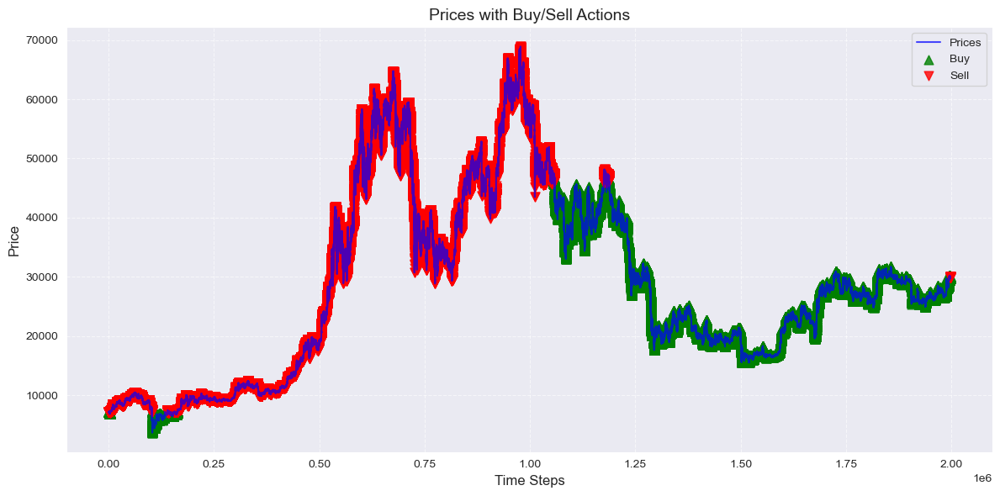
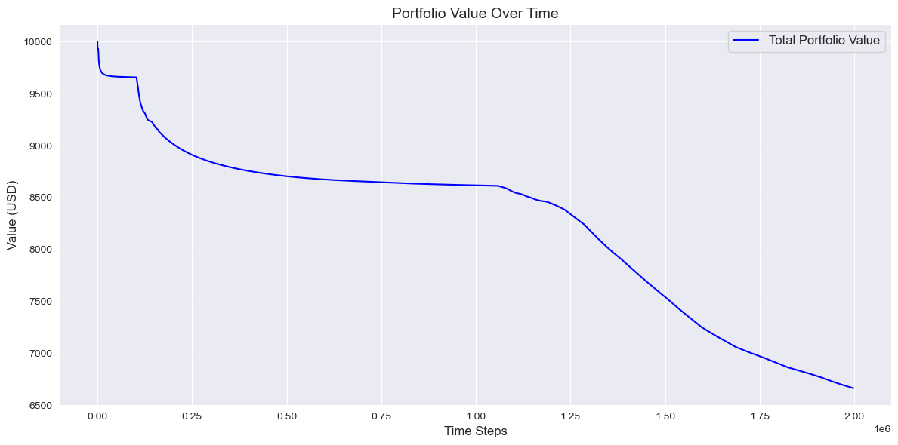
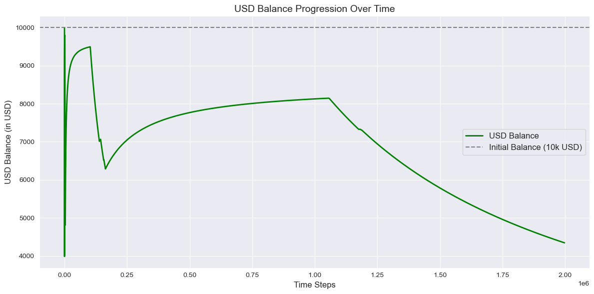
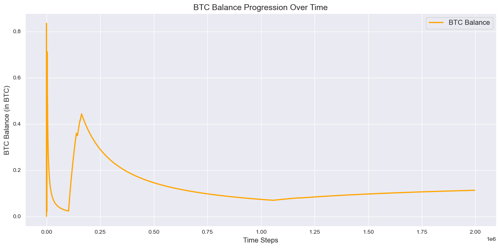

```python
import builtins
```


```python
# Output path
output_path = '../export/simulators/home_based_trader/'
```


```python
# Run the input processing notebook to prepare input
%run "../helpers/data-processing.ipynb"
```

    Missing values in the dataset


<div>
<style scoped>
    .dataframe tbody tr th:only-of-type {
        vertical-align: middle;
    }

    .dataframe tbody tr th {
        vertical-align: top;
    }

    .dataframe thead th {
        text-align: right;
    }
</style>
<table border="1" class="dataframe">
  <thead>
    <tr style="text-align: right;">
      <th></th>
      <th>Column</th>
      <th>Missing Count</th>
      <th>Missing Percentage</th>
      <th>Action</th>
    </tr>
  </thead>
  <tbody>
    <tr>
      <th>0</th>
      <td>date</td>
      <td>0</td>
      <td>0.000000</td>
      <td>No Missing Values</td>
    </tr>
    <tr>
      <th>1</th>
      <td>open</td>
      <td>0</td>
      <td>0.000000</td>
      <td>No Missing Values</td>
    </tr>
    <tr>
      <th>2</th>
      <td>high</td>
      <td>0</td>
      <td>0.000000</td>
      <td>No Missing Values</td>
    </tr>
    <tr>
      <th>3</th>
      <td>low</td>
      <td>0</td>
      <td>0.000000</td>
      <td>No Missing Values</td>
    </tr>
    <tr>
      <th>4</th>
      <td>close</td>
      <td>0</td>
      <td>0.000000</td>
      <td>No Missing Values</td>
    </tr>
    <tr>
      <th>5</th>
      <td>Volume USDT</td>
      <td>0</td>
      <td>0.000000</td>
      <td>No Missing Values</td>
    </tr>
    <tr>
      <th>6</th>
      <td>tradecount</td>
      <td>0</td>
      <td>0.000000</td>
      <td>No Missing Values</td>
    </tr>
    <tr>
      <th>7</th>
      <td>ema_5</td>
      <td>0</td>
      <td>0.000000</td>
      <td>No Missing Values</td>
    </tr>
    <tr>
      <th>8</th>
      <td>ema_15</td>
      <td>0</td>
      <td>0.000000</td>
      <td>No Missing Values</td>
    </tr>
    <tr>
      <th>9</th>
      <td>ema_30</td>
      <td>0</td>
      <td>0.000000</td>
      <td>No Missing Values</td>
    </tr>
    <tr>
      <th>10</th>
      <td>ema_60</td>
      <td>0</td>
      <td>0.000000</td>
      <td>No Missing Values</td>
    </tr>
    <tr>
      <th>11</th>
      <td>ema_100</td>
      <td>0</td>
      <td>0.000000</td>
      <td>No Missing Values</td>
    </tr>
    <tr>
      <th>12</th>
      <td>ema_200</td>
      <td>0</td>
      <td>0.000000</td>
      <td>No Missing Values</td>
    </tr>
    <tr>
      <th>13</th>
      <td>WMA</td>
      <td>13</td>
      <td>0.000651</td>
      <td>Filled with median (26752.13)</td>
    </tr>
    <tr>
      <th>14</th>
      <td>MACD</td>
      <td>25</td>
      <td>0.001252</td>
      <td>Filled with median (-0.08)</td>
    </tr>
    <tr>
      <th>15</th>
      <td>MACD_Signal</td>
      <td>33</td>
      <td>0.001652</td>
      <td>Filled with median (0.00)</td>
    </tr>
    <tr>
      <th>16</th>
      <td>MACD_Hist</td>
      <td>33</td>
      <td>0.001652</td>
      <td>Filled with median (-0.10)</td>
    </tr>
    <tr>
      <th>17</th>
      <td>ATR</td>
      <td>14</td>
      <td>0.000701</td>
      <td>Filled with median (25.15)</td>
    </tr>
    <tr>
      <th>18</th>
      <td>HMA</td>
      <td>11</td>
      <td>0.000551</td>
      <td>Filled with median (26751.02)</td>
    </tr>
    <tr>
      <th>19</th>
      <td>KAMA</td>
      <td>9</td>
      <td>0.000451</td>
      <td>Filled with median (26751.57)</td>
    </tr>
    <tr>
      <th>20</th>
      <td>CMO</td>
      <td>14</td>
      <td>0.000701</td>
      <td>Filled with median (-0.12)</td>
    </tr>
    <tr>
      <th>21</th>
      <td>Z-Score</td>
      <td>154</td>
      <td>0.007711</td>
      <td>Filled with median (-0.01)</td>
    </tr>
    <tr>
      <th>22</th>
      <td>QStick</td>
      <td>9</td>
      <td>0.000451</td>
      <td>Filled with median (0.01)</td>
    </tr>
    <tr>
      <th>23</th>
      <td>hour</td>
      <td>0</td>
      <td>0.000000</td>
      <td>No Missing Values</td>
    </tr>
    <tr>
      <th>24</th>
      <td>day_of_week</td>
      <td>0</td>
      <td>0.000000</td>
      <td>No Missing Values</td>
    </tr>
  </tbody>
</table>
</div>


    Analyzing feature correlations...
    
    The following features were dropped due to high correlation (threshold: 90%):
    - high
    - close
    - ema_60
    - KAMA
    - HMA
    - ema_30
    - WMA
    - ema_5
    - low
    - ema_200
    - Z-Score
    - ema_15
    - ema_100
    - MACD_Hist
    - open
    
    Performing feature selection using RandomForestClassifier...
    
    Cross-validation accuracy scores: [0.99994 0.99994 0.99994]
    
    Mean accuracy: 0.9999
    
    The following features were selected based on feature importance:
    - date
    - price
    - Volume USDT
    - tradecount
    - MACD
    - MACD_Signal
    - ATR
    - CMO
    - QStick
    - price_change_ratio
    - high_low_spread
    
    Feature selection process completed.
    
    Shape of X: (1997210, 11)


<div>
<style scoped>
    .dataframe tbody tr th:only-of-type {
        vertical-align: middle;
    }

    .dataframe tbody tr th {
        vertical-align: top;
    }

    .dataframe thead th {
        text-align: right;
    }
</style>
<table border="1" class="dataframe">
  <thead>
    <tr style="text-align: right;">
      <th></th>
      <th>date</th>
      <th>price</th>
      <th>Volume USDT</th>
      <th>tradecount</th>
      <th>MACD</th>
      <th>MACD_Signal</th>
      <th>ATR</th>
      <th>CMO</th>
      <th>QStick</th>
      <th>price_change_ratio</th>
      <th>high_low_spread</th>
    </tr>
  </thead>
  <tbody>
    <tr>
      <th>0</th>
      <td>1.577837e+09</td>
      <td>7180.720</td>
      <td>509146.0</td>
      <td>140.0</td>
      <td>0.728704</td>
      <td>-0.152219</td>
      <td>4.684925</td>
      <td>4.193879</td>
      <td>0.120</td>
      <td>0.000000</td>
      <td>3.69</td>
    </tr>
    <tr>
      <th>1</th>
      <td>1.577837e+09</td>
      <td>7178.470</td>
      <td>713540.0</td>
      <td>148.0</td>
      <td>0.736887</td>
      <td>-0.182091</td>
      <td>4.698380</td>
      <td>0.859360</td>
      <td>0.528</td>
      <td>-0.000313</td>
      <td>3.76</td>
    </tr>
    <tr>
      <th>2</th>
      <td>1.577837e+09</td>
      <td>7179.440</td>
      <td>497793.0</td>
      <td>104.0</td>
      <td>0.846578</td>
      <td>-0.117923</td>
      <td>4.609025</td>
      <td>11.466626</td>
      <td>0.493</td>
      <td>0.000135</td>
      <td>5.60</td>
    </tr>
    <tr>
      <th>3</th>
      <td>1.577837e+09</td>
      <td>7177.175</td>
      <td>698627.0</td>
      <td>193.0</td>
      <td>0.650488</td>
      <td>-0.343494</td>
      <td>4.398181</td>
      <td>-7.962104</td>
      <td>-0.425</td>
      <td>-0.000315</td>
      <td>6.16</td>
    </tr>
    <tr>
      <th>4</th>
      <td>1.577837e+09</td>
      <td>7175.160</td>
      <td>241980.0</td>
      <td>124.0</td>
      <td>0.987398</td>
      <td>-0.092457</td>
      <td>4.262656</td>
      <td>-6.795307</td>
      <td>-0.131</td>
      <td>-0.000281</td>
      <td>3.86</td>
    </tr>
    <tr>
      <th>...</th>
      <td>...</td>
      <td>...</td>
      <td>...</td>
      <td>...</td>
      <td>...</td>
      <td>...</td>
      <td>...</td>
      <td>...</td>
      <td>...</td>
      <td>...</td>
      <td>...</td>
    </tr>
    <tr>
      <th>1997205</th>
      <td>1.698019e+09</td>
      <td>29966.285</td>
      <td>482950.0</td>
      <td>635.0</td>
      <td>-4056.925846</td>
      <td>-1909.922487</td>
      <td>926.278065</td>
      <td>-97.689989</td>
      <td>13.189</td>
      <td>-0.000401</td>
      <td>5.00</td>
    </tr>
    <tr>
      <th>1997206</th>
      <td>1.698019e+09</td>
      <td>29970.500</td>
      <td>169682.0</td>
      <td>450.0</td>
      <td>-3657.565528</td>
      <td>-1988.042791</td>
      <td>996.882531</td>
      <td>-97.688910</td>
      <td>24.399</td>
      <td>0.000141</td>
      <td>5.83</td>
    </tr>
    <tr>
      <th>1997207</th>
      <td>1.698019e+09</td>
      <td>29975.100</td>
      <td>111271.0</td>
      <td>303.0</td>
      <td>-3095.229187</td>
      <td>-1922.717147</td>
      <td>1072.856572</td>
      <td>-97.688328</td>
      <td>32.045</td>
      <td>0.000153</td>
      <td>3.40</td>
    </tr>
    <tr>
      <th>1997208</th>
      <td>1.698019e+09</td>
      <td>29980.890</td>
      <td>169741.0</td>
      <td>631.0</td>
      <td>-2332.807178</td>
      <td>-1640.974425</td>
      <td>1154.492462</td>
      <td>-97.687019</td>
      <td>22.669</td>
      <td>0.000193</td>
      <td>8.21</td>
    </tr>
    <tr>
      <th>1997209</th>
      <td>1.698019e+09</td>
      <td>29988.730</td>
      <td>321595.0</td>
      <td>861.0</td>
      <td>-1326.581600</td>
      <td>-1044.992454</td>
      <td>1242.094190</td>
      <td>-97.685909</td>
      <td>18.319</td>
      <td>0.000261</td>
      <td>12.47</td>
    </tr>
  </tbody>
</table>
<p>1997210 rows × 11 columns</p>
</div>


    
    Shape of y: (1997210,)


    0    1
    1    0
    2    1
    3    0
    4    0
    Name: price_direction, dtype: int64


```python
# Ensure the features and target align
prices = features['price'].values
predictions = target.values        # Binary predictions from target
```


```python
# Parameters
r = 0.0002  # Expected rate of return
sigma = 0.02  # Base volatility
rolling_window = 14  # Rolling window for metrics
gamma = 0.1  # Adjustment factor for strategy evolution
buy_fee = 0.0025  # 0.25% buy fee
sell_fee = 0.004  # 0.40% sell fee
```


```python
# Initialize portfolio values
initial_capital = 10000.0  # USD
usd_balance = initial_capital  # Start with all USD
btc_balance = 0.0  # Start with no BTC
```


```python
# Initialize strategy probabilities
P_buy = np.full(len(prices), 0.5)  # Start with equal probabilities
P_sell = np.full(len(prices), 0.5)
```


```python
# Calculate market signals using rolling metrics
features['momentum'] = features['price_change_ratio']
features['ATR'] = features['ATR']
features['MACD_signal'] = features['MACD'] - features['MACD_Signal']
```


```python
# Iterate through each row to simulate trades
actions = []
trade_percentages = []
usd_balances = []
btc_balances = []

for t in range(len(prices)):
    # Adjust strategy probabilities dynamically based on market signals
    if t > 0:
        market_signal = features.loc[t, 'MACD_signal']
        P_buy[t] = P_buy[t - 1] + gamma * (market_signal - P_buy[t - 1])
        P_sell[t] = P_sell[t - 1] + gamma * (-market_signal - P_sell[t - 1])

        # Normalize probabilities to sum to 1
        total_prob = P_buy[t] + P_sell[t]
        P_buy[t] /= total_prob
        P_sell[t] /= total_prob

    # Determine action and trade percentage
    current_price = prices[t]
    if P_buy[t] > P_sell[t] and usd_balance > 0:
        # Buy decision
        trade_percentage = min(0.1 * P_buy[t], usd_balance / current_price)
        usd_spent = trade_percentage * usd_balance
        btc_bought = (usd_spent * (1 - buy_fee)) / current_price  # Deduct fees
        usd_balance -= usd_spent
        btc_balance += btc_bought
        actions.append('Buy')
        trade_percentages.append(trade_percentage)

    elif P_sell[t] > P_buy[t] and btc_balance > 0:
        # Sell decision
        trade_percentage = min(0.1 * P_sell[t], btc_balance)
        btc_to_sell = trade_percentage * btc_balance
        usd_gained = btc_to_sell * current_price * (1 - sell_fee)  # Deduct fees
        btc_balance -= btc_to_sell
        usd_balance += usd_gained
        actions.append('Sell')
        trade_percentages.append(trade_percentage)
    else:
        # If no action is taken, add a default value
        actions.append('None')
        trade_percentages.append(0.0)

    # Record balances
    usd_balances.append(usd_balance)
    btc_balances.append(btc_balance)
```


```python
# Export results
builtins.data = home_trader_df = pd.DataFrame({
    'prices': prices,
    'MACD_signal': features['MACD_signal'],
    'ATR': features['ATR'],
    'momentum': features['momentum'],
    'P_buy': P_buy,
    'P_sell': P_sell,
    'Action': actions,
    'Trade_Percentage': trade_percentages,
    'USD_Balance': usd_balances,
    'BTC_Balance': btc_balances,
})
```


```python
%run "../helpers/trades.ipynb"
```

    Trading Log:


<div>
<style scoped>
    .dataframe tbody tr th:only-of-type {
        vertical-align: middle;
    }

    .dataframe tbody tr th {
        vertical-align: top;
    }

    .dataframe thead th {
        text-align: right;
    }
</style>
<table border="1" class="dataframe">
  <thead>
    <tr style="text-align: right;">
      <th></th>
      <th>prices</th>
      <th>MACD_signal</th>
      <th>ATR</th>
      <th>momentum</th>
      <th>P_buy</th>
      <th>P_sell</th>
      <th>Action</th>
      <th>Trade_Percentage</th>
      <th>USD_Balance</th>
      <th>BTC_Balance</th>
      <th>Total_Capital</th>
    </tr>
  </thead>
  <tbody>
    <tr>
      <th>0</th>
      <td>7180.720</td>
      <td>0.880923</td>
      <td>4.684925</td>
      <td>0.000000</td>
      <td>0.500000</td>
      <td>0.500000</td>
      <td>None</td>
      <td>0.000000</td>
      <td>10000.000000</td>
      <td>0.000000</td>
      <td>10000.000000</td>
    </tr>
    <tr>
      <th>1</th>
      <td>7178.470</td>
      <td>0.918978</td>
      <td>4.698380</td>
      <td>-0.000313</td>
      <td>0.602109</td>
      <td>0.397891</td>
      <td>Buy</td>
      <td>0.060211</td>
      <td>9397.891328</td>
      <td>0.083667</td>
      <td>9998.494728</td>
    </tr>
    <tr>
      <th>2</th>
      <td>7179.440</td>
      <td>0.964501</td>
      <td>4.609025</td>
      <td>0.000135</td>
      <td>0.709275</td>
      <td>0.290725</td>
      <td>Buy</td>
      <td>0.070928</td>
      <td>8731.322001</td>
      <td>0.176279</td>
      <td>9996.909462</td>
    </tr>
    <tr>
      <th>3</th>
      <td>7177.175</td>
      <td>0.993981</td>
      <td>4.398181</td>
      <td>-0.000315</td>
      <td>0.819718</td>
      <td>0.180282</td>
      <td>Buy</td>
      <td>0.081972</td>
      <td>8015.600005</td>
      <td>0.275752</td>
      <td>9994.720884</td>
    </tr>
    <tr>
      <th>4</th>
      <td>7175.160</td>
      <td>1.079855</td>
      <td>4.262656</td>
      <td>-0.000281</td>
      <td>0.939702</td>
      <td>0.060298</td>
      <td>Buy</td>
      <td>0.093970</td>
      <td>7262.372745</td>
      <td>0.380467</td>
      <td>9992.282176</td>
    </tr>
    <tr>
      <th>...</th>
      <td>...</td>
      <td>...</td>
      <td>...</td>
      <td>...</td>
      <td>...</td>
      <td>...</td>
      <td>...</td>
      <td>...</td>
      <td>...</td>
      <td>...</td>
      <td>...</td>
    </tr>
    <tr>
      <th>1997205</th>
      <td>29966.285</td>
      <td>-2147.003359</td>
      <td>926.278065</td>
      <td>-0.000401</td>
      <td>-9219.522786</td>
      <td>9220.522786</td>
      <td>Sell</td>
      <td>0.030321</td>
      <td>3905.364490</td>
      <td>0.029401</td>
      <td>4786.416992</td>
    </tr>
    <tr>
      <th>1997206</th>
      <td>29970.500</td>
      <td>-1669.522737</td>
      <td>996.882531</td>
      <td>0.000141</td>
      <td>-9405.025312</td>
      <td>9406.025312</td>
      <td>Sell</td>
      <td>0.029401</td>
      <td>3931.168731</td>
      <td>0.028537</td>
      <td>4786.437287</td>
    </tr>
    <tr>
      <th>1997207</th>
      <td>29975.100</td>
      <td>-1172.512039</td>
      <td>1072.856572</td>
      <td>0.000153</td>
      <td>-9535.304428</td>
      <td>9536.304428</td>
      <td>Sell</td>
      <td>0.028537</td>
      <td>3955.481645</td>
      <td>0.027723</td>
      <td>4786.470915</td>
    </tr>
    <tr>
      <th>1997208</th>
      <td>29980.890</td>
      <td>-691.832752</td>
      <td>1154.492462</td>
      <td>0.000193</td>
      <td>-9612.174733</td>
      <td>9613.174733</td>
      <td>Sell</td>
      <td>0.027723</td>
      <td>3978.431155</td>
      <td>0.026954</td>
      <td>4786.539263</td>
    </tr>
    <tr>
      <th>1997209</th>
      <td>29988.730</td>
      <td>-281.589146</td>
      <td>1242.094190</td>
      <td>0.000261</td>
      <td>-9643.462416</td>
      <td>9644.462416</td>
      <td>Sell</td>
      <td>0.026954</td>
      <td>4000.131533</td>
      <td>0.026228</td>
      <td>4786.663433</td>
    </tr>
  </tbody>
</table>
<p>1997210 rows × 11 columns</p>
</div>


    Buy Actions: 988563
    Sell Actions: 1008646


    Processing Rows: 100%|██████████| 1997210/1997210 [00:41<00:00, 47612.14rows/s]

    Trading Simulation Results:


    


<div>
<style scoped>
    .dataframe tbody tr th:only-of-type {
        vertical-align: middle;
    }

    .dataframe tbody tr th {
        vertical-align: top;
    }

    .dataframe thead th {
        text-align: right;
    }
</style>
<table border="1" class="dataframe">
  <thead>
    <tr style="text-align: right;">
      <th></th>
      <th>Final USD Balance</th>
      <th>Remaining BTC</th>
      <th>Remaining BTC Value (USD)</th>
      <th>Final Portfolio Value (USD)</th>
      <th>Profit/Loss</th>
      <th>Total Trades Executed</th>
      <th>Buy Trades</th>
      <th>Sell Trades</th>
    </tr>
  </thead>
  <tbody>
    <tr>
      <th>0</th>
      <td>$4017.96</td>
      <td>0.026344 BTC</td>
      <td>$790.01</td>
      <td>$4807.98</td>
      <td>-51.92%</td>
      <td>368020</td>
      <td>356495</td>
      <td>11525</td>
    </tr>
  </tbody>
</table>
</div>


    

    


    

    


    

    


    

    


```python
%run "../helpers/testing.ipynb"
```

    Data Leakage Check
    
    Data alignment check passed.
    Correlation between predictions and future price changes:
                         predictions  future_price_change
    predictions             1.000000             0.250137
    future_price_change     0.250137             1.000000
    
    
    Feature Importance Analysis
    
    Feature Importances:
                   Feature  Importance
    9   price_change_ratio    0.483756
    11            momentum    0.479978
    8               QStick    0.017276
    7                  CMO    0.005198
    5          MACD_Signal    0.004598
    10     high_low_spread    0.003843
    6                  ATR    0.001082
    2          Volume USDT    0.000974
    4                 MACD    0.000948
    3           tradecount    0.000723
    12         MACD_signal    0.000667
    0                 date    0.000547
    1                price    0.000410
    Permutation Importances:
                   Feature  Importance
    9   price_change_ratio    0.263786
    11            momentum    0.250783
    8               QStick    0.000049
    7                  CMO    0.000046
    5          MACD_Signal    0.000037
    4                 MACD    0.000032
    10     high_low_spread    0.000032
    0                 date    0.000028
    12         MACD_signal    0.000027
    3           tradecount    0.000024
    6                  ATR    0.000023
    2          Volume USDT    0.000023
    1                price    0.000016
    

