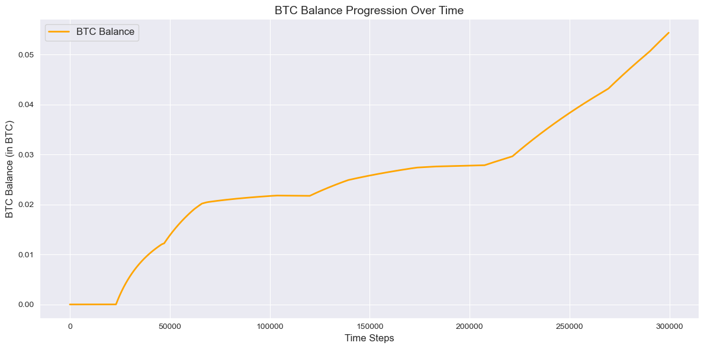

```python
from tensorflow.keras.models import Sequential
from tensorflow.keras.layers import Dense, Input
from tensorflow.keras.optimizers import Adam
from sklearn.preprocessing import MinMaxScaler
from sklearn.model_selection import TimeSeriesSplit
from sklearn.utils.class_weight import compute_class_weight
import tensorflow as tf
import builtins
import os
```

    2025-01-17 02:33:54.093078: I tensorflow/core/platform/cpu_feature_guard.cc:210] This TensorFlow binary is optimized to use available CPU instructions in performance-critical operations.
    To enable the following instructions: AVX2 AVX_VNNI FMA, in other operations, rebuild TensorFlow with the appropriate compiler flags.


```python
# Set intra-op threads (for parallelizing within a single operation)
tf.config.threading.set_intra_op_parallelism_threads(24)  # Use all 24 threads

# Set inter-op threads (for parallelizing across independent operations)
tf.config.threading.set_inter_op_parallelism_threads(2)   # Adjust based on your workload

# Verify the settings
print("Intra-op threads:", tf.config.threading.get_intra_op_parallelism_threads())
print("Inter-op threads:", tf.config.threading.get_inter_op_parallelism_threads())
```

    Intra-op threads: 24
    Inter-op threads: 2


```python
os.environ['TF_ENABLE_ONEDNN_OPTS'] = '1'  # Enable oneDNN optimizations
```


```python
# Output path
output_path = '../export/perceptron/'
```


```python
%run "../helpers/data-processing.ipynb"
```

    Missing values in the dataset


<div>
<style scoped>
    .dataframe tbody tr th:only-of-type {
        vertical-align: middle;
    }

    .dataframe tbody tr th {
        vertical-align: top;
    }

    .dataframe thead th {
        text-align: right;
    }
</style>
<table border="1" class="dataframe">
  <thead>
    <tr style="text-align: right;">
      <th></th>
      <th>Column</th>
      <th>Missing Count</th>
      <th>Missing Percentage</th>
      <th>Action</th>
    </tr>
  </thead>
  <tbody>
    <tr>
      <th>0</th>
      <td>date</td>
      <td>0</td>
      <td>0.000000</td>
      <td>No Missing Values</td>
    </tr>
    <tr>
      <th>1</th>
      <td>open</td>
      <td>0</td>
      <td>0.000000</td>
      <td>No Missing Values</td>
    </tr>
    <tr>
      <th>2</th>
      <td>high</td>
      <td>0</td>
      <td>0.000000</td>
      <td>No Missing Values</td>
    </tr>
    <tr>
      <th>3</th>
      <td>low</td>
      <td>0</td>
      <td>0.000000</td>
      <td>No Missing Values</td>
    </tr>
    <tr>
      <th>4</th>
      <td>close</td>
      <td>0</td>
      <td>0.000000</td>
      <td>No Missing Values</td>
    </tr>
    <tr>
      <th>5</th>
      <td>Volume USDT</td>
      <td>0</td>
      <td>0.000000</td>
      <td>No Missing Values</td>
    </tr>
    <tr>
      <th>6</th>
      <td>tradecount</td>
      <td>0</td>
      <td>0.000000</td>
      <td>No Missing Values</td>
    </tr>
    <tr>
      <th>7</th>
      <td>ema_5</td>
      <td>0</td>
      <td>0.000000</td>
      <td>No Missing Values</td>
    </tr>
    <tr>
      <th>8</th>
      <td>ema_15</td>
      <td>0</td>
      <td>0.000000</td>
      <td>No Missing Values</td>
    </tr>
    <tr>
      <th>9</th>
      <td>ema_30</td>
      <td>0</td>
      <td>0.000000</td>
      <td>No Missing Values</td>
    </tr>
    <tr>
      <th>10</th>
      <td>ema_60</td>
      <td>0</td>
      <td>0.000000</td>
      <td>No Missing Values</td>
    </tr>
    <tr>
      <th>11</th>
      <td>ema_100</td>
      <td>0</td>
      <td>0.000000</td>
      <td>No Missing Values</td>
    </tr>
    <tr>
      <th>12</th>
      <td>ema_200</td>
      <td>0</td>
      <td>0.000000</td>
      <td>No Missing Values</td>
    </tr>
    <tr>
      <th>13</th>
      <td>WMA</td>
      <td>13</td>
      <td>0.000651</td>
      <td>Filled with median (26752.13)</td>
    </tr>
    <tr>
      <th>14</th>
      <td>MACD</td>
      <td>25</td>
      <td>0.001252</td>
      <td>Filled with median (-0.08)</td>
    </tr>
    <tr>
      <th>15</th>
      <td>MACD_Signal</td>
      <td>33</td>
      <td>0.001652</td>
      <td>Filled with median (0.00)</td>
    </tr>
    <tr>
      <th>16</th>
      <td>MACD_Hist</td>
      <td>33</td>
      <td>0.001652</td>
      <td>Filled with median (-0.10)</td>
    </tr>
    <tr>
      <th>17</th>
      <td>ATR</td>
      <td>14</td>
      <td>0.000701</td>
      <td>Filled with median (25.15)</td>
    </tr>
    <tr>
      <th>18</th>
      <td>HMA</td>
      <td>11</td>
      <td>0.000551</td>
      <td>Filled with median (26751.02)</td>
    </tr>
    <tr>
      <th>19</th>
      <td>KAMA</td>
      <td>9</td>
      <td>0.000451</td>
      <td>Filled with median (26751.57)</td>
    </tr>
    <tr>
      <th>20</th>
      <td>CMO</td>
      <td>14</td>
      <td>0.000701</td>
      <td>Filled with median (-0.12)</td>
    </tr>
    <tr>
      <th>21</th>
      <td>Z-Score</td>
      <td>154</td>
      <td>0.007711</td>
      <td>Filled with median (-0.01)</td>
    </tr>
    <tr>
      <th>22</th>
      <td>QStick</td>
      <td>9</td>
      <td>0.000451</td>
      <td>Filled with median (0.01)</td>
    </tr>
    <tr>
      <th>23</th>
      <td>hour</td>
      <td>0</td>
      <td>0.000000</td>
      <td>No Missing Values</td>
    </tr>
    <tr>
      <th>24</th>
      <td>day_of_week</td>
      <td>0</td>
      <td>0.000000</td>
      <td>No Missing Values</td>
    </tr>
  </tbody>
</table>
</div>


    Analyzing feature correlations...
    
    The following features were dropped due to high correlation (threshold: 90%):
    - ema_5
    - ema_200
    - HMA
    - low
    - ema_15
    - WMA
    - high
    - open
    - ema_100
    - Z-Score
    - KAMA
    - ema_60
    - close
    - ema_30
    - MACD_Hist
    
    Performing feature selection using RandomForestClassifier...
    
    Cross-validation accuracy scores: [1. 1. 1.]
    
    Mean accuracy: 1.0000
    
    The following features were selected based on feature importance:
    - date
    - price
    - Volume USDT
    - tradecount
    - MACD
    - MACD_Signal
    - ATR
    - CMO
    - QStick
    - price_change_ratio
    - high_low_spread
    
    Feature selection process completed.
    
    Shape of X: (1997210, 11)


<div>
<style scoped>
    .dataframe tbody tr th:only-of-type {
        vertical-align: middle;
    }

    .dataframe tbody tr th {
        vertical-align: top;
    }

    .dataframe thead th {
        text-align: right;
    }
</style>
<table border="1" class="dataframe">
  <thead>
    <tr style="text-align: right;">
      <th></th>
      <th>date</th>
      <th>price</th>
      <th>Volume USDT</th>
      <th>tradecount</th>
      <th>MACD</th>
      <th>MACD_Signal</th>
      <th>ATR</th>
      <th>CMO</th>
      <th>QStick</th>
      <th>price_change_ratio</th>
      <th>high_low_spread</th>
    </tr>
  </thead>
  <tbody>
    <tr>
      <th>0</th>
      <td>1.577837e+09</td>
      <td>7180.720</td>
      <td>509146.0</td>
      <td>140.0</td>
      <td>0.728704</td>
      <td>-0.152219</td>
      <td>4.684925</td>
      <td>4.193879</td>
      <td>0.120</td>
      <td>0.000000</td>
      <td>3.69</td>
    </tr>
    <tr>
      <th>1</th>
      <td>1.577837e+09</td>
      <td>7178.470</td>
      <td>713540.0</td>
      <td>148.0</td>
      <td>0.736887</td>
      <td>-0.182091</td>
      <td>4.698380</td>
      <td>0.859360</td>
      <td>0.528</td>
      <td>-0.000313</td>
      <td>3.76</td>
    </tr>
    <tr>
      <th>2</th>
      <td>1.577837e+09</td>
      <td>7179.440</td>
      <td>497793.0</td>
      <td>104.0</td>
      <td>0.846578</td>
      <td>-0.117923</td>
      <td>4.609025</td>
      <td>11.466626</td>
      <td>0.493</td>
      <td>0.000135</td>
      <td>5.60</td>
    </tr>
    <tr>
      <th>3</th>
      <td>1.577837e+09</td>
      <td>7177.175</td>
      <td>698627.0</td>
      <td>193.0</td>
      <td>0.650488</td>
      <td>-0.343494</td>
      <td>4.398181</td>
      <td>-7.962104</td>
      <td>-0.425</td>
      <td>-0.000315</td>
      <td>6.16</td>
    </tr>
    <tr>
      <th>4</th>
      <td>1.577837e+09</td>
      <td>7175.160</td>
      <td>241980.0</td>
      <td>124.0</td>
      <td>0.987398</td>
      <td>-0.092457</td>
      <td>4.262656</td>
      <td>-6.795307</td>
      <td>-0.131</td>
      <td>-0.000281</td>
      <td>3.86</td>
    </tr>
    <tr>
      <th>...</th>
      <td>...</td>
      <td>...</td>
      <td>...</td>
      <td>...</td>
      <td>...</td>
      <td>...</td>
      <td>...</td>
      <td>...</td>
      <td>...</td>
      <td>...</td>
      <td>...</td>
    </tr>
    <tr>
      <th>1997205</th>
      <td>1.698019e+09</td>
      <td>29966.285</td>
      <td>482950.0</td>
      <td>635.0</td>
      <td>-4056.925846</td>
      <td>-1909.922487</td>
      <td>926.278065</td>
      <td>-97.689989</td>
      <td>13.189</td>
      <td>-0.000401</td>
      <td>5.00</td>
    </tr>
    <tr>
      <th>1997206</th>
      <td>1.698019e+09</td>
      <td>29970.500</td>
      <td>169682.0</td>
      <td>450.0</td>
      <td>-3657.565528</td>
      <td>-1988.042791</td>
      <td>996.882531</td>
      <td>-97.688910</td>
      <td>24.399</td>
      <td>0.000141</td>
      <td>5.83</td>
    </tr>
    <tr>
      <th>1997207</th>
      <td>1.698019e+09</td>
      <td>29975.100</td>
      <td>111271.0</td>
      <td>303.0</td>
      <td>-3095.229187</td>
      <td>-1922.717147</td>
      <td>1072.856572</td>
      <td>-97.688328</td>
      <td>32.045</td>
      <td>0.000153</td>
      <td>3.40</td>
    </tr>
    <tr>
      <th>1997208</th>
      <td>1.698019e+09</td>
      <td>29980.890</td>
      <td>169741.0</td>
      <td>631.0</td>
      <td>-2332.807178</td>
      <td>-1640.974425</td>
      <td>1154.492462</td>
      <td>-97.687019</td>
      <td>22.669</td>
      <td>0.000193</td>
      <td>8.21</td>
    </tr>
    <tr>
      <th>1997209</th>
      <td>1.698019e+09</td>
      <td>29988.730</td>
      <td>321595.0</td>
      <td>861.0</td>
      <td>-1326.581600</td>
      <td>-1044.992454</td>
      <td>1242.094190</td>
      <td>-97.685909</td>
      <td>18.319</td>
      <td>0.000261</td>
      <td>12.47</td>
    </tr>
  </tbody>
</table>
<p>1997210 rows × 11 columns</p>
</div>


    
    Shape of y: (1997210,)


    0    1
    1    0
    2    1
    3    0
    4    0
    Name: price_direction, dtype: int64


```python
# Scale features (Dask lazy evaluation ends here)
scaler = MinMaxScaler()
X_scaled = scaler.fit_transform(X)
```


```python
# Reserve the last 15% as the test set
test_size = int(0.15 * len(X_scaled))
X_test, y_test = X_scaled[-test_size:], y[-test_size:]
X_train_val, y_train_val = X_scaled[:-test_size], y[:-test_size]
```


```python
# Time-based split using TimeSeriesSplit
tscv = TimeSeriesSplit(n_splits=5)

for train_idx, val_idx in tscv.split(X_train_val):
    X_train, X_val = X_train_val[train_idx], X_train_val[val_idx]
    y_train, y_val = y_train_val[train_idx], y_train_val[val_idx]

    # Balance the classes
    class_weights = compute_class_weight('balanced', classes=np.unique(y_train), y=y_train)
    class_weight_dict = {i: class_weights[i] for i in range(len(class_weights))}

    # Build the perceptron (single perceptron)
    model = Sequential([
        Input(shape=(X_train.shape[1],)),  # Explicit input layer
        Dense(units=1, activation='sigmoid')  # Single perceptron with sigmoid activation
    ])

    # Compile the model
    model.compile(
        optimizer=Adam(learning_rate=0.001),
        loss='binary_crossentropy',
        metrics=['accuracy']
    )

    # Train the model with class weights
    history = model.fit(
        X_train, y_train,
        validation_data=(X_val, y_val),
        epochs=10,
        batch_size=128,
        class_weight=class_weight_dict,
        verbose=1
    )

    # Validate the model
    val_loss, val_accuracy = model.evaluate(X_val, y_val, verbose=0)
    print(f"Validation Accuracy: {val_accuracy:.2f}")
```

    Epoch 1/10
    2211/2211 ━━━━━━━━━━━━━━━━━━━━ 2s 929us/step - accuracy: 0.4930 - loss: 0.6935 - val_accuracy: 0.5161 - val_loss: 0.6927
    Epoch 2/10
    2211/2211 ━━━━━━━━━━━━━━━━━━━━ 2s 928us/step - accuracy: 0.5220 - loss: 0.6922 - val_accuracy: 0.5195 - val_loss: 0.6923
    Epoch 3/10
    2211/2211 ━━━━━━━━━━━━━━━━━━━━ 2s 919us/step - accuracy: 0.5310 - loss: 0.6913 - val_accuracy: 0.5208 - val_loss: 0.6920
    Epoch 4/10
    2211/2211 ━━━━━━━━━━━━━━━━━━━━ 2s 906us/step - accuracy: 0.5347 - loss: 0.6906 - val_accuracy: 0.5200 - val_loss: 0.6921
    Epoch 5/10
    2211/2211 ━━━━━━━━━━━━━━━━━━━━ 2s 893us/step - accuracy: 0.5398 - loss: 0.6897 - val_accuracy: 0.5241 - val_loss: 0.6915
    Epoch 6/10
    2211/2211 ━━━━━━━━━━━━━━━━━━━━ 2s 874us/step - accuracy: 0.5425 - loss: 0.6891 - val_accuracy: 0.5247 - val_loss: 0.6916
    Epoch 7/10
    2211/2211 ━━━━━━━━━━━━━━━━━━━━ 2s 895us/step - accuracy: 0.5413 - loss: 0.6886 - val_accuracy: 0.5268 - val_loss: 0.6909
    Epoch 8/10
    2211/2211 ━━━━━━━━━━━━━━━━━━━━ 2s 898us/step - accuracy: 0.5452 - loss: 0.6880 - val_accuracy: 0.5260 - val_loss: 0.6916
    Epoch 9/10
    2211/2211 ━━━━━━━━━━━━━━━━━━━━ 2s 904us/step - accuracy: 0.5470 - loss: 0.6874 - val_accuracy: 0.5288 - val_loss: 0.6907
    Epoch 10/10
    2211/2211 ━━━━━━━━━━━━━━━━━━━━ 2s 911us/step - accuracy: 0.5479 - loss: 0.6872 - val_accuracy: 0.5274 - val_loss: 0.6915
    Validation Accuracy: 0.53
    Epoch 1/10
    4421/4421 ━━━━━━━━━━━━━━━━━━━━ 3s 665us/step - accuracy: 0.5186 - loss: 0.6924 - val_accuracy: 0.5344 - val_loss: 0.6910
    Epoch 2/10
    4421/4421 ━━━━━━━━━━━━━━━━━━━━ 3s 680us/step - accuracy: 0.5444 - loss: 0.6904 - val_accuracy: 0.5462 - val_loss: 0.6894
    Epoch 3/10
    4421/4421 ━━━━━━━━━━━━━━━━━━━━ 3s 651us/step - accuracy: 0.5495 - loss: 0.6892 - val_accuracy: 0.5517 - val_loss: 0.6880
    Epoch 4/10
    4421/4421 ━━━━━━━━━━━━━━━━━━━━ 3s 649us/step - accuracy: 0.5531 - loss: 0.6881 - val_accuracy: 0.5597 - val_loss: 0.6866
    Epoch 5/10
    4421/4421 ━━━━━━━━━━━━━━━━━━━━ 3s 669us/step - accuracy: 0.5589 - loss: 0.6870 - val_accuracy: 0.5659 - val_loss: 0.6852
    Epoch 6/10
    4421/4421 ━━━━━━━━━━━━━━━━━━━━ 3s 630us/step - accuracy: 0.5665 - loss: 0.6858 - val_accuracy: 0.5739 - val_loss: 0.6838
    Epoch 7/10
    4421/4421 ━━━━━━━━━━━━━━━━━━━━ 3s 674us/step - accuracy: 0.5718 - loss: 0.6850 - val_accuracy: 0.5777 - val_loss: 0.6825
    Epoch 8/10
    4421/4421 ━━━━━━━━━━━━━━━━━━━━ 3s 661us/step - accuracy: 0.5769 - loss: 0.6839 - val_accuracy: 0.5876 - val_loss: 0.6811
    Epoch 9/10
    4421/4421 ━━━━━━━━━━━━━━━━━━━━ 3s 643us/step - accuracy: 0.5853 - loss: 0.6829 - val_accuracy: 0.5939 - val_loss: 0.6797
    Epoch 10/10
    4421/4421 ━━━━━━━━━━━━━━━━━━━━ 3s 650us/step - accuracy: 0.5910 - loss: 0.6818 - val_accuracy: 0.5991 - val_loss: 0.6785
    Validation Accuracy: 0.60
    Epoch 1/10
    6632/6632 ━━━━━━━━━━━━━━━━━━━━ 4s 582us/step - accuracy: 0.5201 - loss: 0.6937 - val_accuracy: 0.5453 - val_loss: 0.6908
    Epoch 2/10
    6632/6632 ━━━━━━━━━━━━━━━━━━━━ 4s 571us/step - accuracy: 0.5574 - loss: 0.6894 - val_accuracy: 0.5435 - val_loss: 0.6894
    Epoch 3/10
    6632/6632 ━━━━━━━━━━━━━━━━━━━━ 4s 562us/step - accuracy: 0.5679 - loss: 0.6873 - val_accuracy: 0.5644 - val_loss: 0.6875
    Epoch 4/10
    6632/6632 ━━━━━━━━━━━━━━━━━━━━ 4s 566us/step - accuracy: 0.5811 - loss: 0.6853 - val_accuracy: 0.5754 - val_loss: 0.6858
    Epoch 5/10
    6632/6632 ━━━━━━━━━━━━━━━━━━━━ 4s 580us/step - accuracy: 0.5932 - loss: 0.6833 - val_accuracy: 0.5879 - val_loss: 0.6841
    Epoch 6/10
    6632/6632 ━━━━━━━━━━━━━━━━━━━━ 4s 587us/step - accuracy: 0.6073 - loss: 0.6813 - val_accuracy: 0.5794 - val_loss: 0.6829
    Epoch 7/10
    6632/6632 ━━━━━━━━━━━━━━━━━━━━ 4s 573us/step - accuracy: 0.6196 - loss: 0.6794 - val_accuracy: 0.6073 - val_loss: 0.6809
    Epoch 8/10
    6632/6632 ━━━━━━━━━━━━━━━━━━━━ 4s 566us/step - accuracy: 0.6309 - loss: 0.6774 - val_accuracy: 0.6207 - val_loss: 0.6792
    Epoch 9/10
    6632/6632 ━━━━━━━━━━━━━━━━━━━━ 4s 557us/step - accuracy: 0.6442 - loss: 0.6755 - val_accuracy: 0.6274 - val_loss: 0.6776
    Epoch 10/10
    6632/6632 ━━━━━━━━━━━━━━━━━━━━ 4s 568us/step - accuracy: 0.6559 - loss: 0.6737 - val_accuracy: 0.6474 - val_loss: 0.6758
    Validation Accuracy: 0.65
    Epoch 1/10
    8842/8842 ━━━━━━━━━━━━━━━━━━━━ 5s 534us/step - accuracy: 0.4953 - loss: 0.6973 - val_accuracy: 0.5293 - val_loss: 0.6917
    Epoch 2/10
    8842/8842 ━━━━━━━━━━━━━━━━━━━━ 5s 527us/step - accuracy: 0.5375 - loss: 0.6907 - val_accuracy: 0.5446 - val_loss: 0.6896
    Epoch 3/10
    8842/8842 ━━━━━━━━━━━━━━━━━━━━ 5s 531us/step - accuracy: 0.5598 - loss: 0.6882 - val_accuracy: 0.5568 - val_loss: 0.6875
    Epoch 4/10
    8842/8842 ━━━━━━━━━━━━━━━━━━━━ 5s 529us/step - accuracy: 0.5793 - loss: 0.6856 - val_accuracy: 0.5828 - val_loss: 0.6852
    Epoch 5/10
    8842/8842 ━━━━━━━━━━━━━━━━━━━━ 5s 531us/step - accuracy: 0.5993 - loss: 0.6832 - val_accuracy: 0.6010 - val_loss: 0.6830
    Epoch 6/10
    8842/8842 ━━━━━━━━━━━━━━━━━━━━ 5s 526us/step - accuracy: 0.6178 - loss: 0.6807 - val_accuracy: 0.6156 - val_loss: 0.6809
    Epoch 7/10
    8842/8842 ━━━━━━━━━━━━━━━━━━━━ 5s 530us/step - accuracy: 0.6363 - loss: 0.6782 - val_accuracy: 0.6338 - val_loss: 0.6788
    Epoch 8/10
    8842/8842 ━━━━━━━━━━━━━━━━━━━━ 5s 531us/step - accuracy: 0.6531 - loss: 0.6759 - val_accuracy: 0.6434 - val_loss: 0.6768
    Epoch 9/10
    8842/8842 ━━━━━━━━━━━━━━━━━━━━ 5s 537us/step - accuracy: 0.6676 - loss: 0.6735 - val_accuracy: 0.6608 - val_loss: 0.6747
    Epoch 10/10
    8842/8842 ━━━━━━━━━━━━━━━━━━━━ 5s 532us/step - accuracy: 0.6832 - loss: 0.6713 - val_accuracy: 0.6674 - val_loss: 0.6727
    Validation Accuracy: 0.67
    Epoch 1/10
    11053/11053 ━━━━━━━━━━━━━━━━━━━━ 6s 510us/step - accuracy: 0.5357 - loss: 0.6916 - val_accuracy: 0.5535 - val_loss: 0.6900
    Epoch 2/10
    11053/11053 ━━━━━━━━━━━━━━━━━━━━ 6s 515us/step - accuracy: 0.5738 - loss: 0.6876 - val_accuracy: 0.5643 - val_loss: 0.6880
    Epoch 3/10
    11053/11053 ━━━━━━━━━━━━━━━━━━━━ 6s 508us/step - accuracy: 0.5918 - loss: 0.6846 - val_accuracy: 0.5769 - val_loss: 0.6862
    Epoch 4/10
    11053/11053 ━━━━━━━━━━━━━━━━━━━━ 6s 512us/step - accuracy: 0.6154 - loss: 0.6816 - val_accuracy: 0.5950 - val_loss: 0.6845
    Epoch 5/10
    11053/11053 ━━━━━━━━━━━━━━━━━━━━ 6s 509us/step - accuracy: 0.6381 - loss: 0.6788 - val_accuracy: 0.6033 - val_loss: 0.6828
    Epoch 6/10
    11053/11053 ━━━━━━━━━━━━━━━━━━━━ 6s 501us/step - accuracy: 0.6582 - loss: 0.6760 - val_accuracy: 0.6216 - val_loss: 0.6811
    Epoch 7/10
    11053/11053 ━━━━━━━━━━━━━━━━━━━━ 6s 510us/step - accuracy: 0.6748 - loss: 0.6732 - val_accuracy: 0.6331 - val_loss: 0.6794
    Epoch 8/10
    11053/11053 ━━━━━━━━━━━━━━━━━━━━ 6s 506us/step - accuracy: 0.6927 - loss: 0.6704 - val_accuracy: 0.6486 - val_loss: 0.6777
    Epoch 9/10
    11053/11053 ━━━━━━━━━━━━━━━━━━━━ 6s 513us/step - accuracy: 0.7078 - loss: 0.6678 - val_accuracy: 0.6521 - val_loss: 0.6762
    Epoch 10/10
    11053/11053 ━━━━━━━━━━━━━━━━━━━━ 6s 508us/step - accuracy: 0.7224 - loss: 0.6651 - val_accuracy: 0.6661 - val_loss: 0.6744
    Validation Accuracy: 0.67


```python
# Prepare test dataset and evaluation variables
test_dataset = tf.data.Dataset.from_tensor_slices((X_test, y_test))
test_dataset = test_dataset.batch(128).prefetch(tf.data.experimental.AUTOTUNE)
```


```python
X_test_evaluate = X_test  # Assign X_test for evaluation
y_test_evaluate = y_test  # Assign y_test for evaluation
```


```python
# Evaluate the model on the test set
test_loss, test_accuracy = model.evaluate(X_test, y_test, verbose=0)
print(f"Test Accuracy: {test_accuracy:.2f}")
```

    Test Accuracy: 0.62


```python
# Predict probabilities for the entire test set
predicted_probas = model.predict(X_test).flatten()
```

    9362/9362 ━━━━━━━━━━━━━━━━━━━━ 2s 250us/step


```python
print("Training set size:", X_train.shape, y_train.shape)
print("Validation set size:", X_val.shape, y_val.shape)
print("Test set size:", X_test.shape, y_test.shape)
```

    Training set size: (1414691, 11) (1414691,)
    Validation set size: (282938, 11) (282938,)
    Test set size: (299581, 11) (299581,)


```python
# Slice prices to match each split
prices_train = prices[:len(X_train)]  # First 70% of prices for train
prices_val = prices[len(X_train):len(X_train) + len(X_val)]  # Next 15% for validation
prices_test = prices[len(X_train) + len(X_val):]  # Remaining 15% for test
```


```python
# Ensure lengths are consistent
assert len(prices_train) == len(X_train), "Mismatch in train prices and features length."
assert len(prices_val) == len(X_val), "Mismatch in validation prices and features length."
assert len(prices_test) == len(X_test), "Mismatch in test prices and features length."
```


```python
# Adjusted thresholds
buy_threshold = 0.7
sell_threshold = 0.3

# Maximum fraction of the portfolio to trade
max_trade_fraction = 0.15  # up to 15% in the most confident case
```


```python
%run "../helpers/evaluate_tf.ipynb"
```

    2341/2341 ━━━━━━━━━━━━━━━━━━━━ 1s 396us/step - accuracy: 0.6404 - loss: 0.6780
    Test Accuracy: 62.10%
    9362/9362 ━━━━━━━━━━━━━━━━━━━━ 2s 246us/step
    Confusion Matrix:
    Predicted       0   1
    Actual               
    0          146603   0
    1          152966  12


    

    


    

    


```python
# Starting portfolio values
usd_balance = 10000.0  # Starting USD balance
btc_balance = 0.0      # Starting BTC balance
buy_fee = 0.0025  # 0.25% buy fee
sell_fee = 0.004  # 0.40% sell fee

# Track balances and actions
usd_balances = []
btc_balances = []
actions = []
trade_percentages = []
```


```python
# Loop over prices_test and use precomputed probabilities
for t in range(len(prices_test)):
    # Default action is 'None'
    action = 'None'
    trade_percentage = 0.0

    # Use precomputed probability
    predicted_proba = predicted_probas[t]

    # Compute confidence: ranges from 0 (proba = 0.5) to 0.5 (proba = 0 or 1)
    confidence = abs(predicted_proba - 0.5)  # 0.0 → not sure, 0.5 → extremely sure

    # Turn confidence into a fraction of max_trade_fraction
    # e.g. if confidence=0.4, fraction_to_trade=0.2*(0.4/0.5)=0.16 (i.e. 16% of USD)
    fraction_to_trade = max_trade_fraction * (confidence / 0.5)

    # Decide action based on thresholds
    if predicted_proba > buy_threshold and usd_balance > 1e-3:
        # Buy if proba > buy_threshold. The fraction_to_trade goes from 0 to max_trade_fraction (0 to 20%)
        usd_spent = fraction_to_trade * usd_balance
        # Convert to BTC, minus the buy fee
        btc_bought = (usd_spent * (1 - buy_fee)) / prices_test[t]
        usd_balance -= usd_spent
        btc_balance += btc_bought
        action = 'Buy'
        trade_percentage = fraction_to_trade  # record how much fraction we traded

    elif predicted_proba < sell_threshold and btc_balance > 1e-6:
        # Sell if proba < sell_threshold. fraction_to_trade is again 0 to 20% based on confidence
        btc_to_sell = fraction_to_trade * btc_balance
        usd_gained = btc_to_sell * prices_test[t] * (1 - sell_fee)
        btc_balance -= btc_to_sell
        usd_balance += usd_gained
        action = 'Sell'
        trade_percentage = fraction_to_trade  # record how much fraction we traded

    # Record balances and actions
    usd_balances.append(usd_balance)
    btc_balances.append(btc_balance)
    actions.append(action)
    trade_percentages.append(trade_percentage)
```


```python
# Final portfolio status
final_btc_price = prices_test[-1]
remaining_btc_value = btc_balance * final_btc_price
total_portfolio_value = usd_balance + remaining_btc_value
profit_loss = ((total_portfolio_value - 10000) / 10000) * 100

print("Final Portfolio Status:")
print(f"  USD Balance: ${usd_balance:.2f}")
print(f"  BTC Balance: {btc_balance:.6f} BTC")
print(f"  BTC Value (in USD at last price): ${remaining_btc_value:.2f}")
print(f"  Total Portfolio Value (USD): ${total_portfolio_value:.2f}")
print(f"  Profit/Loss: {profit_loss:.2f}%")
```

    Final Portfolio Status:
      USD Balance: $5359.00
      BTC Balance: 0.168423 BTC
      BTC Value (in USD at last price): $5050.80
      Total Portfolio Value (USD): $10409.80
      Profit/Loss: 4.10%


```python
builtins.data = pd.DataFrame({
    'prices': prices_test,
    'USD_Balance': usd_balances,
    'BTC_Balance': btc_balances,
    'Action': actions,
    'Trade_Percentage': trade_percentages,
})
```


```python
%run "../helpers/trades.ipynb"
```

    Trading Log:


<div>
<style scoped>
    .dataframe tbody tr th:only-of-type {
        vertical-align: middle;
    }

    .dataframe tbody tr th {
        vertical-align: top;
    }

    .dataframe thead th {
        text-align: right;
    }
</style>
<table border="1" class="dataframe">
  <thead>
    <tr style="text-align: right;">
      <th></th>
      <th>prices</th>
      <th>USD_Balance</th>
      <th>BTC_Balance</th>
      <th>Action</th>
      <th>Trade_Percentage</th>
      <th>Total_Capital</th>
    </tr>
  </thead>
  <tbody>
    <tr>
      <th>0</th>
      <td>27409.745</td>
      <td>10000.000000</td>
      <td>0.000000</td>
      <td>None</td>
      <td>0.0</td>
      <td>10000.000000</td>
    </tr>
    <tr>
      <th>1</th>
      <td>27419.005</td>
      <td>10000.000000</td>
      <td>0.000000</td>
      <td>None</td>
      <td>0.0</td>
      <td>10000.000000</td>
    </tr>
    <tr>
      <th>2</th>
      <td>27430.025</td>
      <td>10000.000000</td>
      <td>0.000000</td>
      <td>None</td>
      <td>0.0</td>
      <td>10000.000000</td>
    </tr>
    <tr>
      <th>3</th>
      <td>27410.065</td>
      <td>10000.000000</td>
      <td>0.000000</td>
      <td>None</td>
      <td>0.0</td>
      <td>10000.000000</td>
    </tr>
    <tr>
      <th>4</th>
      <td>27394.345</td>
      <td>10000.000000</td>
      <td>0.000000</td>
      <td>None</td>
      <td>0.0</td>
      <td>10000.000000</td>
    </tr>
    <tr>
      <th>...</th>
      <td>...</td>
      <td>...</td>
      <td>...</td>
      <td>...</td>
      <td>...</td>
      <td>...</td>
    </tr>
    <tr>
      <th>299576</th>
      <td>29966.285</td>
      <td>5358.995169</td>
      <td>0.168423</td>
      <td>None</td>
      <td>0.0</td>
      <td>10406.019274</td>
    </tr>
    <tr>
      <th>299577</th>
      <td>29970.500</td>
      <td>5358.995169</td>
      <td>0.168423</td>
      <td>None</td>
      <td>0.0</td>
      <td>10406.729179</td>
    </tr>
    <tr>
      <th>299578</th>
      <td>29975.100</td>
      <td>5358.995169</td>
      <td>0.168423</td>
      <td>None</td>
      <td>0.0</td>
      <td>10407.503926</td>
    </tr>
    <tr>
      <th>299579</th>
      <td>29980.890</td>
      <td>5358.995169</td>
      <td>0.168423</td>
      <td>None</td>
      <td>0.0</td>
      <td>10408.479098</td>
    </tr>
    <tr>
      <th>299580</th>
      <td>29988.730</td>
      <td>5358.995169</td>
      <td>0.168423</td>
      <td>None</td>
      <td>0.0</td>
      <td>10409.799538</td>
    </tr>
  </tbody>
</table>
<p>299581 rows × 6 columns</p>
</div>


    Processing Rows: 100%|██████████| 299581/299581 [00:05<00:00, 52343.62rows/s]


    Final Portfolio Status:
      USD Balance: $5359.00
      BTC Balance: 0.168423 BTC
      BTC Value (in USD at last price): $5050.80
      Total Portfolio Value (USD): $10409.80
      Profit/Loss: 4.10%
      Total Trades Executed: 36
        Buy Trades: 12
        Sell Trades: 24


    

    


    

    


    

    


    

    


```python
import numpy as np
import pandas as pd
from sklearn.metrics import accuracy_score, classification_report, confusion_matrix
import matplotlib.pyplot as plt

# Ensure reproducibility
np.random.seed(42)

# Placeholder for your dataset (X, y)
# Replace these with your actual input_data
# X_train, X_val, X_test, y_train, y_val, y_test should already be defined

# Test set evaluation
def evaluate_on_test_set(model, X_test, y_test):
    """Evaluate the model on the test set and return metrics."""
    y_pred = model.predict(X_test)
    y_test = np.array(y_test).astype(int)
    y_pred = (y_pred > 0.5).astype(int).flatten()

    test_accuracy = accuracy_score(y_test, y_pred)
    report = classification_report(y_test, y_pred)
    cm = confusion_matrix(y_test, y_pred)
    return {
        'accuracy': test_accuracy,
        'report': report,
        'confusion_matrix': cm
    }

# Confidence analysis
def analyze_prediction_confidence(model, X_test, y_test):
    """Analyze prediction confidence and return plots."""
    try:
        predicted_proba = model.predict_proba(X_test)
        confidence_scores = np.max(predicted_proba, axis=1)

        plt.figure(figsize=(10, 6))
        plt.hist(confidence_scores, bins=20, color='blue', alpha=0.7, edgecolor='black')
        plt.title("Prediction Confidence Distribution")
        plt.xlabel("Confidence")
        plt.ylabel("Frequency")
        plt.grid(alpha=0.6)
        plt.show()

        correct_predictions = (model.predict(X_test) > 0.5).astype(int).flatten() == y_test
        plt.figure(figsize=(10, 6))
        plt.scatter(confidence_scores, correct_predictions, alpha=0.3, color='orange')
        plt.title("Confidence vs Correctness")
        plt.xlabel("Confidence")
        plt.ylabel("Correct Prediction")
        plt.grid(alpha=0.6)
        plt.show()
    except AttributeError:
        print("Model does not have a predict_proba method.")

# Data leakage check
def check_data_leakage(X_train, X_test):
    """Check for input_data leakage between training and test sets."""
    if not isinstance(X_train, (pd.DataFrame, np.ndarray)) or not isinstance(X_test, (pd.DataFrame, np.ndarray)):
        print("X_train and X_test should be DataFrames or NumPy arrays for leakage check.")
        return

    # Convert to DataFrames if they are NumPy arrays
    if isinstance(X_train, np.ndarray):
        X_train = pd.DataFrame(X_train)
    if isinstance(X_test, np.ndarray):
        X_test = pd.DataFrame(X_test)

    common_features = set(X_train.columns) & set(X_test.columns)
    if len(common_features) != X_train.shape[1]:
        print("Warning: Feature mismatch between train and test sets.")
    else:
        print("No apparent input_data leakage detected in features.")

# Evaluate robustness with noisy input_data
def evaluate_with_noise(model, X_test, y_test, noise_level=0.01):
    """Evaluate model's robustness with noisy input_data and return accuracy."""
    if not isinstance(X_test, np.ndarray):
        try:
            X_test = X_test.values  # Convert to numpy array if possible
        except AttributeError:
            print("X_test cannot be converted to a numpy array.")
            return None
    X_noisy = X_test + noise_level * np.random.normal(size=X_test.shape)
    y_pred_noisy = (model.predict(X_noisy) > 0.5).astype(int).flatten()
    noisy_accuracy = accuracy_score(y_test, y_pred_noisy)
    return noisy_accuracy

# Run all checks
def check_model_overfitting(model, X_train, X_val, X_test, y_train, y_val, y_test, noise_level=0.01):
    """Run all evaluations to check for model overfitting."""
    print("\n--- Evaluating on Test Set ---")
    test_results = evaluate_on_test_set(model, X_test, y_test)
    print(f"Test Set Accuracy: {test_results['accuracy']}")
    print("Classification Report (Test Set):\n", test_results['report'])
    print("Confusion Matrix (Test Set):\n", test_results['confusion_matrix'])

    print("\n--- Analyzing Prediction Confidence ---")
    analyze_prediction_confidence(model, X_test, y_test)

    print("\n--- Checking for Data Leakage ---")
    check_data_leakage(X_train, X_test)

    print("\n--- Evaluating with Noise ---")
    noisy_accuracy = evaluate_with_noise(model, X_test, y_test, noise_level)
    print(f"Accuracy with {noise_level * 100:.1f}% Noise:", noisy_accuracy)

# Usage example (replace `model` with your trained model)
noise_level = 0.01  # Define the noise level
check_model_overfitting(model, X_train, X_val, X_test, y_train, y_val, y_test, noise_level)
```

    
    --- Evaluating on Test Set ---
    9362/9362 ━━━━━━━━━━━━━━━━━━━━ 2s 247us/step
    Test Set Accuracy: 0.6209606083162817
    Classification Report (Test Set):
                   precision    recall  f1-score   support
    
               0       0.60      0.67      0.63    146603
               1       0.64      0.58      0.61    152978
    
        accuracy                           0.62    299581
       macro avg       0.62      0.62      0.62    299581
    weighted avg       0.62      0.62      0.62    299581
    
    Confusion Matrix (Test Set):
     [[97504 49099]
     [64454 88524]]
    
    --- Analyzing Prediction Confidence ---
    Model does not have a predict_proba method.
    
    --- Checking for Data Leakage ---
    No apparent input_data leakage detected in features.
    
    --- Evaluating with Noise ---
    9362/9362 ━━━━━━━━━━━━━━━━━━━━ 2s 258us/step
    Accuracy with 1.0% Noise: 0.5705735677496236


```python
%run "../helpers/testing.ipynb"
```

    Data Leakage Check
    
    Data alignment check passed.
    Correlation between predictions and future price changes:
                         predictions  future_price_change
    predictions             1.000000             0.250137
    future_price_change     0.250137             1.000000
    
    
    Feature Importance Analysis
    
    Feature Importances:
                   Feature  Importance
    9   price_change_ratio    0.941433
    8               QStick    0.022292
    7                  CMO    0.009655
    5          MACD_Signal    0.008473
    10     high_low_spread    0.005913
    6                  ATR    0.002730
    4                 MACD    0.002276
    2          Volume USDT    0.002252
    3           tradecount    0.001853
    0                 date    0.001638
    1                price    0.001486
    Permutation Importances:
                   Feature  Importance
    9   price_change_ratio    0.499862
    8               QStick    0.000049
    7                  CMO    0.000046
    5          MACD_Signal    0.000040
    10     high_low_spread    0.000036
    4                 MACD    0.000034
    0                 date    0.000027
    2          Volume USDT    0.000026
    6                  ATR    0.000026
    3           tradecount    0.000023
    1                price    0.000020
    
    
    Risk-Reward Dynamics
    
    Profit/Loss Distribution:
    count    299580.000000
    mean          0.001368
    std           0.741987
    min         -64.640868
    25%          -0.130975
    50%           0.000000
    75%           0.133447
    max          99.875808
    dtype: float64
    Sharpe Ratio: -134.77
    
    
    Trading Logic Validation
    
    Profit/Loss Distribution:
    count    1.997209e+06
    mean     7.809559e-03
    std      8.211658e+00
    min     -6.732322e+02
    25%     -2.392189e+00
    50%      0.000000e+00
    75%      2.395735e+00
    max      5.169086e+02
    dtype: float64
    Sharpe Ratio: -12.18


    Processing Rows: 100%|██████████| 299581/299581 [00:05<00:00, 52787.06rows/s]
    Processing Rows: 100%|██████████| 299581/299581 [00:05<00:00, 51659.13rows/s]
    Processing Rows: 100%|██████████| 299581/299581 [00:05<00:00, 51929.08rows/s]
    Processing Rows: 100%|██████████| 299581/299581 [00:05<00:00, 51801.58rows/s]
    Processing Rows: 100%|██████████| 299581/299581 [00:05<00:00, 52599.81rows/s]
    Processing Rows: 100%|██████████| 299581/299581 [00:05<00:00, 52035.75rows/s]
    Processing Rows: 100%|██████████| 299581/299581 [00:05<00:00, 52708.56rows/s]
    Processing Rows: 100%|██████████| 299581/299581 [00:05<00:00, 52801.98rows/s]
    Processing Rows: 100%|██████████| 299581/299581 [00:05<00:00, 52317.37rows/s]

    
    
    Sensitivity Analysis
    


    


<div>
<style scoped>
    .dataframe tbody tr th:only-of-type {
        vertical-align: middle;
    }

    .dataframe tbody tr th {
        vertical-align: top;
    }

    .dataframe thead th {
        text-align: right;
    }
</style>
<table border="1" class="dataframe">
  <thead>
    <tr style="text-align: right;">
      <th></th>
      <th>Initial USD Balance</th>
      <th>Initial BTC Balance</th>
      <th>Maker Fee</th>
      <th>Taker Fee</th>
      <th>Final USD Balance</th>
      <th>Final BTC Balance</th>
      <th>Total Portfolio Value (USD)</th>
      <th>Profit/Loss (%)</th>
      <th>Buy Trades</th>
      <th>Sell Trades</th>
    </tr>
  </thead>
  <tbody>
    <tr>
      <th>0</th>
      <td>10000.0</td>
      <td>0.0</td>
      <td>0.0025</td>
      <td>0.0040</td>
      <td>5358.995169</td>
      <td>0.168423</td>
      <td>10409.799538</td>
      <td>4.097995</td>
      <td>12</td>
      <td>24</td>
    </tr>
    <tr>
      <th>1</th>
      <td>10000.0</td>
      <td>0.0</td>
      <td>0.0015</td>
      <td>0.0030</td>
      <td>5363.214803</td>
      <td>0.168639</td>
      <td>10420.469845</td>
      <td>4.204698</td>
      <td>12</td>
      <td>24</td>
    </tr>
    <tr>
      <th>2</th>
      <td>10000.0</td>
      <td>0.0</td>
      <td>0.0050</td>
      <td>0.0075</td>
      <td>5346.369224</td>
      <td>0.167863</td>
      <td>10380.376314</td>
      <td>3.803763</td>
      <td>12</td>
      <td>24</td>
    </tr>
    <tr>
      <th>3</th>
      <td>20000.0</td>
      <td>0.0</td>
      <td>0.0025</td>
      <td>0.0040</td>
      <td>10717.990338</td>
      <td>0.336847</td>
      <td>20819.599075</td>
      <td>4.097995</td>
      <td>12</td>
      <td>24</td>
    </tr>
    <tr>
      <th>4</th>
      <td>20000.0</td>
      <td>0.0</td>
      <td>0.0015</td>
      <td>0.0030</td>
      <td>10726.429605</td>
      <td>0.337277</td>
      <td>20840.939690</td>
      <td>4.204698</td>
      <td>12</td>
      <td>24</td>
    </tr>
    <tr>
      <th>5</th>
      <td>20000.0</td>
      <td>0.0</td>
      <td>0.0050</td>
      <td>0.0075</td>
      <td>10692.738448</td>
      <td>0.335727</td>
      <td>20760.752629</td>
      <td>3.803763</td>
      <td>12</td>
      <td>24</td>
    </tr>
    <tr>
      <th>6</th>
      <td>5000.0</td>
      <td>0.5</td>
      <td>0.0025</td>
      <td>0.0040</td>
      <td>9460.422715</td>
      <td>0.340767</td>
      <td>19679.594545</td>
      <td>293.591891</td>
      <td>12</td>
      <td>24</td>
    </tr>
    <tr>
      <th>7</th>
      <td>5000.0</td>
      <td>0.5</td>
      <td>0.0015</td>
      <td>0.0030</td>
      <td>9472.870089</td>
      <td>0.341270</td>
      <td>19707.117669</td>
      <td>294.142353</td>
      <td>12</td>
      <td>24</td>
    </tr>
    <tr>
      <th>8</th>
      <td>5000.0</td>
      <td>0.5</td>
      <td>0.0050</td>
      <td>0.0075</td>
      <td>9419.763170</td>
      <td>0.339304</td>
      <td>19595.061657</td>
      <td>291.901233</td>
      <td>12</td>
      <td>24</td>
    </tr>
  </tbody>
</table>
</div>


    

    

