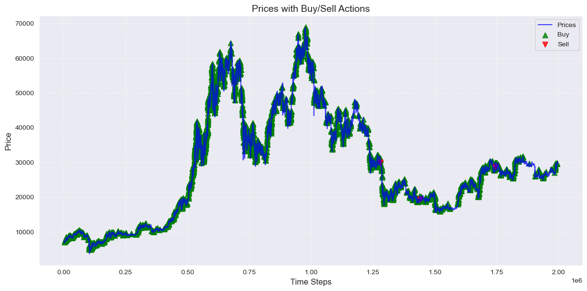
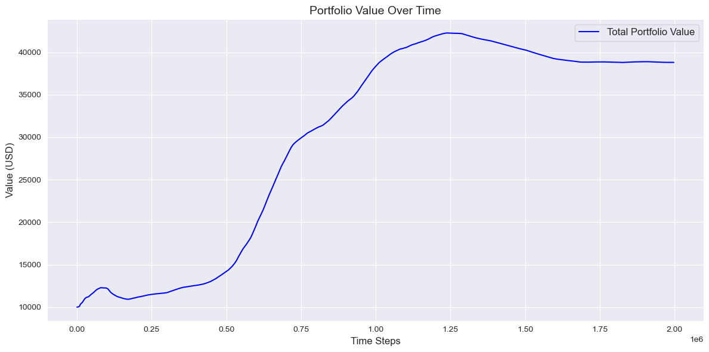
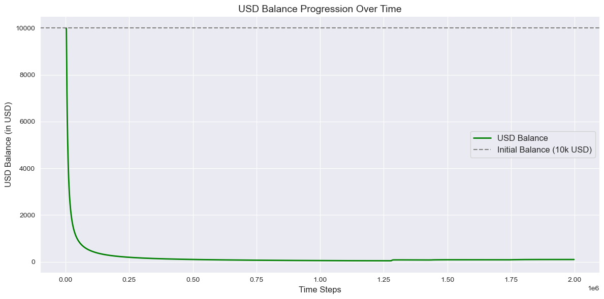
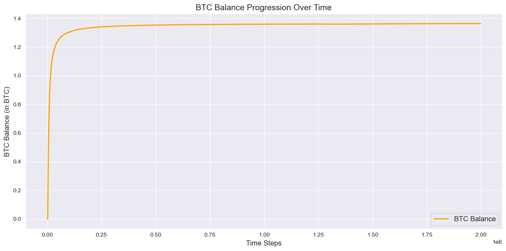
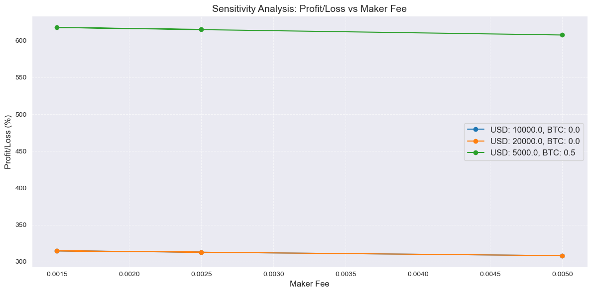

```python
import builtins
from tqdm import tqdm
from sklearn.tree import DecisionTreeClassifier
from sklearn.preprocessing import MinMaxScaler
```


```python
# Output path
output_path = '../export/simulators/pro_risk_friendly_trader/'
```


```python
# Run the input processing notebook to prepare input
%run "../helpers/data-processing.ipynb"
```

    Missing values in the dataset


<div>
<style scoped>
    .dataframe tbody tr th:only-of-type {
        vertical-align: middle;
    }

    .dataframe tbody tr th {
        vertical-align: top;
    }

    .dataframe thead th {
        text-align: right;
    }
</style>
<table border="1" class="dataframe">
  <thead>
    <tr style="text-align: right;">
      <th></th>
      <th>Column</th>
      <th>Missing Count</th>
      <th>Missing Percentage</th>
      <th>Action</th>
    </tr>
  </thead>
  <tbody>
    <tr>
      <th>0</th>
      <td>date</td>
      <td>0</td>
      <td>0.000000</td>
      <td>No Missing Values</td>
    </tr>
    <tr>
      <th>1</th>
      <td>open</td>
      <td>0</td>
      <td>0.000000</td>
      <td>No Missing Values</td>
    </tr>
    <tr>
      <th>2</th>
      <td>high</td>
      <td>0</td>
      <td>0.000000</td>
      <td>No Missing Values</td>
    </tr>
    <tr>
      <th>3</th>
      <td>low</td>
      <td>0</td>
      <td>0.000000</td>
      <td>No Missing Values</td>
    </tr>
    <tr>
      <th>4</th>
      <td>close</td>
      <td>0</td>
      <td>0.000000</td>
      <td>No Missing Values</td>
    </tr>
    <tr>
      <th>5</th>
      <td>Volume USDT</td>
      <td>0</td>
      <td>0.000000</td>
      <td>No Missing Values</td>
    </tr>
    <tr>
      <th>6</th>
      <td>tradecount</td>
      <td>0</td>
      <td>0.000000</td>
      <td>No Missing Values</td>
    </tr>
    <tr>
      <th>7</th>
      <td>ema_5</td>
      <td>0</td>
      <td>0.000000</td>
      <td>No Missing Values</td>
    </tr>
    <tr>
      <th>8</th>
      <td>ema_15</td>
      <td>0</td>
      <td>0.000000</td>
      <td>No Missing Values</td>
    </tr>
    <tr>
      <th>9</th>
      <td>ema_30</td>
      <td>0</td>
      <td>0.000000</td>
      <td>No Missing Values</td>
    </tr>
    <tr>
      <th>10</th>
      <td>ema_60</td>
      <td>0</td>
      <td>0.000000</td>
      <td>No Missing Values</td>
    </tr>
    <tr>
      <th>11</th>
      <td>ema_100</td>
      <td>0</td>
      <td>0.000000</td>
      <td>No Missing Values</td>
    </tr>
    <tr>
      <th>12</th>
      <td>ema_200</td>
      <td>0</td>
      <td>0.000000</td>
      <td>No Missing Values</td>
    </tr>
    <tr>
      <th>13</th>
      <td>WMA</td>
      <td>13</td>
      <td>0.000651</td>
      <td>Filled with median (26752.13)</td>
    </tr>
    <tr>
      <th>14</th>
      <td>MACD</td>
      <td>25</td>
      <td>0.001252</td>
      <td>Filled with median (-0.08)</td>
    </tr>
    <tr>
      <th>15</th>
      <td>MACD_Signal</td>
      <td>33</td>
      <td>0.001652</td>
      <td>Filled with median (0.00)</td>
    </tr>
    <tr>
      <th>16</th>
      <td>MACD_Hist</td>
      <td>33</td>
      <td>0.001652</td>
      <td>Filled with median (-0.10)</td>
    </tr>
    <tr>
      <th>17</th>
      <td>ATR</td>
      <td>14</td>
      <td>0.000701</td>
      <td>Filled with median (25.15)</td>
    </tr>
    <tr>
      <th>18</th>
      <td>HMA</td>
      <td>11</td>
      <td>0.000551</td>
      <td>Filled with median (26751.02)</td>
    </tr>
    <tr>
      <th>19</th>
      <td>KAMA</td>
      <td>9</td>
      <td>0.000451</td>
      <td>Filled with median (26751.57)</td>
    </tr>
    <tr>
      <th>20</th>
      <td>CMO</td>
      <td>14</td>
      <td>0.000701</td>
      <td>Filled with median (-0.12)</td>
    </tr>
    <tr>
      <th>21</th>
      <td>Z-Score</td>
      <td>154</td>
      <td>0.007711</td>
      <td>Filled with median (-0.01)</td>
    </tr>
    <tr>
      <th>22</th>
      <td>QStick</td>
      <td>9</td>
      <td>0.000451</td>
      <td>Filled with median (0.01)</td>
    </tr>
    <tr>
      <th>23</th>
      <td>hour</td>
      <td>0</td>
      <td>0.000000</td>
      <td>No Missing Values</td>
    </tr>
    <tr>
      <th>24</th>
      <td>day_of_week</td>
      <td>0</td>
      <td>0.000000</td>
      <td>No Missing Values</td>
    </tr>
  </tbody>
</table>
</div>


    Analyzing feature correlations...
    
    The following features were dropped due to high correlation (threshold: 90%):
    - low
    - ema_60
    - ema_100
    - ema_200
    - ema_15
    - ema_5
    - MACD_Hist
    - ema_30
    - WMA
    - high
    - HMA
    - open
    - KAMA
    - Z-Score
    - close
    
    Performing feature selection using RandomForestClassifier...
    
    Cross-validation accuracy scores: [0.99988 0.99982 1.     ]
    
    Mean accuracy: 0.9999
    
    The following features were selected based on feature importance:
    - date
    - price
    - Volume USDT
    - tradecount
    - MACD
    - MACD_Signal
    - ATR
    - CMO
    - QStick
    - price_change_ratio
    - high_low_spread
    
    Feature selection process completed.
    
    Shape of X: (1997210, 11)


<div>
<style scoped>
    .dataframe tbody tr th:only-of-type {
        vertical-align: middle;
    }

    .dataframe tbody tr th {
        vertical-align: top;
    }

    .dataframe thead th {
        text-align: right;
    }
</style>
<table border="1" class="dataframe">
  <thead>
    <tr style="text-align: right;">
      <th></th>
      <th>date</th>
      <th>price</th>
      <th>Volume USDT</th>
      <th>tradecount</th>
      <th>MACD</th>
      <th>MACD_Signal</th>
      <th>ATR</th>
      <th>CMO</th>
      <th>QStick</th>
      <th>price_change_ratio</th>
      <th>high_low_spread</th>
    </tr>
  </thead>
  <tbody>
    <tr>
      <th>0</th>
      <td>1.577837e+09</td>
      <td>7180.720</td>
      <td>509146.0</td>
      <td>140.0</td>
      <td>0.728704</td>
      <td>-0.152219</td>
      <td>4.684925</td>
      <td>4.193879</td>
      <td>0.120</td>
      <td>0.000000</td>
      <td>3.69</td>
    </tr>
    <tr>
      <th>1</th>
      <td>1.577837e+09</td>
      <td>7178.470</td>
      <td>713540.0</td>
      <td>148.0</td>
      <td>0.736887</td>
      <td>-0.182091</td>
      <td>4.698380</td>
      <td>0.859360</td>
      <td>0.528</td>
      <td>-0.000313</td>
      <td>3.76</td>
    </tr>
    <tr>
      <th>2</th>
      <td>1.577837e+09</td>
      <td>7179.440</td>
      <td>497793.0</td>
      <td>104.0</td>
      <td>0.846578</td>
      <td>-0.117923</td>
      <td>4.609025</td>
      <td>11.466626</td>
      <td>0.493</td>
      <td>0.000135</td>
      <td>5.60</td>
    </tr>
    <tr>
      <th>3</th>
      <td>1.577837e+09</td>
      <td>7177.175</td>
      <td>698627.0</td>
      <td>193.0</td>
      <td>0.650488</td>
      <td>-0.343494</td>
      <td>4.398181</td>
      <td>-7.962104</td>
      <td>-0.425</td>
      <td>-0.000315</td>
      <td>6.16</td>
    </tr>
    <tr>
      <th>4</th>
      <td>1.577837e+09</td>
      <td>7175.160</td>
      <td>241980.0</td>
      <td>124.0</td>
      <td>0.987398</td>
      <td>-0.092457</td>
      <td>4.262656</td>
      <td>-6.795307</td>
      <td>-0.131</td>
      <td>-0.000281</td>
      <td>3.86</td>
    </tr>
    <tr>
      <th>...</th>
      <td>...</td>
      <td>...</td>
      <td>...</td>
      <td>...</td>
      <td>...</td>
      <td>...</td>
      <td>...</td>
      <td>...</td>
      <td>...</td>
      <td>...</td>
      <td>...</td>
    </tr>
    <tr>
      <th>1997205</th>
      <td>1.698019e+09</td>
      <td>29966.285</td>
      <td>482950.0</td>
      <td>635.0</td>
      <td>-4056.925846</td>
      <td>-1909.922487</td>
      <td>926.278065</td>
      <td>-97.689989</td>
      <td>13.189</td>
      <td>-0.000401</td>
      <td>5.00</td>
    </tr>
    <tr>
      <th>1997206</th>
      <td>1.698019e+09</td>
      <td>29970.500</td>
      <td>169682.0</td>
      <td>450.0</td>
      <td>-3657.565528</td>
      <td>-1988.042791</td>
      <td>996.882531</td>
      <td>-97.688910</td>
      <td>24.399</td>
      <td>0.000141</td>
      <td>5.83</td>
    </tr>
    <tr>
      <th>1997207</th>
      <td>1.698019e+09</td>
      <td>29975.100</td>
      <td>111271.0</td>
      <td>303.0</td>
      <td>-3095.229187</td>
      <td>-1922.717147</td>
      <td>1072.856572</td>
      <td>-97.688328</td>
      <td>32.045</td>
      <td>0.000153</td>
      <td>3.40</td>
    </tr>
    <tr>
      <th>1997208</th>
      <td>1.698019e+09</td>
      <td>29980.890</td>
      <td>169741.0</td>
      <td>631.0</td>
      <td>-2332.807178</td>
      <td>-1640.974425</td>
      <td>1154.492462</td>
      <td>-97.687019</td>
      <td>22.669</td>
      <td>0.000193</td>
      <td>8.21</td>
    </tr>
    <tr>
      <th>1997209</th>
      <td>1.698019e+09</td>
      <td>29988.730</td>
      <td>321595.0</td>
      <td>861.0</td>
      <td>-1326.581600</td>
      <td>-1044.992454</td>
      <td>1242.094190</td>
      <td>-97.685909</td>
      <td>18.319</td>
      <td>0.000261</td>
      <td>12.47</td>
    </tr>
  </tbody>
</table>
<p>1997210 rows × 11 columns</p>
</div>


    
    Shape of y: (1997210,)


    0    1
    1    0
    2    1
    3    0
    4    0
    Name: price_direction, dtype: int64


```python
# Ensure the features and target align
prices = features['price'].values   # Price column
predictions = target.values        # Binary predictions from target
```


```python
# Parameters
rolling_window = 30  # Moderate rolling window
train_window = 60  # Training window for decision tree
buy_fee = 0.0025  # 0.25% buy fee
sell_fee = 0.004  # 0.40% sell fee
risk_factor = 0.5  # Aggressiveness factor
profit_threshold = 0.0005  # Minimum profit term to act
max_trade_percentage = 0.3  # Max 30% per trade
```


```python
# Portfolio Initialization
initial_capital = 10000.0  # Starting capital in USD
usd_balance = initial_capital
btc_balance = 0.0
```


```python
# Tracking Variables
usd_balances = []
btc_balances = []
actions = []
trade_percentages = []
```


```python
# Indicators to consider
indicators = ['price_change_ratio', 'Volume USDT', 'tradecount', 'MACD', 'ATR', 'CMO', 'high_low_spread']

# Initialize Scaler and Model
tree_model = DecisionTreeClassifier(max_depth=5, random_state=42)
scaler = MinMaxScaler()
```


```python
# Calculate Rolling Metrics
rolling_returns = pd.Series(prices).pct_change().rolling(rolling_window).mean().fillna(0).values
rolling_volatility = pd.Series(prices).pct_change().rolling(rolling_window).std().fillna(0).values
```


```python
# Simulate Trading with Adjusted Risk-Friendly Logic
for t in tqdm(range(len(prices)), desc="Processing Rows", unit="rows"):
    action = 'None'
    trade_percentage = 0.0

    if t < max(rolling_window, train_window):
        usd_balances.append(usd_balance)
        btc_balances.append(btc_balance)
        actions.append(action)
        trade_percentages.append(trade_percentage)
        continue

    # Rolling metrics
    expected_return = rolling_returns[t]
    volatility = rolling_volatility[t]
    reward_to_risk_ratio = (expected_return / (volatility + 1e-6)) if volatility > 0 else 0
    dynamic_threshold = max(profit_threshold, volatility * 0.5)
    profit_term = expected_return * (1 + risk_factor * reward_to_risk_ratio)

    # Prepare training input_data
    train_data = features.iloc[t - train_window:t][indicators].values
    train_target = target.iloc[t - train_window:t].values
    scaled_train_data = scaler.fit_transform(train_data)
    tree_model.fit(scaled_train_data, train_target)

    # Predict action
    current_data = features.iloc[[t]][indicators].values
    scaled_current_data = scaler.transform(current_data)
    predicted_action = tree_model.predict(scaled_current_data)[0]
    predicted_proba = tree_model.predict_proba(scaled_current_data)
    buy_proba, sell_proba = (
        predicted_proba[0][1] if predicted_proba.shape[1] > 1 else 0.0,
        predicted_proba[0][0] if predicted_proba.shape[1] > 1 else 1.0,
    )

    # Trade logic
    if predicted_action == 1 and usd_balance > 1e-3 and profit_term > dynamic_threshold:
        trade_percentage = min(max_trade_percentage * buy_proba, usd_balance / prices[t])
        usd_spent = trade_percentage * usd_balance
        btc_bought = (usd_spent * (1 - buy_fee)) / prices[t]
        usd_balance -= usd_spent
        btc_balance += btc_bought
        action = 'Buy'

    elif predicted_action == 0 and btc_balance > 1e-6 and profit_term < -dynamic_threshold:
        trade_percentage = min(max_trade_percentage * sell_proba, btc_balance)
        btc_to_sell = trade_percentage * btc_balance
        usd_gained = btc_to_sell * prices[t] * (1 - sell_fee)
        btc_balance -= btc_to_sell
        usd_balance += usd_gained
        action = 'Sell'

    # Record results
    usd_balances.append(usd_balance)
    btc_balances.append(btc_balance)
    actions.append(action)
    trade_percentages.append(trade_percentage)
```

    Processing Rows: 100%|██████████| 1997210/1997210 [36:39<00:00, 908.01rows/s]


```python
# Ensure Lengths Match
assert len(usd_balances) == len(prices), "USD balances length mismatch!"
assert len(btc_balances) == len(prices), "BTC balances length mismatch!"
assert len(actions) == len(prices), "Actions length mismatch!"
assert len(trade_percentages) == len(prices), "Trade percentages length mismatch!"
```


```python
# Export Results to a DataFrame
builtins.data = risk_tolerant_trader_df = pd.DataFrame({
    'prices': prices,
    'USD_Balance': usd_balances,
    'BTC_Balance': btc_balances,
    'Action': actions,
    'Trade_Percentage': trade_percentages,
    'Rolling_Returns': rolling_returns,
    'Rolling_Volatility': rolling_volatility,
})
```


```python
%run "../helpers/trades.ipynb"
```

    Trading Log:


<div>
<style scoped>
    .dataframe tbody tr th:only-of-type {
        vertical-align: middle;
    }

    .dataframe tbody tr th {
        vertical-align: top;
    }

    .dataframe thead th {
        text-align: right;
    }
</style>
<table border="1" class="dataframe">
  <thead>
    <tr style="text-align: right;">
      <th></th>
      <th>prices</th>
      <th>USD_Balance</th>
      <th>BTC_Balance</th>
      <th>Action</th>
      <th>Trade_Percentage</th>
      <th>Rolling_Returns</th>
      <th>Rolling_Volatility</th>
      <th>Total_Capital</th>
    </tr>
  </thead>
  <tbody>
    <tr>
      <th>0</th>
      <td>7180.720</td>
      <td>10000.000000</td>
      <td>0.000000</td>
      <td>None</td>
      <td>0.0</td>
      <td>0.000000</td>
      <td>0.000000</td>
      <td>10000.000000</td>
    </tr>
    <tr>
      <th>1</th>
      <td>7178.470</td>
      <td>10000.000000</td>
      <td>0.000000</td>
      <td>None</td>
      <td>0.0</td>
      <td>0.000000</td>
      <td>0.000000</td>
      <td>10000.000000</td>
    </tr>
    <tr>
      <th>2</th>
      <td>7179.440</td>
      <td>10000.000000</td>
      <td>0.000000</td>
      <td>None</td>
      <td>0.0</td>
      <td>0.000000</td>
      <td>0.000000</td>
      <td>10000.000000</td>
    </tr>
    <tr>
      <th>3</th>
      <td>7177.175</td>
      <td>10000.000000</td>
      <td>0.000000</td>
      <td>None</td>
      <td>0.0</td>
      <td>0.000000</td>
      <td>0.000000</td>
      <td>10000.000000</td>
    </tr>
    <tr>
      <th>4</th>
      <td>7175.160</td>
      <td>10000.000000</td>
      <td>0.000000</td>
      <td>None</td>
      <td>0.0</td>
      <td>0.000000</td>
      <td>0.000000</td>
      <td>10000.000000</td>
    </tr>
    <tr>
      <th>...</th>
      <td>...</td>
      <td>...</td>
      <td>...</td>
      <td>...</td>
      <td>...</td>
      <td>...</td>
      <td>...</td>
      <td>...</td>
    </tr>
    <tr>
      <th>1997205</th>
      <td>29966.285</td>
      <td>86.432992</td>
      <td>1.373836</td>
      <td>None</td>
      <td>0.0</td>
      <td>0.000024</td>
      <td>0.000267</td>
      <td>41255.191841</td>
    </tr>
    <tr>
      <th>1997206</th>
      <td>29970.500</td>
      <td>86.432992</td>
      <td>1.373836</td>
      <td>None</td>
      <td>0.0</td>
      <td>0.000043</td>
      <td>0.000252</td>
      <td>41260.982560</td>
    </tr>
    <tr>
      <th>1997207</th>
      <td>29975.100</td>
      <td>86.432992</td>
      <td>1.373836</td>
      <td>None</td>
      <td>0.0</td>
      <td>0.000039</td>
      <td>0.000250</td>
      <td>41267.302205</td>
    </tr>
    <tr>
      <th>1997208</th>
      <td>29980.890</td>
      <td>86.432992</td>
      <td>1.373836</td>
      <td>None</td>
      <td>0.0</td>
      <td>0.000034</td>
      <td>0.000244</td>
      <td>41275.256715</td>
    </tr>
    <tr>
      <th>1997209</th>
      <td>29988.730</td>
      <td>86.432992</td>
      <td>1.373836</td>
      <td>None</td>
      <td>0.0</td>
      <td>0.000037</td>
      <td>0.000247</td>
      <td>41286.027589</td>
    </tr>
  </tbody>
</table>
<p>1997210 rows × 8 columns</p>
</div>


    Processing Rows: 100%|██████████| 1997210/1997210 [00:38<00:00, 51457.48rows/s]


    Final Portfolio Status:
      USD Balance: $86.43
      BTC Balance: 1.373836 BTC
      BTC Value (in USD at last price): $41199.59
      Total Portfolio Value (USD): $41286.03
      Profit/Loss: 312.86%
      Total Trades Executed: 11170
        Buy Trades: 11164
        Sell Trades: 6


    

    


    

    


    

    


    

    


```python
%run "../helpers/testing.ipynb"
```

    Data Leakage Check
    
    Data alignment check passed.
    Correlation between predictions and future price changes:
                         predictions  future_price_change
    predictions             1.000000             0.250137
    future_price_change     0.250137             1.000000
    
    
    Feature Importance Analysis
    
    Feature Importances:
                   Feature  Importance
    9   price_change_ratio    0.941433
    8               QStick    0.022292
    7                  CMO    0.009655
    5          MACD_Signal    0.008473
    10     high_low_spread    0.005913
    6                  ATR    0.002730
    4                 MACD    0.002276
    2          Volume USDT    0.002252
    3           tradecount    0.001853
    0                 date    0.001638
    1                price    0.001486
    Permutation Importances:
                   Feature  Importance
    9   price_change_ratio    0.499862
    8               QStick    0.000049
    7                  CMO    0.000046
    5          MACD_Signal    0.000040
    10     high_low_spread    0.000036
    4                 MACD    0.000034
    0                 date    0.000027
    2          Volume USDT    0.000026
    6                  ATR    0.000026
    3           tradecount    0.000023
    1                price    0.000020
    
    
    Risk-Reward Dynamics
    
    Profit/Loss Distribution:
    count    1.997209e+06
    mean     1.566487e-02
    std      3.326867e+01
    min     -2.477987e+03
    25%     -7.544458e+00
    50%      0.000000e+00
    75%      7.537781e+00
    max      2.114002e+03
    dtype: float64
    Sharpe Ratio: -3.01
    
    
    Trading Logic Validation
    
    Profit/Loss Distribution:
    count    1.997209e+06
    mean     6.295744e-03
    std      8.195798e+00
    min     -5.461211e+02
    25%     -2.376464e+00
    50%      0.000000e+00
    75%      2.377714e+00
    max      5.433600e+02
    dtype: float64
    Sharpe Ratio: -12.20


    Processing Rows: 100%|██████████| 1997210/1997210 [00:38<00:00, 52243.72rows/s]


    
    
    Sensitivity Analysis
    


<div>
<style scoped>
    .dataframe tbody tr th:only-of-type {
        vertical-align: middle;
    }

    .dataframe tbody tr th {
        vertical-align: top;
    }

    .dataframe thead th {
        text-align: right;
    }
</style>
<table border="1" class="dataframe">
  <thead>
    <tr style="text-align: right;">
      <th></th>
      <th>Initial USD Balance</th>
      <th>Initial BTC Balance</th>
      <th>Maker Fee</th>
      <th>Taker Fee</th>
      <th>Final USD Balance</th>
      <th>Final BTC Balance</th>
      <th>Total Portfolio Value (USD)</th>
      <th>Profit/Loss (%)</th>
      <th>Buy Trades</th>
      <th>Sell Trades</th>
    </tr>
  </thead>
  <tbody>
    <tr>
      <th>0</th>
      <td>10000.0</td>
      <td>0.0</td>
      <td>0.0025</td>
      <td>0.0040</td>
      <td>86.432992</td>
      <td>1.373836</td>
      <td>41286.027589</td>
      <td>312.860276</td>
      <td>11164</td>
      <td>6</td>
    </tr>
    <tr>
      <th>1</th>
      <td>10000.0</td>
      <td>0.0</td>
      <td>0.0015</td>
      <td>0.0030</td>
      <td>86.784586</td>
      <td>1.379448</td>
      <td>41454.664452</td>
      <td>314.546645</td>
      <td>11164</td>
      <td>6</td>
    </tr>
    <tr>
      <th>2</th>
      <td>10000.0</td>
      <td>0.0</td>
      <td>0.0050</td>
      <td>0.0075</td>
      <td>85.385500</td>
      <td>1.357809</td>
      <td>40804.357418</td>
      <td>308.043574</td>
      <td>11164</td>
      <td>6</td>
    </tr>
    <tr>
      <th>3</th>
      <td>20000.0</td>
      <td>0.0</td>
      <td>0.0025</td>
      <td>0.0040</td>
      <td>172.865983</td>
      <td>2.747672</td>
      <td>82572.055177</td>
      <td>312.860276</td>
      <td>11164</td>
      <td>6</td>
    </tr>
    <tr>
      <th>4</th>
      <td>20000.0</td>
      <td>0.0</td>
      <td>0.0015</td>
      <td>0.0030</td>
      <td>173.569172</td>
      <td>2.758895</td>
      <td>82909.328905</td>
      <td>314.546645</td>
      <td>11164</td>
      <td>6</td>
    </tr>
    <tr>
      <th>5</th>
      <td>20000.0</td>
      <td>0.0</td>
      <td>0.0050</td>
      <td>0.0075</td>
      <td>170.771000</td>
      <td>2.715618</td>
      <td>81608.714835</td>
      <td>308.043574</td>
      <td>11164</td>
      <td>6</td>
    </tr>
    <tr>
      <th>6</th>
      <td>5000.0</td>
      <td>0.5</td>
      <td>0.0025</td>
      <td>0.0040</td>
      <td>74.862251</td>
      <td>1.189921</td>
      <td>35759.088086</td>
      <td>615.181762</td>
      <td>11164</td>
      <td>6</td>
    </tr>
    <tr>
      <th>7</th>
      <td>5000.0</td>
      <td>0.5</td>
      <td>0.0015</td>
      <td>0.0030</td>
      <td>75.134957</td>
      <td>1.194276</td>
      <td>35889.949975</td>
      <td>617.798999</td>
      <td>11164</td>
      <td>6</td>
    </tr>
    <tr>
      <th>8</th>
      <td>5000.0</td>
      <td>0.5</td>
      <td>0.0050</td>
      <td>0.0075</td>
      <td>74.033529</td>
      <td>1.177289</td>
      <td>35379.432945</td>
      <td>607.588659</td>
      <td>11164</td>
      <td>6</td>
    </tr>
  </tbody>
</table>
</div>


    

    

