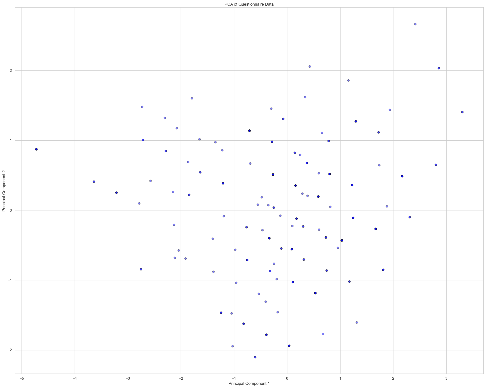
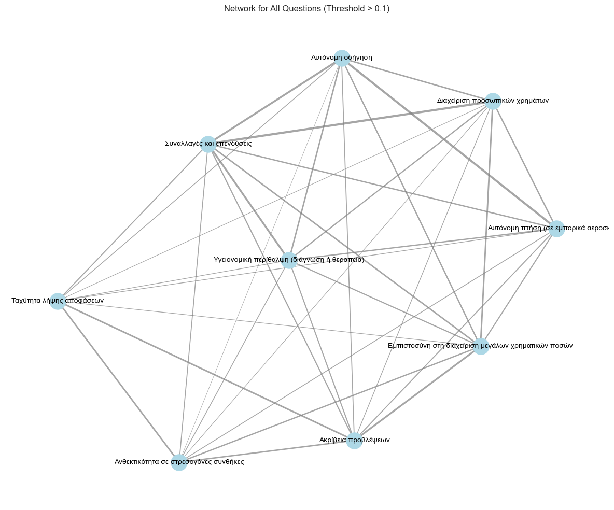

```python
import numpy as np
import pandas as pd
import networkx as nx
import seaborn as sns
import statsmodels.api as sm
import matplotlib.pyplot as plt
from textblob import TextBlob
from scipy.stats import f_oneway
from scipy.stats import norm, shapiro, chi2_contingency
from IPython.display import display
from deep_translator import GoogleTranslator
from sklearn.cluster import KMeans
from sklearn.decomposition import PCA
from sklearn.decomposition import FactorAnalysis
from sklearn.preprocessing import StandardScaler
```


```python
# Load the input
data = pd.read_excel('../input/questionnaire.xlsx')
```


```python
# Clean up text to remove unwanted characters and whitespace
def clean_text(text):
    """
    Cleans text by stripping whitespace and removing new line characters.
    """
    if isinstance(text, str):
        return text.strip().replace("\n", "")
    return text
```


```python
# Generate a mapping of columns to question descriptions
def generate_column_mapping(input_data):
    """
    Generates a mapping of columns to question descriptions using an explicit
    index-to-question mapping. This function is designed to handle grouped questions
    and dynamically adapt to changes in the questionnaire structure.
    """
    # Explicit mapping of column indices (1-based) to question numbers
    index_to_question = {
        1: 1,  # Column 1 → Question 1
        2: 2,  # Column 2 → Question 2
        3: 3,  # Column 3 → Question 3
        4: 4,
        5: 5,
        6: 6,
        7: 6,
        8: 6,
        9: 6,
        10: 6,
        11: 7,
        12: 8,
        13: 9,
        14: 10,
        15: 11,
        16: 12,
        17: 13,
        18: 14,
        19: 15,
        20: 16,
        21: 17,
        22: 18,
        23: 19,
        24: 20,
        25: 20,
        26: 20,
        27: 20,
        28: 21
    }

    column_mapping = {}

    # Descriptions for grouped questions (Question 6 & Question 20)
    question_6_description = "Πόσο εμπιστεύεστε την τεχνητή νοημοσύνη στις ακόλουθες εφαρμογές;"
    question_20_description = "Πώς θα αξιολογούσατε την τεχνητή νοημοσύνη σε σχέση με τους ανθρώπους στις ακόλουθες πτυχές;"

    # Iterate over columns (index starting at 1) to build the mapping
    for idx, column in enumerate(input_data.columns, start=1):
        question_number = index_to_question.get(idx)

        if question_number == 6:
            # Grouped sub-questions under Question 6
            column_mapping[idx] = (
                f"Question 6\n{question_6_description}\n{clean_text(column)}"
            )
        elif question_number == 20:
            # Grouped sub-questions under Question 20
            column_mapping[idx] = (
                f"Question 20\n{question_20_description}\n{clean_text(column)}"
            )
        else:
            # Default behaviour for standalone questions
            column_mapping[idx] = f"Question {question_number}\n{clean_text(column)}"

    return column_mapping
```


```python
# Analyze questions and process responses
def analyze_questions(input_data, column_mapping):
    """
    Processes and analyses the input for each question.
    Handles single and multi-answer questions appropriately.
    Uses 'column_mapping' to retrieve question numbers and descriptions.
    Returns a list of tuples: (question_num, question_text, answers).
    """
    results = []

    # Create a reverse mapping: question_number -> [(col_idx, question_text), ...]
    question_to_columns = {}
    for col_idx, question_text in column_mapping.items():
        # Extract question number (e.g. "Question 12\n..." → 12)
        question_number = int(question_text.split("\n")[0].replace("Question ", "").strip())
        question_to_columns.setdefault(question_number, []).append((col_idx, question_text))

    # Process each question number
    for question_number, columns in question_to_columns.items():
        combined_answers = None
        # Use the first column's text as the "question text"
        question_text = columns[0][1]

        # Process each column associated with this question
        for column_idx, _ in columns:
            # Convert from 1-based to 0-based index to retrieve actual column
            column_name = input_data.columns[column_idx - 1]

            # Analyse the column
            if input_data[column_name].dtype == 'object':
                # Possibly multi-answer if there are semicolons
                if input_data[column_name].str.contains(';').any():
                    # Split and flatten multi-answer responses
                    answers = (
                        input_data[column_name]
                        .dropna()
                        .str.split(';')
                        .explode()
                        .apply(clean_text)
                        .value_counts()
                    )
                else:
                    # Single-answer question with text-based responses
                    answers = input_data[column_name].dropna().apply(clean_text).value_counts()
            else:
                # Numeric or other input types
                answers = input_data[column_name].value_counts()

            # Combine answers for grouped questions
            if combined_answers is None:
                combined_answers = answers
            else:
                combined_answers = combined_answers.add(answers, fill_value=0)

        # Clean the index name
        combined_answers.index.name = None

        # Add to results
        results.append((f"Question {question_number}", question_text, combined_answers))

    return results
```


```python
# Generate descriptive statistics for each question
def generate_statistics(analysis_results):
    """
    Generates descriptive statistics for each question from the analysis results:
    - Total responses
    - Percentage distribution
    - Most common response
    - If numeric, attempts to compute mean/median
    """
    for question_num, question_text, answers in analysis_results:
        print(question_text)
        print("-" * 50)

        # Total responses for this question
        total_responses = answers.sum()
        print(f"Total Responses: {total_responses}")

        # Percentage distribution
        percentages = (answers / total_responses * 100).round(2)
        print("\nPercentage Distribution:")
        print(percentages.to_string())

        # Most common response
        most_common = answers.idxmax()
        print(f"\nMost Common Response: {most_common} ({answers[most_common]} responses)")

        # If numeric-like responses, attempt to compute mean & median
        try:
            numeric_index = pd.to_numeric(answers.index, errors='coerce')
            if numeric_index.notna().all():
                # Weighted mean
                weighted_mean = (numeric_index * answers).sum() / total_responses
                # Weighted median
                repeated_idx = numeric_index.repeat(answers)
                median_response = repeated_idx.median()
                print(f"Mean Response: {weighted_mean:.2f}")
                print(f"Median Response: {median_response:.2f}")
        except Exception:
            print("Mean and Median not applicable (non-numeric responses).")

        print("-" * 50)
        print()
```


```python
def perform_chi_square(input_data, column1, column2):
    """
    Performs a chi-square test of independence between two categorical variables.
    """
    contingency_table = pd.crosstab(input_data[column1], input_data[column2])
    chi2, p, dof, expected = chi2_contingency(contingency_table)
    print(f"Chi-Square Statistic: {chi2:.3f}")
    print(f"Degrees of Freedom: {dof}")
    print(f"P-Value: {p:.5f}")
    print("Expected Frequencies:")
    print(expected)
```


```python
def calculate_confidence_interval(data_series, confidence=0.95):
    """
    Calculates the confidence interval for the mean of a numeric Series.
    """
    mean_val = np.mean(data_series)
    std_err = np.std(data_series, ddof=1) / np.sqrt(len(data_series))
    z_value = norm.ppf((1 + confidence) / 2)  # Z for two-tailed
    margin_of_error = z_value * std_err
    lower_bound = mean_val - margin_of_error
    upper_bound = mean_val + margin_of_error
    print(f"Mean: {mean_val:.2f}")
    print(f"{int(confidence * 100)}% Confidence Interval: [{lower_bound:.2f}, {upper_bound:.2f}]")
```


```python
def calculate_correlation(input_data, column1, column2):
    """
    Calculates the Pearson correlation coefficient between two numeric columns.
    """
    correlation = input_data[column1].corr(input_data[column2])
    print(f"Pearson Correlation Coefficient: {correlation:.3f}")
```


```python
def group_descriptive_statistics(input_data, group_col, response_col):
    """
    Calculates descriptive statistics for a response variable grouped by a demographic variable.
    """
    grouped_stats = input_data.groupby(group_col)[response_col].describe()
    print(grouped_stats)
```


```python
# Analyze Likert-scale responses
def analyze_likert_scale(input_data, column):
    """
    Analyses Likert-scale responses, providing weighted averages and distributions.
    Assumes a 5-point scale from 1 to 5, mapped to -2..+2, just as an example.
    """
    weights = {1: -2, 2: -1, 3: 0, 4: 1, 5: 2}
    valid_responses = input_data[column].dropna()
    try:
        numeric_responses = valid_responses.astype(int)
    except ValueError:
        print(f"Cannot convert '{column}' to integers. Skipping.")
        return

    # Compute weighted sum
    val_counts = numeric_responses.value_counts()
    weighted_sum = sum(weights[val] * count for val, count in val_counts.items() if val in weights)
    total = numeric_responses.count()
    if total > 0:
        weighted_average = weighted_sum / total
    else:
        weighted_average = 0.0

    print(f"Likert-Scale Weighted Average for '{column}': {weighted_average:.2f}")
    print("Response Distribution (%):")
    distribution = (val_counts / total) * 100
    print(distribution.round(2))
```


```python
def regression_analysis(input_data, dependent_var, independent_vars):
    """
    Performs linear regression analysis using OLS.
    """
    # We must ensure the variables are numeric or encoded
    # For demonstration, simply drop NaNs and attempt to do numeric conversions
    df = input_data[[dependent_var] + independent_vars].dropna()
    # Basic numeric conversion attempt
    for col in independent_vars:
        # This is simplistic; ideally you'd use proper encoding for categorical vars
        df[col] = pd.Categorical(df[col]).codes

    df[dependent_var] = pd.Categorical(df[dependent_var]).codes

    X = df[independent_vars]
    y = df[dependent_var]
    X = sm.add_constant(X)  # Intercept
    model = sm.OLS(y, X).fit()
    print(model.summary())
```


```python
def test_normality(input_data, column):
    """
    Tests for normality using the Shapiro-Wilk test on a given column.
    """
    series = input_data[column].dropna()
    if len(series) < 3:
        print(f"Not enough input in column '{column}' for normality testing.")
        return

    stat, p = shapiro(series)
    print(f"Shapiro-Wilk Test for '{column}': Statistic={stat:.3f}, P-Value={p:.5f}")
    if p > 0.05:
        print("Data appears to be normally distributed (Shapiro-Wilk).")
    else:
        print("Data does NOT appear to be normally distributed (Shapiro-Wilk).")
```


```python
# 1) Clean column names
data.columns = [clean_text(c) for c in data.columns]
```


```python
# 2) Drop the first 6 columns if they are just administrative/time columns
data = data.iloc[:, 6:]
```


```python
# Display the dataframe
display(data)
```


<div>
<style scoped>
    .dataframe tbody tr th:only-of-type {
        vertical-align: middle;
    }

    .dataframe tbody tr th {
        vertical-align: top;
    }

    .dataframe thead th {
        text-align: right;
    }
</style>
<table border="1" class="dataframe">
  <thead>
    <tr style="text-align: right;">
      <th></th>
      <th>Ποια είναι η ηλικιακή σας ομάδα;</th>
      <th>Ποιο είναι το φύλο σας;</th>
      <th>Ποια είναι η επαγγελματική σας ιδιότητα;</th>
      <th>Έχετε προηγούμενη εμπειρία με την τεχνητή νοημοσύνη;</th>
      <th>Έχετε ασχοληθεί ποτέ με επενδύσεις ή συναλλαγές κρυπτονομισμάτων;</th>
      <th>Αυτόνομη οδήγηση</th>
      <th>Αυτόνομη πτήση (σε εμπορικά αεροσκάφη)</th>
      <th>Υγειονομική περίθαλψη (διάγνωση ή θεραπεία)</th>
      <th>Συναλλαγές και επενδύσεις</th>
      <th>Διαχείριση προσωπικών χρημάτων</th>
      <th>...</th>
      <th>Θεωρείτε ότι η τεχνητή νοημοσύνη θα αντικαταστήσει πλήρως τους ανθρώπινους επενδυτές στο μέλλον;</th>
      <th>Τι σας ανησυχεί περισσότερο σχετικά με τη χρήση της τεχνητής νοημοσύνης στις επενδύσεις;</th>
      <th>Θεωρείτε την τεχνητή νοημοσύνη δίκαιη και αντικειμενική στη λήψη αποφάσεων;</th>
      <th>Θα πληρώνατε για τη χρήση μιας υπηρεσίας τεχνητής νοημοσύνης για τη διαχείριση των επενδύσεών σας;</th>
      <th>Ποιο ποσοστό των συνολικών επενδύσεών σας θα ήσασταν πρόθυμοι να αφήσετε στη διαχείριση μιας τεχνητής νοημοσύνης;</th>
      <th>Ταχύτητα λήψης αποφάσεων</th>
      <th>Ακρίβεια προβλέψεων</th>
      <th>Ανθεκτικότητα σε στρεσογόνες συνθήκες</th>
      <th>Εμπιστοσύνη στη διαχείριση μεγάλων χρηματικών ποσών</th>
      <th>Θα εμπιστευόσασταν την τεχνητή νοημοσύνη να λαμβάνει επενδυτικές αποφάσεις σε μια οικονομική κρίση;</th>
    </tr>
  </thead>
  <tbody>
    <tr>
      <th>0</th>
      <td>31-40</td>
      <td>Γυναίκα</td>
      <td>Επαγγελματίας στον τομέα των οικονομικών</td>
      <td>Ελάχιστη</td>
      <td>Όχι</td>
      <td>3</td>
      <td>3</td>
      <td>4</td>
      <td>4</td>
      <td>4</td>
      <td>...</td>
      <td>Όχι</td>
      <td>Χρήση αναξιόπιστων δεδομένων;Αδυναμία κατανόησ...</td>
      <td>Ναι, τις περισσότερες φορές</td>
      <td>Ναι</td>
      <td>1-25%</td>
      <td>5</td>
      <td>4</td>
      <td>5</td>
      <td>3</td>
      <td>Ναι</td>
    </tr>
    <tr>
      <th>1</th>
      <td>31-40</td>
      <td>Άνδρας</td>
      <td>Άλλος επαγγελματίας</td>
      <td>Προχωρημένη</td>
      <td>Ναι, περιστασιακά</td>
      <td>4</td>
      <td>5</td>
      <td>4</td>
      <td>1</td>
      <td>2</td>
      <td>...</td>
      <td>Ίσως</td>
      <td>Κίνδυνος τεχνικών σφαλμάτων;Αδυναμία κατανόηση...</td>
      <td>Όχι, εξαρτάται από τον προγραμματισμό της</td>
      <td>Όχι</td>
      <td>1-25%</td>
      <td>5</td>
      <td>3</td>
      <td>3</td>
      <td>1</td>
      <td>Δεν είμαι σίγουρος/η</td>
    </tr>
    <tr>
      <th>2</th>
      <td>21-30</td>
      <td>Άνδρας</td>
      <td>Φοιτητής/Φοιτήτρια</td>
      <td>Ελάχιστη</td>
      <td>Ναι, περιστασιακά</td>
      <td>2</td>
      <td>1</td>
      <td>2</td>
      <td>3</td>
      <td>2</td>
      <td>...</td>
      <td>Ίσως</td>
      <td>Αδυναμία κατανόησης σύνθετων συνθηκών αγοράς;</td>
      <td>Όχι, εξαρτάται από τον προγραμματισμό της</td>
      <td>Εξαρτάται από το κόστος</td>
      <td>1-25%</td>
      <td>5</td>
      <td>3</td>
      <td>5</td>
      <td>3</td>
      <td>Δεν είμαι σίγουρος/η</td>
    </tr>
    <tr>
      <th>3</th>
      <td>Άνω των 50</td>
      <td>Γυναίκα</td>
      <td>Άλλος επαγγελματίας</td>
      <td>Καθόλου</td>
      <td>Όχι</td>
      <td>3</td>
      <td>3</td>
      <td>3</td>
      <td>4</td>
      <td>3</td>
      <td>...</td>
      <td>Ίσως</td>
      <td>Αδυναμία κατανόησης σύνθετων συνθηκών αγοράς;</td>
      <td>Ναι, τις περισσότερες φορές</td>
      <td>Εξαρτάται από το κόστος</td>
      <td>26-50%</td>
      <td>4</td>
      <td>3</td>
      <td>4</td>
      <td>3</td>
      <td>Δεν είμαι σίγουρος/η</td>
    </tr>
    <tr>
      <th>4</th>
      <td>41-50</td>
      <td>Γυναίκα</td>
      <td>Επαγγελματίας στον τομέα των οικονομικών</td>
      <td>Μέτρια</td>
      <td>Ναι, περιστασιακά</td>
      <td>1</td>
      <td>3</td>
      <td>1</td>
      <td>2</td>
      <td>2</td>
      <td>...</td>
      <td>Όχι</td>
      <td>Ανησυχίες για ασφάλεια και ιδιωτικότητα;Αδυναμ...</td>
      <td>Ναι, τις περισσότερες φορές</td>
      <td>Εξαρτάται από το κόστος</td>
      <td>26-50%</td>
      <td>4</td>
      <td>3</td>
      <td>4</td>
      <td>3</td>
      <td>Όχι</td>
    </tr>
    <tr>
      <th>...</th>
      <td>...</td>
      <td>...</td>
      <td>...</td>
      <td>...</td>
      <td>...</td>
      <td>...</td>
      <td>...</td>
      <td>...</td>
      <td>...</td>
      <td>...</td>
      <td>...</td>
      <td>...</td>
      <td>...</td>
      <td>...</td>
      <td>...</td>
      <td>...</td>
      <td>...</td>
      <td>...</td>
      <td>...</td>
      <td>...</td>
      <td>...</td>
    </tr>
    <tr>
      <th>245</th>
      <td>41-50</td>
      <td>Γυναίκα</td>
      <td>Ιδιωτική υπάλληλος -ταμιας</td>
      <td>Μέτρια</td>
      <td>Όχι</td>
      <td>1</td>
      <td>2</td>
      <td>1</td>
      <td>2</td>
      <td>1</td>
      <td>...</td>
      <td>Ίσως</td>
      <td>Ανησυχίες για ασφάλεια και ιδιωτικότητα;Χρήση ...</td>
      <td>Όχι, οι αποφάσεις της μπορεί να επηρεάζονται α...</td>
      <td>Όχι</td>
      <td>1-25%</td>
      <td>3</td>
      <td>3</td>
      <td>2</td>
      <td>1</td>
      <td>Όχι</td>
    </tr>
    <tr>
      <th>246</th>
      <td>31-40</td>
      <td>Άνδρας</td>
      <td>Δημόσιος υπάλληλος</td>
      <td>Καθόλου</td>
      <td>Όχι</td>
      <td>2</td>
      <td>2</td>
      <td>3</td>
      <td>3</td>
      <td>3</td>
      <td>...</td>
      <td>Όχι</td>
      <td>Κίνδυνος τεχνικών σφαλμάτων;Αδυναμία κατανόηση...</td>
      <td>Ναι, τις περισσότερες φορές</td>
      <td>Εξαρτάται από το κόστος</td>
      <td>1-25%</td>
      <td>1</td>
      <td>2</td>
      <td>4</td>
      <td>2</td>
      <td>Δεν είμαι σίγουρος/η</td>
    </tr>
    <tr>
      <th>247</th>
      <td>Άνω των 50</td>
      <td>Άνδρας</td>
      <td>Επαγγελματίας στον τομέα των οικονομικών</td>
      <td>Μέτρια</td>
      <td>Ναι, περιστασιακά</td>
      <td>3</td>
      <td>2</td>
      <td>2</td>
      <td>4</td>
      <td>3</td>
      <td>...</td>
      <td>Ναι</td>
      <td>Κίνδυνος τεχνικών σφαλμάτων;Ανησυχίες για ασφά...</td>
      <td>Ναι, τις περισσότερες φορές</td>
      <td>Όχι</td>
      <td>1-25%</td>
      <td>5</td>
      <td>3</td>
      <td>3</td>
      <td>2</td>
      <td>Όχι</td>
    </tr>
    <tr>
      <th>248</th>
      <td>31-40</td>
      <td>Γυναίκα</td>
      <td>Επαγγελματίας στον τομέα των οικονομικών</td>
      <td>Καθόλου</td>
      <td>Όχι</td>
      <td>2</td>
      <td>2</td>
      <td>3</td>
      <td>4</td>
      <td>3</td>
      <td>...</td>
      <td>Ίσως</td>
      <td>Αδυναμία κατανόησης σύνθετων συνθηκών αγοράς;Χ...</td>
      <td>Όχι, οι αποφάσεις της μπορεί να επηρεάζονται α...</td>
      <td>Εξαρτάται από το κόστος</td>
      <td>0% (Καθόλου)</td>
      <td>2</td>
      <td>3</td>
      <td>4</td>
      <td>2</td>
      <td>Όχι</td>
    </tr>
    <tr>
      <th>249</th>
      <td>21-30</td>
      <td>Άνδρας</td>
      <td>Φοιτητής/Φοιτήτρια</td>
      <td>Ελάχιστη</td>
      <td>Ναι, περιστασιακά</td>
      <td>1</td>
      <td>2</td>
      <td>3</td>
      <td>3</td>
      <td>1</td>
      <td>...</td>
      <td>Όχι</td>
      <td>Ανησυχίες για ασφάλεια και ιδιωτικότητα;</td>
      <td>Ναι, τις περισσότερες φορές</td>
      <td>Εξαρτάται από το κόστος</td>
      <td>26-50%</td>
      <td>5</td>
      <td>3</td>
      <td>5</td>
      <td>3</td>
      <td>Δεν είμαι σίγουρος/η</td>
    </tr>
  </tbody>
</table>
<p>250 rows × 28 columns</p>
</div>


```python
# 3) Generate the mapping of columns to question numbers/descriptions
column_mapping = generate_column_mapping(data)
```


```python
# 4) Perform the main analysis
analysis_results = analyze_questions(data, column_mapping)
```


```python
# 5) Print raw frequencies for each question
for question_num, question_text, answers in analysis_results:
    print(question_text)
    print(answers.to_string())
    print("-" * 50)
```

    Question 1
    Ποια είναι η ηλικιακή σας ομάδα;
    31-40          76
    21-30          68
    41-50          64
    Άνω των 50     30
    Κάτω από 20    12
    --------------------------------------------------
    Question 2
    Ποιο είναι το φύλο σας;
    Γυναίκα    140
    Άνδρας     110
    --------------------------------------------------
    Question 3
    Ποια είναι η επαγγελματική σας ιδιότητα;
    Επαγγελματίας στον τομέα των οικονομικών                            61
    Φοιτητής/Φοιτήτρια                                                  50
    Επαγγελματίας στον τομέα της τεχνολογίας                            23
    Άνεργος/Άνεργη                                                      13
    Δημόσιος υπάλληλος                                                   7
    Ιδιωτικός υπάλληλος                                                  7
    Εκπαιδευτικός                                                        7
    Ελεύθερος επαγγελματίας                                              4
    Βοηθός λογιστη                                                       2
    Ιδιωτικός τομέας                                                     2
    Ιδιωτική υπάλληλος                                                   2
    Επαγγελματίας στον τομέα του τουρισμού                               2
    Άλλος επαγγελματίας                                                  2
    Εκπαιδευτικός πρωτοβάθμιας                                           2
    Shipping                                                             2
    ΔΗΜΟΣΙΟΣ ΥΠΑΛΛΗΛΟΣ                                                   2
    Επιχειρηματίας                                                       2
    Τηλεπικοινωνίες                                                      1
    Ιδ.υπαλληλος                                                         1
    φοιτήτρια και εργαζόμενη στις πωλήσεις                               1
    Ιδιωτική υπάλληλος σε εταιρεία  Logistics                            1
    Βοηθός λογιστή                                                       1
    Ερευνητής                                                            1
    Φυσικός                                                              1
    Αστυνομικός                                                          1
    Υπάλληλος & προπονητής                                               1
    Τουρισμός                                                            1
    Ιδ υπ/λος                                                            1
    Store association                                                    1
    Υπάλληλος σούπερ μάρκετ                                              1
    ΥΠΆΛΛΗΛΟΣ ΙΔΙΩΤΙΚΟΎ ΤΟΜΈΑ                                            1
    Ιδιωτικός Υπάλληλος                                                  1
    Επαγγελματίας στον τομέα του λιανικού εμπορίου                       1
    Ιδιωτική υπάλληλος στον τομέα λιανικού εμποριου                      1
    Εστίαση                                                              1
    Eκπαιδευτικος                                                        1
    Chef                                                                 1
    Ελεύθερος Επαγγελματίας                                              1
    Γραφιστας                                                            1
    Άλλο                                                                 1
    εκπαιδευτικός                                                        1
    ΤΗΛΕΠΙΚΟΙΝΩΝΙΕΣ                                                      1
    Νοσηλεύτρια                                                          1
    Νομικός                                                              1
    Δ.Υ                                                                  1
    Ιδιωτικός υπάλληλος σε εταιρεία, ιντερνετικου εμπορίου               1
    ΔΗΜΟΣΙΟΣ ΥΠΑΛΛΗΛΟς                                                   1
    Ιδιωτική Υπάλληλος                                                   1
    Μουσικοπαιδαγωγός                                                    1
    Γραφίστας                                                            1
    Καθηγήτρια                                                           1
    Δ.Υ.                                                                 1
    Καθηγήτρια σε σχολείο                                                1
    Καθηγήτρια Αγγλικών                                                  1
    Νηπιαγωγός σε παιδικό σταθμό                                         1
    Στρατιωτικός                                                         1
    Δικηγόρος                                                            1
    Τουριστικά                                                           1
    Ιδιωτικος υπαλληλος                                                  1
    Μηχανικός                                                            1
    Νοσηλευτικής                                                         1
    Φυσικοθεραπευτης                                                     1
    Κοινωνικές επιστήμες                                                 1
    Εργαζόμενη στον τομέα του ηλεκτρονικού εμπορίου                      1
    Hospitality industry                                                 1
    αεροδρόμιο                                                           1
    Υπάλληλος στον τομέα των ταχυμεταφορών                               1
    Εργαζόμενη στον τομέα των οικονομικών και Μεταπτυχιακή φοιτήτρια     1
    Τομέας τουρισμού                                                     1
    Φιλόλογος                                                            1
    Risk Monitoring Officer                                              1
    Σώματα Ασφαλείας                                                     1
    ΚΑΘΗΓΗΤΡΙΑ                                                           1
    Μεταπτυχιακή Φοιτήτρια, ιδιωτικός τομέας                             1
    Επαγγελματίας στον τομέα Real Estate.                                1
    Δημόσιος υπάλληλος - φοιτήτρια                                       1
    Ιδιωτική υπάλληλος -ταμιας                                           1
    --------------------------------------------------
    Question 4
    Έχετε προηγούμενη εμπειρία με την τεχνητή νοημοσύνη;
    Ελάχιστη       101
    Μέτρια          66
    Καθόλου         65
    Προχωρημένη     18
    --------------------------------------------------
    Question 5
    Έχετε ασχοληθεί ποτέ με επενδύσεις ή συναλλαγές κρυπτονομισμάτων;
    Όχι                  187
    Ναι, περιστασιακά     44
    Ναι, συχνά            19
    --------------------------------------------------
    Question 6
    Πόσο εμπιστεύεστε την τεχνητή νοημοσύνη στις ακόλουθες εφαρμογές;
    Αυτόνομη οδήγηση
    1    244
    2    324
    3    433
    4    203
    5     46
    --------------------------------------------------
    Question 7
    Θα εμπιστευόσασταν ένα μοντέλο τεχνητής νοημοσύνης να διαχειριστεί εξ ολοκλήρου τις επενδύσεις σας;
    Όχι     148
    Ίσως     93
    Ναι       9
    --------------------------------------------------
    Question 8
    Τι πιστεύετε ότι είναι το μεγαλύτερο πλεονέκτημα της τεχνητής νοημοσύνης στις επενδύσεις;
                                     250
    Ταχύτερη ανάλυση δεδομένων       184
    Αποφυγή συναισθηματικών λαθών    128
    Πρόβλεψη τάσεων της αγοράς        65
    Καλύτερη διαχείριση κινδύνου      49
    Δεν βλέπω πλεονεκτήματα            9
    --------------------------------------------------
    Question 9
    Ποιο θεωρείτε το μεγαλύτερο μειονέκτημα της τεχνητής νοημοσύνης στις επενδύσεις;
                                                                                                                               250
    Δυσκολία προσαρμογής σε μη αναμενόμενες συνθήκες                                                                           145
    Ευπάθεια σε τεχνικά σφάλματα ή παραβιάσεις                                                                                 134
    Εξάρτηση από δεδομένα του παρελθόντος                                                                                       69
    Έλλειψη διαφάνειας στη λήψη αποφάσεων                                                                                       47
    Μη σωστή λήψη αποφάσεων λόγω της πρόβλεψης των τάσεων στην αγορά                                                             1
    Μπορεί κάποιος να βάλει ότι δεδομένα θέλει οπότε ένα μοντέλο AI μπορεί πολύ εύκολα να ακολούθηση λάθος/ψεύτικα δεδομένα      1
    Στο τι θέλω, επι της ουσίας τo in thuis case                                                                                 1
    Ρίσκο                                                                                                                        1
    Απλοϊκή αιτιολόγηση των αποφάσεων                                                                                            1
    --------------------------------------------------
    Question 10
    Πιστεύετε ότι η τεχνητή νοημοσύνη είναι πιο αξιόπιστη από τους ανθρώπους στις επενδύσεις;
    Εξαρτάται από την περίπτωση    151
    Όχι                             62
    Ναι                             37
    --------------------------------------------------
    Question 11
    Ποιον θα εμπιστευόσασταν περισσότερο για τη διαχείριση των επενδύσεών σας;
    Έναν έμπειρο επενδυτή    114
    Και τα δύο εξίσου         91
    Κανέναν                   26
    Την τεχνητή νοημοσύνη     18
    --------------------------------------------------
    Question 12
    Σε ποια από τις ακόλουθες καταστάσεις θεωρείτε ότι η τεχνητή νοημοσύνη υπερέχει σε σχέση με τους ανθρώπους;
                                                   250
    Γρήγορη ανάλυση δεδομένων                      212
    Λήψη αποφάσεων χωρίς συναισθηματική επιρροή    138
    Ανίχνευση επενδυτικών ευκαιριών                 46
    Αποφυγή απάτης                                  23
    Δεν θεωρώ ότι υπερέχει σε κάποια από αυτές       7
    --------------------------------------------------
    Question 13
    Σε ποιες από τις ακόλουθες καταστάσεις θεωρείτε ότι οι άνθρωποι υπερέχουν σε σχέση με την τεχνητή νοημοσύνη;
                                                                      250
    Προσαρμογή σε μη αναμενόμενες καταστάσεις                         130
    Λήψη ηθικών αποφάσεων                                             114
    Ερμηνεία μη ποσοτικών δεδομένων (π.χ. συναισθήματα της αγοράς)    103
    Δημιουργικότητα στις στρατηγικές επενδύσεων                        87
    Δεν θεωρώ ότι υπερέχουν σε κάποια από αυτές                        14
    --------------------------------------------------
    Question 14
    Θα ήσασταν πρόθυμοι να χρησιμοποιήσετε ένα συνδυαστικό μοντέλο όπου η τεχνητή νοημοσύνη συνεργάζεται με έναν άνθρωπο επενδυτή;
    Ναι                     176
    Δεν είμαι σίγουρος/η     57
    Όχι                      17
    --------------------------------------------------
    Question 15
    Θεωρείτε ότι η τεχνητή νοημοσύνη θα αντικαταστήσει πλήρως τους ανθρώπινους επενδυτές στο μέλλον;
    Ίσως    107
    Όχι      84
    Ναι      59
    --------------------------------------------------
    Question 16
    Τι σας ανησυχεί περισσότερο σχετικά με τη χρήση της τεχνητής νοημοσύνης στις επενδύσεις;
                                                    250
    Κίνδυνος τεχνικών σφαλμάτων                     113
    Ανησυχίες για ασφάλεια και ιδιωτικότητα         108
    Αδυναμία κατανόησης σύνθετων συνθηκών αγοράς     88
    Χρήση αναξιόπιστων δεδομένων                     76
    Έλλειψη διαφάνειας στη λήψη αποφάσεων            44
    --------------------------------------------------
    Question 17
    Θεωρείτε την τεχνητή νοημοσύνη δίκαιη και αντικειμενική στη λήψη αποφάσεων;
    Όχι, καθώς ο προγραμματισμός της μπορεί να περιέχει προκαταλήψεις ή σφάλματα    116
    Ναι, τις περισσότερες φορές                                                      85
    Όχι, οι αποφάσεις της μπορεί να επηρεάζονται από προκαταλήψεις στα δεδομένα      42
    Ναι, πάντα                                                                        5
    Όχι, εξαρτάται από τον προγραμματισμό της                                         2
    --------------------------------------------------
    Question 18
    Θα πληρώνατε για τη χρήση μιας υπηρεσίας τεχνητής νοημοσύνης για τη διαχείριση των επενδύσεών σας;
    Εξαρτάται από το κόστος    143
    Όχι                         75
    Ναι                         32
    --------------------------------------------------
    Question 19
    Ποιο ποσοστό των συνολικών επενδύσεών σας θα ήσασταν πρόθυμοι να αφήσετε στη διαχείριση μιας τεχνητής νοημοσύνης;
    1-25%           155
    26-50%           48
    0% (Καθόλου)     33
    51-75%           12
    76-100%           2
    --------------------------------------------------
    Question 20
    Πώς θα αξιολογούσατε την τεχνητή νοημοσύνη σε σχέση με τους ανθρώπους στις ακόλουθες πτυχές;
    Ταχύτητα λήψης αποφάσεων
    1     67
    2    154
    3    321
    4    231
    5    227
    --------------------------------------------------
    Question 21
    Θα εμπιστευόσασταν την τεχνητή νοημοσύνη να λαμβάνει επενδυτικές αποφάσεις σε μια οικονομική κρίση;
    Δεν είμαι σίγουρος/η    145
    Όχι                      80
    Ναι                      25
    --------------------------------------------------


```python
# 6) Generate descriptive statistics
generate_statistics(analysis_results)
```

    Question 1
    Ποια είναι η ηλικιακή σας ομάδα;
    --------------------------------------------------
    Total Responses: 250
    
    Percentage Distribution:
    31-40          30.4
    21-30          27.2
    41-50          25.6
    Άνω των 50     12.0
    Κάτω από 20     4.8
    
    Most Common Response: 31-40 (76 responses)
    --------------------------------------------------
    
    Question 2
    Ποιο είναι το φύλο σας;
    --------------------------------------------------
    Total Responses: 250
    
    Percentage Distribution:
    Γυναίκα    56.0
    Άνδρας     44.0
    
    Most Common Response: Γυναίκα (140 responses)
    --------------------------------------------------
    
    Question 3
    Ποια είναι η επαγγελματική σας ιδιότητα;
    --------------------------------------------------
    Total Responses: 250
    
    Percentage Distribution:
    Επαγγελματίας στον τομέα των οικονομικών                            24.4
    Φοιτητής/Φοιτήτρια                                                  20.0
    Επαγγελματίας στον τομέα της τεχνολογίας                             9.2
    Άνεργος/Άνεργη                                                       5.2
    Δημόσιος υπάλληλος                                                   2.8
    Ιδιωτικός υπάλληλος                                                  2.8
    Εκπαιδευτικός                                                        2.8
    Ελεύθερος επαγγελματίας                                              1.6
    Βοηθός λογιστη                                                       0.8
    Ιδιωτικός τομέας                                                     0.8
    Ιδιωτική υπάλληλος                                                   0.8
    Επαγγελματίας στον τομέα του τουρισμού                               0.8
    Άλλος επαγγελματίας                                                  0.8
    Εκπαιδευτικός πρωτοβάθμιας                                           0.8
    Shipping                                                             0.8
    ΔΗΜΟΣΙΟΣ ΥΠΑΛΛΗΛΟΣ                                                   0.8
    Επιχειρηματίας                                                       0.8
    Τηλεπικοινωνίες                                                      0.4
    Ιδ.υπαλληλος                                                         0.4
    φοιτήτρια και εργαζόμενη στις πωλήσεις                               0.4
    Ιδιωτική υπάλληλος σε εταιρεία  Logistics                            0.4
    Βοηθός λογιστή                                                       0.4
    Ερευνητής                                                            0.4
    Φυσικός                                                              0.4
    Αστυνομικός                                                          0.4
    Υπάλληλος & προπονητής                                               0.4
    Τουρισμός                                                            0.4
    Ιδ υπ/λος                                                            0.4
    Store association                                                    0.4
    Υπάλληλος σούπερ μάρκετ                                              0.4
    ΥΠΆΛΛΗΛΟΣ ΙΔΙΩΤΙΚΟΎ ΤΟΜΈΑ                                            0.4
    Ιδιωτικός Υπάλληλος                                                  0.4
    Επαγγελματίας στον τομέα του λιανικού εμπορίου                       0.4
    Ιδιωτική υπάλληλος στον τομέα λιανικού εμποριου                      0.4
    Εστίαση                                                              0.4
    Eκπαιδευτικος                                                        0.4
    Chef                                                                 0.4
    Ελεύθερος Επαγγελματίας                                              0.4
    Γραφιστας                                                            0.4
    Άλλο                                                                 0.4
    εκπαιδευτικός                                                        0.4
    ΤΗΛΕΠΙΚΟΙΝΩΝΙΕΣ                                                      0.4
    Νοσηλεύτρια                                                          0.4
    Νομικός                                                              0.4
    Δ.Υ                                                                  0.4
    Ιδιωτικός υπάλληλος σε εταιρεία, ιντερνετικου εμπορίου               0.4
    ΔΗΜΟΣΙΟΣ ΥΠΑΛΛΗΛΟς                                                   0.4
    Ιδιωτική Υπάλληλος                                                   0.4
    Μουσικοπαιδαγωγός                                                    0.4
    Γραφίστας                                                            0.4
    Καθηγήτρια                                                           0.4
    Δ.Υ.                                                                 0.4
    Καθηγήτρια σε σχολείο                                                0.4
    Καθηγήτρια Αγγλικών                                                  0.4
    Νηπιαγωγός σε παιδικό σταθμό                                         0.4
    Στρατιωτικός                                                         0.4
    Δικηγόρος                                                            0.4
    Τουριστικά                                                           0.4
    Ιδιωτικος υπαλληλος                                                  0.4
    Μηχανικός                                                            0.4
    Νοσηλευτικής                                                         0.4
    Φυσικοθεραπευτης                                                     0.4
    Κοινωνικές επιστήμες                                                 0.4
    Εργαζόμενη στον τομέα του ηλεκτρονικού εμπορίου                      0.4
    Hospitality industry                                                 0.4
    αεροδρόμιο                                                           0.4
    Υπάλληλος στον τομέα των ταχυμεταφορών                               0.4
    Εργαζόμενη στον τομέα των οικονομικών και Μεταπτυχιακή φοιτήτρια     0.4
    Τομέας τουρισμού                                                     0.4
    Φιλόλογος                                                            0.4
    Risk Monitoring Officer                                              0.4
    Σώματα Ασφαλείας                                                     0.4
    ΚΑΘΗΓΗΤΡΙΑ                                                           0.4
    Μεταπτυχιακή Φοιτήτρια, ιδιωτικός τομέας                             0.4
    Επαγγελματίας στον τομέα Real Estate.                                0.4
    Δημόσιος υπάλληλος - φοιτήτρια                                       0.4
    Ιδιωτική υπάλληλος -ταμιας                                           0.4
    
    Most Common Response: Επαγγελματίας στον τομέα των οικονομικών (61 responses)
    --------------------------------------------------
    
    Question 4
    Έχετε προηγούμενη εμπειρία με την τεχνητή νοημοσύνη;
    --------------------------------------------------
    Total Responses: 250
    
    Percentage Distribution:
    Ελάχιστη       40.4
    Μέτρια         26.4
    Καθόλου        26.0
    Προχωρημένη     7.2
    
    Most Common Response: Ελάχιστη (101 responses)
    --------------------------------------------------
    
    Question 5
    Έχετε ασχοληθεί ποτέ με επενδύσεις ή συναλλαγές κρυπτονομισμάτων;
    --------------------------------------------------
    Total Responses: 250
    
    Percentage Distribution:
    Όχι                  74.8
    Ναι, περιστασιακά    17.6
    Ναι, συχνά            7.6
    
    Most Common Response: Όχι (187 responses)
    --------------------------------------------------
    
    Question 6
    Πόσο εμπιστεύεστε την τεχνητή νοημοσύνη στις ακόλουθες εφαρμογές;
    Αυτόνομη οδήγηση
    --------------------------------------------------
    Total Responses: 1250
    
    Percentage Distribution:
    1    19.52
    2    25.92
    3    34.64
    4    16.24
    5     3.68
    
    Most Common Response: 3 (433 responses)
    Mean and Median not applicable (non-numeric responses).
    --------------------------------------------------
    
    Question 7
    Θα εμπιστευόσασταν ένα μοντέλο τεχνητής νοημοσύνης να διαχειριστεί εξ ολοκλήρου τις επενδύσεις σας;
    --------------------------------------------------
    Total Responses: 250
    
    Percentage Distribution:
    Όχι     59.2
    Ίσως    37.2
    Ναι      3.6
    
    Most Common Response: Όχι (148 responses)
    --------------------------------------------------
    
    Question 8
    Τι πιστεύετε ότι είναι το μεγαλύτερο πλεονέκτημα της τεχνητής νοημοσύνης στις επενδύσεις;
    --------------------------------------------------
    Total Responses: 685
    
    Percentage Distribution:
                                     36.50
    Ταχύτερη ανάλυση δεδομένων       26.86
    Αποφυγή συναισθηματικών λαθών    18.69
    Πρόβλεψη τάσεων της αγοράς        9.49
    Καλύτερη διαχείριση κινδύνου      7.15
    Δεν βλέπω πλεονεκτήματα           1.31
    
    Most Common Response:  (250 responses)
    --------------------------------------------------
    
    Question 9
    Ποιο θεωρείτε το μεγαλύτερο μειονέκτημα της τεχνητής νοημοσύνης στις επενδύσεις;
    --------------------------------------------------
    Total Responses: 650
    
    Percentage Distribution:
                                                                                                                               38.46
    Δυσκολία προσαρμογής σε μη αναμενόμενες συνθήκες                                                                           22.31
    Ευπάθεια σε τεχνικά σφάλματα ή παραβιάσεις                                                                                 20.62
    Εξάρτηση από δεδομένα του παρελθόντος                                                                                      10.62
    Έλλειψη διαφάνειας στη λήψη αποφάσεων                                                                                       7.23
    Μη σωστή λήψη αποφάσεων λόγω της πρόβλεψης των τάσεων στην αγορά                                                            0.15
    Μπορεί κάποιος να βάλει ότι δεδομένα θέλει οπότε ένα μοντέλο AI μπορεί πολύ εύκολα να ακολούθηση λάθος/ψεύτικα δεδομένα     0.15
    Στο τι θέλω, επι της ουσίας τo in thuis case                                                                                0.15
    Ρίσκο                                                                                                                       0.15
    Απλοϊκή αιτιολόγηση των αποφάσεων                                                                                           0.15
    
    Most Common Response:  (250 responses)
    --------------------------------------------------
    
    Question 10
    Πιστεύετε ότι η τεχνητή νοημοσύνη είναι πιο αξιόπιστη από τους ανθρώπους στις επενδύσεις;
    --------------------------------------------------
    Total Responses: 250
    
    Percentage Distribution:
    Εξαρτάται από την περίπτωση    60.4
    Όχι                            24.8
    Ναι                            14.8
    
    Most Common Response: Εξαρτάται από την περίπτωση (151 responses)
    --------------------------------------------------
    
    Question 11
    Ποιον θα εμπιστευόσασταν περισσότερο για τη διαχείριση των επενδύσεών σας;
    --------------------------------------------------
    Total Responses: 249
    
    Percentage Distribution:
    Έναν έμπειρο επενδυτή    45.78
    Και τα δύο εξίσου        36.55
    Κανέναν                  10.44
    Την τεχνητή νοημοσύνη     7.23
    
    Most Common Response: Έναν έμπειρο επενδυτή (114 responses)
    --------------------------------------------------
    
    Question 12
    Σε ποια από τις ακόλουθες καταστάσεις θεωρείτε ότι η τεχνητή νοημοσύνη υπερέχει σε σχέση με τους ανθρώπους;
    --------------------------------------------------
    Total Responses: 676
    
    Percentage Distribution:
                                                   36.98
    Γρήγορη ανάλυση δεδομένων                      31.36
    Λήψη αποφάσεων χωρίς συναισθηματική επιρροή    20.41
    Ανίχνευση επενδυτικών ευκαιριών                 6.80
    Αποφυγή απάτης                                  3.40
    Δεν θεωρώ ότι υπερέχει σε κάποια από αυτές      1.04
    
    Most Common Response:  (250 responses)
    --------------------------------------------------
    
    Question 13
    Σε ποιες από τις ακόλουθες καταστάσεις θεωρείτε ότι οι άνθρωποι υπερέχουν σε σχέση με την τεχνητή νοημοσύνη;
    --------------------------------------------------
    Total Responses: 698
    
    Percentage Distribution:
                                                                      35.82
    Προσαρμογή σε μη αναμενόμενες καταστάσεις                         18.62
    Λήψη ηθικών αποφάσεων                                             16.33
    Ερμηνεία μη ποσοτικών δεδομένων (π.χ. συναισθήματα της αγοράς)    14.76
    Δημιουργικότητα στις στρατηγικές επενδύσεων                       12.46
    Δεν θεωρώ ότι υπερέχουν σε κάποια από αυτές                        2.01
    
    Most Common Response:  (250 responses)
    --------------------------------------------------
    
    Question 14
    Θα ήσασταν πρόθυμοι να χρησιμοποιήσετε ένα συνδυαστικό μοντέλο όπου η τεχνητή νοημοσύνη συνεργάζεται με έναν άνθρωπο επενδυτή;
    --------------------------------------------------
    Total Responses: 250
    
    Percentage Distribution:
    Ναι                     70.4
    Δεν είμαι σίγουρος/η    22.8
    Όχι                      6.8
    
    Most Common Response: Ναι (176 responses)
    --------------------------------------------------
    
    Question 15
    Θεωρείτε ότι η τεχνητή νοημοσύνη θα αντικαταστήσει πλήρως τους ανθρώπινους επενδυτές στο μέλλον;
    --------------------------------------------------
    Total Responses: 250
    
    Percentage Distribution:
    Ίσως    42.8
    Όχι     33.6
    Ναι     23.6
    
    Most Common Response: Ίσως (107 responses)
    --------------------------------------------------
    
    Question 16
    Τι σας ανησυχεί περισσότερο σχετικά με τη χρήση της τεχνητής νοημοσύνης στις επενδύσεις;
    --------------------------------------------------
    Total Responses: 679
    
    Percentage Distribution:
                                                    36.82
    Κίνδυνος τεχνικών σφαλμάτων                     16.64
    Ανησυχίες για ασφάλεια και ιδιωτικότητα         15.91
    Αδυναμία κατανόησης σύνθετων συνθηκών αγοράς    12.96
    Χρήση αναξιόπιστων δεδομένων                    11.19
    Έλλειψη διαφάνειας στη λήψη αποφάσεων            6.48
    
    Most Common Response:  (250 responses)
    --------------------------------------------------
    
    Question 17
    Θεωρείτε την τεχνητή νοημοσύνη δίκαιη και αντικειμενική στη λήψη αποφάσεων;
    --------------------------------------------------
    Total Responses: 250
    
    Percentage Distribution:
    Όχι, καθώς ο προγραμματισμός της μπορεί να περιέχει προκαταλήψεις ή σφάλματα    46.4
    Ναι, τις περισσότερες φορές                                                     34.0
    Όχι, οι αποφάσεις της μπορεί να επηρεάζονται από προκαταλήψεις στα δεδομένα     16.8
    Ναι, πάντα                                                                       2.0
    Όχι, εξαρτάται από τον προγραμματισμό της                                        0.8
    
    Most Common Response: Όχι, καθώς ο προγραμματισμός της μπορεί να περιέχει προκαταλήψεις ή σφάλματα (116 responses)
    --------------------------------------------------
    
    Question 18
    Θα πληρώνατε για τη χρήση μιας υπηρεσίας τεχνητής νοημοσύνης για τη διαχείριση των επενδύσεών σας;
    --------------------------------------------------
    Total Responses: 250
    
    Percentage Distribution:
    Εξαρτάται από το κόστος    57.2
    Όχι                        30.0
    Ναι                        12.8
    
    Most Common Response: Εξαρτάται από το κόστος (143 responses)
    --------------------------------------------------
    
    Question 19
    Ποιο ποσοστό των συνολικών επενδύσεών σας θα ήσασταν πρόθυμοι να αφήσετε στη διαχείριση μιας τεχνητής νοημοσύνης;
    --------------------------------------------------
    Total Responses: 250
    
    Percentage Distribution:
    1-25%           62.0
    26-50%          19.2
    0% (Καθόλου)    13.2
    51-75%           4.8
    76-100%          0.8
    
    Most Common Response: 1-25% (155 responses)
    --------------------------------------------------
    
    Question 20
    Πώς θα αξιολογούσατε την τεχνητή νοημοσύνη σε σχέση με τους ανθρώπους στις ακόλουθες πτυχές;
    Ταχύτητα λήψης αποφάσεων
    --------------------------------------------------
    Total Responses: 1000
    
    Percentage Distribution:
    1     6.7
    2    15.4
    3    32.1
    4    23.1
    5    22.7
    
    Most Common Response: 3 (321 responses)
    Mean and Median not applicable (non-numeric responses).
    --------------------------------------------------
    
    Question 21
    Θα εμπιστευόσασταν την τεχνητή νοημοσύνη να λαμβάνει επενδυτικές αποφάσεις σε μια οικονομική κρίση;
    --------------------------------------------------
    Total Responses: 250
    
    Percentage Distribution:
    Δεν είμαι σίγουρος/η    58.0
    Όχι                     32.0
    Ναι                     10.0
    
    Most Common Response: Δεν είμαι σίγουρος/η (145 responses)
    --------------------------------------------------
    


```python
# 7) Test normality for numeric columns
print("\n### Normality Tests ###\n")
numeric_cols = [col for col in data.columns if pd.api.types.is_numeric_dtype(data[col])]
for col in numeric_cols:
    test_normality(data, col)
    print("-" * 50)
```

    
    ### Normality Tests ###
    
    Shapiro-Wilk Test for 'Αυτόνομη οδήγηση': Statistic=0.891, P-Value=0.00000
    Data does NOT appear to be normally distributed (Shapiro-Wilk).
    --------------------------------------------------
    Shapiro-Wilk Test for 'Αυτόνομη πτήση (σε εμπορικά αεροσκάφη)': Statistic=0.893, P-Value=0.00000
    Data does NOT appear to be normally distributed (Shapiro-Wilk).
    --------------------------------------------------
    Shapiro-Wilk Test for 'Υγειονομική περίθαλψη (διάγνωση ή θεραπεία)': Statistic=0.911, P-Value=0.00000
    Data does NOT appear to be normally distributed (Shapiro-Wilk).
    --------------------------------------------------
    Shapiro-Wilk Test for 'Συναλλαγές και επενδύσεις': Statistic=0.909, P-Value=0.00000
    Data does NOT appear to be normally distributed (Shapiro-Wilk).
    --------------------------------------------------
    Shapiro-Wilk Test for 'Διαχείριση προσωπικών χρημάτων': Statistic=0.889, P-Value=0.00000
    Data does NOT appear to be normally distributed (Shapiro-Wilk).
    --------------------------------------------------
    Shapiro-Wilk Test for 'Ταχύτητα λήψης αποφάσεων': Statistic=0.801, P-Value=0.00000
    Data does NOT appear to be normally distributed (Shapiro-Wilk).
    --------------------------------------------------
    Shapiro-Wilk Test for 'Ακρίβεια προβλέψεων': Statistic=0.877, P-Value=0.00000
    Data does NOT appear to be normally distributed (Shapiro-Wilk).
    --------------------------------------------------
    Shapiro-Wilk Test for 'Ανθεκτικότητα σε στρεσογόνες συνθήκες': Statistic=0.852, P-Value=0.00000
    Data does NOT appear to be normally distributed (Shapiro-Wilk).
    --------------------------------------------------
    Shapiro-Wilk Test for 'Εμπιστοσύνη στη διαχείριση μεγάλων χρηματικών ποσών': Statistic=0.883, P-Value=0.00000
    Data does NOT appear to be normally distributed (Shapiro-Wilk).
    --------------------------------------------------


```python
# 8) Confidence intervals for numeric columns
print("### Confidence Intervals ###\n")
for col in numeric_cols:
    col_data = data[col].dropna()
    if len(col_data) > 1:
        print(f"Column: {col}")
        calculate_confidence_interval(col_data)
        print("-" * 50)
```

    ### Confidence Intervals ###
    
    Column: Αυτόνομη οδήγηση
    Mean: 2.43
    95% Confidence Interval: [2.30, 2.55]
    --------------------------------------------------
    Column: Αυτόνομη πτήση (σε εμπορικά αεροσκάφη)
    Mean: 2.45
    95% Confidence Interval: [2.31, 2.60]
    --------------------------------------------------
    Column: Υγειονομική περίθαλψη (διάγνωση ή θεραπεία)
    Mean: 2.76
    95% Confidence Interval: [2.63, 2.89]
    --------------------------------------------------
    Column: Συναλλαγές και επενδύσεις
    Mean: 2.88
    95% Confidence Interval: [2.76, 3.01]
    --------------------------------------------------
    Column: Διαχείριση προσωπικών χρημάτων
    Mean: 2.41
    95% Confidence Interval: [2.28, 2.54]
    --------------------------------------------------
    Column: Ταχύτητα λήψης αποφάσεων
    Mean: 4.07
    95% Confidence Interval: [3.94, 4.20]
    --------------------------------------------------
    Column: Ακρίβεια προβλέψεων
    Mean: 3.24
    95% Confidence Interval: [3.14, 3.35]
    --------------------------------------------------
    Column: Ανθεκτικότητα σε στρεσογόνες συνθήκες
    Mean: 3.79
    95% Confidence Interval: [3.64, 3.94]
    --------------------------------------------------
    Column: Εμπιστοσύνη στη διαχείριση μεγάλων χρηματικών ποσών
    Mean: 2.49
    95% Confidence Interval: [2.37, 2.60]
    --------------------------------------------------


```python
# 9) Correlation analysis (example)
print("### Correlation Analysis ###\n")
if len(numeric_cols) > 1:
    for i in range(len(numeric_cols) - 1):
        for j in range(i + 1, len(numeric_cols)):
            print(f"Correlation between '{numeric_cols[i]}' and '{numeric_cols[j]}':")
            calculate_correlation(data, numeric_cols[i], numeric_cols[j])
            print("-" * 50)
```

    ### Correlation Analysis ###
    
    Correlation between 'Αυτόνομη οδήγηση' and 'Αυτόνομη πτήση (σε εμπορικά αεροσκάφη)':
    Pearson Correlation Coefficient: 0.574
    --------------------------------------------------
    Correlation between 'Αυτόνομη οδήγηση' and 'Υγειονομική περίθαλψη (διάγνωση ή θεραπεία)':
    Pearson Correlation Coefficient: 0.392
    --------------------------------------------------
    Correlation between 'Αυτόνομη οδήγηση' and 'Συναλλαγές και επενδύσεις':
    Pearson Correlation Coefficient: 0.520
    --------------------------------------------------
    Correlation between 'Αυτόνομη οδήγηση' and 'Διαχείριση προσωπικών χρημάτων':
    Pearson Correlation Coefficient: 0.391
    --------------------------------------------------
    Correlation between 'Αυτόνομη οδήγηση' and 'Ταχύτητα λήψης αποφάσεων':
    Pearson Correlation Coefficient: 0.220
    --------------------------------------------------
    Correlation between 'Αυτόνομη οδήγηση' and 'Ακρίβεια προβλέψεων':
    Pearson Correlation Coefficient: 0.253
    --------------------------------------------------
    Correlation between 'Αυτόνομη οδήγηση' and 'Ανθεκτικότητα σε στρεσογόνες συνθήκες':
    Pearson Correlation Coefficient: 0.118
    --------------------------------------------------
    Correlation between 'Αυτόνομη οδήγηση' and 'Εμπιστοσύνη στη διαχείριση μεγάλων χρηματικών ποσών':
    Pearson Correlation Coefficient: 0.370
    --------------------------------------------------
    Correlation between 'Αυτόνομη πτήση (σε εμπορικά αεροσκάφη)' and 'Υγειονομική περίθαλψη (διάγνωση ή θεραπεία)':
    Pearson Correlation Coefficient: 0.352
    --------------------------------------------------
    Correlation between 'Αυτόνομη πτήση (σε εμπορικά αεροσκάφη)' and 'Συναλλαγές και επενδύσεις':
    Pearson Correlation Coefficient: 0.364
    --------------------------------------------------
    Correlation between 'Αυτόνομη πτήση (σε εμπορικά αεροσκάφη)' and 'Διαχείριση προσωπικών χρημάτων':
    Pearson Correlation Coefficient: 0.374
    --------------------------------------------------
    Correlation between 'Αυτόνομη πτήση (σε εμπορικά αεροσκάφη)' and 'Ταχύτητα λήψης αποφάσεων':
    Pearson Correlation Coefficient: 0.190
    --------------------------------------------------
    Correlation between 'Αυτόνομη πτήση (σε εμπορικά αεροσκάφη)' and 'Ακρίβεια προβλέψεων':
    Pearson Correlation Coefficient: 0.278
    --------------------------------------------------
    Correlation between 'Αυτόνομη πτήση (σε εμπορικά αεροσκάφη)' and 'Ανθεκτικότητα σε στρεσογόνες συνθήκες':
    Pearson Correlation Coefficient: 0.227
    --------------------------------------------------
    Correlation between 'Αυτόνομη πτήση (σε εμπορικά αεροσκάφη)' and 'Εμπιστοσύνη στη διαχείριση μεγάλων χρηματικών ποσών':
    Pearson Correlation Coefficient: 0.313
    --------------------------------------------------
    Correlation between 'Υγειονομική περίθαλψη (διάγνωση ή θεραπεία)' and 'Συναλλαγές και επενδύσεις':
    Pearson Correlation Coefficient: 0.511
    --------------------------------------------------
    Correlation between 'Υγειονομική περίθαλψη (διάγνωση ή θεραπεία)' and 'Διαχείριση προσωπικών χρημάτων':
    Pearson Correlation Coefficient: 0.345
    --------------------------------------------------
    Correlation between 'Υγειονομική περίθαλψη (διάγνωση ή θεραπεία)' and 'Ταχύτητα λήψης αποφάσεων':
    Pearson Correlation Coefficient: 0.188
    --------------------------------------------------
    Correlation between 'Υγειονομική περίθαλψη (διάγνωση ή θεραπεία)' and 'Ακρίβεια προβλέψεων':
    Pearson Correlation Coefficient: 0.302
    --------------------------------------------------
    Correlation between 'Υγειονομική περίθαλψη (διάγνωση ή θεραπεία)' and 'Ανθεκτικότητα σε στρεσογόνες συνθήκες':
    Pearson Correlation Coefficient: 0.228
    --------------------------------------------------
    Correlation between 'Υγειονομική περίθαλψη (διάγνωση ή θεραπεία)' and 'Εμπιστοσύνη στη διαχείριση μεγάλων χρηματικών ποσών':
    Pearson Correlation Coefficient: 0.323
    --------------------------------------------------
    Correlation between 'Συναλλαγές και επενδύσεις' and 'Διαχείριση προσωπικών χρημάτων':
    Pearson Correlation Coefficient: 0.596
    --------------------------------------------------
    Correlation between 'Συναλλαγές και επενδύσεις' and 'Ταχύτητα λήψης αποφάσεων':
    Pearson Correlation Coefficient: 0.279
    --------------------------------------------------
    Correlation between 'Συναλλαγές και επενδύσεις' and 'Ακρίβεια προβλέψεων':
    Pearson Correlation Coefficient: 0.321
    --------------------------------------------------
    Correlation between 'Συναλλαγές και επενδύσεις' and 'Ανθεκτικότητα σε στρεσογόνες συνθήκες':
    Pearson Correlation Coefficient: 0.249
    --------------------------------------------------
    Correlation between 'Συναλλαγές και επενδύσεις' and 'Εμπιστοσύνη στη διαχείριση μεγάλων χρηματικών ποσών':
    Pearson Correlation Coefficient: 0.403
    --------------------------------------------------
    Correlation between 'Διαχείριση προσωπικών χρημάτων' and 'Ταχύτητα λήψης αποφάσεων':
    Pearson Correlation Coefficient: 0.163
    --------------------------------------------------
    Correlation between 'Διαχείριση προσωπικών χρημάτων' and 'Ακρίβεια προβλέψεων':
    Pearson Correlation Coefficient: 0.205
    --------------------------------------------------
    Correlation between 'Διαχείριση προσωπικών χρημάτων' and 'Ανθεκτικότητα σε στρεσογόνες συνθήκες':
    Pearson Correlation Coefficient: 0.167
    --------------------------------------------------
    Correlation between 'Διαχείριση προσωπικών χρημάτων' and 'Εμπιστοσύνη στη διαχείριση μεγάλων χρηματικών ποσών':
    Pearson Correlation Coefficient: 0.417
    --------------------------------------------------
    Correlation between 'Ταχύτητα λήψης αποφάσεων' and 'Ακρίβεια προβλέψεων':
    Pearson Correlation Coefficient: 0.440
    --------------------------------------------------
    Correlation between 'Ταχύτητα λήψης αποφάσεων' and 'Ανθεκτικότητα σε στρεσογόνες συνθήκες':
    Pearson Correlation Coefficient: 0.421
    --------------------------------------------------
    Correlation between 'Ταχύτητα λήψης αποφάσεων' and 'Εμπιστοσύνη στη διαχείριση μεγάλων χρηματικών ποσών':
    Pearson Correlation Coefficient: 0.175
    --------------------------------------------------
    Correlation between 'Ακρίβεια προβλέψεων' and 'Ανθεκτικότητα σε στρεσογόνες συνθήκες':
    Pearson Correlation Coefficient: 0.387
    --------------------------------------------------
    Correlation between 'Ακρίβεια προβλέψεων' and 'Εμπιστοσύνη στη διαχείριση μεγάλων χρηματικών ποσών':
    Pearson Correlation Coefficient: 0.485
    --------------------------------------------------
    Correlation between 'Ανθεκτικότητα σε στρεσογόνες συνθήκες' and 'Εμπιστοσύνη στη διαχείριση μεγάλων χρηματικών ποσών':
    Pearson Correlation Coefficient: 0.362
    --------------------------------------------------


```python
# 10) Group descriptive statistics (example)
print("### Group Descriptive Statistics ###\n")
group_column = 'Ποιο είναι το φύλο σας;'
response_column = 'Θα εμπιστευόσασταν ένα μοντέλο τεχνητής νοημοσύνης να διαχειριστεί εξ ολοκλήρου τις επενδύσεις σας;'
if group_column in data.columns and response_column in data.columns:
    group_descriptive_statistics(data, group_column, response_column)
else:
    print(f"Columns '{group_column}' or '{response_column}' not found in dataset.")
```

    ### Group Descriptive Statistics ###
    
                            count unique  top freq
    Ποιο είναι το φύλο σας;                       
    Άνδρας                    110      3  Όχι   64
    Γυναίκα                   140      3  Όχι   84


```python
# 11) Likert Scale Analysis
print("### Likert Scale Analysis ###\n")

likert_col = 'Θα εμπιστευόσασταν ένα μοντέλο τεχνητής νοημοσύνης να διαχειριστεί εξ ολοκλήρου τις επενδύσεις σας;'

# Define a mapping for categorical responses to numeric values
response_mapping = {'Όχι': 1, 'Ίσως': 2, 'Ναι': 3}

if likert_col in data.columns:
    # Map responses to numeric values
    data[likert_col] = data[likert_col].map(response_mapping)

    # Check if mapping was successful
    if data[likert_col].isna().all():
        print(f"Likert-scale column '{likert_col}' contains no valid values after mapping. Skipping.")
    else:
        # Perform Likert scale analysis
        analyze_likert_scale(data, likert_col)
else:
    print(f"Likert-scale column '{likert_col}' not found in dataset.")
```

    ### Likert Scale Analysis ###
    
    Likert-Scale Weighted Average for 'Θα εμπιστευόσασταν ένα μοντέλο τεχνητής νοημοσύνης να διαχειριστεί εξ ολοκλήρου τις επενδύσεις σας;': -1.56
    Response Distribution (%):
    Θα εμπιστευόσασταν ένα μοντέλο τεχνητής νοημοσύνης να διαχειριστεί εξ ολοκλήρου τις επενδύσεις σας;
    1    59.2
    2    37.2
    3     3.6
    Name: count, dtype: float64


```python
# 12) Regression analysis
print("### Regression Analysis ###\n")
dependent_var = 'Θα εμπιστευόσασταν ένα μοντέλο τεχνητής νοημοσύνης να διαχειριστεί εξ ολοκλήρου τις επενδύσεις σας;'
independent_vars = [
    'Ποια είναι η ηλικιακή σας ομάδα;',
    'Ποιο είναι το φύλο σας;'
]
if all(col in data.columns for col in [dependent_var] + independent_vars):
    regression_analysis(data, dependent_var, independent_vars)
else:
    print("Required columns for regression not found in dataset.")
```

    ### Regression Analysis ###
    
                                                                         OLS Regression Results                                                                    
    ===============================================================================================================================================================
    Dep. Variable:     Θα εμπιστευόσασταν ένα μοντέλο τεχνητής νοημοσύνης να διαχειριστεί εξ ολοκλήρου τις επενδύσεις σας;   R-squared:                       0.018
    Model:                                                                                                             OLS   Adj. R-squared:                  0.010
    Method:                                                                                                  Least Squares   F-statistic:                     2.207
    Date:                                                                                                 Thu, 16 Jan 2025   Prob (F-statistic):              0.112
    Time:                                                                                                         23:35:13   Log-Likelihood:                -209.65
    No. Observations:                                                                                                  250   AIC:                             425.3
    Df Residuals:                                                                                                      247   BIC:                             435.9
    Df Model:                                                                                                            2                                         
    Covariance Type:                                                                                             nonrobust                                         
    ====================================================================================================
                                           coef    std err          t      P>|t|      [0.025      0.975]
    ----------------------------------------------------------------------------------------------------
    const                                0.5596      0.069      8.064      0.000       0.423       0.696
    Ποια είναι η ηλικιακή σας ομάδα;    -0.0616      0.031     -1.976      0.049      -0.123      -0.000
    Ποιο είναι το φύλο σας;             -0.0558      0.072     -0.778      0.438      -0.197       0.086
    ==============================================================================
    Omnibus:                       23.648   Durbin-Watson:                   2.221
    Prob(Omnibus):                  0.000   Jarque-Bera (JB):               27.963
    Skew:                           0.804   Prob(JB):                     8.47e-07
    Kurtosis:                       2.686   Cond. No.                         5.11
    ==============================================================================
    
    Notes:
    [1] Standard Errors assume that the covariance matrix of the errors is correctly specified.


```python
# 13) Chi-square tests (example, iterating over pairs of categorical columns)
print("### Chi-Square Tests ###\n")
categorical_cols = [col for col in data.columns if data[col].dtype == 'object']
if len(categorical_cols) > 1:
    # For demonstration, run chi-square on all pairs of categorical columns
    for i in range(len(categorical_cols) - 1):
        for j in range(i + 1, len(categorical_cols)):
            print(f"Chi-Square Test between '{categorical_cols[i]}' and '{categorical_cols[j]}':")
            perform_chi_square(data, categorical_cols[i], categorical_cols[j])
            print("-" * 50)
else:
    print("Not enough categorical columns for Chi-square testing.")
```

    ### Chi-Square Tests ###
    
    Chi-Square Test between 'Ποια είναι η ηλικιακή σας ομάδα;' and 'Ποιο είναι το φύλο σας;':
    Chi-Square Statistic: 4.998
    Degrees of Freedom: 4
    P-Value: 0.28752
    Expected Frequencies:
    [[29.92 38.08]
     [33.44 42.56]
     [28.16 35.84]
     [13.2  16.8 ]
     [ 5.28  6.72]]
    --------------------------------------------------
    Chi-Square Test between 'Ποια είναι η ηλικιακή σας ομάδα;' and 'Ποια είναι η επαγγελματική σας ιδιότητα;':
    Chi-Square Statistic: 319.222
    Degrees of Freedom: 316
    P-Value: 0.43871
    Expected Frequencies:
    [[ 0.272  0.272  0.272  0.272  0.544  0.272  0.272  0.544  3.536  0.272
       0.272  0.544  0.272  0.272  0.272  0.272  0.544  0.272  0.272  1.632
       0.272  0.272  1.088  0.816  0.544  0.272  1.088  0.272  6.256  0.272
       0.544 16.592  0.544  0.272  0.272  0.272  0.272  0.272  0.272  0.272
       0.544  0.272  0.272  0.272  0.272  0.272  0.544  0.272  1.632  0.272
       0.272  0.272  0.272  0.272  0.272  0.272  0.272  0.272  0.272  0.272
       0.272  0.272  0.272  0.272  0.272  0.272  0.272  0.272  0.272  0.272
       0.272  0.272  0.272  0.272 13.6    0.272  0.272  0.272  0.272  0.272]
     [ 0.304  0.304  0.304  0.304  0.608  0.304  0.304  0.608  3.952  0.304
       0.304  0.608  0.304  0.304  0.304  0.304  0.608  0.304  0.304  1.824
       0.304  0.304  1.216  0.912  0.608  0.304  1.216  0.304  6.992  0.304
       0.608 18.544  0.608  0.304  0.304  0.304  0.304  0.304  0.304  0.304
       0.608  0.304  0.304  0.304  0.304  0.304  0.608  0.304  1.824  0.304
       0.304  0.304  0.304  0.304  0.304  0.304  0.304  0.304  0.304  0.304
       0.304  0.304  0.304  0.304  0.304  0.304  0.304  0.304  0.304  0.304
       0.304  0.304  0.304  0.304 15.2    0.304  0.304  0.304  0.304  0.304]
     [ 0.256  0.256  0.256  0.256  0.512  0.256  0.256  0.512  3.328  0.256
       0.256  0.512  0.256  0.256  0.256  0.256  0.512  0.256  0.256  1.536
       0.256  0.256  1.024  0.768  0.512  0.256  1.024  0.256  5.888  0.256
       0.512 15.616  0.512  0.256  0.256  0.256  0.256  0.256  0.256  0.256
       0.512  0.256  0.256  0.256  0.256  0.256  0.512  0.256  1.536  0.256
       0.256  0.256  0.256  0.256  0.256  0.256  0.256  0.256  0.256  0.256
       0.256  0.256  0.256  0.256  0.256  0.256  0.256  0.256  0.256  0.256
       0.256  0.256  0.256  0.256 12.8    0.256  0.256  0.256  0.256  0.256]
     [ 0.12   0.12   0.12   0.12   0.24   0.12   0.12   0.24   1.56   0.12
       0.12   0.24   0.12   0.12   0.12   0.12   0.24   0.12   0.12   0.72
       0.12   0.12   0.48   0.36   0.24   0.12   0.48   0.12   2.76   0.12
       0.24   7.32   0.24   0.12   0.12   0.12   0.12   0.12   0.12   0.12
       0.24   0.12   0.12   0.12   0.12   0.12   0.24   0.12   0.72   0.12
       0.12   0.12   0.12   0.12   0.12   0.12   0.12   0.12   0.12   0.12
       0.12   0.12   0.12   0.12   0.12   0.12   0.12   0.12   0.12   0.12
       0.12   0.12   0.12   0.12   6.     0.12   0.12   0.12   0.12   0.12 ]
     [ 0.048  0.048  0.048  0.048  0.096  0.048  0.048  0.096  0.624  0.048
       0.048  0.096  0.048  0.048  0.048  0.048  0.096  0.048  0.048  0.288
       0.048  0.048  0.192  0.144  0.096  0.048  0.192  0.048  1.104  0.048
       0.096  2.928  0.096  0.048  0.048  0.048  0.048  0.048  0.048  0.048
       0.096  0.048  0.048  0.048  0.048  0.048  0.096  0.048  0.288  0.048
       0.048  0.048  0.048  0.048  0.048  0.048  0.048  0.048  0.048  0.048
       0.048  0.048  0.048  0.048  0.048  0.048  0.048  0.048  0.048  0.048
       0.048  0.048  0.048  0.048  2.4    0.048  0.048  0.048  0.048  0.048]]
    --------------------------------------------------
    Chi-Square Test between 'Ποια είναι η ηλικιακή σας ομάδα;' and 'Έχετε προηγούμενη εμπειρία με την τεχνητή νοημοσύνη;':
    Chi-Square Statistic: 11.716
    Degrees of Freedom: 12
    P-Value: 0.46871
    Expected Frequencies:
    [[27.472 17.68  17.952  4.896]
     [30.704 19.76  20.064  5.472]
     [25.856 16.64  16.896  4.608]
     [12.12   7.8    7.92   2.16 ]
     [ 4.848  3.12   3.168  0.864]]
    --------------------------------------------------
    Chi-Square Test between 'Ποια είναι η ηλικιακή σας ομάδα;' and 'Έχετε ασχοληθεί ποτέ με επενδύσεις ή συναλλαγές κρυπτονομισμάτων;':
    Chi-Square Statistic: 10.001
    Degrees of Freedom: 8
    P-Value: 0.26497
    Expected Frequencies:
    [[50.864 11.968  5.168]
     [56.848 13.376  5.776]
     [47.872 11.264  4.864]
     [22.44   5.28   2.28 ]
     [ 8.976  2.112  0.912]]
    --------------------------------------------------
    Chi-Square Test between 'Ποια είναι η ηλικιακή σας ομάδα;' and 'Τι πιστεύετε ότι είναι το μεγαλύτερο πλεονέκτημα της τεχνητής νοημοσύνης στις επενδύσεις;':
    Chi-Square Statistic: 62.101
    Degrees of Freedom: 60
    P-Value: 0.40116
    Expected Frequencies:
    [[ 5.168  2.176  3.264  6.528  2.448  1.36   1.36   0.272  0.816  0.544
       1.36   3.264  8.16  16.32   5.984  8.976]
     [ 5.776  2.432  3.648  7.296  2.736  1.52   1.52   0.304  0.912  0.608
       1.52   3.648  9.12  18.24   6.688 10.032]
     [ 4.864  2.048  3.072  6.144  2.304  1.28   1.28   0.256  0.768  0.512
       1.28   3.072  7.68  15.36   5.632  8.448]
     [ 2.28   0.96   1.44   2.88   1.08   0.6    0.6    0.12   0.36   0.24
       0.6    1.44   3.6    7.2    2.64   3.96 ]
     [ 0.912  0.384  0.576  1.152  0.432  0.24   0.24   0.048  0.144  0.096
       0.24   0.576  1.44   2.88   1.056  1.584]]
    --------------------------------------------------
    Chi-Square Test between 'Ποια είναι η ηλικιακή σας ομάδα;' and 'Ποιο θεωρείτε το μεγαλύτερο μειονέκτημα της τεχνητής νοημοσύνης στις επενδύσεις;':
    Chi-Square Statistic: 82.512
    Degrees of Freedom: 80
    P-Value: 0.40164
    Expected Frequencies:
    [[ 3.536  1.904  1.36   2.72   0.272  9.248  0.816  4.08   4.896  0.272
       3.264  0.816  5.168  2.992 10.064  1.632 13.056  1.088  0.272  0.272
       0.272]
     [ 3.952  2.128  1.52   3.04   0.304 10.336  0.912  4.56   5.472  0.304
       3.648  0.912  5.776  3.344 11.248  1.824 14.592  1.216  0.304  0.304
       0.304]
     [ 3.328  1.792  1.28   2.56   0.256  8.704  0.768  3.84   4.608  0.256
       3.072  0.768  4.864  2.816  9.472  1.536 12.288  1.024  0.256  0.256
       0.256]
     [ 1.56   0.84   0.6    1.2    0.12   4.08   0.36   1.8    2.16   0.12
       1.44   0.36   2.28   1.32   4.44   0.72   5.76   0.48   0.12   0.12
       0.12 ]
     [ 0.624  0.336  0.24   0.48   0.048  1.632  0.144  0.72   0.864  0.048
       0.576  0.144  0.912  0.528  1.776  0.288  2.304  0.192  0.048  0.048
       0.048]]
    --------------------------------------------------
    Chi-Square Test between 'Ποια είναι η ηλικιακή σας ομάδα;' and 'Πιστεύετε ότι η τεχνητή νοημοσύνη είναι πιο αξιόπιστη από τους ανθρώπους στις επενδύσεις;':
    Chi-Square Statistic: 10.161
    Degrees of Freedom: 8
    P-Value: 0.25387
    Expected Frequencies:
    [[16.864 41.072 10.064]
     [18.848 45.904 11.248]
     [15.872 38.656  9.472]
     [ 7.44  18.12   4.44 ]
     [ 2.976  7.248  1.776]]
    --------------------------------------------------
    Chi-Square Test between 'Ποια είναι η ηλικιακή σας ομάδα;' and 'Ποιον θα εμπιστευόσασταν περισσότερο για τη διαχείριση των επενδύσεών σας;':
    Chi-Square Statistic: 9.794
    Degrees of Freedom: 12
    P-Value: 0.63399
    Expected Frequencies:
    [[31.13253012 24.85140562  7.10040161  4.91566265]
     [34.79518072 27.7751004   7.93574297  5.4939759 ]
     [28.84337349 23.02409639  6.57831325  4.55421687]
     [13.73493976 10.96385542  3.13253012  2.1686747 ]
     [ 5.4939759   4.38554217  1.25301205  0.86746988]]
    --------------------------------------------------
    Chi-Square Test between 'Ποια είναι η ηλικιακή σας ομάδα;' and 'Σε ποια από τις ακόλουθες καταστάσεις θεωρείτε ότι η τεχνητή νοημοσύνη υπερέχει σε σχέση με τους ανθρώπους;':
    Chi-Square Statistic: 63.253
    Degrees of Freedom: 64
    P-Value: 0.50288
    Expected Frequencies:
    [[ 1.36   0.272  0.544  0.272  0.544  0.272  1.088  0.272 13.6    8.704
       2.72  25.568  1.632  3.264  0.816  1.632  5.44 ]
     [ 1.52   0.304  0.608  0.304  0.608  0.304  1.216  0.304 15.2    9.728
       3.04  28.576  1.824  3.648  0.912  1.824  6.08 ]
     [ 1.28   0.256  0.512  0.256  0.512  0.256  1.024  0.256 12.8    8.192
       2.56  24.064  1.536  3.072  0.768  1.536  5.12 ]
     [ 0.6    0.12   0.24   0.12   0.24   0.12   0.48   0.12   6.     3.84
       1.2   11.28   0.72   1.44   0.36   0.72   2.4  ]
     [ 0.24   0.048  0.096  0.048  0.096  0.048  0.192  0.048  2.4    1.536
       0.48   4.512  0.288  0.576  0.144  0.288  0.96 ]]
    --------------------------------------------------
    Chi-Square Test between 'Ποια είναι η ηλικιακή σας ομάδα;' and 'Σε ποιες από τις ακόλουθες καταστάσεις θεωρείτε ότι οι άνθρωποι υπερέχουν σε σχέση με την τεχνητή νοημοσύνη;':
    Chi-Square Statistic: 131.278
    Degrees of Freedom: 132
    P-Value: 0.50139
    Expected Frequencies:
    [[3.808 3.264 1.36  2.448 0.272 1.36  3.808 1.904 0.544 0.544 5.984 0.272
      0.272 4.352 0.816 1.088 0.816 5.984 0.816 0.272 0.544 0.272 2.176 0.272
      2.448 6.8   6.8   0.544 0.272 2.176 0.272 4.896 0.272 0.272]
     [4.256 3.648 1.52  2.736 0.304 1.52  4.256 2.128 0.608 0.608 6.688 0.304
      0.304 4.864 0.912 1.216 0.912 6.688 0.912 0.304 0.608 0.304 2.432 0.304
      2.736 7.6   7.6   0.608 0.304 2.432 0.304 5.472 0.304 0.304]
     [3.584 3.072 1.28  2.304 0.256 1.28  3.584 1.792 0.512 0.512 5.632 0.256
      0.256 4.096 0.768 1.024 0.768 5.632 0.768 0.256 0.512 0.256 2.048 0.256
      2.304 6.4   6.4   0.512 0.256 2.048 0.256 4.608 0.256 0.256]
     [1.68  1.44  0.6   1.08  0.12  0.6   1.68  0.84  0.24  0.24  2.64  0.12
      0.12  1.92  0.36  0.48  0.36  2.64  0.36  0.12  0.24  0.12  0.96  0.12
      1.08  3.    3.    0.24  0.12  0.96  0.12  2.16  0.12  0.12 ]
     [0.672 0.576 0.24  0.432 0.048 0.24  0.672 0.336 0.096 0.096 1.056 0.048
      0.048 0.768 0.144 0.192 0.144 1.056 0.144 0.048 0.096 0.048 0.384 0.048
      0.432 1.2   1.2   0.096 0.048 0.384 0.048 0.864 0.048 0.048]]
    --------------------------------------------------
    Chi-Square Test between 'Ποια είναι η ηλικιακή σας ομάδα;' and 'Θα ήσασταν πρόθυμοι να χρησιμοποιήσετε ένα συνδυαστικό μοντέλο όπου η τεχνητή νοημοσύνη συνεργάζεται με έναν άνθρωπο επενδυτή;':
    Chi-Square Statistic: 9.763
    Degrees of Freedom: 8
    P-Value: 0.28206
    Expected Frequencies:
    [[ 4.624 15.504 47.872]
     [ 5.168 17.328 53.504]
     [ 4.352 14.592 45.056]
     [ 2.04   6.84  21.12 ]
     [ 0.816  2.736  8.448]]
    --------------------------------------------------
    Chi-Square Test between 'Ποια είναι η ηλικιακή σας ομάδα;' and 'Θεωρείτε ότι η τεχνητή νοημοσύνη θα αντικαταστήσει πλήρως τους ανθρώπινους επενδυτές στο μέλλον;':
    Chi-Square Statistic: 12.144
    Degrees of Freedom: 8
    P-Value: 0.14490
    Expected Frequencies:
    [[29.104 22.848 16.048]
     [32.528 25.536 17.936]
     [27.392 21.504 15.104]
     [12.84  10.08   7.08 ]
     [ 5.136  4.032  2.832]]
    --------------------------------------------------
    Chi-Square Test between 'Ποια είναι η ηλικιακή σας ομάδα;' and 'Τι σας ανησυχεί περισσότερο σχετικά με τη χρήση της τεχνητής νοημοσύνης στις επενδύσεις;':
    Chi-Square Statistic: 100.329
    Degrees of Freedom: 96
    P-Value: 0.36101
    Expected Frequencies:
    [[1.904 1.088 2.448 2.176 1.904 4.896 0.544 1.088 1.632 2.176 5.712 0.816
      4.896 2.992 1.632 4.08  0.816 4.896 7.344 5.168 2.72  0.272 2.72  2.448
      1.632]
     [2.128 1.216 2.736 2.432 2.128 5.472 0.608 1.216 1.824 2.432 6.384 0.912
      5.472 3.344 1.824 4.56  0.912 5.472 8.208 5.776 3.04  0.304 3.04  2.736
      1.824]
     [1.792 1.024 2.304 2.048 1.792 4.608 0.512 1.024 1.536 2.048 5.376 0.768
      4.608 2.816 1.536 3.84  0.768 4.608 6.912 4.864 2.56  0.256 2.56  2.304
      1.536]
     [0.84  0.48  1.08  0.96  0.84  2.16  0.24  0.48  0.72  0.96  2.52  0.36
      2.16  1.32  0.72  1.8   0.36  2.16  3.24  2.28  1.2   0.12  1.2   1.08
      0.72 ]
     [0.336 0.192 0.432 0.384 0.336 0.864 0.096 0.192 0.288 0.384 1.008 0.144
      0.864 0.528 0.288 0.72  0.144 0.864 1.296 0.912 0.48  0.048 0.48  0.432
      0.288]]
    --------------------------------------------------
    Chi-Square Test between 'Ποια είναι η ηλικιακή σας ομάδα;' and 'Θεωρείτε την τεχνητή νοημοσύνη δίκαιη και αντικειμενική στη λήψη αποφάσεων;':
    Chi-Square Statistic: 6.385
    Degrees of Freedom: 16
    P-Value: 0.98338
    Expected Frequencies:
    [[ 0.544 31.552 11.424  1.36  23.12 ]
     [ 0.608 35.264 12.768  1.52  25.84 ]
     [ 0.512 29.696 10.752  1.28  21.76 ]
     [ 0.24  13.92   5.04   0.6   10.2  ]
     [ 0.096  5.568  2.016  0.24   4.08 ]]
    --------------------------------------------------
    Chi-Square Test between 'Ποια είναι η ηλικιακή σας ομάδα;' and 'Θα πληρώνατε για τη χρήση μιας υπηρεσίας τεχνητής νοημοσύνης για τη διαχείριση των επενδύσεών σας;':
    Chi-Square Statistic: 16.989
    Degrees of Freedom: 8
    P-Value: 0.03022
    Expected Frequencies:
    [[20.4   38.896  8.704]
     [22.8   43.472  9.728]
     [19.2   36.608  8.192]
     [ 9.    17.16   3.84 ]
     [ 3.6    6.864  1.536]]
    --------------------------------------------------
    Chi-Square Test between 'Ποια είναι η ηλικιακή σας ομάδα;' and 'Ποιο ποσοστό των συνολικών επενδύσεών σας θα ήσασταν πρόθυμοι να αφήσετε στη διαχείριση μιας τεχνητής νοημοσύνης;':
    Chi-Square Statistic: 26.442
    Degrees of Freedom: 16
    P-Value: 0.04812
    Expected Frequencies:
    [[ 8.976 42.16  13.056  3.264  0.544]
     [10.032 47.12  14.592  3.648  0.608]
     [ 8.448 39.68  12.288  3.072  0.512]
     [ 3.96  18.6    5.76   1.44   0.24 ]
     [ 1.584  7.44   2.304  0.576  0.096]]
    --------------------------------------------------
    Chi-Square Test between 'Ποια είναι η ηλικιακή σας ομάδα;' and 'Θα εμπιστευόσασταν την τεχνητή νοημοσύνη να λαμβάνει επενδυτικές αποφάσεις σε μια οικονομική κρίση;':
    Chi-Square Statistic: 14.679
    Degrees of Freedom: 8
    P-Value: 0.06569
    Expected Frequencies:
    [[21.76 39.44  6.8 ]
     [24.32 44.08  7.6 ]
     [20.48 37.12  6.4 ]
     [ 9.6  17.4   3.  ]
     [ 3.84  6.96  1.2 ]]
    --------------------------------------------------
    Chi-Square Test between 'Ποιο είναι το φύλο σας;' and 'Ποια είναι η επαγγελματική σας ιδιότητα;':
    Chi-Square Statistic: 87.839
    Degrees of Freedom: 79
    P-Value: 0.23234
    Expected Frequencies:
    [[ 0.44  0.44  0.44  0.44  0.88  0.44  0.44  0.88  5.72  0.44  0.44  0.88
       0.44  0.44  0.44  0.44  0.88  0.44  0.44  2.64  0.44  0.44  1.76  1.32
       0.88  0.44  1.76  0.44 10.12  0.44  0.88 26.84  0.88  0.44  0.44  0.44
       0.44  0.44  0.44  0.44  0.88  0.44  0.44  0.44  0.44  0.44  0.88  0.44
       2.64  0.44  0.44  0.44  0.44  0.44  0.44  0.44  0.44  0.44  0.44  0.44
       0.44  0.44  0.44  0.44  0.44  0.44  0.44  0.44  0.44  0.44  0.44  0.44
       0.44  0.44 22.    0.44  0.44  0.44  0.44  0.44]
     [ 0.56  0.56  0.56  0.56  1.12  0.56  0.56  1.12  7.28  0.56  0.56  1.12
       0.56  0.56  0.56  0.56  1.12  0.56  0.56  3.36  0.56  0.56  2.24  1.68
       1.12  0.56  2.24  0.56 12.88  0.56  1.12 34.16  1.12  0.56  0.56  0.56
       0.56  0.56  0.56  0.56  1.12  0.56  0.56  0.56  0.56  0.56  1.12  0.56
       3.36  0.56  0.56  0.56  0.56  0.56  0.56  0.56  0.56  0.56  0.56  0.56
       0.56  0.56  0.56  0.56  0.56  0.56  0.56  0.56  0.56  0.56  0.56  0.56
       0.56  0.56 28.    0.56  0.56  0.56  0.56  0.56]]
    --------------------------------------------------
    Chi-Square Test between 'Ποιο είναι το φύλο σας;' and 'Έχετε προηγούμενη εμπειρία με την τεχνητή νοημοσύνη;':
    Chi-Square Statistic: 17.175
    Degrees of Freedom: 3
    P-Value: 0.00065
    Expected Frequencies:
    [[44.44 28.6  29.04  7.92]
     [56.56 36.4  36.96 10.08]]
    --------------------------------------------------
    Chi-Square Test between 'Ποιο είναι το φύλο σας;' and 'Έχετε ασχοληθεί ποτέ με επενδύσεις ή συναλλαγές κρυπτονομισμάτων;':
    Chi-Square Statistic: 36.489
    Degrees of Freedom: 2
    P-Value: 0.00000
    Expected Frequencies:
    [[ 82.28  19.36   8.36]
     [104.72  24.64  10.64]]
    --------------------------------------------------
    Chi-Square Test between 'Ποιο είναι το φύλο σας;' and 'Τι πιστεύετε ότι είναι το μεγαλύτερο πλεονέκτημα της τεχνητής νοημοσύνης στις επενδύσεις;':
    Chi-Square Statistic: 25.289
    Degrees of Freedom: 15
    P-Value: 0.04620
    Expected Frequencies:
    [[ 8.36  3.52  5.28 10.56  3.96  2.2   2.2   0.44  1.32  0.88  2.2   5.28
      13.2  26.4   9.68 14.52]
     [10.64  4.48  6.72 13.44  5.04  2.8   2.8   0.56  1.68  1.12  2.8   6.72
      16.8  33.6  12.32 18.48]]
    --------------------------------------------------
    Chi-Square Test between 'Ποιο είναι το φύλο σας;' and 'Ποιο θεωρείτε το μεγαλύτερο μειονέκτημα της τεχνητής νοημοσύνης στις επενδύσεις;':
    Chi-Square Statistic: 47.662
    Degrees of Freedom: 20
    P-Value: 0.00047
    Expected Frequencies:
    [[ 5.72  3.08  2.2   4.4   0.44 14.96  1.32  6.6   7.92  0.44  5.28  1.32
       8.36  4.84 16.28  2.64 21.12  1.76  0.44  0.44  0.44]
     [ 7.28  3.92  2.8   5.6   0.56 19.04  1.68  8.4  10.08  0.56  6.72  1.68
      10.64  6.16 20.72  3.36 26.88  2.24  0.56  0.56  0.56]]
    --------------------------------------------------
    Chi-Square Test between 'Ποιο είναι το φύλο σας;' and 'Πιστεύετε ότι η τεχνητή νοημοσύνη είναι πιο αξιόπιστη από τους ανθρώπους στις επενδύσεις;':
    Chi-Square Statistic: 3.204
    Degrees of Freedom: 2
    P-Value: 0.20153
    Expected Frequencies:
    [[27.28 66.44 16.28]
     [34.72 84.56 20.72]]
    --------------------------------------------------
    Chi-Square Test between 'Ποιο είναι το φύλο σας;' and 'Ποιον θα εμπιστευόσασταν περισσότερο για τη διαχείριση των επενδύσεών σας;':
    Chi-Square Statistic: 7.491
    Degrees of Freedom: 3
    P-Value: 0.05779
    Expected Frequencies:
    [[50.36144578 40.20080321 11.48594378  7.95180723]
     [63.63855422 50.79919679 14.51405622 10.04819277]]
    --------------------------------------------------
    Chi-Square Test between 'Ποιο είναι το φύλο σας;' and 'Σε ποια από τις ακόλουθες καταστάσεις θεωρείτε ότι η τεχνητή νοημοσύνη υπερέχει σε σχέση με τους ανθρώπους;':
    Chi-Square Statistic: 25.397
    Degrees of Freedom: 16
    P-Value: 0.06312
    Expected Frequencies:
    [[ 2.2   0.44  0.88  0.44  0.88  0.44  1.76  0.44 22.   14.08  4.4  41.36
       2.64  5.28  1.32  2.64  8.8 ]
     [ 2.8   0.56  1.12  0.56  1.12  0.56  2.24  0.56 28.   17.92  5.6  52.64
       3.36  6.72  1.68  3.36 11.2 ]]
    --------------------------------------------------
    Chi-Square Test between 'Ποιο είναι το φύλο σας;' and 'Σε ποιες από τις ακόλουθες καταστάσεις θεωρείτε ότι οι άνθρωποι υπερέχουν σε σχέση με την τεχνητή νοημοσύνη;':
    Chi-Square Statistic: 35.184
    Degrees of Freedom: 33
    P-Value: 0.36512
    Expected Frequencies:
    [[ 6.16  5.28  2.2   3.96  0.44  2.2   6.16  3.08  0.88  0.88  9.68  0.44
       0.44  7.04  1.32  1.76  1.32  9.68  1.32  0.44  0.88  0.44  3.52  0.44
       3.96 11.   11.    0.88  0.44  3.52  0.44  7.92  0.44  0.44]
     [ 7.84  6.72  2.8   5.04  0.56  2.8   7.84  3.92  1.12  1.12 12.32  0.56
       0.56  8.96  1.68  2.24  1.68 12.32  1.68  0.56  1.12  0.56  4.48  0.56
       5.04 14.   14.    1.12  0.56  4.48  0.56 10.08  0.56  0.56]]
    --------------------------------------------------
    Chi-Square Test between 'Ποιο είναι το φύλο σας;' and 'Θα ήσασταν πρόθυμοι να χρησιμοποιήσετε ένα συνδυαστικό μοντέλο όπου η τεχνητή νοημοσύνη συνεργάζεται με έναν άνθρωπο επενδυτή;':
    Chi-Square Statistic: 3.353
    Degrees of Freedom: 2
    P-Value: 0.18706
    Expected Frequencies:
    [[ 7.48 25.08 77.44]
     [ 9.52 31.92 98.56]]
    --------------------------------------------------
    Chi-Square Test between 'Ποιο είναι το φύλο σας;' and 'Θεωρείτε ότι η τεχνητή νοημοσύνη θα αντικαταστήσει πλήρως τους ανθρώπινους επενδυτές στο μέλλον;':
    Chi-Square Statistic: 8.562
    Degrees of Freedom: 2
    P-Value: 0.01383
    Expected Frequencies:
    [[47.08 36.96 25.96]
     [59.92 47.04 33.04]]
    --------------------------------------------------
    Chi-Square Test between 'Ποιο είναι το φύλο σας;' and 'Τι σας ανησυχεί περισσότερο σχετικά με τη χρήση της τεχνητής νοημοσύνης στις επενδύσεις;':
    Chi-Square Statistic: 23.379
    Degrees of Freedom: 24
    P-Value: 0.49752
    Expected Frequencies:
    [[ 3.08  1.76  3.96  3.52  3.08  7.92  0.88  1.76  2.64  3.52  9.24  1.32
       7.92  4.84  2.64  6.6   1.32  7.92 11.88  8.36  4.4   0.44  4.4   3.96
       2.64]
     [ 3.92  2.24  5.04  4.48  3.92 10.08  1.12  2.24  3.36  4.48 11.76  1.68
      10.08  6.16  3.36  8.4   1.68 10.08 15.12 10.64  5.6   0.56  5.6   5.04
       3.36]]
    --------------------------------------------------
    Chi-Square Test between 'Ποιο είναι το φύλο σας;' and 'Θεωρείτε την τεχνητή νοημοσύνη δίκαιη και αντικειμενική στη λήψη αποφάσεων;':
    Chi-Square Statistic: 4.405
    Degrees of Freedom: 4
    P-Value: 0.35399
    Expected Frequencies:
    [[ 0.88 51.04 18.48  2.2  37.4 ]
     [ 1.12 64.96 23.52  2.8  47.6 ]]
    --------------------------------------------------
    Chi-Square Test between 'Ποιο είναι το φύλο σας;' and 'Θα πληρώνατε για τη χρήση μιας υπηρεσίας τεχνητής νοημοσύνης για τη διαχείριση των επενδύσεών σας;':
    Chi-Square Statistic: 8.725
    Degrees of Freedom: 2
    P-Value: 0.01275
    Expected Frequencies:
    [[33.   62.92 14.08]
     [42.   80.08 17.92]]
    --------------------------------------------------
    Chi-Square Test between 'Ποιο είναι το φύλο σας;' and 'Ποιο ποσοστό των συνολικών επενδύσεών σας θα ήσασταν πρόθυμοι να αφήσετε στη διαχείριση μιας τεχνητής νοημοσύνης;':
    Chi-Square Statistic: 2.923
    Degrees of Freedom: 4
    P-Value: 0.57085
    Expected Frequencies:
    [[14.52 68.2  21.12  5.28  0.88]
     [18.48 86.8  26.88  6.72  1.12]]
    --------------------------------------------------
    Chi-Square Test between 'Ποιο είναι το φύλο σας;' and 'Θα εμπιστευόσασταν την τεχνητή νοημοσύνη να λαμβάνει επενδυτικές αποφάσεις σε μια οικονομική κρίση;':
    Chi-Square Statistic: 0.651
    Degrees of Freedom: 2
    P-Value: 0.72226
    Expected Frequencies:
    [[35.2 63.8 11. ]
     [44.8 81.2 14. ]]
    --------------------------------------------------
    Chi-Square Test between 'Ποια είναι η επαγγελματική σας ιδιότητα;' and 'Έχετε προηγούμενη εμπειρία με την τεχνητή νοημοσύνη;':
    Chi-Square Statistic: 250.722
    Degrees of Freedom: 237
    P-Value: 0.25818
    Expected Frequencies:
    [[ 0.404  0.26   0.264  0.072]
     [ 0.404  0.26   0.264  0.072]
     [ 0.404  0.26   0.264  0.072]
     [ 0.404  0.26   0.264  0.072]
     [ 0.808  0.52   0.528  0.144]
     [ 0.404  0.26   0.264  0.072]
     [ 0.404  0.26   0.264  0.072]
     [ 0.808  0.52   0.528  0.144]
     [ 5.252  3.38   3.432  0.936]
     [ 0.404  0.26   0.264  0.072]
     [ 0.404  0.26   0.264  0.072]
     [ 0.808  0.52   0.528  0.144]
     [ 0.404  0.26   0.264  0.072]
     [ 0.404  0.26   0.264  0.072]
     [ 0.404  0.26   0.264  0.072]
     [ 0.404  0.26   0.264  0.072]
     [ 0.808  0.52   0.528  0.144]
     [ 0.404  0.26   0.264  0.072]
     [ 0.404  0.26   0.264  0.072]
     [ 2.424  1.56   1.584  0.432]
     [ 0.404  0.26   0.264  0.072]
     [ 0.404  0.26   0.264  0.072]
     [ 1.616  1.04   1.056  0.288]
     [ 1.212  0.78   0.792  0.216]
     [ 0.808  0.52   0.528  0.144]
     [ 0.404  0.26   0.264  0.072]
     [ 1.616  1.04   1.056  0.288]
     [ 0.404  0.26   0.264  0.072]
     [ 9.292  5.98   6.072  1.656]
     [ 0.404  0.26   0.264  0.072]
     [ 0.808  0.52   0.528  0.144]
     [24.644 15.86  16.104  4.392]
     [ 0.808  0.52   0.528  0.144]
     [ 0.404  0.26   0.264  0.072]
     [ 0.404  0.26   0.264  0.072]
     [ 0.404  0.26   0.264  0.072]
     [ 0.404  0.26   0.264  0.072]
     [ 0.404  0.26   0.264  0.072]
     [ 0.404  0.26   0.264  0.072]
     [ 0.404  0.26   0.264  0.072]
     [ 0.808  0.52   0.528  0.144]
     [ 0.404  0.26   0.264  0.072]
     [ 0.404  0.26   0.264  0.072]
     [ 0.404  0.26   0.264  0.072]
     [ 0.404  0.26   0.264  0.072]
     [ 0.404  0.26   0.264  0.072]
     [ 0.808  0.52   0.528  0.144]
     [ 0.404  0.26   0.264  0.072]
     [ 2.424  1.56   1.584  0.432]
     [ 0.404  0.26   0.264  0.072]
     [ 0.404  0.26   0.264  0.072]
     [ 0.404  0.26   0.264  0.072]
     [ 0.404  0.26   0.264  0.072]
     [ 0.404  0.26   0.264  0.072]
     [ 0.404  0.26   0.264  0.072]
     [ 0.404  0.26   0.264  0.072]
     [ 0.404  0.26   0.264  0.072]
     [ 0.404  0.26   0.264  0.072]
     [ 0.404  0.26   0.264  0.072]
     [ 0.404  0.26   0.264  0.072]
     [ 0.404  0.26   0.264  0.072]
     [ 0.404  0.26   0.264  0.072]
     [ 0.404  0.26   0.264  0.072]
     [ 0.404  0.26   0.264  0.072]
     [ 0.404  0.26   0.264  0.072]
     [ 0.404  0.26   0.264  0.072]
     [ 0.404  0.26   0.264  0.072]
     [ 0.404  0.26   0.264  0.072]
     [ 0.404  0.26   0.264  0.072]
     [ 0.404  0.26   0.264  0.072]
     [ 0.404  0.26   0.264  0.072]
     [ 0.404  0.26   0.264  0.072]
     [ 0.404  0.26   0.264  0.072]
     [ 0.404  0.26   0.264  0.072]
     [20.2   13.    13.2    3.6  ]
     [ 0.404  0.26   0.264  0.072]
     [ 0.404  0.26   0.264  0.072]
     [ 0.404  0.26   0.264  0.072]
     [ 0.404  0.26   0.264  0.072]
     [ 0.404  0.26   0.264  0.072]]
    --------------------------------------------------
    Chi-Square Test between 'Ποια είναι η επαγγελματική σας ιδιότητα;' and 'Έχετε ασχοληθεί ποτέ με επενδύσεις ή συναλλαγές κρυπτονομισμάτων;':
    Chi-Square Statistic: 116.631
    Degrees of Freedom: 158
    P-Value: 0.99430
    Expected Frequencies:
    [[ 0.748  0.176  0.076]
     [ 0.748  0.176  0.076]
     [ 0.748  0.176  0.076]
     [ 0.748  0.176  0.076]
     [ 1.496  0.352  0.152]
     [ 0.748  0.176  0.076]
     [ 0.748  0.176  0.076]
     [ 1.496  0.352  0.152]
     [ 9.724  2.288  0.988]
     [ 0.748  0.176  0.076]
     [ 0.748  0.176  0.076]
     [ 1.496  0.352  0.152]
     [ 0.748  0.176  0.076]
     [ 0.748  0.176  0.076]
     [ 0.748  0.176  0.076]
     [ 0.748  0.176  0.076]
     [ 1.496  0.352  0.152]
     [ 0.748  0.176  0.076]
     [ 0.748  0.176  0.076]
     [ 4.488  1.056  0.456]
     [ 0.748  0.176  0.076]
     [ 0.748  0.176  0.076]
     [ 2.992  0.704  0.304]
     [ 2.244  0.528  0.228]
     [ 1.496  0.352  0.152]
     [ 0.748  0.176  0.076]
     [ 2.992  0.704  0.304]
     [ 0.748  0.176  0.076]
     [17.204  4.048  1.748]
     [ 0.748  0.176  0.076]
     [ 1.496  0.352  0.152]
     [45.628 10.736  4.636]
     [ 1.496  0.352  0.152]
     [ 0.748  0.176  0.076]
     [ 0.748  0.176  0.076]
     [ 0.748  0.176  0.076]
     [ 0.748  0.176  0.076]
     [ 0.748  0.176  0.076]
     [ 0.748  0.176  0.076]
     [ 0.748  0.176  0.076]
     [ 1.496  0.352  0.152]
     [ 0.748  0.176  0.076]
     [ 0.748  0.176  0.076]
     [ 0.748  0.176  0.076]
     [ 0.748  0.176  0.076]
     [ 0.748  0.176  0.076]
     [ 1.496  0.352  0.152]
     [ 0.748  0.176  0.076]
     [ 4.488  1.056  0.456]
     [ 0.748  0.176  0.076]
     [ 0.748  0.176  0.076]
     [ 0.748  0.176  0.076]
     [ 0.748  0.176  0.076]
     [ 0.748  0.176  0.076]
     [ 0.748  0.176  0.076]
     [ 0.748  0.176  0.076]
     [ 0.748  0.176  0.076]
     [ 0.748  0.176  0.076]
     [ 0.748  0.176  0.076]
     [ 0.748  0.176  0.076]
     [ 0.748  0.176  0.076]
     [ 0.748  0.176  0.076]
     [ 0.748  0.176  0.076]
     [ 0.748  0.176  0.076]
     [ 0.748  0.176  0.076]
     [ 0.748  0.176  0.076]
     [ 0.748  0.176  0.076]
     [ 0.748  0.176  0.076]
     [ 0.748  0.176  0.076]
     [ 0.748  0.176  0.076]
     [ 0.748  0.176  0.076]
     [ 0.748  0.176  0.076]
     [ 0.748  0.176  0.076]
     [ 0.748  0.176  0.076]
     [37.4    8.8    3.8  ]
     [ 0.748  0.176  0.076]
     [ 0.748  0.176  0.076]
     [ 0.748  0.176  0.076]
     [ 0.748  0.176  0.076]
     [ 0.748  0.176  0.076]]
    --------------------------------------------------
    Chi-Square Test between 'Ποια είναι η επαγγελματική σας ιδιότητα;' and 'Τι πιστεύετε ότι είναι το μεγαλύτερο πλεονέκτημα της τεχνητής νοημοσύνης στις επενδύσεις;':
    Chi-Square Statistic: 985.640
    Degrees of Freedom: 1185
    P-Value: 0.99999
    Expected Frequencies:
    [[0.076 0.032 0.048 ... 0.24  0.088 0.132]
     [0.076 0.032 0.048 ... 0.24  0.088 0.132]
     [0.076 0.032 0.048 ... 0.24  0.088 0.132]
     ...
     [0.076 0.032 0.048 ... 0.24  0.088 0.132]
     [0.076 0.032 0.048 ... 0.24  0.088 0.132]
     [0.076 0.032 0.048 ... 0.24  0.088 0.132]]
    --------------------------------------------------
    Chi-Square Test between 'Ποια είναι η επαγγελματική σας ιδιότητα;' and 'Ποιο θεωρείτε το μεγαλύτερο μειονέκτημα της τεχνητής νοημοσύνης στις επενδύσεις;':
    Chi-Square Statistic: 1482.912
    Degrees of Freedom: 1580
    P-Value: 0.96010
    Expected Frequencies:
    [[0.052 0.028 0.02  ... 0.004 0.004 0.004]
     [0.052 0.028 0.02  ... 0.004 0.004 0.004]
     [0.052 0.028 0.02  ... 0.004 0.004 0.004]
     ...
     [0.052 0.028 0.02  ... 0.004 0.004 0.004]
     [0.052 0.028 0.02  ... 0.004 0.004 0.004]
     [0.052 0.028 0.02  ... 0.004 0.004 0.004]]
    --------------------------------------------------
    Chi-Square Test between 'Ποια είναι η επαγγελματική σας ιδιότητα;' and 'Πιστεύετε ότι η τεχνητή νοημοσύνη είναι πιο αξιόπιστη από τους ανθρώπους στις επενδύσεις;':
    Chi-Square Statistic: 164.032
    Degrees of Freedom: 158
    P-Value: 0.35476
    Expected Frequencies:
    [[ 0.248  0.604  0.148]
     [ 0.248  0.604  0.148]
     [ 0.248  0.604  0.148]
     [ 0.248  0.604  0.148]
     [ 0.496  1.208  0.296]
     [ 0.248  0.604  0.148]
     [ 0.248  0.604  0.148]
     [ 0.496  1.208  0.296]
     [ 3.224  7.852  1.924]
     [ 0.248  0.604  0.148]
     [ 0.248  0.604  0.148]
     [ 0.496  1.208  0.296]
     [ 0.248  0.604  0.148]
     [ 0.248  0.604  0.148]
     [ 0.248  0.604  0.148]
     [ 0.248  0.604  0.148]
     [ 0.496  1.208  0.296]
     [ 0.248  0.604  0.148]
     [ 0.248  0.604  0.148]
     [ 1.488  3.624  0.888]
     [ 0.248  0.604  0.148]
     [ 0.248  0.604  0.148]
     [ 0.992  2.416  0.592]
     [ 0.744  1.812  0.444]
     [ 0.496  1.208  0.296]
     [ 0.248  0.604  0.148]
     [ 0.992  2.416  0.592]
     [ 0.248  0.604  0.148]
     [ 5.704 13.892  3.404]
     [ 0.248  0.604  0.148]
     [ 0.496  1.208  0.296]
     [15.128 36.844  9.028]
     [ 0.496  1.208  0.296]
     [ 0.248  0.604  0.148]
     [ 0.248  0.604  0.148]
     [ 0.248  0.604  0.148]
     [ 0.248  0.604  0.148]
     [ 0.248  0.604  0.148]
     [ 0.248  0.604  0.148]
     [ 0.248  0.604  0.148]
     [ 0.496  1.208  0.296]
     [ 0.248  0.604  0.148]
     [ 0.248  0.604  0.148]
     [ 0.248  0.604  0.148]
     [ 0.248  0.604  0.148]
     [ 0.248  0.604  0.148]
     [ 0.496  1.208  0.296]
     [ 0.248  0.604  0.148]
     [ 1.488  3.624  0.888]
     [ 0.248  0.604  0.148]
     [ 0.248  0.604  0.148]
     [ 0.248  0.604  0.148]
     [ 0.248  0.604  0.148]
     [ 0.248  0.604  0.148]
     [ 0.248  0.604  0.148]
     [ 0.248  0.604  0.148]
     [ 0.248  0.604  0.148]
     [ 0.248  0.604  0.148]
     [ 0.248  0.604  0.148]
     [ 0.248  0.604  0.148]
     [ 0.248  0.604  0.148]
     [ 0.248  0.604  0.148]
     [ 0.248  0.604  0.148]
     [ 0.248  0.604  0.148]
     [ 0.248  0.604  0.148]
     [ 0.248  0.604  0.148]
     [ 0.248  0.604  0.148]
     [ 0.248  0.604  0.148]
     [ 0.248  0.604  0.148]
     [ 0.248  0.604  0.148]
     [ 0.248  0.604  0.148]
     [ 0.248  0.604  0.148]
     [ 0.248  0.604  0.148]
     [ 0.248  0.604  0.148]
     [12.4   30.2    7.4  ]
     [ 0.248  0.604  0.148]
     [ 0.248  0.604  0.148]
     [ 0.248  0.604  0.148]
     [ 0.248  0.604  0.148]
     [ 0.248  0.604  0.148]]
    --------------------------------------------------
    Chi-Square Test between 'Ποια είναι η επαγγελματική σας ιδιότητα;' and 'Ποιον θα εμπιστευόσασταν περισσότερο για τη διαχείριση των επενδύσεών σας;':
    Chi-Square Statistic: 213.705
    Degrees of Freedom: 234
    P-Value: 0.82528
    Expected Frequencies:
    [[ 0.45783133  0.36546185  0.10441767  0.07228916]
     [ 0.45783133  0.36546185  0.10441767  0.07228916]
     [ 0.45783133  0.36546185  0.10441767  0.07228916]
     [ 0.45783133  0.36546185  0.10441767  0.07228916]
     [ 0.91566265  0.73092369  0.20883534  0.14457831]
     [ 0.45783133  0.36546185  0.10441767  0.07228916]
     [ 0.45783133  0.36546185  0.10441767  0.07228916]
     [ 0.91566265  0.73092369  0.20883534  0.14457831]
     [ 5.95180723  4.75100402  1.35742972  0.93975904]
     [ 0.45783133  0.36546185  0.10441767  0.07228916]
     [ 0.45783133  0.36546185  0.10441767  0.07228916]
     [ 0.91566265  0.73092369  0.20883534  0.14457831]
     [ 0.45783133  0.36546185  0.10441767  0.07228916]
     [ 0.45783133  0.36546185  0.10441767  0.07228916]
     [ 0.45783133  0.36546185  0.10441767  0.07228916]
     [ 0.45783133  0.36546185  0.10441767  0.07228916]
     [ 0.91566265  0.73092369  0.20883534  0.14457831]
     [ 0.45783133  0.36546185  0.10441767  0.07228916]
     [ 0.45783133  0.36546185  0.10441767  0.07228916]
     [ 2.74698795  2.19277108  0.62650602  0.43373494]
     [ 0.45783133  0.36546185  0.10441767  0.07228916]
     [ 0.45783133  0.36546185  0.10441767  0.07228916]
     [ 1.8313253   1.46184739  0.41767068  0.28915663]
     [ 1.37349398  1.09638554  0.31325301  0.21686747]
     [ 0.91566265  0.73092369  0.20883534  0.14457831]
     [ 0.45783133  0.36546185  0.10441767  0.07228916]
     [ 1.8313253   1.46184739  0.41767068  0.28915663]
     [ 0.45783133  0.36546185  0.10441767  0.07228916]
     [10.53012048  8.40562249  2.40160643  1.6626506 ]
     [ 0.45783133  0.36546185  0.10441767  0.07228916]
     [ 0.91566265  0.73092369  0.20883534  0.14457831]
     [27.92771084 22.29317269  6.36947791  4.40963855]
     [ 0.91566265  0.73092369  0.20883534  0.14457831]
     [ 0.45783133  0.36546185  0.10441767  0.07228916]
     [ 0.45783133  0.36546185  0.10441767  0.07228916]
     [ 0.45783133  0.36546185  0.10441767  0.07228916]
     [ 0.45783133  0.36546185  0.10441767  0.07228916]
     [ 0.45783133  0.36546185  0.10441767  0.07228916]
     [ 0.45783133  0.36546185  0.10441767  0.07228916]
     [ 0.45783133  0.36546185  0.10441767  0.07228916]
     [ 0.91566265  0.73092369  0.20883534  0.14457831]
     [ 0.45783133  0.36546185  0.10441767  0.07228916]
     [ 0.45783133  0.36546185  0.10441767  0.07228916]
     [ 0.45783133  0.36546185  0.10441767  0.07228916]
     [ 0.45783133  0.36546185  0.10441767  0.07228916]
     [ 0.45783133  0.36546185  0.10441767  0.07228916]
     [ 0.91566265  0.73092369  0.20883534  0.14457831]
     [ 0.45783133  0.36546185  0.10441767  0.07228916]
     [ 2.74698795  2.19277108  0.62650602  0.43373494]
     [ 0.45783133  0.36546185  0.10441767  0.07228916]
     [ 0.45783133  0.36546185  0.10441767  0.07228916]
     [ 0.45783133  0.36546185  0.10441767  0.07228916]
     [ 0.45783133  0.36546185  0.10441767  0.07228916]
     [ 0.45783133  0.36546185  0.10441767  0.07228916]
     [ 0.45783133  0.36546185  0.10441767  0.07228916]
     [ 0.45783133  0.36546185  0.10441767  0.07228916]
     [ 0.45783133  0.36546185  0.10441767  0.07228916]
     [ 0.45783133  0.36546185  0.10441767  0.07228916]
     [ 0.45783133  0.36546185  0.10441767  0.07228916]
     [ 0.45783133  0.36546185  0.10441767  0.07228916]
     [ 0.45783133  0.36546185  0.10441767  0.07228916]
     [ 0.45783133  0.36546185  0.10441767  0.07228916]
     [ 0.45783133  0.36546185  0.10441767  0.07228916]
     [ 0.45783133  0.36546185  0.10441767  0.07228916]
     [ 0.45783133  0.36546185  0.10441767  0.07228916]
     [ 0.45783133  0.36546185  0.10441767  0.07228916]
     [ 0.45783133  0.36546185  0.10441767  0.07228916]
     [ 0.45783133  0.36546185  0.10441767  0.07228916]
     [ 0.45783133  0.36546185  0.10441767  0.07228916]
     [ 0.45783133  0.36546185  0.10441767  0.07228916]
     [ 0.45783133  0.36546185  0.10441767  0.07228916]
     [ 0.45783133  0.36546185  0.10441767  0.07228916]
     [ 0.45783133  0.36546185  0.10441767  0.07228916]
     [ 0.45783133  0.36546185  0.10441767  0.07228916]
     [22.89156627 18.27309237  5.22088353  3.61445783]
     [ 0.45783133  0.36546185  0.10441767  0.07228916]
     [ 0.45783133  0.36546185  0.10441767  0.07228916]
     [ 0.45783133  0.36546185  0.10441767  0.07228916]
     [ 0.45783133  0.36546185  0.10441767  0.07228916]]
    --------------------------------------------------
    Chi-Square Test between 'Ποια είναι η επαγγελματική σας ιδιότητα;' and 'Σε ποια από τις ακόλουθες καταστάσεις θεωρείτε ότι η τεχνητή νοημοσύνη υπερέχει σε σχέση με τους ανθρώπους;':
    Chi-Square Statistic: 1284.719
    Degrees of Freedom: 1264
    P-Value: 0.33611
    Expected Frequencies:
    [[0.02  0.004 0.008 ... 0.012 0.024 0.08 ]
     [0.02  0.004 0.008 ... 0.012 0.024 0.08 ]
     [0.02  0.004 0.008 ... 0.012 0.024 0.08 ]
     ...
     [0.02  0.004 0.008 ... 0.012 0.024 0.08 ]
     [0.02  0.004 0.008 ... 0.012 0.024 0.08 ]
     [0.02  0.004 0.008 ... 0.012 0.024 0.08 ]]
    --------------------------------------------------
    Chi-Square Test between 'Ποια είναι η επαγγελματική σας ιδιότητα;' and 'Σε ποιες από τις ακόλουθες καταστάσεις θεωρείτε ότι οι άνθρωποι υπερέχουν σε σχέση με την τεχνητή νοημοσύνη;':
    Chi-Square Statistic: 2052.776
    Degrees of Freedom: 2607
    P-Value: 1.00000
    Expected Frequencies:
    [[0.056 0.048 0.02  ... 0.072 0.004 0.004]
     [0.056 0.048 0.02  ... 0.072 0.004 0.004]
     [0.056 0.048 0.02  ... 0.072 0.004 0.004]
     ...
     [0.056 0.048 0.02  ... 0.072 0.004 0.004]
     [0.056 0.048 0.02  ... 0.072 0.004 0.004]
     [0.056 0.048 0.02  ... 0.072 0.004 0.004]]
    --------------------------------------------------
    Chi-Square Test between 'Ποια είναι η επαγγελματική σας ιδιότητα;' and 'Θα ήσασταν πρόθυμοι να χρησιμοποιήσετε ένα συνδυαστικό μοντέλο όπου η τεχνητή νοημοσύνη συνεργάζεται με έναν άνθρωπο επενδυτή;':
    Chi-Square Statistic: 161.522
    Degrees of Freedom: 158
    P-Value: 0.40744
    Expected Frequencies:
    [[ 0.068  0.228  0.704]
     [ 0.068  0.228  0.704]
     [ 0.068  0.228  0.704]
     [ 0.068  0.228  0.704]
     [ 0.136  0.456  1.408]
     [ 0.068  0.228  0.704]
     [ 0.068  0.228  0.704]
     [ 0.136  0.456  1.408]
     [ 0.884  2.964  9.152]
     [ 0.068  0.228  0.704]
     [ 0.068  0.228  0.704]
     [ 0.136  0.456  1.408]
     [ 0.068  0.228  0.704]
     [ 0.068  0.228  0.704]
     [ 0.068  0.228  0.704]
     [ 0.068  0.228  0.704]
     [ 0.136  0.456  1.408]
     [ 0.068  0.228  0.704]
     [ 0.068  0.228  0.704]
     [ 0.408  1.368  4.224]
     [ 0.068  0.228  0.704]
     [ 0.068  0.228  0.704]
     [ 0.272  0.912  2.816]
     [ 0.204  0.684  2.112]
     [ 0.136  0.456  1.408]
     [ 0.068  0.228  0.704]
     [ 0.272  0.912  2.816]
     [ 0.068  0.228  0.704]
     [ 1.564  5.244 16.192]
     [ 0.068  0.228  0.704]
     [ 0.136  0.456  1.408]
     [ 4.148 13.908 42.944]
     [ 0.136  0.456  1.408]
     [ 0.068  0.228  0.704]
     [ 0.068  0.228  0.704]
     [ 0.068  0.228  0.704]
     [ 0.068  0.228  0.704]
     [ 0.068  0.228  0.704]
     [ 0.068  0.228  0.704]
     [ 0.068  0.228  0.704]
     [ 0.136  0.456  1.408]
     [ 0.068  0.228  0.704]
     [ 0.068  0.228  0.704]
     [ 0.068  0.228  0.704]
     [ 0.068  0.228  0.704]
     [ 0.068  0.228  0.704]
     [ 0.136  0.456  1.408]
     [ 0.068  0.228  0.704]
     [ 0.408  1.368  4.224]
     [ 0.068  0.228  0.704]
     [ 0.068  0.228  0.704]
     [ 0.068  0.228  0.704]
     [ 0.068  0.228  0.704]
     [ 0.068  0.228  0.704]
     [ 0.068  0.228  0.704]
     [ 0.068  0.228  0.704]
     [ 0.068  0.228  0.704]
     [ 0.068  0.228  0.704]
     [ 0.068  0.228  0.704]
     [ 0.068  0.228  0.704]
     [ 0.068  0.228  0.704]
     [ 0.068  0.228  0.704]
     [ 0.068  0.228  0.704]
     [ 0.068  0.228  0.704]
     [ 0.068  0.228  0.704]
     [ 0.068  0.228  0.704]
     [ 0.068  0.228  0.704]
     [ 0.068  0.228  0.704]
     [ 0.068  0.228  0.704]
     [ 0.068  0.228  0.704]
     [ 0.068  0.228  0.704]
     [ 0.068  0.228  0.704]
     [ 0.068  0.228  0.704]
     [ 0.068  0.228  0.704]
     [ 3.4   11.4   35.2  ]
     [ 0.068  0.228  0.704]
     [ 0.068  0.228  0.704]
     [ 0.068  0.228  0.704]
     [ 0.068  0.228  0.704]
     [ 0.068  0.228  0.704]]
    --------------------------------------------------
    Chi-Square Test between 'Ποια είναι η επαγγελματική σας ιδιότητα;' and 'Θεωρείτε ότι η τεχνητή νοημοσύνη θα αντικαταστήσει πλήρως τους ανθρώπινους επενδυτές στο μέλλον;':
    Chi-Square Statistic: 168.234
    Degrees of Freedom: 158
    P-Value: 0.27390
    Expected Frequencies:
    [[ 0.428  0.336  0.236]
     [ 0.428  0.336  0.236]
     [ 0.428  0.336  0.236]
     [ 0.428  0.336  0.236]
     [ 0.856  0.672  0.472]
     [ 0.428  0.336  0.236]
     [ 0.428  0.336  0.236]
     [ 0.856  0.672  0.472]
     [ 5.564  4.368  3.068]
     [ 0.428  0.336  0.236]
     [ 0.428  0.336  0.236]
     [ 0.856  0.672  0.472]
     [ 0.428  0.336  0.236]
     [ 0.428  0.336  0.236]
     [ 0.428  0.336  0.236]
     [ 0.428  0.336  0.236]
     [ 0.856  0.672  0.472]
     [ 0.428  0.336  0.236]
     [ 0.428  0.336  0.236]
     [ 2.568  2.016  1.416]
     [ 0.428  0.336  0.236]
     [ 0.428  0.336  0.236]
     [ 1.712  1.344  0.944]
     [ 1.284  1.008  0.708]
     [ 0.856  0.672  0.472]
     [ 0.428  0.336  0.236]
     [ 1.712  1.344  0.944]
     [ 0.428  0.336  0.236]
     [ 9.844  7.728  5.428]
     [ 0.428  0.336  0.236]
     [ 0.856  0.672  0.472]
     [26.108 20.496 14.396]
     [ 0.856  0.672  0.472]
     [ 0.428  0.336  0.236]
     [ 0.428  0.336  0.236]
     [ 0.428  0.336  0.236]
     [ 0.428  0.336  0.236]
     [ 0.428  0.336  0.236]
     [ 0.428  0.336  0.236]
     [ 0.428  0.336  0.236]
     [ 0.856  0.672  0.472]
     [ 0.428  0.336  0.236]
     [ 0.428  0.336  0.236]
     [ 0.428  0.336  0.236]
     [ 0.428  0.336  0.236]
     [ 0.428  0.336  0.236]
     [ 0.856  0.672  0.472]
     [ 0.428  0.336  0.236]
     [ 2.568  2.016  1.416]
     [ 0.428  0.336  0.236]
     [ 0.428  0.336  0.236]
     [ 0.428  0.336  0.236]
     [ 0.428  0.336  0.236]
     [ 0.428  0.336  0.236]
     [ 0.428  0.336  0.236]
     [ 0.428  0.336  0.236]
     [ 0.428  0.336  0.236]
     [ 0.428  0.336  0.236]
     [ 0.428  0.336  0.236]
     [ 0.428  0.336  0.236]
     [ 0.428  0.336  0.236]
     [ 0.428  0.336  0.236]
     [ 0.428  0.336  0.236]
     [ 0.428  0.336  0.236]
     [ 0.428  0.336  0.236]
     [ 0.428  0.336  0.236]
     [ 0.428  0.336  0.236]
     [ 0.428  0.336  0.236]
     [ 0.428  0.336  0.236]
     [ 0.428  0.336  0.236]
     [ 0.428  0.336  0.236]
     [ 0.428  0.336  0.236]
     [ 0.428  0.336  0.236]
     [ 0.428  0.336  0.236]
     [21.4   16.8   11.8  ]
     [ 0.428  0.336  0.236]
     [ 0.428  0.336  0.236]
     [ 0.428  0.336  0.236]
     [ 0.428  0.336  0.236]
     [ 0.428  0.336  0.236]]
    --------------------------------------------------
    Chi-Square Test between 'Ποια είναι η επαγγελματική σας ιδιότητα;' and 'Τι σας ανησυχεί περισσότερο σχετικά με τη χρήση της τεχνητής νοημοσύνης στις επενδύσεις;':
    Chi-Square Statistic: 1844.752
    Degrees of Freedom: 1896
    P-Value: 0.79645
    Expected Frequencies:
    [[0.028 0.016 0.036 ... 0.04  0.036 0.024]
     [0.028 0.016 0.036 ... 0.04  0.036 0.024]
     [0.028 0.016 0.036 ... 0.04  0.036 0.024]
     ...
     [0.028 0.016 0.036 ... 0.04  0.036 0.024]
     [0.028 0.016 0.036 ... 0.04  0.036 0.024]
     [0.028 0.016 0.036 ... 0.04  0.036 0.024]]
    --------------------------------------------------
    Chi-Square Test between 'Ποια είναι η επαγγελματική σας ιδιότητα;' and 'Θεωρείτε την τεχνητή νοημοσύνη δίκαιη και αντικειμενική στη λήψη αποφάσεων;':
    Chi-Square Statistic: 339.898
    Degrees of Freedom: 316
    P-Value: 0.17004
    Expected Frequencies:
    [[8.0000e-03 4.6400e-01 1.6800e-01 2.0000e-02 3.4000e-01]
     [8.0000e-03 4.6400e-01 1.6800e-01 2.0000e-02 3.4000e-01]
     [8.0000e-03 4.6400e-01 1.6800e-01 2.0000e-02 3.4000e-01]
     [8.0000e-03 4.6400e-01 1.6800e-01 2.0000e-02 3.4000e-01]
     [1.6000e-02 9.2800e-01 3.3600e-01 4.0000e-02 6.8000e-01]
     [8.0000e-03 4.6400e-01 1.6800e-01 2.0000e-02 3.4000e-01]
     [8.0000e-03 4.6400e-01 1.6800e-01 2.0000e-02 3.4000e-01]
     [1.6000e-02 9.2800e-01 3.3600e-01 4.0000e-02 6.8000e-01]
     [1.0400e-01 6.0320e+00 2.1840e+00 2.6000e-01 4.4200e+00]
     [8.0000e-03 4.6400e-01 1.6800e-01 2.0000e-02 3.4000e-01]
     [8.0000e-03 4.6400e-01 1.6800e-01 2.0000e-02 3.4000e-01]
     [1.6000e-02 9.2800e-01 3.3600e-01 4.0000e-02 6.8000e-01]
     [8.0000e-03 4.6400e-01 1.6800e-01 2.0000e-02 3.4000e-01]
     [8.0000e-03 4.6400e-01 1.6800e-01 2.0000e-02 3.4000e-01]
     [8.0000e-03 4.6400e-01 1.6800e-01 2.0000e-02 3.4000e-01]
     [8.0000e-03 4.6400e-01 1.6800e-01 2.0000e-02 3.4000e-01]
     [1.6000e-02 9.2800e-01 3.3600e-01 4.0000e-02 6.8000e-01]
     [8.0000e-03 4.6400e-01 1.6800e-01 2.0000e-02 3.4000e-01]
     [8.0000e-03 4.6400e-01 1.6800e-01 2.0000e-02 3.4000e-01]
     [4.8000e-02 2.7840e+00 1.0080e+00 1.2000e-01 2.0400e+00]
     [8.0000e-03 4.6400e-01 1.6800e-01 2.0000e-02 3.4000e-01]
     [8.0000e-03 4.6400e-01 1.6800e-01 2.0000e-02 3.4000e-01]
     [3.2000e-02 1.8560e+00 6.7200e-01 8.0000e-02 1.3600e+00]
     [2.4000e-02 1.3920e+00 5.0400e-01 6.0000e-02 1.0200e+00]
     [1.6000e-02 9.2800e-01 3.3600e-01 4.0000e-02 6.8000e-01]
     [8.0000e-03 4.6400e-01 1.6800e-01 2.0000e-02 3.4000e-01]
     [3.2000e-02 1.8560e+00 6.7200e-01 8.0000e-02 1.3600e+00]
     [8.0000e-03 4.6400e-01 1.6800e-01 2.0000e-02 3.4000e-01]
     [1.8400e-01 1.0672e+01 3.8640e+00 4.6000e-01 7.8200e+00]
     [8.0000e-03 4.6400e-01 1.6800e-01 2.0000e-02 3.4000e-01]
     [1.6000e-02 9.2800e-01 3.3600e-01 4.0000e-02 6.8000e-01]
     [4.8800e-01 2.8304e+01 1.0248e+01 1.2200e+00 2.0740e+01]
     [1.6000e-02 9.2800e-01 3.3600e-01 4.0000e-02 6.8000e-01]
     [8.0000e-03 4.6400e-01 1.6800e-01 2.0000e-02 3.4000e-01]
     [8.0000e-03 4.6400e-01 1.6800e-01 2.0000e-02 3.4000e-01]
     [8.0000e-03 4.6400e-01 1.6800e-01 2.0000e-02 3.4000e-01]
     [8.0000e-03 4.6400e-01 1.6800e-01 2.0000e-02 3.4000e-01]
     [8.0000e-03 4.6400e-01 1.6800e-01 2.0000e-02 3.4000e-01]
     [8.0000e-03 4.6400e-01 1.6800e-01 2.0000e-02 3.4000e-01]
     [8.0000e-03 4.6400e-01 1.6800e-01 2.0000e-02 3.4000e-01]
     [1.6000e-02 9.2800e-01 3.3600e-01 4.0000e-02 6.8000e-01]
     [8.0000e-03 4.6400e-01 1.6800e-01 2.0000e-02 3.4000e-01]
     [8.0000e-03 4.6400e-01 1.6800e-01 2.0000e-02 3.4000e-01]
     [8.0000e-03 4.6400e-01 1.6800e-01 2.0000e-02 3.4000e-01]
     [8.0000e-03 4.6400e-01 1.6800e-01 2.0000e-02 3.4000e-01]
     [8.0000e-03 4.6400e-01 1.6800e-01 2.0000e-02 3.4000e-01]
     [1.6000e-02 9.2800e-01 3.3600e-01 4.0000e-02 6.8000e-01]
     [8.0000e-03 4.6400e-01 1.6800e-01 2.0000e-02 3.4000e-01]
     [4.8000e-02 2.7840e+00 1.0080e+00 1.2000e-01 2.0400e+00]
     [8.0000e-03 4.6400e-01 1.6800e-01 2.0000e-02 3.4000e-01]
     [8.0000e-03 4.6400e-01 1.6800e-01 2.0000e-02 3.4000e-01]
     [8.0000e-03 4.6400e-01 1.6800e-01 2.0000e-02 3.4000e-01]
     [8.0000e-03 4.6400e-01 1.6800e-01 2.0000e-02 3.4000e-01]
     [8.0000e-03 4.6400e-01 1.6800e-01 2.0000e-02 3.4000e-01]
     [8.0000e-03 4.6400e-01 1.6800e-01 2.0000e-02 3.4000e-01]
     [8.0000e-03 4.6400e-01 1.6800e-01 2.0000e-02 3.4000e-01]
     [8.0000e-03 4.6400e-01 1.6800e-01 2.0000e-02 3.4000e-01]
     [8.0000e-03 4.6400e-01 1.6800e-01 2.0000e-02 3.4000e-01]
     [8.0000e-03 4.6400e-01 1.6800e-01 2.0000e-02 3.4000e-01]
     [8.0000e-03 4.6400e-01 1.6800e-01 2.0000e-02 3.4000e-01]
     [8.0000e-03 4.6400e-01 1.6800e-01 2.0000e-02 3.4000e-01]
     [8.0000e-03 4.6400e-01 1.6800e-01 2.0000e-02 3.4000e-01]
     [8.0000e-03 4.6400e-01 1.6800e-01 2.0000e-02 3.4000e-01]
     [8.0000e-03 4.6400e-01 1.6800e-01 2.0000e-02 3.4000e-01]
     [8.0000e-03 4.6400e-01 1.6800e-01 2.0000e-02 3.4000e-01]
     [8.0000e-03 4.6400e-01 1.6800e-01 2.0000e-02 3.4000e-01]
     [8.0000e-03 4.6400e-01 1.6800e-01 2.0000e-02 3.4000e-01]
     [8.0000e-03 4.6400e-01 1.6800e-01 2.0000e-02 3.4000e-01]
     [8.0000e-03 4.6400e-01 1.6800e-01 2.0000e-02 3.4000e-01]
     [8.0000e-03 4.6400e-01 1.6800e-01 2.0000e-02 3.4000e-01]
     [8.0000e-03 4.6400e-01 1.6800e-01 2.0000e-02 3.4000e-01]
     [8.0000e-03 4.6400e-01 1.6800e-01 2.0000e-02 3.4000e-01]
     [8.0000e-03 4.6400e-01 1.6800e-01 2.0000e-02 3.4000e-01]
     [8.0000e-03 4.6400e-01 1.6800e-01 2.0000e-02 3.4000e-01]
     [4.0000e-01 2.3200e+01 8.4000e+00 1.0000e+00 1.7000e+01]
     [8.0000e-03 4.6400e-01 1.6800e-01 2.0000e-02 3.4000e-01]
     [8.0000e-03 4.6400e-01 1.6800e-01 2.0000e-02 3.4000e-01]
     [8.0000e-03 4.6400e-01 1.6800e-01 2.0000e-02 3.4000e-01]
     [8.0000e-03 4.6400e-01 1.6800e-01 2.0000e-02 3.4000e-01]
     [8.0000e-03 4.6400e-01 1.6800e-01 2.0000e-02 3.4000e-01]]
    --------------------------------------------------
    Chi-Square Test between 'Ποια είναι η επαγγελματική σας ιδιότητα;' and 'Θα πληρώνατε για τη χρήση μιας υπηρεσίας τεχνητής νοημοσύνης για τη διαχείριση των επενδύσεών σας;':
    Chi-Square Statistic: 149.396
    Degrees of Freedom: 158
    P-Value: 0.67559
    Expected Frequencies:
    [[ 0.3    0.572  0.128]
     [ 0.3    0.572  0.128]
     [ 0.3    0.572  0.128]
     [ 0.3    0.572  0.128]
     [ 0.6    1.144  0.256]
     [ 0.3    0.572  0.128]
     [ 0.3    0.572  0.128]
     [ 0.6    1.144  0.256]
     [ 3.9    7.436  1.664]
     [ 0.3    0.572  0.128]
     [ 0.3    0.572  0.128]
     [ 0.6    1.144  0.256]
     [ 0.3    0.572  0.128]
     [ 0.3    0.572  0.128]
     [ 0.3    0.572  0.128]
     [ 0.3    0.572  0.128]
     [ 0.6    1.144  0.256]
     [ 0.3    0.572  0.128]
     [ 0.3    0.572  0.128]
     [ 1.8    3.432  0.768]
     [ 0.3    0.572  0.128]
     [ 0.3    0.572  0.128]
     [ 1.2    2.288  0.512]
     [ 0.9    1.716  0.384]
     [ 0.6    1.144  0.256]
     [ 0.3    0.572  0.128]
     [ 1.2    2.288  0.512]
     [ 0.3    0.572  0.128]
     [ 6.9   13.156  2.944]
     [ 0.3    0.572  0.128]
     [ 0.6    1.144  0.256]
     [18.3   34.892  7.808]
     [ 0.6    1.144  0.256]
     [ 0.3    0.572  0.128]
     [ 0.3    0.572  0.128]
     [ 0.3    0.572  0.128]
     [ 0.3    0.572  0.128]
     [ 0.3    0.572  0.128]
     [ 0.3    0.572  0.128]
     [ 0.3    0.572  0.128]
     [ 0.6    1.144  0.256]
     [ 0.3    0.572  0.128]
     [ 0.3    0.572  0.128]
     [ 0.3    0.572  0.128]
     [ 0.3    0.572  0.128]
     [ 0.3    0.572  0.128]
     [ 0.6    1.144  0.256]
     [ 0.3    0.572  0.128]
     [ 1.8    3.432  0.768]
     [ 0.3    0.572  0.128]
     [ 0.3    0.572  0.128]
     [ 0.3    0.572  0.128]
     [ 0.3    0.572  0.128]
     [ 0.3    0.572  0.128]
     [ 0.3    0.572  0.128]
     [ 0.3    0.572  0.128]
     [ 0.3    0.572  0.128]
     [ 0.3    0.572  0.128]
     [ 0.3    0.572  0.128]
     [ 0.3    0.572  0.128]
     [ 0.3    0.572  0.128]
     [ 0.3    0.572  0.128]
     [ 0.3    0.572  0.128]
     [ 0.3    0.572  0.128]
     [ 0.3    0.572  0.128]
     [ 0.3    0.572  0.128]
     [ 0.3    0.572  0.128]
     [ 0.3    0.572  0.128]
     [ 0.3    0.572  0.128]
     [ 0.3    0.572  0.128]
     [ 0.3    0.572  0.128]
     [ 0.3    0.572  0.128]
     [ 0.3    0.572  0.128]
     [ 0.3    0.572  0.128]
     [15.    28.6    6.4  ]
     [ 0.3    0.572  0.128]
     [ 0.3    0.572  0.128]
     [ 0.3    0.572  0.128]
     [ 0.3    0.572  0.128]
     [ 0.3    0.572  0.128]]
    --------------------------------------------------
    Chi-Square Test between 'Ποια είναι η επαγγελματική σας ιδιότητα;' and 'Ποιο ποσοστό των συνολικών επενδύσεών σας θα ήσασταν πρόθυμοι να αφήσετε στη διαχείριση μιας τεχνητής νοημοσύνης;':
    Chi-Square Statistic: 240.023
    Degrees of Freedom: 316
    P-Value: 0.99948
    Expected Frequencies:
    [[1.3200e-01 6.2000e-01 1.9200e-01 4.8000e-02 8.0000e-03]
     [1.3200e-01 6.2000e-01 1.9200e-01 4.8000e-02 8.0000e-03]
     [1.3200e-01 6.2000e-01 1.9200e-01 4.8000e-02 8.0000e-03]
     [1.3200e-01 6.2000e-01 1.9200e-01 4.8000e-02 8.0000e-03]
     [2.6400e-01 1.2400e+00 3.8400e-01 9.6000e-02 1.6000e-02]
     [1.3200e-01 6.2000e-01 1.9200e-01 4.8000e-02 8.0000e-03]
     [1.3200e-01 6.2000e-01 1.9200e-01 4.8000e-02 8.0000e-03]
     [2.6400e-01 1.2400e+00 3.8400e-01 9.6000e-02 1.6000e-02]
     [1.7160e+00 8.0600e+00 2.4960e+00 6.2400e-01 1.0400e-01]
     [1.3200e-01 6.2000e-01 1.9200e-01 4.8000e-02 8.0000e-03]
     [1.3200e-01 6.2000e-01 1.9200e-01 4.8000e-02 8.0000e-03]
     [2.6400e-01 1.2400e+00 3.8400e-01 9.6000e-02 1.6000e-02]
     [1.3200e-01 6.2000e-01 1.9200e-01 4.8000e-02 8.0000e-03]
     [1.3200e-01 6.2000e-01 1.9200e-01 4.8000e-02 8.0000e-03]
     [1.3200e-01 6.2000e-01 1.9200e-01 4.8000e-02 8.0000e-03]
     [1.3200e-01 6.2000e-01 1.9200e-01 4.8000e-02 8.0000e-03]
     [2.6400e-01 1.2400e+00 3.8400e-01 9.6000e-02 1.6000e-02]
     [1.3200e-01 6.2000e-01 1.9200e-01 4.8000e-02 8.0000e-03]
     [1.3200e-01 6.2000e-01 1.9200e-01 4.8000e-02 8.0000e-03]
     [7.9200e-01 3.7200e+00 1.1520e+00 2.8800e-01 4.8000e-02]
     [1.3200e-01 6.2000e-01 1.9200e-01 4.8000e-02 8.0000e-03]
     [1.3200e-01 6.2000e-01 1.9200e-01 4.8000e-02 8.0000e-03]
     [5.2800e-01 2.4800e+00 7.6800e-01 1.9200e-01 3.2000e-02]
     [3.9600e-01 1.8600e+00 5.7600e-01 1.4400e-01 2.4000e-02]
     [2.6400e-01 1.2400e+00 3.8400e-01 9.6000e-02 1.6000e-02]
     [1.3200e-01 6.2000e-01 1.9200e-01 4.8000e-02 8.0000e-03]
     [5.2800e-01 2.4800e+00 7.6800e-01 1.9200e-01 3.2000e-02]
     [1.3200e-01 6.2000e-01 1.9200e-01 4.8000e-02 8.0000e-03]
     [3.0360e+00 1.4260e+01 4.4160e+00 1.1040e+00 1.8400e-01]
     [1.3200e-01 6.2000e-01 1.9200e-01 4.8000e-02 8.0000e-03]
     [2.6400e-01 1.2400e+00 3.8400e-01 9.6000e-02 1.6000e-02]
     [8.0520e+00 3.7820e+01 1.1712e+01 2.9280e+00 4.8800e-01]
     [2.6400e-01 1.2400e+00 3.8400e-01 9.6000e-02 1.6000e-02]
     [1.3200e-01 6.2000e-01 1.9200e-01 4.8000e-02 8.0000e-03]
     [1.3200e-01 6.2000e-01 1.9200e-01 4.8000e-02 8.0000e-03]
     [1.3200e-01 6.2000e-01 1.9200e-01 4.8000e-02 8.0000e-03]
     [1.3200e-01 6.2000e-01 1.9200e-01 4.8000e-02 8.0000e-03]
     [1.3200e-01 6.2000e-01 1.9200e-01 4.8000e-02 8.0000e-03]
     [1.3200e-01 6.2000e-01 1.9200e-01 4.8000e-02 8.0000e-03]
     [1.3200e-01 6.2000e-01 1.9200e-01 4.8000e-02 8.0000e-03]
     [2.6400e-01 1.2400e+00 3.8400e-01 9.6000e-02 1.6000e-02]
     [1.3200e-01 6.2000e-01 1.9200e-01 4.8000e-02 8.0000e-03]
     [1.3200e-01 6.2000e-01 1.9200e-01 4.8000e-02 8.0000e-03]
     [1.3200e-01 6.2000e-01 1.9200e-01 4.8000e-02 8.0000e-03]
     [1.3200e-01 6.2000e-01 1.9200e-01 4.8000e-02 8.0000e-03]
     [1.3200e-01 6.2000e-01 1.9200e-01 4.8000e-02 8.0000e-03]
     [2.6400e-01 1.2400e+00 3.8400e-01 9.6000e-02 1.6000e-02]
     [1.3200e-01 6.2000e-01 1.9200e-01 4.8000e-02 8.0000e-03]
     [7.9200e-01 3.7200e+00 1.1520e+00 2.8800e-01 4.8000e-02]
     [1.3200e-01 6.2000e-01 1.9200e-01 4.8000e-02 8.0000e-03]
     [1.3200e-01 6.2000e-01 1.9200e-01 4.8000e-02 8.0000e-03]
     [1.3200e-01 6.2000e-01 1.9200e-01 4.8000e-02 8.0000e-03]
     [1.3200e-01 6.2000e-01 1.9200e-01 4.8000e-02 8.0000e-03]
     [1.3200e-01 6.2000e-01 1.9200e-01 4.8000e-02 8.0000e-03]
     [1.3200e-01 6.2000e-01 1.9200e-01 4.8000e-02 8.0000e-03]
     [1.3200e-01 6.2000e-01 1.9200e-01 4.8000e-02 8.0000e-03]
     [1.3200e-01 6.2000e-01 1.9200e-01 4.8000e-02 8.0000e-03]
     [1.3200e-01 6.2000e-01 1.9200e-01 4.8000e-02 8.0000e-03]
     [1.3200e-01 6.2000e-01 1.9200e-01 4.8000e-02 8.0000e-03]
     [1.3200e-01 6.2000e-01 1.9200e-01 4.8000e-02 8.0000e-03]
     [1.3200e-01 6.2000e-01 1.9200e-01 4.8000e-02 8.0000e-03]
     [1.3200e-01 6.2000e-01 1.9200e-01 4.8000e-02 8.0000e-03]
     [1.3200e-01 6.2000e-01 1.9200e-01 4.8000e-02 8.0000e-03]
     [1.3200e-01 6.2000e-01 1.9200e-01 4.8000e-02 8.0000e-03]
     [1.3200e-01 6.2000e-01 1.9200e-01 4.8000e-02 8.0000e-03]
     [1.3200e-01 6.2000e-01 1.9200e-01 4.8000e-02 8.0000e-03]
     [1.3200e-01 6.2000e-01 1.9200e-01 4.8000e-02 8.0000e-03]
     [1.3200e-01 6.2000e-01 1.9200e-01 4.8000e-02 8.0000e-03]
     [1.3200e-01 6.2000e-01 1.9200e-01 4.8000e-02 8.0000e-03]
     [1.3200e-01 6.2000e-01 1.9200e-01 4.8000e-02 8.0000e-03]
     [1.3200e-01 6.2000e-01 1.9200e-01 4.8000e-02 8.0000e-03]
     [1.3200e-01 6.2000e-01 1.9200e-01 4.8000e-02 8.0000e-03]
     [1.3200e-01 6.2000e-01 1.9200e-01 4.8000e-02 8.0000e-03]
     [1.3200e-01 6.2000e-01 1.9200e-01 4.8000e-02 8.0000e-03]
     [6.6000e+00 3.1000e+01 9.6000e+00 2.4000e+00 4.0000e-01]
     [1.3200e-01 6.2000e-01 1.9200e-01 4.8000e-02 8.0000e-03]
     [1.3200e-01 6.2000e-01 1.9200e-01 4.8000e-02 8.0000e-03]
     [1.3200e-01 6.2000e-01 1.9200e-01 4.8000e-02 8.0000e-03]
     [1.3200e-01 6.2000e-01 1.9200e-01 4.8000e-02 8.0000e-03]
     [1.3200e-01 6.2000e-01 1.9200e-01 4.8000e-02 8.0000e-03]]
    --------------------------------------------------
    Chi-Square Test between 'Ποια είναι η επαγγελματική σας ιδιότητα;' and 'Θα εμπιστευόσασταν την τεχνητή νοημοσύνη να λαμβάνει επενδυτικές αποφάσεις σε μια οικονομική κρίση;':
    Chi-Square Statistic: 147.989
    Degrees of Freedom: 158
    P-Value: 0.70465
    Expected Frequencies:
    [[ 0.32  0.58  0.1 ]
     [ 0.32  0.58  0.1 ]
     [ 0.32  0.58  0.1 ]
     [ 0.32  0.58  0.1 ]
     [ 0.64  1.16  0.2 ]
     [ 0.32  0.58  0.1 ]
     [ 0.32  0.58  0.1 ]
     [ 0.64  1.16  0.2 ]
     [ 4.16  7.54  1.3 ]
     [ 0.32  0.58  0.1 ]
     [ 0.32  0.58  0.1 ]
     [ 0.64  1.16  0.2 ]
     [ 0.32  0.58  0.1 ]
     [ 0.32  0.58  0.1 ]
     [ 0.32  0.58  0.1 ]
     [ 0.32  0.58  0.1 ]
     [ 0.64  1.16  0.2 ]
     [ 0.32  0.58  0.1 ]
     [ 0.32  0.58  0.1 ]
     [ 1.92  3.48  0.6 ]
     [ 0.32  0.58  0.1 ]
     [ 0.32  0.58  0.1 ]
     [ 1.28  2.32  0.4 ]
     [ 0.96  1.74  0.3 ]
     [ 0.64  1.16  0.2 ]
     [ 0.32  0.58  0.1 ]
     [ 1.28  2.32  0.4 ]
     [ 0.32  0.58  0.1 ]
     [ 7.36 13.34  2.3 ]
     [ 0.32  0.58  0.1 ]
     [ 0.64  1.16  0.2 ]
     [19.52 35.38  6.1 ]
     [ 0.64  1.16  0.2 ]
     [ 0.32  0.58  0.1 ]
     [ 0.32  0.58  0.1 ]
     [ 0.32  0.58  0.1 ]
     [ 0.32  0.58  0.1 ]
     [ 0.32  0.58  0.1 ]
     [ 0.32  0.58  0.1 ]
     [ 0.32  0.58  0.1 ]
     [ 0.64  1.16  0.2 ]
     [ 0.32  0.58  0.1 ]
     [ 0.32  0.58  0.1 ]
     [ 0.32  0.58  0.1 ]
     [ 0.32  0.58  0.1 ]
     [ 0.32  0.58  0.1 ]
     [ 0.64  1.16  0.2 ]
     [ 0.32  0.58  0.1 ]
     [ 1.92  3.48  0.6 ]
     [ 0.32  0.58  0.1 ]
     [ 0.32  0.58  0.1 ]
     [ 0.32  0.58  0.1 ]
     [ 0.32  0.58  0.1 ]
     [ 0.32  0.58  0.1 ]
     [ 0.32  0.58  0.1 ]
     [ 0.32  0.58  0.1 ]
     [ 0.32  0.58  0.1 ]
     [ 0.32  0.58  0.1 ]
     [ 0.32  0.58  0.1 ]
     [ 0.32  0.58  0.1 ]
     [ 0.32  0.58  0.1 ]
     [ 0.32  0.58  0.1 ]
     [ 0.32  0.58  0.1 ]
     [ 0.32  0.58  0.1 ]
     [ 0.32  0.58  0.1 ]
     [ 0.32  0.58  0.1 ]
     [ 0.32  0.58  0.1 ]
     [ 0.32  0.58  0.1 ]
     [ 0.32  0.58  0.1 ]
     [ 0.32  0.58  0.1 ]
     [ 0.32  0.58  0.1 ]
     [ 0.32  0.58  0.1 ]
     [ 0.32  0.58  0.1 ]
     [ 0.32  0.58  0.1 ]
     [16.   29.    5.  ]
     [ 0.32  0.58  0.1 ]
     [ 0.32  0.58  0.1 ]
     [ 0.32  0.58  0.1 ]
     [ 0.32  0.58  0.1 ]
     [ 0.32  0.58  0.1 ]]
    --------------------------------------------------
    Chi-Square Test between 'Έχετε προηγούμενη εμπειρία με την τεχνητή νοημοσύνη;' and 'Έχετε ασχοληθεί ποτέ με επενδύσεις ή συναλλαγές κρυπτονομισμάτων;':
    Chi-Square Statistic: 18.205
    Degrees of Freedom: 6
    P-Value: 0.00574
    Expected Frequencies:
    [[75.548 17.776  7.676]
     [48.62  11.44   4.94 ]
     [49.368 11.616  5.016]
     [13.464  3.168  1.368]]
    --------------------------------------------------
    Chi-Square Test between 'Έχετε προηγούμενη εμπειρία με την τεχνητή νοημοσύνη;' and 'Τι πιστεύετε ότι είναι το μεγαλύτερο πλεονέκτημα της τεχνητής νοημοσύνης στις επενδύσεις;':
    Chi-Square Statistic: 54.534
    Degrees of Freedom: 45
    P-Value: 0.15605
    Expected Frequencies:
    [[ 7.676  3.232  4.848  9.696  3.636  2.02   2.02   0.404  1.212  0.808
       2.02   4.848 12.12  24.24   8.888 13.332]
     [ 4.94   2.08   3.12   6.24   2.34   1.3    1.3    0.26   0.78   0.52
       1.3    3.12   7.8   15.6    5.72   8.58 ]
     [ 5.016  2.112  3.168  6.336  2.376  1.32   1.32   0.264  0.792  0.528
       1.32   3.168  7.92  15.84   5.808  8.712]
     [ 1.368  0.576  0.864  1.728  0.648  0.36   0.36   0.072  0.216  0.144
       0.36   0.864  2.16   4.32   1.584  2.376]]
    --------------------------------------------------
    Chi-Square Test between 'Έχετε προηγούμενη εμπειρία με την τεχνητή νοημοσύνη;' and 'Ποιο θεωρείτε το μεγαλύτερο μειονέκτημα της τεχνητής νοημοσύνης στις επενδύσεις;':
    Chi-Square Statistic: 53.057
    Degrees of Freedom: 60
    P-Value: 0.72527
    Expected Frequencies:
    [[ 5.252  2.828  2.02   4.04   0.404 13.736  1.212  6.06   7.272  0.404
       4.848  1.212  7.676  4.444 14.948  2.424 19.392  1.616  0.404  0.404
       0.404]
     [ 3.38   1.82   1.3    2.6    0.26   8.84   0.78   3.9    4.68   0.26
       3.12   0.78   4.94   2.86   9.62   1.56  12.48   1.04   0.26   0.26
       0.26 ]
     [ 3.432  1.848  1.32   2.64   0.264  8.976  0.792  3.96   4.752  0.264
       3.168  0.792  5.016  2.904  9.768  1.584 12.672  1.056  0.264  0.264
       0.264]
     [ 0.936  0.504  0.36   0.72   0.072  2.448  0.216  1.08   1.296  0.072
       0.864  0.216  1.368  0.792  2.664  0.432  3.456  0.288  0.072  0.072
       0.072]]
    --------------------------------------------------
    Chi-Square Test between 'Έχετε προηγούμενη εμπειρία με την τεχνητή νοημοσύνη;' and 'Πιστεύετε ότι η τεχνητή νοημοσύνη είναι πιο αξιόπιστη από τους ανθρώπους στις επενδύσεις;':
    Chi-Square Statistic: 5.005
    Degrees of Freedom: 6
    P-Value: 0.54315
    Expected Frequencies:
    [[25.048 61.004 14.948]
     [16.12  39.26   9.62 ]
     [16.368 39.864  9.768]
     [ 4.464 10.872  2.664]]
    --------------------------------------------------
    Chi-Square Test between 'Έχετε προηγούμενη εμπειρία με την τεχνητή νοημοσύνη;' and 'Ποιον θα εμπιστευόσασταν περισσότερο για τη διαχείριση των επενδύσεών σας;':
    Chi-Square Statistic: 8.305
    Degrees of Freedom: 9
    P-Value: 0.50372
    Expected Frequencies:
    [[45.78313253 36.54618474 10.44176707  7.22891566]
     [29.75903614 23.75502008  6.78714859  4.69879518]
     [30.21686747 24.12048193  6.89156627  4.77108434]
     [ 8.24096386  6.57831325  1.87951807  1.30120482]]
    --------------------------------------------------
    Chi-Square Test between 'Έχετε προηγούμενη εμπειρία με την τεχνητή νοημοσύνη;' and 'Σε ποια από τις ακόλουθες καταστάσεις θεωρείτε ότι η τεχνητή νοημοσύνη υπερέχει σε σχέση με τους ανθρώπους;':
    Chi-Square Statistic: 64.435
    Degrees of Freedom: 48
    P-Value: 0.05668
    Expected Frequencies:
    [[ 2.02   0.404  0.808  0.404  0.808  0.404  1.616  0.404 20.2   12.928
       4.04  37.976  2.424  4.848  1.212  2.424  8.08 ]
     [ 1.3    0.26   0.52   0.26   0.52   0.26   1.04   0.26  13.     8.32
       2.6   24.44   1.56   3.12   0.78   1.56   5.2  ]
     [ 1.32   0.264  0.528  0.264  0.528  0.264  1.056  0.264 13.2    8.448
       2.64  24.816  1.584  3.168  0.792  1.584  5.28 ]
     [ 0.36   0.072  0.144  0.072  0.144  0.072  0.288  0.072  3.6    2.304
       0.72   6.768  0.432  0.864  0.216  0.432  1.44 ]]
    --------------------------------------------------
    Chi-Square Test between 'Έχετε προηγούμενη εμπειρία με την τεχνητή νοημοσύνη;' and 'Σε ποιες από τις ακόλουθες καταστάσεις θεωρείτε ότι οι άνθρωποι υπερέχουν σε σχέση με την τεχνητή νοημοσύνη;':
    Chi-Square Statistic: 112.626
    Degrees of Freedom: 99
    P-Value: 0.16500
    Expected Frequencies:
    [[ 5.656  4.848  2.02   3.636  0.404  2.02   5.656  2.828  0.808  0.808
       8.888  0.404  0.404  6.464  1.212  1.616  1.212  8.888  1.212  0.404
       0.808  0.404  3.232  0.404  3.636 10.1   10.1    0.808  0.404  3.232
       0.404  7.272  0.404  0.404]
     [ 3.64   3.12   1.3    2.34   0.26   1.3    3.64   1.82   0.52   0.52
       5.72   0.26   0.26   4.16   0.78   1.04   0.78   5.72   0.78   0.26
       0.52   0.26   2.08   0.26   2.34   6.5    6.5    0.52   0.26   2.08
       0.26   4.68   0.26   0.26 ]
     [ 3.696  3.168  1.32   2.376  0.264  1.32   3.696  1.848  0.528  0.528
       5.808  0.264  0.264  4.224  0.792  1.056  0.792  5.808  0.792  0.264
       0.528  0.264  2.112  0.264  2.376  6.6    6.6    0.528  0.264  2.112
       0.264  4.752  0.264  0.264]
     [ 1.008  0.864  0.36   0.648  0.072  0.36   1.008  0.504  0.144  0.144
       1.584  0.072  0.072  1.152  0.216  0.288  0.216  1.584  0.216  0.072
       0.144  0.072  0.576  0.072  0.648  1.8    1.8    0.144  0.072  0.576
       0.072  1.296  0.072  0.072]]
    --------------------------------------------------
    Chi-Square Test between 'Έχετε προηγούμενη εμπειρία με την τεχνητή νοημοσύνη;' and 'Θα ήσασταν πρόθυμοι να χρησιμοποιήσετε ένα συνδυαστικό μοντέλο όπου η τεχνητή νοημοσύνη συνεργάζεται με έναν άνθρωπο επενδυτή;':
    Chi-Square Statistic: 15.250
    Degrees of Freedom: 6
    P-Value: 0.01840
    Expected Frequencies:
    [[ 6.868 23.028 71.104]
     [ 4.42  14.82  45.76 ]
     [ 4.488 15.048 46.464]
     [ 1.224  4.104 12.672]]
    --------------------------------------------------
    Chi-Square Test between 'Έχετε προηγούμενη εμπειρία με την τεχνητή νοημοσύνη;' and 'Θεωρείτε ότι η τεχνητή νοημοσύνη θα αντικαταστήσει πλήρως τους ανθρώπινους επενδυτές στο μέλλον;':
    Chi-Square Statistic: 20.463
    Degrees of Freedom: 6
    P-Value: 0.00229
    Expected Frequencies:
    [[43.228 33.936 23.836]
     [27.82  21.84  15.34 ]
     [28.248 22.176 15.576]
     [ 7.704  6.048  4.248]]
    --------------------------------------------------
    Chi-Square Test between 'Έχετε προηγούμενη εμπειρία με την τεχνητή νοημοσύνη;' and 'Τι σας ανησυχεί περισσότερο σχετικά με τη χρήση της τεχνητής νοημοσύνης στις επενδύσεις;':
    Chi-Square Statistic: 85.999
    Degrees of Freedom: 72
    P-Value: 0.12440
    Expected Frequencies:
    [[ 2.828  1.616  3.636  3.232  2.828  7.272  0.808  1.616  2.424  3.232
       8.484  1.212  7.272  4.444  2.424  6.06   1.212  7.272 10.908  7.676
       4.04   0.404  4.04   3.636  2.424]
     [ 1.82   1.04   2.34   2.08   1.82   4.68   0.52   1.04   1.56   2.08
       5.46   0.78   4.68   2.86   1.56   3.9    0.78   4.68   7.02   4.94
       2.6    0.26   2.6    2.34   1.56 ]
     [ 1.848  1.056  2.376  2.112  1.848  4.752  0.528  1.056  1.584  2.112
       5.544  0.792  4.752  2.904  1.584  3.96   0.792  4.752  7.128  5.016
       2.64   0.264  2.64   2.376  1.584]
     [ 0.504  0.288  0.648  0.576  0.504  1.296  0.144  0.288  0.432  0.576
       1.512  0.216  1.296  0.792  0.432  1.08   0.216  1.296  1.944  1.368
       0.72   0.072  0.72   0.648  0.432]]
    --------------------------------------------------
    Chi-Square Test between 'Έχετε προηγούμενη εμπειρία με την τεχνητή νοημοσύνη;' and 'Θεωρείτε την τεχνητή νοημοσύνη δίκαιη και αντικειμενική στη λήψη αποφάσεων;':
    Chi-Square Statistic: 20.332
    Degrees of Freedom: 12
    P-Value: 0.06107
    Expected Frequencies:
    [[ 0.808 46.864 16.968  2.02  34.34 ]
     [ 0.52  30.16  10.92   1.3   22.1  ]
     [ 0.528 30.624 11.088  1.32  22.44 ]
     [ 0.144  8.352  3.024  0.36   6.12 ]]
    --------------------------------------------------
    Chi-Square Test between 'Έχετε προηγούμενη εμπειρία με την τεχνητή νοημοσύνη;' and 'Θα πληρώνατε για τη χρήση μιας υπηρεσίας τεχνητής νοημοσύνης για τη διαχείριση των επενδύσεών σας;':
    Chi-Square Statistic: 15.914
    Degrees of Freedom: 6
    P-Value: 0.01422
    Expected Frequencies:
    [[30.3   57.772 12.928]
     [19.5   37.18   8.32 ]
     [19.8   37.752  8.448]
     [ 5.4   10.296  2.304]]
    --------------------------------------------------
    Chi-Square Test between 'Έχετε προηγούμενη εμπειρία με την τεχνητή νοημοσύνη;' and 'Ποιο ποσοστό των συνολικών επενδύσεών σας θα ήσασταν πρόθυμοι να αφήσετε στη διαχείριση μιας τεχνητής νοημοσύνης;':
    Chi-Square Statistic: 16.150
    Degrees of Freedom: 12
    P-Value: 0.18444
    Expected Frequencies:
    [[13.332 62.62  19.392  4.848  0.808]
     [ 8.58  40.3   12.48   3.12   0.52 ]
     [ 8.712 40.92  12.672  3.168  0.528]
     [ 2.376 11.16   3.456  0.864  0.144]]
    --------------------------------------------------
    Chi-Square Test between 'Έχετε προηγούμενη εμπειρία με την τεχνητή νοημοσύνη;' and 'Θα εμπιστευόσασταν την τεχνητή νοημοσύνη να λαμβάνει επενδυτικές αποφάσεις σε μια οικονομική κρίση;':
    Chi-Square Statistic: 6.058
    Degrees of Freedom: 6
    P-Value: 0.41668
    Expected Frequencies:
    [[32.32 58.58 10.1 ]
     [20.8  37.7   6.5 ]
     [21.12 38.28  6.6 ]
     [ 5.76 10.44  1.8 ]]
    --------------------------------------------------
    Chi-Square Test between 'Έχετε ασχοληθεί ποτέ με επενδύσεις ή συναλλαγές κρυπτονομισμάτων;' and 'Τι πιστεύετε ότι είναι το μεγαλύτερο πλεονέκτημα της τεχνητής νοημοσύνης στις επενδύσεις;':
    Chi-Square Statistic: 28.481
    Degrees of Freedom: 30
    P-Value: 0.54496
    Expected Frequencies:
    [[14.212  5.984  8.976 17.952  6.732  3.74   3.74   0.748  2.244  1.496
       3.74   8.976 22.44  44.88  16.456 24.684]
     [ 3.344  1.408  2.112  4.224  1.584  0.88   0.88   0.176  0.528  0.352
       0.88   2.112  5.28  10.56   3.872  5.808]
     [ 1.444  0.608  0.912  1.824  0.684  0.38   0.38   0.076  0.228  0.152
       0.38   0.912  2.28   4.56   1.672  2.508]]
    --------------------------------------------------
    Chi-Square Test between 'Έχετε ασχοληθεί ποτέ με επενδύσεις ή συναλλαγές κρυπτονομισμάτων;' and 'Ποιο θεωρείτε το μεγαλύτερο μειονέκτημα της τεχνητής νοημοσύνης στις επενδύσεις;':
    Chi-Square Statistic: 46.430
    Degrees of Freedom: 40
    P-Value: 0.22443
    Expected Frequencies:
    [[ 9.724  5.236  3.74   7.48   0.748 25.432  2.244 11.22  13.464  0.748
       8.976  2.244 14.212  8.228 27.676  4.488 35.904  2.992  0.748  0.748
       0.748]
     [ 2.288  1.232  0.88   1.76   0.176  5.984  0.528  2.64   3.168  0.176
       2.112  0.528  3.344  1.936  6.512  1.056  8.448  0.704  0.176  0.176
       0.176]
     [ 0.988  0.532  0.38   0.76   0.076  2.584  0.228  1.14   1.368  0.076
       0.912  0.228  1.444  0.836  2.812  0.456  3.648  0.304  0.076  0.076
       0.076]]
    --------------------------------------------------
    Chi-Square Test between 'Έχετε ασχοληθεί ποτέ με επενδύσεις ή συναλλαγές κρυπτονομισμάτων;' and 'Πιστεύετε ότι η τεχνητή νοημοσύνη είναι πιο αξιόπιστη από τους ανθρώπους στις επενδύσεις;':
    Chi-Square Statistic: 8.000
    Degrees of Freedom: 4
    P-Value: 0.09157
    Expected Frequencies:
    [[ 46.376 112.948  27.676]
     [ 10.912  26.576   6.512]
     [  4.712  11.476   2.812]]
    --------------------------------------------------
    Chi-Square Test between 'Έχετε ασχοληθεί ποτέ με επενδύσεις ή συναλλαγές κρυπτονομισμάτων;' and 'Ποιον θα εμπιστευόσασταν περισσότερο για τη διαχείριση των επενδύσεών σας;':
    Chi-Square Statistic: 8.161
    Degrees of Freedom: 6
    P-Value: 0.22652
    Expected Frequencies:
    [[85.15662651 67.97590361 19.42168675 13.44578313]
     [20.14457831 16.08032129  4.59437751  3.18072289]
     [ 8.69879518  6.9437751   1.98393574  1.37349398]]
    --------------------------------------------------
    Chi-Square Test between 'Έχετε ασχοληθεί ποτέ με επενδύσεις ή συναλλαγές κρυπτονομισμάτων;' and 'Σε ποια από τις ακόλουθες καταστάσεις θεωρείτε ότι η τεχνητή νοημοσύνη υπερέχει σε σχέση με τους ανθρώπους;':
    Chi-Square Statistic: 27.213
    Degrees of Freedom: 32
    P-Value: 0.70767
    Expected Frequencies:
    [[ 3.74   0.748  1.496  0.748  1.496  0.748  2.992  0.748 37.4   23.936
       7.48  70.312  4.488  8.976  2.244  4.488 14.96 ]
     [ 0.88   0.176  0.352  0.176  0.352  0.176  0.704  0.176  8.8    5.632
       1.76  16.544  1.056  2.112  0.528  1.056  3.52 ]
     [ 0.38   0.076  0.152  0.076  0.152  0.076  0.304  0.076  3.8    2.432
       0.76   7.144  0.456  0.912  0.228  0.456  1.52 ]]
    --------------------------------------------------
    Chi-Square Test between 'Έχετε ασχοληθεί ποτέ με επενδύσεις ή συναλλαγές κρυπτονομισμάτων;' and 'Σε ποιες από τις ακόλουθες καταστάσεις θεωρείτε ότι οι άνθρωποι υπερέχουν σε σχέση με την τεχνητή νοημοσύνη;':
    Chi-Square Statistic: 70.203
    Degrees of Freedom: 66
    P-Value: 0.33866
    Expected Frequencies:
    [[10.472  8.976  3.74   6.732  0.748  3.74  10.472  5.236  1.496  1.496
      16.456  0.748  0.748 11.968  2.244  2.992  2.244 16.456  2.244  0.748
       1.496  0.748  5.984  0.748  6.732 18.7   18.7    1.496  0.748  5.984
       0.748 13.464  0.748  0.748]
     [ 2.464  2.112  0.88   1.584  0.176  0.88   2.464  1.232  0.352  0.352
       3.872  0.176  0.176  2.816  0.528  0.704  0.528  3.872  0.528  0.176
       0.352  0.176  1.408  0.176  1.584  4.4    4.4    0.352  0.176  1.408
       0.176  3.168  0.176  0.176]
     [ 1.064  0.912  0.38   0.684  0.076  0.38   1.064  0.532  0.152  0.152
       1.672  0.076  0.076  1.216  0.228  0.304  0.228  1.672  0.228  0.076
       0.152  0.076  0.608  0.076  0.684  1.9    1.9    0.152  0.076  0.608
       0.076  1.368  0.076  0.076]]
    --------------------------------------------------
    Chi-Square Test between 'Έχετε ασχοληθεί ποτέ με επενδύσεις ή συναλλαγές κρυπτονομισμάτων;' and 'Θα ήσασταν πρόθυμοι να χρησιμοποιήσετε ένα συνδυαστικό μοντέλο όπου η τεχνητή νοημοσύνη συνεργάζεται με έναν άνθρωπο επενδυτή;':
    Chi-Square Statistic: 8.588
    Degrees of Freedom: 4
    P-Value: 0.07227
    Expected Frequencies:
    [[ 12.716  42.636 131.648]
     [  2.992  10.032  30.976]
     [  1.292   4.332  13.376]]
    --------------------------------------------------
    Chi-Square Test between 'Έχετε ασχοληθεί ποτέ με επενδύσεις ή συναλλαγές κρυπτονομισμάτων;' and 'Θεωρείτε ότι η τεχνητή νοημοσύνη θα αντικαταστήσει πλήρως τους ανθρώπινους επενδυτές στο μέλλον;':
    Chi-Square Statistic: 1.054
    Degrees of Freedom: 4
    P-Value: 0.90155
    Expected Frequencies:
    [[80.036 62.832 44.132]
     [18.832 14.784 10.384]
     [ 8.132  6.384  4.484]]
    --------------------------------------------------
    Chi-Square Test between 'Έχετε ασχοληθεί ποτέ με επενδύσεις ή συναλλαγές κρυπτονομισμάτων;' and 'Τι σας ανησυχεί περισσότερο σχετικά με τη χρήση της τεχνητής νοημοσύνης στις επενδύσεις;':
    Chi-Square Statistic: 61.046
    Degrees of Freedom: 48
    P-Value: 0.09789
    Expected Frequencies:
    [[ 5.236  2.992  6.732  5.984  5.236 13.464  1.496  2.992  4.488  5.984
      15.708  2.244 13.464  8.228  4.488 11.22   2.244 13.464 20.196 14.212
       7.48   0.748  7.48   6.732  4.488]
     [ 1.232  0.704  1.584  1.408  1.232  3.168  0.352  0.704  1.056  1.408
       3.696  0.528  3.168  1.936  1.056  2.64   0.528  3.168  4.752  3.344
       1.76   0.176  1.76   1.584  1.056]
     [ 0.532  0.304  0.684  0.608  0.532  1.368  0.152  0.304  0.456  0.608
       1.596  0.228  1.368  0.836  0.456  1.14   0.228  1.368  2.052  1.444
       0.76   0.076  0.76   0.684  0.456]]
    --------------------------------------------------
    Chi-Square Test between 'Έχετε ασχοληθεί ποτέ με επενδύσεις ή συναλλαγές κρυπτονομισμάτων;' and 'Θεωρείτε την τεχνητή νοημοσύνη δίκαιη και αντικειμενική στη λήψη αποφάσεων;':
    Chi-Square Statistic: 11.966
    Degrees of Freedom: 8
    P-Value: 0.15271
    Expected Frequencies:
    [[ 1.496 86.768 31.416  3.74  63.58 ]
     [ 0.352 20.416  7.392  0.88  14.96 ]
     [ 0.152  8.816  3.192  0.38   6.46 ]]
    --------------------------------------------------
    Chi-Square Test between 'Έχετε ασχοληθεί ποτέ με επενδύσεις ή συναλλαγές κρυπτονομισμάτων;' and 'Θα πληρώνατε για τη χρήση μιας υπηρεσίας τεχνητής νοημοσύνης για τη διαχείριση των επενδύσεών σας;':
    Chi-Square Statistic: 16.101
    Degrees of Freedom: 4
    P-Value: 0.00289
    Expected Frequencies:
    [[ 56.1   106.964  23.936]
     [ 13.2    25.168   5.632]
     [  5.7    10.868   2.432]]
    --------------------------------------------------
    Chi-Square Test between 'Έχετε ασχοληθεί ποτέ με επενδύσεις ή συναλλαγές κρυπτονομισμάτων;' and 'Ποιο ποσοστό των συνολικών επενδύσεών σας θα ήσασταν πρόθυμοι να αφήσετε στη διαχείριση μιας τεχνητής νοημοσύνης;':
    Chi-Square Statistic: 17.557
    Degrees of Freedom: 8
    P-Value: 0.02480
    Expected Frequencies:
    [[ 24.684 115.94   35.904   8.976   1.496]
     [  5.808  27.28    8.448   2.112   0.352]
     [  2.508  11.78    3.648   0.912   0.152]]
    --------------------------------------------------
    Chi-Square Test between 'Έχετε ασχοληθεί ποτέ με επενδύσεις ή συναλλαγές κρυπτονομισμάτων;' and 'Θα εμπιστευόσασταν την τεχνητή νοημοσύνη να λαμβάνει επενδυτικές αποφάσεις σε μια οικονομική κρίση;':
    Chi-Square Statistic: 1.855
    Degrees of Freedom: 4
    P-Value: 0.76243
    Expected Frequencies:
    [[ 59.84 108.46  18.7 ]
     [ 14.08  25.52   4.4 ]
     [  6.08  11.02   1.9 ]]
    --------------------------------------------------
    Chi-Square Test between 'Τι πιστεύετε ότι είναι το μεγαλύτερο πλεονέκτημα της τεχνητής νοημοσύνης στις επενδύσεις;' and 'Ποιο θεωρείτε το μεγαλύτερο μειονέκτημα της τεχνητής νοημοσύνης στις επενδύσεις;':
    Chi-Square Statistic: 343.076
    Degrees of Freedom: 300
    P-Value: 0.04384
    Expected Frequencies:
    [[9.880e-01 5.320e-01 3.800e-01 7.600e-01 7.600e-02 2.584e+00 2.280e-01
      1.140e+00 1.368e+00 7.600e-02 9.120e-01 2.280e-01 1.444e+00 8.360e-01
      2.812e+00 4.560e-01 3.648e+00 3.040e-01 7.600e-02 7.600e-02 7.600e-02]
     [4.160e-01 2.240e-01 1.600e-01 3.200e-01 3.200e-02 1.088e+00 9.600e-02
      4.800e-01 5.760e-01 3.200e-02 3.840e-01 9.600e-02 6.080e-01 3.520e-01
      1.184e+00 1.920e-01 1.536e+00 1.280e-01 3.200e-02 3.200e-02 3.200e-02]
     [6.240e-01 3.360e-01 2.400e-01 4.800e-01 4.800e-02 1.632e+00 1.440e-01
      7.200e-01 8.640e-01 4.800e-02 5.760e-01 1.440e-01 9.120e-01 5.280e-01
      1.776e+00 2.880e-01 2.304e+00 1.920e-01 4.800e-02 4.800e-02 4.800e-02]
     [1.248e+00 6.720e-01 4.800e-01 9.600e-01 9.600e-02 3.264e+00 2.880e-01
      1.440e+00 1.728e+00 9.600e-02 1.152e+00 2.880e-01 1.824e+00 1.056e+00
      3.552e+00 5.760e-01 4.608e+00 3.840e-01 9.600e-02 9.600e-02 9.600e-02]
     [4.680e-01 2.520e-01 1.800e-01 3.600e-01 3.600e-02 1.224e+00 1.080e-01
      5.400e-01 6.480e-01 3.600e-02 4.320e-01 1.080e-01 6.840e-01 3.960e-01
      1.332e+00 2.160e-01 1.728e+00 1.440e-01 3.600e-02 3.600e-02 3.600e-02]
     [2.600e-01 1.400e-01 1.000e-01 2.000e-01 2.000e-02 6.800e-01 6.000e-02
      3.000e-01 3.600e-01 2.000e-02 2.400e-01 6.000e-02 3.800e-01 2.200e-01
      7.400e-01 1.200e-01 9.600e-01 8.000e-02 2.000e-02 2.000e-02 2.000e-02]
     [2.600e-01 1.400e-01 1.000e-01 2.000e-01 2.000e-02 6.800e-01 6.000e-02
      3.000e-01 3.600e-01 2.000e-02 2.400e-01 6.000e-02 3.800e-01 2.200e-01
      7.400e-01 1.200e-01 9.600e-01 8.000e-02 2.000e-02 2.000e-02 2.000e-02]
     [5.200e-02 2.800e-02 2.000e-02 4.000e-02 4.000e-03 1.360e-01 1.200e-02
      6.000e-02 7.200e-02 4.000e-03 4.800e-02 1.200e-02 7.600e-02 4.400e-02
      1.480e-01 2.400e-02 1.920e-01 1.600e-02 4.000e-03 4.000e-03 4.000e-03]
     [1.560e-01 8.400e-02 6.000e-02 1.200e-01 1.200e-02 4.080e-01 3.600e-02
      1.800e-01 2.160e-01 1.200e-02 1.440e-01 3.600e-02 2.280e-01 1.320e-01
      4.440e-01 7.200e-02 5.760e-01 4.800e-02 1.200e-02 1.200e-02 1.200e-02]
     [1.040e-01 5.600e-02 4.000e-02 8.000e-02 8.000e-03 2.720e-01 2.400e-02
      1.200e-01 1.440e-01 8.000e-03 9.600e-02 2.400e-02 1.520e-01 8.800e-02
      2.960e-01 4.800e-02 3.840e-01 3.200e-02 8.000e-03 8.000e-03 8.000e-03]
     [2.600e-01 1.400e-01 1.000e-01 2.000e-01 2.000e-02 6.800e-01 6.000e-02
      3.000e-01 3.600e-01 2.000e-02 2.400e-01 6.000e-02 3.800e-01 2.200e-01
      7.400e-01 1.200e-01 9.600e-01 8.000e-02 2.000e-02 2.000e-02 2.000e-02]
     [6.240e-01 3.360e-01 2.400e-01 4.800e-01 4.800e-02 1.632e+00 1.440e-01
      7.200e-01 8.640e-01 4.800e-02 5.760e-01 1.440e-01 9.120e-01 5.280e-01
      1.776e+00 2.880e-01 2.304e+00 1.920e-01 4.800e-02 4.800e-02 4.800e-02]
     [1.560e+00 8.400e-01 6.000e-01 1.200e+00 1.200e-01 4.080e+00 3.600e-01
      1.800e+00 2.160e+00 1.200e-01 1.440e+00 3.600e-01 2.280e+00 1.320e+00
      4.440e+00 7.200e-01 5.760e+00 4.800e-01 1.200e-01 1.200e-01 1.200e-01]
     [3.120e+00 1.680e+00 1.200e+00 2.400e+00 2.400e-01 8.160e+00 7.200e-01
      3.600e+00 4.320e+00 2.400e-01 2.880e+00 7.200e-01 4.560e+00 2.640e+00
      8.880e+00 1.440e+00 1.152e+01 9.600e-01 2.400e-01 2.400e-01 2.400e-01]
     [1.144e+00 6.160e-01 4.400e-01 8.800e-01 8.800e-02 2.992e+00 2.640e-01
      1.320e+00 1.584e+00 8.800e-02 1.056e+00 2.640e-01 1.672e+00 9.680e-01
      3.256e+00 5.280e-01 4.224e+00 3.520e-01 8.800e-02 8.800e-02 8.800e-02]
     [1.716e+00 9.240e-01 6.600e-01 1.320e+00 1.320e-01 4.488e+00 3.960e-01
      1.980e+00 2.376e+00 1.320e-01 1.584e+00 3.960e-01 2.508e+00 1.452e+00
      4.884e+00 7.920e-01 6.336e+00 5.280e-01 1.320e-01 1.320e-01 1.320e-01]]
    --------------------------------------------------
    Chi-Square Test between 'Τι πιστεύετε ότι είναι το μεγαλύτερο πλεονέκτημα της τεχνητής νοημοσύνης στις επενδύσεις;' and 'Πιστεύετε ότι η τεχνητή νοημοσύνη είναι πιο αξιόπιστη από τους ανθρώπους στις επενδύσεις;':
    Chi-Square Statistic: 49.290
    Degrees of Freedom: 30
    P-Value: 0.01468
    Expected Frequencies:
    [[ 4.712 11.476  2.812]
     [ 1.984  4.832  1.184]
     [ 2.976  7.248  1.776]
     [ 5.952 14.496  3.552]
     [ 2.232  5.436  1.332]
     [ 1.24   3.02   0.74 ]
     [ 1.24   3.02   0.74 ]
     [ 0.248  0.604  0.148]
     [ 0.744  1.812  0.444]
     [ 0.496  1.208  0.296]
     [ 1.24   3.02   0.74 ]
     [ 2.976  7.248  1.776]
     [ 7.44  18.12   4.44 ]
     [14.88  36.24   8.88 ]
     [ 5.456 13.288  3.256]
     [ 8.184 19.932  4.884]]
    --------------------------------------------------
    Chi-Square Test between 'Τι πιστεύετε ότι είναι το μεγαλύτερο πλεονέκτημα της τεχνητής νοημοσύνης στις επενδύσεις;' and 'Ποιον θα εμπιστευόσασταν περισσότερο για τη διαχείριση των επενδύσεών σας;':
    Chi-Square Statistic: 41.892
    Degrees of Freedom: 45
    P-Value: 0.60437
    Expected Frequencies:
    [[ 8.69879518  6.9437751   1.98393574  1.37349398]
     [ 3.6626506   2.92369478  0.83534137  0.57831325]
     [ 5.4939759   4.38554217  1.25301205  0.86746988]
     [10.98795181  8.77108434  2.5060241   1.73493976]
     [ 4.12048193  3.28915663  0.93975904  0.65060241]
     [ 2.28915663  1.82730924  0.52208835  0.36144578]
     [ 2.28915663  1.82730924  0.52208835  0.36144578]
     [ 0.45783133  0.36546185  0.10441767  0.07228916]
     [ 1.37349398  1.09638554  0.31325301  0.21686747]
     [ 0.91566265  0.73092369  0.20883534  0.14457831]
     [ 2.28915663  1.82730924  0.52208835  0.36144578]
     [ 5.4939759   4.38554217  1.25301205  0.86746988]
     [13.73493976 10.96385542  3.13253012  2.1686747 ]
     [27.46987952 21.92771084  6.26506024  4.3373494 ]
     [10.07228916  8.04016064  2.29718876  1.59036145]
     [14.65060241 11.69477912  3.34136546  2.31325301]]
    --------------------------------------------------
    Chi-Square Test between 'Τι πιστεύετε ότι είναι το μεγαλύτερο πλεονέκτημα της τεχνητής νοημοσύνης στις επενδύσεις;' and 'Σε ποια από τις ακόλουθες καταστάσεις θεωρείτε ότι η τεχνητή νοημοσύνη υπερέχει σε σχέση με τους ανθρώπους;':
    Chi-Square Statistic: 451.570
    Degrees of Freedom: 240
    P-Value: 0.00000
    Expected Frequencies:
    [[3.8000e-01 7.6000e-02 1.5200e-01 7.6000e-02 1.5200e-01 7.6000e-02
      3.0400e-01 7.6000e-02 3.8000e+00 2.4320e+00 7.6000e-01 7.1440e+00
      4.5600e-01 9.1200e-01 2.2800e-01 4.5600e-01 1.5200e+00]
     [1.6000e-01 3.2000e-02 6.4000e-02 3.2000e-02 6.4000e-02 3.2000e-02
      1.2800e-01 3.2000e-02 1.6000e+00 1.0240e+00 3.2000e-01 3.0080e+00
      1.9200e-01 3.8400e-01 9.6000e-02 1.9200e-01 6.4000e-01]
     [2.4000e-01 4.8000e-02 9.6000e-02 4.8000e-02 9.6000e-02 4.8000e-02
      1.9200e-01 4.8000e-02 2.4000e+00 1.5360e+00 4.8000e-01 4.5120e+00
      2.8800e-01 5.7600e-01 1.4400e-01 2.8800e-01 9.6000e-01]
     [4.8000e-01 9.6000e-02 1.9200e-01 9.6000e-02 1.9200e-01 9.6000e-02
      3.8400e-01 9.6000e-02 4.8000e+00 3.0720e+00 9.6000e-01 9.0240e+00
      5.7600e-01 1.1520e+00 2.8800e-01 5.7600e-01 1.9200e+00]
     [1.8000e-01 3.6000e-02 7.2000e-02 3.6000e-02 7.2000e-02 3.6000e-02
      1.4400e-01 3.6000e-02 1.8000e+00 1.1520e+00 3.6000e-01 3.3840e+00
      2.1600e-01 4.3200e-01 1.0800e-01 2.1600e-01 7.2000e-01]
     [1.0000e-01 2.0000e-02 4.0000e-02 2.0000e-02 4.0000e-02 2.0000e-02
      8.0000e-02 2.0000e-02 1.0000e+00 6.4000e-01 2.0000e-01 1.8800e+00
      1.2000e-01 2.4000e-01 6.0000e-02 1.2000e-01 4.0000e-01]
     [1.0000e-01 2.0000e-02 4.0000e-02 2.0000e-02 4.0000e-02 2.0000e-02
      8.0000e-02 2.0000e-02 1.0000e+00 6.4000e-01 2.0000e-01 1.8800e+00
      1.2000e-01 2.4000e-01 6.0000e-02 1.2000e-01 4.0000e-01]
     [2.0000e-02 4.0000e-03 8.0000e-03 4.0000e-03 8.0000e-03 4.0000e-03
      1.6000e-02 4.0000e-03 2.0000e-01 1.2800e-01 4.0000e-02 3.7600e-01
      2.4000e-02 4.8000e-02 1.2000e-02 2.4000e-02 8.0000e-02]
     [6.0000e-02 1.2000e-02 2.4000e-02 1.2000e-02 2.4000e-02 1.2000e-02
      4.8000e-02 1.2000e-02 6.0000e-01 3.8400e-01 1.2000e-01 1.1280e+00
      7.2000e-02 1.4400e-01 3.6000e-02 7.2000e-02 2.4000e-01]
     [4.0000e-02 8.0000e-03 1.6000e-02 8.0000e-03 1.6000e-02 8.0000e-03
      3.2000e-02 8.0000e-03 4.0000e-01 2.5600e-01 8.0000e-02 7.5200e-01
      4.8000e-02 9.6000e-02 2.4000e-02 4.8000e-02 1.6000e-01]
     [1.0000e-01 2.0000e-02 4.0000e-02 2.0000e-02 4.0000e-02 2.0000e-02
      8.0000e-02 2.0000e-02 1.0000e+00 6.4000e-01 2.0000e-01 1.8800e+00
      1.2000e-01 2.4000e-01 6.0000e-02 1.2000e-01 4.0000e-01]
     [2.4000e-01 4.8000e-02 9.6000e-02 4.8000e-02 9.6000e-02 4.8000e-02
      1.9200e-01 4.8000e-02 2.4000e+00 1.5360e+00 4.8000e-01 4.5120e+00
      2.8800e-01 5.7600e-01 1.4400e-01 2.8800e-01 9.6000e-01]
     [6.0000e-01 1.2000e-01 2.4000e-01 1.2000e-01 2.4000e-01 1.2000e-01
      4.8000e-01 1.2000e-01 6.0000e+00 3.8400e+00 1.2000e+00 1.1280e+01
      7.2000e-01 1.4400e+00 3.6000e-01 7.2000e-01 2.4000e+00]
     [1.2000e+00 2.4000e-01 4.8000e-01 2.4000e-01 4.8000e-01 2.4000e-01
      9.6000e-01 2.4000e-01 1.2000e+01 7.6800e+00 2.4000e+00 2.2560e+01
      1.4400e+00 2.8800e+00 7.2000e-01 1.4400e+00 4.8000e+00]
     [4.4000e-01 8.8000e-02 1.7600e-01 8.8000e-02 1.7600e-01 8.8000e-02
      3.5200e-01 8.8000e-02 4.4000e+00 2.8160e+00 8.8000e-01 8.2720e+00
      5.2800e-01 1.0560e+00 2.6400e-01 5.2800e-01 1.7600e+00]
     [6.6000e-01 1.3200e-01 2.6400e-01 1.3200e-01 2.6400e-01 1.3200e-01
      5.2800e-01 1.3200e-01 6.6000e+00 4.2240e+00 1.3200e+00 1.2408e+01
      7.9200e-01 1.5840e+00 3.9600e-01 7.9200e-01 2.6400e+00]]
    --------------------------------------------------
    Chi-Square Test between 'Τι πιστεύετε ότι είναι το μεγαλύτερο πλεονέκτημα της τεχνητής νοημοσύνης στις επενδύσεις;' and 'Σε ποιες από τις ακόλουθες καταστάσεις θεωρείτε ότι οι άνθρωποι υπερέχουν σε σχέση με την τεχνητή νοημοσύνη;':
    Chi-Square Statistic: 477.268
    Degrees of Freedom: 495
    P-Value: 0.70856
    Expected Frequencies:
    [[1.064e+00 9.120e-01 3.800e-01 6.840e-01 7.600e-02 3.800e-01 1.064e+00
      5.320e-01 1.520e-01 1.520e-01 1.672e+00 7.600e-02 7.600e-02 1.216e+00
      2.280e-01 3.040e-01 2.280e-01 1.672e+00 2.280e-01 7.600e-02 1.520e-01
      7.600e-02 6.080e-01 7.600e-02 6.840e-01 1.900e+00 1.900e+00 1.520e-01
      7.600e-02 6.080e-01 7.600e-02 1.368e+00 7.600e-02 7.600e-02]
     [4.480e-01 3.840e-01 1.600e-01 2.880e-01 3.200e-02 1.600e-01 4.480e-01
      2.240e-01 6.400e-02 6.400e-02 7.040e-01 3.200e-02 3.200e-02 5.120e-01
      9.600e-02 1.280e-01 9.600e-02 7.040e-01 9.600e-02 3.200e-02 6.400e-02
      3.200e-02 2.560e-01 3.200e-02 2.880e-01 8.000e-01 8.000e-01 6.400e-02
      3.200e-02 2.560e-01 3.200e-02 5.760e-01 3.200e-02 3.200e-02]
     [6.720e-01 5.760e-01 2.400e-01 4.320e-01 4.800e-02 2.400e-01 6.720e-01
      3.360e-01 9.600e-02 9.600e-02 1.056e+00 4.800e-02 4.800e-02 7.680e-01
      1.440e-01 1.920e-01 1.440e-01 1.056e+00 1.440e-01 4.800e-02 9.600e-02
      4.800e-02 3.840e-01 4.800e-02 4.320e-01 1.200e+00 1.200e+00 9.600e-02
      4.800e-02 3.840e-01 4.800e-02 8.640e-01 4.800e-02 4.800e-02]
     [1.344e+00 1.152e+00 4.800e-01 8.640e-01 9.600e-02 4.800e-01 1.344e+00
      6.720e-01 1.920e-01 1.920e-01 2.112e+00 9.600e-02 9.600e-02 1.536e+00
      2.880e-01 3.840e-01 2.880e-01 2.112e+00 2.880e-01 9.600e-02 1.920e-01
      9.600e-02 7.680e-01 9.600e-02 8.640e-01 2.400e+00 2.400e+00 1.920e-01
      9.600e-02 7.680e-01 9.600e-02 1.728e+00 9.600e-02 9.600e-02]
     [5.040e-01 4.320e-01 1.800e-01 3.240e-01 3.600e-02 1.800e-01 5.040e-01
      2.520e-01 7.200e-02 7.200e-02 7.920e-01 3.600e-02 3.600e-02 5.760e-01
      1.080e-01 1.440e-01 1.080e-01 7.920e-01 1.080e-01 3.600e-02 7.200e-02
      3.600e-02 2.880e-01 3.600e-02 3.240e-01 9.000e-01 9.000e-01 7.200e-02
      3.600e-02 2.880e-01 3.600e-02 6.480e-01 3.600e-02 3.600e-02]
     [2.800e-01 2.400e-01 1.000e-01 1.800e-01 2.000e-02 1.000e-01 2.800e-01
      1.400e-01 4.000e-02 4.000e-02 4.400e-01 2.000e-02 2.000e-02 3.200e-01
      6.000e-02 8.000e-02 6.000e-02 4.400e-01 6.000e-02 2.000e-02 4.000e-02
      2.000e-02 1.600e-01 2.000e-02 1.800e-01 5.000e-01 5.000e-01 4.000e-02
      2.000e-02 1.600e-01 2.000e-02 3.600e-01 2.000e-02 2.000e-02]
     [2.800e-01 2.400e-01 1.000e-01 1.800e-01 2.000e-02 1.000e-01 2.800e-01
      1.400e-01 4.000e-02 4.000e-02 4.400e-01 2.000e-02 2.000e-02 3.200e-01
      6.000e-02 8.000e-02 6.000e-02 4.400e-01 6.000e-02 2.000e-02 4.000e-02
      2.000e-02 1.600e-01 2.000e-02 1.800e-01 5.000e-01 5.000e-01 4.000e-02
      2.000e-02 1.600e-01 2.000e-02 3.600e-01 2.000e-02 2.000e-02]
     [5.600e-02 4.800e-02 2.000e-02 3.600e-02 4.000e-03 2.000e-02 5.600e-02
      2.800e-02 8.000e-03 8.000e-03 8.800e-02 4.000e-03 4.000e-03 6.400e-02
      1.200e-02 1.600e-02 1.200e-02 8.800e-02 1.200e-02 4.000e-03 8.000e-03
      4.000e-03 3.200e-02 4.000e-03 3.600e-02 1.000e-01 1.000e-01 8.000e-03
      4.000e-03 3.200e-02 4.000e-03 7.200e-02 4.000e-03 4.000e-03]
     [1.680e-01 1.440e-01 6.000e-02 1.080e-01 1.200e-02 6.000e-02 1.680e-01
      8.400e-02 2.400e-02 2.400e-02 2.640e-01 1.200e-02 1.200e-02 1.920e-01
      3.600e-02 4.800e-02 3.600e-02 2.640e-01 3.600e-02 1.200e-02 2.400e-02
      1.200e-02 9.600e-02 1.200e-02 1.080e-01 3.000e-01 3.000e-01 2.400e-02
      1.200e-02 9.600e-02 1.200e-02 2.160e-01 1.200e-02 1.200e-02]
     [1.120e-01 9.600e-02 4.000e-02 7.200e-02 8.000e-03 4.000e-02 1.120e-01
      5.600e-02 1.600e-02 1.600e-02 1.760e-01 8.000e-03 8.000e-03 1.280e-01
      2.400e-02 3.200e-02 2.400e-02 1.760e-01 2.400e-02 8.000e-03 1.600e-02
      8.000e-03 6.400e-02 8.000e-03 7.200e-02 2.000e-01 2.000e-01 1.600e-02
      8.000e-03 6.400e-02 8.000e-03 1.440e-01 8.000e-03 8.000e-03]
     [2.800e-01 2.400e-01 1.000e-01 1.800e-01 2.000e-02 1.000e-01 2.800e-01
      1.400e-01 4.000e-02 4.000e-02 4.400e-01 2.000e-02 2.000e-02 3.200e-01
      6.000e-02 8.000e-02 6.000e-02 4.400e-01 6.000e-02 2.000e-02 4.000e-02
      2.000e-02 1.600e-01 2.000e-02 1.800e-01 5.000e-01 5.000e-01 4.000e-02
      2.000e-02 1.600e-01 2.000e-02 3.600e-01 2.000e-02 2.000e-02]
     [6.720e-01 5.760e-01 2.400e-01 4.320e-01 4.800e-02 2.400e-01 6.720e-01
      3.360e-01 9.600e-02 9.600e-02 1.056e+00 4.800e-02 4.800e-02 7.680e-01
      1.440e-01 1.920e-01 1.440e-01 1.056e+00 1.440e-01 4.800e-02 9.600e-02
      4.800e-02 3.840e-01 4.800e-02 4.320e-01 1.200e+00 1.200e+00 9.600e-02
      4.800e-02 3.840e-01 4.800e-02 8.640e-01 4.800e-02 4.800e-02]
     [1.680e+00 1.440e+00 6.000e-01 1.080e+00 1.200e-01 6.000e-01 1.680e+00
      8.400e-01 2.400e-01 2.400e-01 2.640e+00 1.200e-01 1.200e-01 1.920e+00
      3.600e-01 4.800e-01 3.600e-01 2.640e+00 3.600e-01 1.200e-01 2.400e-01
      1.200e-01 9.600e-01 1.200e-01 1.080e+00 3.000e+00 3.000e+00 2.400e-01
      1.200e-01 9.600e-01 1.200e-01 2.160e+00 1.200e-01 1.200e-01]
     [3.360e+00 2.880e+00 1.200e+00 2.160e+00 2.400e-01 1.200e+00 3.360e+00
      1.680e+00 4.800e-01 4.800e-01 5.280e+00 2.400e-01 2.400e-01 3.840e+00
      7.200e-01 9.600e-01 7.200e-01 5.280e+00 7.200e-01 2.400e-01 4.800e-01
      2.400e-01 1.920e+00 2.400e-01 2.160e+00 6.000e+00 6.000e+00 4.800e-01
      2.400e-01 1.920e+00 2.400e-01 4.320e+00 2.400e-01 2.400e-01]
     [1.232e+00 1.056e+00 4.400e-01 7.920e-01 8.800e-02 4.400e-01 1.232e+00
      6.160e-01 1.760e-01 1.760e-01 1.936e+00 8.800e-02 8.800e-02 1.408e+00
      2.640e-01 3.520e-01 2.640e-01 1.936e+00 2.640e-01 8.800e-02 1.760e-01
      8.800e-02 7.040e-01 8.800e-02 7.920e-01 2.200e+00 2.200e+00 1.760e-01
      8.800e-02 7.040e-01 8.800e-02 1.584e+00 8.800e-02 8.800e-02]
     [1.848e+00 1.584e+00 6.600e-01 1.188e+00 1.320e-01 6.600e-01 1.848e+00
      9.240e-01 2.640e-01 2.640e-01 2.904e+00 1.320e-01 1.320e-01 2.112e+00
      3.960e-01 5.280e-01 3.960e-01 2.904e+00 3.960e-01 1.320e-01 2.640e-01
      1.320e-01 1.056e+00 1.320e-01 1.188e+00 3.300e+00 3.300e+00 2.640e-01
      1.320e-01 1.056e+00 1.320e-01 2.376e+00 1.320e-01 1.320e-01]]
    --------------------------------------------------
    Chi-Square Test between 'Τι πιστεύετε ότι είναι το μεγαλύτερο πλεονέκτημα της τεχνητής νοημοσύνης στις επενδύσεις;' and 'Θα ήσασταν πρόθυμοι να χρησιμοποιήσετε ένα συνδυαστικό μοντέλο όπου η τεχνητή νοημοσύνη συνεργάζεται με έναν άνθρωπο επενδυτή;':
    Chi-Square Statistic: 69.279
    Degrees of Freedom: 30
    P-Value: 0.00006
    Expected Frequencies:
    [[ 1.292  4.332 13.376]
     [ 0.544  1.824  5.632]
     [ 0.816  2.736  8.448]
     [ 1.632  5.472 16.896]
     [ 0.612  2.052  6.336]
     [ 0.34   1.14   3.52 ]
     [ 0.34   1.14   3.52 ]
     [ 0.068  0.228  0.704]
     [ 0.204  0.684  2.112]
     [ 0.136  0.456  1.408]
     [ 0.34   1.14   3.52 ]
     [ 0.816  2.736  8.448]
     [ 2.04   6.84  21.12 ]
     [ 4.08  13.68  42.24 ]
     [ 1.496  5.016 15.488]
     [ 2.244  7.524 23.232]]
    --------------------------------------------------
    Chi-Square Test between 'Τι πιστεύετε ότι είναι το μεγαλύτερο πλεονέκτημα της τεχνητής νοημοσύνης στις επενδύσεις;' and 'Θεωρείτε ότι η τεχνητή νοημοσύνη θα αντικαταστήσει πλήρως τους ανθρώπινους επενδυτές στο μέλλον;':
    Chi-Square Statistic: 30.334
    Degrees of Freedom: 30
    P-Value: 0.44867
    Expected Frequencies:
    [[ 8.132  6.384  4.484]
     [ 3.424  2.688  1.888]
     [ 5.136  4.032  2.832]
     [10.272  8.064  5.664]
     [ 3.852  3.024  2.124]
     [ 2.14   1.68   1.18 ]
     [ 2.14   1.68   1.18 ]
     [ 0.428  0.336  0.236]
     [ 1.284  1.008  0.708]
     [ 0.856  0.672  0.472]
     [ 2.14   1.68   1.18 ]
     [ 5.136  4.032  2.832]
     [12.84  10.08   7.08 ]
     [25.68  20.16  14.16 ]
     [ 9.416  7.392  5.192]
     [14.124 11.088  7.788]]
    --------------------------------------------------
    Chi-Square Test between 'Τι πιστεύετε ότι είναι το μεγαλύτερο πλεονέκτημα της τεχνητής νοημοσύνης στις επενδύσεις;' and 'Τι σας ανησυχεί περισσότερο σχετικά με τη χρήση της τεχνητής νοημοσύνης στις επενδύσεις;':
    Chi-Square Statistic: 349.457
    Degrees of Freedom: 360
    P-Value: 0.64502
    Expected Frequencies:
    [[5.320e-01 3.040e-01 6.840e-01 6.080e-01 5.320e-01 1.368e+00 1.520e-01
      3.040e-01 4.560e-01 6.080e-01 1.596e+00 2.280e-01 1.368e+00 8.360e-01
      4.560e-01 1.140e+00 2.280e-01 1.368e+00 2.052e+00 1.444e+00 7.600e-01
      7.600e-02 7.600e-01 6.840e-01 4.560e-01]
     [2.240e-01 1.280e-01 2.880e-01 2.560e-01 2.240e-01 5.760e-01 6.400e-02
      1.280e-01 1.920e-01 2.560e-01 6.720e-01 9.600e-02 5.760e-01 3.520e-01
      1.920e-01 4.800e-01 9.600e-02 5.760e-01 8.640e-01 6.080e-01 3.200e-01
      3.200e-02 3.200e-01 2.880e-01 1.920e-01]
     [3.360e-01 1.920e-01 4.320e-01 3.840e-01 3.360e-01 8.640e-01 9.600e-02
      1.920e-01 2.880e-01 3.840e-01 1.008e+00 1.440e-01 8.640e-01 5.280e-01
      2.880e-01 7.200e-01 1.440e-01 8.640e-01 1.296e+00 9.120e-01 4.800e-01
      4.800e-02 4.800e-01 4.320e-01 2.880e-01]
     [6.720e-01 3.840e-01 8.640e-01 7.680e-01 6.720e-01 1.728e+00 1.920e-01
      3.840e-01 5.760e-01 7.680e-01 2.016e+00 2.880e-01 1.728e+00 1.056e+00
      5.760e-01 1.440e+00 2.880e-01 1.728e+00 2.592e+00 1.824e+00 9.600e-01
      9.600e-02 9.600e-01 8.640e-01 5.760e-01]
     [2.520e-01 1.440e-01 3.240e-01 2.880e-01 2.520e-01 6.480e-01 7.200e-02
      1.440e-01 2.160e-01 2.880e-01 7.560e-01 1.080e-01 6.480e-01 3.960e-01
      2.160e-01 5.400e-01 1.080e-01 6.480e-01 9.720e-01 6.840e-01 3.600e-01
      3.600e-02 3.600e-01 3.240e-01 2.160e-01]
     [1.400e-01 8.000e-02 1.800e-01 1.600e-01 1.400e-01 3.600e-01 4.000e-02
      8.000e-02 1.200e-01 1.600e-01 4.200e-01 6.000e-02 3.600e-01 2.200e-01
      1.200e-01 3.000e-01 6.000e-02 3.600e-01 5.400e-01 3.800e-01 2.000e-01
      2.000e-02 2.000e-01 1.800e-01 1.200e-01]
     [1.400e-01 8.000e-02 1.800e-01 1.600e-01 1.400e-01 3.600e-01 4.000e-02
      8.000e-02 1.200e-01 1.600e-01 4.200e-01 6.000e-02 3.600e-01 2.200e-01
      1.200e-01 3.000e-01 6.000e-02 3.600e-01 5.400e-01 3.800e-01 2.000e-01
      2.000e-02 2.000e-01 1.800e-01 1.200e-01]
     [2.800e-02 1.600e-02 3.600e-02 3.200e-02 2.800e-02 7.200e-02 8.000e-03
      1.600e-02 2.400e-02 3.200e-02 8.400e-02 1.200e-02 7.200e-02 4.400e-02
      2.400e-02 6.000e-02 1.200e-02 7.200e-02 1.080e-01 7.600e-02 4.000e-02
      4.000e-03 4.000e-02 3.600e-02 2.400e-02]
     [8.400e-02 4.800e-02 1.080e-01 9.600e-02 8.400e-02 2.160e-01 2.400e-02
      4.800e-02 7.200e-02 9.600e-02 2.520e-01 3.600e-02 2.160e-01 1.320e-01
      7.200e-02 1.800e-01 3.600e-02 2.160e-01 3.240e-01 2.280e-01 1.200e-01
      1.200e-02 1.200e-01 1.080e-01 7.200e-02]
     [5.600e-02 3.200e-02 7.200e-02 6.400e-02 5.600e-02 1.440e-01 1.600e-02
      3.200e-02 4.800e-02 6.400e-02 1.680e-01 2.400e-02 1.440e-01 8.800e-02
      4.800e-02 1.200e-01 2.400e-02 1.440e-01 2.160e-01 1.520e-01 8.000e-02
      8.000e-03 8.000e-02 7.200e-02 4.800e-02]
     [1.400e-01 8.000e-02 1.800e-01 1.600e-01 1.400e-01 3.600e-01 4.000e-02
      8.000e-02 1.200e-01 1.600e-01 4.200e-01 6.000e-02 3.600e-01 2.200e-01
      1.200e-01 3.000e-01 6.000e-02 3.600e-01 5.400e-01 3.800e-01 2.000e-01
      2.000e-02 2.000e-01 1.800e-01 1.200e-01]
     [3.360e-01 1.920e-01 4.320e-01 3.840e-01 3.360e-01 8.640e-01 9.600e-02
      1.920e-01 2.880e-01 3.840e-01 1.008e+00 1.440e-01 8.640e-01 5.280e-01
      2.880e-01 7.200e-01 1.440e-01 8.640e-01 1.296e+00 9.120e-01 4.800e-01
      4.800e-02 4.800e-01 4.320e-01 2.880e-01]
     [8.400e-01 4.800e-01 1.080e+00 9.600e-01 8.400e-01 2.160e+00 2.400e-01
      4.800e-01 7.200e-01 9.600e-01 2.520e+00 3.600e-01 2.160e+00 1.320e+00
      7.200e-01 1.800e+00 3.600e-01 2.160e+00 3.240e+00 2.280e+00 1.200e+00
      1.200e-01 1.200e+00 1.080e+00 7.200e-01]
     [1.680e+00 9.600e-01 2.160e+00 1.920e+00 1.680e+00 4.320e+00 4.800e-01
      9.600e-01 1.440e+00 1.920e+00 5.040e+00 7.200e-01 4.320e+00 2.640e+00
      1.440e+00 3.600e+00 7.200e-01 4.320e+00 6.480e+00 4.560e+00 2.400e+00
      2.400e-01 2.400e+00 2.160e+00 1.440e+00]
     [6.160e-01 3.520e-01 7.920e-01 7.040e-01 6.160e-01 1.584e+00 1.760e-01
      3.520e-01 5.280e-01 7.040e-01 1.848e+00 2.640e-01 1.584e+00 9.680e-01
      5.280e-01 1.320e+00 2.640e-01 1.584e+00 2.376e+00 1.672e+00 8.800e-01
      8.800e-02 8.800e-01 7.920e-01 5.280e-01]
     [9.240e-01 5.280e-01 1.188e+00 1.056e+00 9.240e-01 2.376e+00 2.640e-01
      5.280e-01 7.920e-01 1.056e+00 2.772e+00 3.960e-01 2.376e+00 1.452e+00
      7.920e-01 1.980e+00 3.960e-01 2.376e+00 3.564e+00 2.508e+00 1.320e+00
      1.320e-01 1.320e+00 1.188e+00 7.920e-01]]
    --------------------------------------------------
    Chi-Square Test between 'Τι πιστεύετε ότι είναι το μεγαλύτερο πλεονέκτημα της τεχνητής νοημοσύνης στις επενδύσεις;' and 'Θεωρείτε την τεχνητή νοημοσύνη δίκαιη και αντικειμενική στη λήψη αποφάσεων;':
    Chi-Square Statistic: 59.592
    Degrees of Freedom: 60
    P-Value: 0.49058
    Expected Frequencies:
    [[1.5200e-01 8.8160e+00 3.1920e+00 3.8000e-01 6.4600e+00]
     [6.4000e-02 3.7120e+00 1.3440e+00 1.6000e-01 2.7200e+00]
     [9.6000e-02 5.5680e+00 2.0160e+00 2.4000e-01 4.0800e+00]
     [1.9200e-01 1.1136e+01 4.0320e+00 4.8000e-01 8.1600e+00]
     [7.2000e-02 4.1760e+00 1.5120e+00 1.8000e-01 3.0600e+00]
     [4.0000e-02 2.3200e+00 8.4000e-01 1.0000e-01 1.7000e+00]
     [4.0000e-02 2.3200e+00 8.4000e-01 1.0000e-01 1.7000e+00]
     [8.0000e-03 4.6400e-01 1.6800e-01 2.0000e-02 3.4000e-01]
     [2.4000e-02 1.3920e+00 5.0400e-01 6.0000e-02 1.0200e+00]
     [1.6000e-02 9.2800e-01 3.3600e-01 4.0000e-02 6.8000e-01]
     [4.0000e-02 2.3200e+00 8.4000e-01 1.0000e-01 1.7000e+00]
     [9.6000e-02 5.5680e+00 2.0160e+00 2.4000e-01 4.0800e+00]
     [2.4000e-01 1.3920e+01 5.0400e+00 6.0000e-01 1.0200e+01]
     [4.8000e-01 2.7840e+01 1.0080e+01 1.2000e+00 2.0400e+01]
     [1.7600e-01 1.0208e+01 3.6960e+00 4.4000e-01 7.4800e+00]
     [2.6400e-01 1.5312e+01 5.5440e+00 6.6000e-01 1.1220e+01]]
    --------------------------------------------------
    Chi-Square Test between 'Τι πιστεύετε ότι είναι το μεγαλύτερο πλεονέκτημα της τεχνητής νοημοσύνης στις επενδύσεις;' and 'Θα πληρώνατε για τη χρήση μιας υπηρεσίας τεχνητής νοημοσύνης για τη διαχείριση των επενδύσεών σας;':
    Chi-Square Statistic: 44.240
    Degrees of Freedom: 30
    P-Value: 0.04535
    Expected Frequencies:
    [[ 5.7   10.868  2.432]
     [ 2.4    4.576  1.024]
     [ 3.6    6.864  1.536]
     [ 7.2   13.728  3.072]
     [ 2.7    5.148  1.152]
     [ 1.5    2.86   0.64 ]
     [ 1.5    2.86   0.64 ]
     [ 0.3    0.572  0.128]
     [ 0.9    1.716  0.384]
     [ 0.6    1.144  0.256]
     [ 1.5    2.86   0.64 ]
     [ 3.6    6.864  1.536]
     [ 9.    17.16   3.84 ]
     [18.    34.32   7.68 ]
     [ 6.6   12.584  2.816]
     [ 9.9   18.876  4.224]]
    --------------------------------------------------
    Chi-Square Test between 'Τι πιστεύετε ότι είναι το μεγαλύτερο πλεονέκτημα της τεχνητής νοημοσύνης στις επενδύσεις;' and 'Ποιο ποσοστό των συνολικών επενδύσεών σας θα ήσασταν πρόθυμοι να αφήσετε στη διαχείριση μιας τεχνητής νοημοσύνης;':
    Chi-Square Statistic: 112.155
    Degrees of Freedom: 60
    P-Value: 0.00005
    Expected Frequencies:
    [[2.508e+00 1.178e+01 3.648e+00 9.120e-01 1.520e-01]
     [1.056e+00 4.960e+00 1.536e+00 3.840e-01 6.400e-02]
     [1.584e+00 7.440e+00 2.304e+00 5.760e-01 9.600e-02]
     [3.168e+00 1.488e+01 4.608e+00 1.152e+00 1.920e-01]
     [1.188e+00 5.580e+00 1.728e+00 4.320e-01 7.200e-02]
     [6.600e-01 3.100e+00 9.600e-01 2.400e-01 4.000e-02]
     [6.600e-01 3.100e+00 9.600e-01 2.400e-01 4.000e-02]
     [1.320e-01 6.200e-01 1.920e-01 4.800e-02 8.000e-03]
     [3.960e-01 1.860e+00 5.760e-01 1.440e-01 2.400e-02]
     [2.640e-01 1.240e+00 3.840e-01 9.600e-02 1.600e-02]
     [6.600e-01 3.100e+00 9.600e-01 2.400e-01 4.000e-02]
     [1.584e+00 7.440e+00 2.304e+00 5.760e-01 9.600e-02]
     [3.960e+00 1.860e+01 5.760e+00 1.440e+00 2.400e-01]
     [7.920e+00 3.720e+01 1.152e+01 2.880e+00 4.800e-01]
     [2.904e+00 1.364e+01 4.224e+00 1.056e+00 1.760e-01]
     [4.356e+00 2.046e+01 6.336e+00 1.584e+00 2.640e-01]]
    --------------------------------------------------
    Chi-Square Test between 'Τι πιστεύετε ότι είναι το μεγαλύτερο πλεονέκτημα της τεχνητής νοημοσύνης στις επενδύσεις;' and 'Θα εμπιστευόσασταν την τεχνητή νοημοσύνη να λαμβάνει επενδυτικές αποφάσεις σε μια οικονομική κρίση;':
    Chi-Square Statistic: 52.722
    Degrees of Freedom: 30
    P-Value: 0.00636
    Expected Frequencies:
    [[ 6.08 11.02  1.9 ]
     [ 2.56  4.64  0.8 ]
     [ 3.84  6.96  1.2 ]
     [ 7.68 13.92  2.4 ]
     [ 2.88  5.22  0.9 ]
     [ 1.6   2.9   0.5 ]
     [ 1.6   2.9   0.5 ]
     [ 0.32  0.58  0.1 ]
     [ 0.96  1.74  0.3 ]
     [ 0.64  1.16  0.2 ]
     [ 1.6   2.9   0.5 ]
     [ 3.84  6.96  1.2 ]
     [ 9.6  17.4   3.  ]
     [19.2  34.8   6.  ]
     [ 7.04 12.76  2.2 ]
     [10.56 19.14  3.3 ]]
    --------------------------------------------------
    Chi-Square Test between 'Ποιο θεωρείτε το μεγαλύτερο μειονέκτημα της τεχνητής νοημοσύνης στις επενδύσεις;' and 'Πιστεύετε ότι η τεχνητή νοημοσύνη είναι πιο αξιόπιστη από τους ανθρώπους στις επενδύσεις;':
    Chi-Square Statistic: 28.414
    Degrees of Freedom: 40
    P-Value: 0.91473
    Expected Frequencies:
    [[ 3.224  7.852  1.924]
     [ 1.736  4.228  1.036]
     [ 1.24   3.02   0.74 ]
     [ 2.48   6.04   1.48 ]
     [ 0.248  0.604  0.148]
     [ 8.432 20.536  5.032]
     [ 0.744  1.812  0.444]
     [ 3.72   9.06   2.22 ]
     [ 4.464 10.872  2.664]
     [ 0.248  0.604  0.148]
     [ 2.976  7.248  1.776]
     [ 0.744  1.812  0.444]
     [ 4.712 11.476  2.812]
     [ 2.728  6.644  1.628]
     [ 9.176 22.348  5.476]
     [ 1.488  3.624  0.888]
     [11.904 28.992  7.104]
     [ 0.992  2.416  0.592]
     [ 0.248  0.604  0.148]
     [ 0.248  0.604  0.148]
     [ 0.248  0.604  0.148]]
    --------------------------------------------------
    Chi-Square Test between 'Ποιο θεωρείτε το μεγαλύτερο μειονέκτημα της τεχνητής νοημοσύνης στις επενδύσεις;' and 'Ποιον θα εμπιστευόσασταν περισσότερο για τη διαχείριση των επενδύσεών σας;':
    Chi-Square Statistic: 91.988
    Degrees of Freedom: 60
    P-Value: 0.00496
    Expected Frequencies:
    [[ 5.95180723  4.75100402  1.35742972  0.93975904]
     [ 3.20481928  2.55823293  0.73092369  0.5060241 ]
     [ 2.28915663  1.82730924  0.52208835  0.36144578]
     [ 4.57831325  3.65461847  1.04417671  0.72289157]
     [ 0.45783133  0.36546185  0.10441767  0.07228916]
     [15.56626506 12.42570281  3.5502008   2.45783133]
     [ 1.37349398  1.09638554  0.31325301  0.21686747]
     [ 6.86746988  5.48192771  1.56626506  1.08433735]
     [ 8.24096386  6.57831325  1.87951807  1.30120482]
     [ 0.45783133  0.36546185  0.10441767  0.07228916]
     [ 5.4939759   4.38554217  1.25301205  0.86746988]
     [ 1.37349398  1.09638554  0.31325301  0.21686747]
     [ 8.69879518  6.9437751   1.98393574  1.37349398]
     [ 5.03614458  4.02008032  1.14859438  0.79518072]
     [16.93975904 13.52208835  3.86345382  2.6746988 ]
     [ 2.28915663  1.82730924  0.52208835  0.36144578]
     [21.97590361 17.54216867  5.01204819  3.46987952]
     [ 1.8313253   1.46184739  0.41767068  0.28915663]
     [ 0.45783133  0.36546185  0.10441767  0.07228916]
     [ 0.45783133  0.36546185  0.10441767  0.07228916]
     [ 0.45783133  0.36546185  0.10441767  0.07228916]]
    --------------------------------------------------
    Chi-Square Test between 'Ποιο θεωρείτε το μεγαλύτερο μειονέκτημα της τεχνητής νοημοσύνης στις επενδύσεις;' and 'Σε ποια από τις ακόλουθες καταστάσεις θεωρείτε ότι η τεχνητή νοημοσύνη υπερέχει σε σχέση με τους ανθρώπους;':
    Chi-Square Statistic: 326.160
    Degrees of Freedom: 320
    P-Value: 0.39424
    Expected Frequencies:
    [[2.6000e-01 5.2000e-02 1.0400e-01 5.2000e-02 1.0400e-01 5.2000e-02
      2.0800e-01 5.2000e-02 2.6000e+00 1.6640e+00 5.2000e-01 4.8880e+00
      3.1200e-01 6.2400e-01 1.5600e-01 3.1200e-01 1.0400e+00]
     [1.4000e-01 2.8000e-02 5.6000e-02 2.8000e-02 5.6000e-02 2.8000e-02
      1.1200e-01 2.8000e-02 1.4000e+00 8.9600e-01 2.8000e-01 2.6320e+00
      1.6800e-01 3.3600e-01 8.4000e-02 1.6800e-01 5.6000e-01]
     [1.0000e-01 2.0000e-02 4.0000e-02 2.0000e-02 4.0000e-02 2.0000e-02
      8.0000e-02 2.0000e-02 1.0000e+00 6.4000e-01 2.0000e-01 1.8800e+00
      1.2000e-01 2.4000e-01 6.0000e-02 1.2000e-01 4.0000e-01]
     [2.0000e-01 4.0000e-02 8.0000e-02 4.0000e-02 8.0000e-02 4.0000e-02
      1.6000e-01 4.0000e-02 2.0000e+00 1.2800e+00 4.0000e-01 3.7600e+00
      2.4000e-01 4.8000e-01 1.2000e-01 2.4000e-01 8.0000e-01]
     [2.0000e-02 4.0000e-03 8.0000e-03 4.0000e-03 8.0000e-03 4.0000e-03
      1.6000e-02 4.0000e-03 2.0000e-01 1.2800e-01 4.0000e-02 3.7600e-01
      2.4000e-02 4.8000e-02 1.2000e-02 2.4000e-02 8.0000e-02]
     [6.8000e-01 1.3600e-01 2.7200e-01 1.3600e-01 2.7200e-01 1.3600e-01
      5.4400e-01 1.3600e-01 6.8000e+00 4.3520e+00 1.3600e+00 1.2784e+01
      8.1600e-01 1.6320e+00 4.0800e-01 8.1600e-01 2.7200e+00]
     [6.0000e-02 1.2000e-02 2.4000e-02 1.2000e-02 2.4000e-02 1.2000e-02
      4.8000e-02 1.2000e-02 6.0000e-01 3.8400e-01 1.2000e-01 1.1280e+00
      7.2000e-02 1.4400e-01 3.6000e-02 7.2000e-02 2.4000e-01]
     [3.0000e-01 6.0000e-02 1.2000e-01 6.0000e-02 1.2000e-01 6.0000e-02
      2.4000e-01 6.0000e-02 3.0000e+00 1.9200e+00 6.0000e-01 5.6400e+00
      3.6000e-01 7.2000e-01 1.8000e-01 3.6000e-01 1.2000e+00]
     [3.6000e-01 7.2000e-02 1.4400e-01 7.2000e-02 1.4400e-01 7.2000e-02
      2.8800e-01 7.2000e-02 3.6000e+00 2.3040e+00 7.2000e-01 6.7680e+00
      4.3200e-01 8.6400e-01 2.1600e-01 4.3200e-01 1.4400e+00]
     [2.0000e-02 4.0000e-03 8.0000e-03 4.0000e-03 8.0000e-03 4.0000e-03
      1.6000e-02 4.0000e-03 2.0000e-01 1.2800e-01 4.0000e-02 3.7600e-01
      2.4000e-02 4.8000e-02 1.2000e-02 2.4000e-02 8.0000e-02]
     [2.4000e-01 4.8000e-02 9.6000e-02 4.8000e-02 9.6000e-02 4.8000e-02
      1.9200e-01 4.8000e-02 2.4000e+00 1.5360e+00 4.8000e-01 4.5120e+00
      2.8800e-01 5.7600e-01 1.4400e-01 2.8800e-01 9.6000e-01]
     [6.0000e-02 1.2000e-02 2.4000e-02 1.2000e-02 2.4000e-02 1.2000e-02
      4.8000e-02 1.2000e-02 6.0000e-01 3.8400e-01 1.2000e-01 1.1280e+00
      7.2000e-02 1.4400e-01 3.6000e-02 7.2000e-02 2.4000e-01]
     [3.8000e-01 7.6000e-02 1.5200e-01 7.6000e-02 1.5200e-01 7.6000e-02
      3.0400e-01 7.6000e-02 3.8000e+00 2.4320e+00 7.6000e-01 7.1440e+00
      4.5600e-01 9.1200e-01 2.2800e-01 4.5600e-01 1.5200e+00]
     [2.2000e-01 4.4000e-02 8.8000e-02 4.4000e-02 8.8000e-02 4.4000e-02
      1.7600e-01 4.4000e-02 2.2000e+00 1.4080e+00 4.4000e-01 4.1360e+00
      2.6400e-01 5.2800e-01 1.3200e-01 2.6400e-01 8.8000e-01]
     [7.4000e-01 1.4800e-01 2.9600e-01 1.4800e-01 2.9600e-01 1.4800e-01
      5.9200e-01 1.4800e-01 7.4000e+00 4.7360e+00 1.4800e+00 1.3912e+01
      8.8800e-01 1.7760e+00 4.4400e-01 8.8800e-01 2.9600e+00]
     [1.2000e-01 2.4000e-02 4.8000e-02 2.4000e-02 4.8000e-02 2.4000e-02
      9.6000e-02 2.4000e-02 1.2000e+00 7.6800e-01 2.4000e-01 2.2560e+00
      1.4400e-01 2.8800e-01 7.2000e-02 1.4400e-01 4.8000e-01]
     [9.6000e-01 1.9200e-01 3.8400e-01 1.9200e-01 3.8400e-01 1.9200e-01
      7.6800e-01 1.9200e-01 9.6000e+00 6.1440e+00 1.9200e+00 1.8048e+01
      1.1520e+00 2.3040e+00 5.7600e-01 1.1520e+00 3.8400e+00]
     [8.0000e-02 1.6000e-02 3.2000e-02 1.6000e-02 3.2000e-02 1.6000e-02
      6.4000e-02 1.6000e-02 8.0000e-01 5.1200e-01 1.6000e-01 1.5040e+00
      9.6000e-02 1.9200e-01 4.8000e-02 9.6000e-02 3.2000e-01]
     [2.0000e-02 4.0000e-03 8.0000e-03 4.0000e-03 8.0000e-03 4.0000e-03
      1.6000e-02 4.0000e-03 2.0000e-01 1.2800e-01 4.0000e-02 3.7600e-01
      2.4000e-02 4.8000e-02 1.2000e-02 2.4000e-02 8.0000e-02]
     [2.0000e-02 4.0000e-03 8.0000e-03 4.0000e-03 8.0000e-03 4.0000e-03
      1.6000e-02 4.0000e-03 2.0000e-01 1.2800e-01 4.0000e-02 3.7600e-01
      2.4000e-02 4.8000e-02 1.2000e-02 2.4000e-02 8.0000e-02]
     [2.0000e-02 4.0000e-03 8.0000e-03 4.0000e-03 8.0000e-03 4.0000e-03
      1.6000e-02 4.0000e-03 2.0000e-01 1.2800e-01 4.0000e-02 3.7600e-01
      2.4000e-02 4.8000e-02 1.2000e-02 2.4000e-02 8.0000e-02]]
    --------------------------------------------------
    Chi-Square Test between 'Ποιο θεωρείτε το μεγαλύτερο μειονέκτημα της τεχνητής νοημοσύνης στις επενδύσεις;' and 'Σε ποιες από τις ακόλουθες καταστάσεις θεωρείτε ότι οι άνθρωποι υπερέχουν σε σχέση με την τεχνητή νοημοσύνη;':
    Chi-Square Statistic: 736.558
    Degrees of Freedom: 660
    P-Value: 0.02023
    Expected Frequencies:
    [[7.280e-01 6.240e-01 2.600e-01 4.680e-01 5.200e-02 2.600e-01 7.280e-01
      3.640e-01 1.040e-01 1.040e-01 1.144e+00 5.200e-02 5.200e-02 8.320e-01
      1.560e-01 2.080e-01 1.560e-01 1.144e+00 1.560e-01 5.200e-02 1.040e-01
      5.200e-02 4.160e-01 5.200e-02 4.680e-01 1.300e+00 1.300e+00 1.040e-01
      5.200e-02 4.160e-01 5.200e-02 9.360e-01 5.200e-02 5.200e-02]
     [3.920e-01 3.360e-01 1.400e-01 2.520e-01 2.800e-02 1.400e-01 3.920e-01
      1.960e-01 5.600e-02 5.600e-02 6.160e-01 2.800e-02 2.800e-02 4.480e-01
      8.400e-02 1.120e-01 8.400e-02 6.160e-01 8.400e-02 2.800e-02 5.600e-02
      2.800e-02 2.240e-01 2.800e-02 2.520e-01 7.000e-01 7.000e-01 5.600e-02
      2.800e-02 2.240e-01 2.800e-02 5.040e-01 2.800e-02 2.800e-02]
     [2.800e-01 2.400e-01 1.000e-01 1.800e-01 2.000e-02 1.000e-01 2.800e-01
      1.400e-01 4.000e-02 4.000e-02 4.400e-01 2.000e-02 2.000e-02 3.200e-01
      6.000e-02 8.000e-02 6.000e-02 4.400e-01 6.000e-02 2.000e-02 4.000e-02
      2.000e-02 1.600e-01 2.000e-02 1.800e-01 5.000e-01 5.000e-01 4.000e-02
      2.000e-02 1.600e-01 2.000e-02 3.600e-01 2.000e-02 2.000e-02]
     [5.600e-01 4.800e-01 2.000e-01 3.600e-01 4.000e-02 2.000e-01 5.600e-01
      2.800e-01 8.000e-02 8.000e-02 8.800e-01 4.000e-02 4.000e-02 6.400e-01
      1.200e-01 1.600e-01 1.200e-01 8.800e-01 1.200e-01 4.000e-02 8.000e-02
      4.000e-02 3.200e-01 4.000e-02 3.600e-01 1.000e+00 1.000e+00 8.000e-02
      4.000e-02 3.200e-01 4.000e-02 7.200e-01 4.000e-02 4.000e-02]
     [5.600e-02 4.800e-02 2.000e-02 3.600e-02 4.000e-03 2.000e-02 5.600e-02
      2.800e-02 8.000e-03 8.000e-03 8.800e-02 4.000e-03 4.000e-03 6.400e-02
      1.200e-02 1.600e-02 1.200e-02 8.800e-02 1.200e-02 4.000e-03 8.000e-03
      4.000e-03 3.200e-02 4.000e-03 3.600e-02 1.000e-01 1.000e-01 8.000e-03
      4.000e-03 3.200e-02 4.000e-03 7.200e-02 4.000e-03 4.000e-03]
     [1.904e+00 1.632e+00 6.800e-01 1.224e+00 1.360e-01 6.800e-01 1.904e+00
      9.520e-01 2.720e-01 2.720e-01 2.992e+00 1.360e-01 1.360e-01 2.176e+00
      4.080e-01 5.440e-01 4.080e-01 2.992e+00 4.080e-01 1.360e-01 2.720e-01
      1.360e-01 1.088e+00 1.360e-01 1.224e+00 3.400e+00 3.400e+00 2.720e-01
      1.360e-01 1.088e+00 1.360e-01 2.448e+00 1.360e-01 1.360e-01]
     [1.680e-01 1.440e-01 6.000e-02 1.080e-01 1.200e-02 6.000e-02 1.680e-01
      8.400e-02 2.400e-02 2.400e-02 2.640e-01 1.200e-02 1.200e-02 1.920e-01
      3.600e-02 4.800e-02 3.600e-02 2.640e-01 3.600e-02 1.200e-02 2.400e-02
      1.200e-02 9.600e-02 1.200e-02 1.080e-01 3.000e-01 3.000e-01 2.400e-02
      1.200e-02 9.600e-02 1.200e-02 2.160e-01 1.200e-02 1.200e-02]
     [8.400e-01 7.200e-01 3.000e-01 5.400e-01 6.000e-02 3.000e-01 8.400e-01
      4.200e-01 1.200e-01 1.200e-01 1.320e+00 6.000e-02 6.000e-02 9.600e-01
      1.800e-01 2.400e-01 1.800e-01 1.320e+00 1.800e-01 6.000e-02 1.200e-01
      6.000e-02 4.800e-01 6.000e-02 5.400e-01 1.500e+00 1.500e+00 1.200e-01
      6.000e-02 4.800e-01 6.000e-02 1.080e+00 6.000e-02 6.000e-02]
     [1.008e+00 8.640e-01 3.600e-01 6.480e-01 7.200e-02 3.600e-01 1.008e+00
      5.040e-01 1.440e-01 1.440e-01 1.584e+00 7.200e-02 7.200e-02 1.152e+00
      2.160e-01 2.880e-01 2.160e-01 1.584e+00 2.160e-01 7.200e-02 1.440e-01
      7.200e-02 5.760e-01 7.200e-02 6.480e-01 1.800e+00 1.800e+00 1.440e-01
      7.200e-02 5.760e-01 7.200e-02 1.296e+00 7.200e-02 7.200e-02]
     [5.600e-02 4.800e-02 2.000e-02 3.600e-02 4.000e-03 2.000e-02 5.600e-02
      2.800e-02 8.000e-03 8.000e-03 8.800e-02 4.000e-03 4.000e-03 6.400e-02
      1.200e-02 1.600e-02 1.200e-02 8.800e-02 1.200e-02 4.000e-03 8.000e-03
      4.000e-03 3.200e-02 4.000e-03 3.600e-02 1.000e-01 1.000e-01 8.000e-03
      4.000e-03 3.200e-02 4.000e-03 7.200e-02 4.000e-03 4.000e-03]
     [6.720e-01 5.760e-01 2.400e-01 4.320e-01 4.800e-02 2.400e-01 6.720e-01
      3.360e-01 9.600e-02 9.600e-02 1.056e+00 4.800e-02 4.800e-02 7.680e-01
      1.440e-01 1.920e-01 1.440e-01 1.056e+00 1.440e-01 4.800e-02 9.600e-02
      4.800e-02 3.840e-01 4.800e-02 4.320e-01 1.200e+00 1.200e+00 9.600e-02
      4.800e-02 3.840e-01 4.800e-02 8.640e-01 4.800e-02 4.800e-02]
     [1.680e-01 1.440e-01 6.000e-02 1.080e-01 1.200e-02 6.000e-02 1.680e-01
      8.400e-02 2.400e-02 2.400e-02 2.640e-01 1.200e-02 1.200e-02 1.920e-01
      3.600e-02 4.800e-02 3.600e-02 2.640e-01 3.600e-02 1.200e-02 2.400e-02
      1.200e-02 9.600e-02 1.200e-02 1.080e-01 3.000e-01 3.000e-01 2.400e-02
      1.200e-02 9.600e-02 1.200e-02 2.160e-01 1.200e-02 1.200e-02]
     [1.064e+00 9.120e-01 3.800e-01 6.840e-01 7.600e-02 3.800e-01 1.064e+00
      5.320e-01 1.520e-01 1.520e-01 1.672e+00 7.600e-02 7.600e-02 1.216e+00
      2.280e-01 3.040e-01 2.280e-01 1.672e+00 2.280e-01 7.600e-02 1.520e-01
      7.600e-02 6.080e-01 7.600e-02 6.840e-01 1.900e+00 1.900e+00 1.520e-01
      7.600e-02 6.080e-01 7.600e-02 1.368e+00 7.600e-02 7.600e-02]
     [6.160e-01 5.280e-01 2.200e-01 3.960e-01 4.400e-02 2.200e-01 6.160e-01
      3.080e-01 8.800e-02 8.800e-02 9.680e-01 4.400e-02 4.400e-02 7.040e-01
      1.320e-01 1.760e-01 1.320e-01 9.680e-01 1.320e-01 4.400e-02 8.800e-02
      4.400e-02 3.520e-01 4.400e-02 3.960e-01 1.100e+00 1.100e+00 8.800e-02
      4.400e-02 3.520e-01 4.400e-02 7.920e-01 4.400e-02 4.400e-02]
     [2.072e+00 1.776e+00 7.400e-01 1.332e+00 1.480e-01 7.400e-01 2.072e+00
      1.036e+00 2.960e-01 2.960e-01 3.256e+00 1.480e-01 1.480e-01 2.368e+00
      4.440e-01 5.920e-01 4.440e-01 3.256e+00 4.440e-01 1.480e-01 2.960e-01
      1.480e-01 1.184e+00 1.480e-01 1.332e+00 3.700e+00 3.700e+00 2.960e-01
      1.480e-01 1.184e+00 1.480e-01 2.664e+00 1.480e-01 1.480e-01]
     [3.360e-01 2.880e-01 1.200e-01 2.160e-01 2.400e-02 1.200e-01 3.360e-01
      1.680e-01 4.800e-02 4.800e-02 5.280e-01 2.400e-02 2.400e-02 3.840e-01
      7.200e-02 9.600e-02 7.200e-02 5.280e-01 7.200e-02 2.400e-02 4.800e-02
      2.400e-02 1.920e-01 2.400e-02 2.160e-01 6.000e-01 6.000e-01 4.800e-02
      2.400e-02 1.920e-01 2.400e-02 4.320e-01 2.400e-02 2.400e-02]
     [2.688e+00 2.304e+00 9.600e-01 1.728e+00 1.920e-01 9.600e-01 2.688e+00
      1.344e+00 3.840e-01 3.840e-01 4.224e+00 1.920e-01 1.920e-01 3.072e+00
      5.760e-01 7.680e-01 5.760e-01 4.224e+00 5.760e-01 1.920e-01 3.840e-01
      1.920e-01 1.536e+00 1.920e-01 1.728e+00 4.800e+00 4.800e+00 3.840e-01
      1.920e-01 1.536e+00 1.920e-01 3.456e+00 1.920e-01 1.920e-01]
     [2.240e-01 1.920e-01 8.000e-02 1.440e-01 1.600e-02 8.000e-02 2.240e-01
      1.120e-01 3.200e-02 3.200e-02 3.520e-01 1.600e-02 1.600e-02 2.560e-01
      4.800e-02 6.400e-02 4.800e-02 3.520e-01 4.800e-02 1.600e-02 3.200e-02
      1.600e-02 1.280e-01 1.600e-02 1.440e-01 4.000e-01 4.000e-01 3.200e-02
      1.600e-02 1.280e-01 1.600e-02 2.880e-01 1.600e-02 1.600e-02]
     [5.600e-02 4.800e-02 2.000e-02 3.600e-02 4.000e-03 2.000e-02 5.600e-02
      2.800e-02 8.000e-03 8.000e-03 8.800e-02 4.000e-03 4.000e-03 6.400e-02
      1.200e-02 1.600e-02 1.200e-02 8.800e-02 1.200e-02 4.000e-03 8.000e-03
      4.000e-03 3.200e-02 4.000e-03 3.600e-02 1.000e-01 1.000e-01 8.000e-03
      4.000e-03 3.200e-02 4.000e-03 7.200e-02 4.000e-03 4.000e-03]
     [5.600e-02 4.800e-02 2.000e-02 3.600e-02 4.000e-03 2.000e-02 5.600e-02
      2.800e-02 8.000e-03 8.000e-03 8.800e-02 4.000e-03 4.000e-03 6.400e-02
      1.200e-02 1.600e-02 1.200e-02 8.800e-02 1.200e-02 4.000e-03 8.000e-03
      4.000e-03 3.200e-02 4.000e-03 3.600e-02 1.000e-01 1.000e-01 8.000e-03
      4.000e-03 3.200e-02 4.000e-03 7.200e-02 4.000e-03 4.000e-03]
     [5.600e-02 4.800e-02 2.000e-02 3.600e-02 4.000e-03 2.000e-02 5.600e-02
      2.800e-02 8.000e-03 8.000e-03 8.800e-02 4.000e-03 4.000e-03 6.400e-02
      1.200e-02 1.600e-02 1.200e-02 8.800e-02 1.200e-02 4.000e-03 8.000e-03
      4.000e-03 3.200e-02 4.000e-03 3.600e-02 1.000e-01 1.000e-01 8.000e-03
      4.000e-03 3.200e-02 4.000e-03 7.200e-02 4.000e-03 4.000e-03]]
    --------------------------------------------------
    Chi-Square Test between 'Ποιο θεωρείτε το μεγαλύτερο μειονέκτημα της τεχνητής νοημοσύνης στις επενδύσεις;' and 'Θα ήσασταν πρόθυμοι να χρησιμοποιήσετε ένα συνδυαστικό μοντέλο όπου η τεχνητή νοημοσύνη συνεργάζεται με έναν άνθρωπο επενδυτή;':
    Chi-Square Statistic: 48.282
    Degrees of Freedom: 40
    P-Value: 0.17305
    Expected Frequencies:
    [[ 0.884  2.964  9.152]
     [ 0.476  1.596  4.928]
     [ 0.34   1.14   3.52 ]
     [ 0.68   2.28   7.04 ]
     [ 0.068  0.228  0.704]
     [ 2.312  7.752 23.936]
     [ 0.204  0.684  2.112]
     [ 1.02   3.42  10.56 ]
     [ 1.224  4.104 12.672]
     [ 0.068  0.228  0.704]
     [ 0.816  2.736  8.448]
     [ 0.204  0.684  2.112]
     [ 1.292  4.332 13.376]
     [ 0.748  2.508  7.744]
     [ 2.516  8.436 26.048]
     [ 0.408  1.368  4.224]
     [ 3.264 10.944 33.792]
     [ 0.272  0.912  2.816]
     [ 0.068  0.228  0.704]
     [ 0.068  0.228  0.704]
     [ 0.068  0.228  0.704]]
    --------------------------------------------------
    Chi-Square Test between 'Ποιο θεωρείτε το μεγαλύτερο μειονέκτημα της τεχνητής νοημοσύνης στις επενδύσεις;' and 'Θεωρείτε ότι η τεχνητή νοημοσύνη θα αντικαταστήσει πλήρως τους ανθρώπινους επενδυτές στο μέλλον;':
    Chi-Square Statistic: 42.741
    Degrees of Freedom: 40
    P-Value: 0.35423
    Expected Frequencies:
    [[ 5.564  4.368  3.068]
     [ 2.996  2.352  1.652]
     [ 2.14   1.68   1.18 ]
     [ 4.28   3.36   2.36 ]
     [ 0.428  0.336  0.236]
     [14.552 11.424  8.024]
     [ 1.284  1.008  0.708]
     [ 6.42   5.04   3.54 ]
     [ 7.704  6.048  4.248]
     [ 0.428  0.336  0.236]
     [ 5.136  4.032  2.832]
     [ 1.284  1.008  0.708]
     [ 8.132  6.384  4.484]
     [ 4.708  3.696  2.596]
     [15.836 12.432  8.732]
     [ 2.568  2.016  1.416]
     [20.544 16.128 11.328]
     [ 1.712  1.344  0.944]
     [ 0.428  0.336  0.236]
     [ 0.428  0.336  0.236]
     [ 0.428  0.336  0.236]]
    --------------------------------------------------
    Chi-Square Test between 'Ποιο θεωρείτε το μεγαλύτερο μειονέκτημα της τεχνητής νοημοσύνης στις επενδύσεις;' and 'Τι σας ανησυχεί περισσότερο σχετικά με τη χρήση της τεχνητής νοημοσύνης στις επενδύσεις;':
    Chi-Square Statistic: 681.594
    Degrees of Freedom: 480
    P-Value: 0.00000
    Expected Frequencies:
    [[3.640e-01 2.080e-01 4.680e-01 4.160e-01 3.640e-01 9.360e-01 1.040e-01
      2.080e-01 3.120e-01 4.160e-01 1.092e+00 1.560e-01 9.360e-01 5.720e-01
      3.120e-01 7.800e-01 1.560e-01 9.360e-01 1.404e+00 9.880e-01 5.200e-01
      5.200e-02 5.200e-01 4.680e-01 3.120e-01]
     [1.960e-01 1.120e-01 2.520e-01 2.240e-01 1.960e-01 5.040e-01 5.600e-02
      1.120e-01 1.680e-01 2.240e-01 5.880e-01 8.400e-02 5.040e-01 3.080e-01
      1.680e-01 4.200e-01 8.400e-02 5.040e-01 7.560e-01 5.320e-01 2.800e-01
      2.800e-02 2.800e-01 2.520e-01 1.680e-01]
     [1.400e-01 8.000e-02 1.800e-01 1.600e-01 1.400e-01 3.600e-01 4.000e-02
      8.000e-02 1.200e-01 1.600e-01 4.200e-01 6.000e-02 3.600e-01 2.200e-01
      1.200e-01 3.000e-01 6.000e-02 3.600e-01 5.400e-01 3.800e-01 2.000e-01
      2.000e-02 2.000e-01 1.800e-01 1.200e-01]
     [2.800e-01 1.600e-01 3.600e-01 3.200e-01 2.800e-01 7.200e-01 8.000e-02
      1.600e-01 2.400e-01 3.200e-01 8.400e-01 1.200e-01 7.200e-01 4.400e-01
      2.400e-01 6.000e-01 1.200e-01 7.200e-01 1.080e+00 7.600e-01 4.000e-01
      4.000e-02 4.000e-01 3.600e-01 2.400e-01]
     [2.800e-02 1.600e-02 3.600e-02 3.200e-02 2.800e-02 7.200e-02 8.000e-03
      1.600e-02 2.400e-02 3.200e-02 8.400e-02 1.200e-02 7.200e-02 4.400e-02
      2.400e-02 6.000e-02 1.200e-02 7.200e-02 1.080e-01 7.600e-02 4.000e-02
      4.000e-03 4.000e-02 3.600e-02 2.400e-02]
     [9.520e-01 5.440e-01 1.224e+00 1.088e+00 9.520e-01 2.448e+00 2.720e-01
      5.440e-01 8.160e-01 1.088e+00 2.856e+00 4.080e-01 2.448e+00 1.496e+00
      8.160e-01 2.040e+00 4.080e-01 2.448e+00 3.672e+00 2.584e+00 1.360e+00
      1.360e-01 1.360e+00 1.224e+00 8.160e-01]
     [8.400e-02 4.800e-02 1.080e-01 9.600e-02 8.400e-02 2.160e-01 2.400e-02
      4.800e-02 7.200e-02 9.600e-02 2.520e-01 3.600e-02 2.160e-01 1.320e-01
      7.200e-02 1.800e-01 3.600e-02 2.160e-01 3.240e-01 2.280e-01 1.200e-01
      1.200e-02 1.200e-01 1.080e-01 7.200e-02]
     [4.200e-01 2.400e-01 5.400e-01 4.800e-01 4.200e-01 1.080e+00 1.200e-01
      2.400e-01 3.600e-01 4.800e-01 1.260e+00 1.800e-01 1.080e+00 6.600e-01
      3.600e-01 9.000e-01 1.800e-01 1.080e+00 1.620e+00 1.140e+00 6.000e-01
      6.000e-02 6.000e-01 5.400e-01 3.600e-01]
     [5.040e-01 2.880e-01 6.480e-01 5.760e-01 5.040e-01 1.296e+00 1.440e-01
      2.880e-01 4.320e-01 5.760e-01 1.512e+00 2.160e-01 1.296e+00 7.920e-01
      4.320e-01 1.080e+00 2.160e-01 1.296e+00 1.944e+00 1.368e+00 7.200e-01
      7.200e-02 7.200e-01 6.480e-01 4.320e-01]
     [2.800e-02 1.600e-02 3.600e-02 3.200e-02 2.800e-02 7.200e-02 8.000e-03
      1.600e-02 2.400e-02 3.200e-02 8.400e-02 1.200e-02 7.200e-02 4.400e-02
      2.400e-02 6.000e-02 1.200e-02 7.200e-02 1.080e-01 7.600e-02 4.000e-02
      4.000e-03 4.000e-02 3.600e-02 2.400e-02]
     [3.360e-01 1.920e-01 4.320e-01 3.840e-01 3.360e-01 8.640e-01 9.600e-02
      1.920e-01 2.880e-01 3.840e-01 1.008e+00 1.440e-01 8.640e-01 5.280e-01
      2.880e-01 7.200e-01 1.440e-01 8.640e-01 1.296e+00 9.120e-01 4.800e-01
      4.800e-02 4.800e-01 4.320e-01 2.880e-01]
     [8.400e-02 4.800e-02 1.080e-01 9.600e-02 8.400e-02 2.160e-01 2.400e-02
      4.800e-02 7.200e-02 9.600e-02 2.520e-01 3.600e-02 2.160e-01 1.320e-01
      7.200e-02 1.800e-01 3.600e-02 2.160e-01 3.240e-01 2.280e-01 1.200e-01
      1.200e-02 1.200e-01 1.080e-01 7.200e-02]
     [5.320e-01 3.040e-01 6.840e-01 6.080e-01 5.320e-01 1.368e+00 1.520e-01
      3.040e-01 4.560e-01 6.080e-01 1.596e+00 2.280e-01 1.368e+00 8.360e-01
      4.560e-01 1.140e+00 2.280e-01 1.368e+00 2.052e+00 1.444e+00 7.600e-01
      7.600e-02 7.600e-01 6.840e-01 4.560e-01]
     [3.080e-01 1.760e-01 3.960e-01 3.520e-01 3.080e-01 7.920e-01 8.800e-02
      1.760e-01 2.640e-01 3.520e-01 9.240e-01 1.320e-01 7.920e-01 4.840e-01
      2.640e-01 6.600e-01 1.320e-01 7.920e-01 1.188e+00 8.360e-01 4.400e-01
      4.400e-02 4.400e-01 3.960e-01 2.640e-01]
     [1.036e+00 5.920e-01 1.332e+00 1.184e+00 1.036e+00 2.664e+00 2.960e-01
      5.920e-01 8.880e-01 1.184e+00 3.108e+00 4.440e-01 2.664e+00 1.628e+00
      8.880e-01 2.220e+00 4.440e-01 2.664e+00 3.996e+00 2.812e+00 1.480e+00
      1.480e-01 1.480e+00 1.332e+00 8.880e-01]
     [1.680e-01 9.600e-02 2.160e-01 1.920e-01 1.680e-01 4.320e-01 4.800e-02
      9.600e-02 1.440e-01 1.920e-01 5.040e-01 7.200e-02 4.320e-01 2.640e-01
      1.440e-01 3.600e-01 7.200e-02 4.320e-01 6.480e-01 4.560e-01 2.400e-01
      2.400e-02 2.400e-01 2.160e-01 1.440e-01]
     [1.344e+00 7.680e-01 1.728e+00 1.536e+00 1.344e+00 3.456e+00 3.840e-01
      7.680e-01 1.152e+00 1.536e+00 4.032e+00 5.760e-01 3.456e+00 2.112e+00
      1.152e+00 2.880e+00 5.760e-01 3.456e+00 5.184e+00 3.648e+00 1.920e+00
      1.920e-01 1.920e+00 1.728e+00 1.152e+00]
     [1.120e-01 6.400e-02 1.440e-01 1.280e-01 1.120e-01 2.880e-01 3.200e-02
      6.400e-02 9.600e-02 1.280e-01 3.360e-01 4.800e-02 2.880e-01 1.760e-01
      9.600e-02 2.400e-01 4.800e-02 2.880e-01 4.320e-01 3.040e-01 1.600e-01
      1.600e-02 1.600e-01 1.440e-01 9.600e-02]
     [2.800e-02 1.600e-02 3.600e-02 3.200e-02 2.800e-02 7.200e-02 8.000e-03
      1.600e-02 2.400e-02 3.200e-02 8.400e-02 1.200e-02 7.200e-02 4.400e-02
      2.400e-02 6.000e-02 1.200e-02 7.200e-02 1.080e-01 7.600e-02 4.000e-02
      4.000e-03 4.000e-02 3.600e-02 2.400e-02]
     [2.800e-02 1.600e-02 3.600e-02 3.200e-02 2.800e-02 7.200e-02 8.000e-03
      1.600e-02 2.400e-02 3.200e-02 8.400e-02 1.200e-02 7.200e-02 4.400e-02
      2.400e-02 6.000e-02 1.200e-02 7.200e-02 1.080e-01 7.600e-02 4.000e-02
      4.000e-03 4.000e-02 3.600e-02 2.400e-02]
     [2.800e-02 1.600e-02 3.600e-02 3.200e-02 2.800e-02 7.200e-02 8.000e-03
      1.600e-02 2.400e-02 3.200e-02 8.400e-02 1.200e-02 7.200e-02 4.400e-02
      2.400e-02 6.000e-02 1.200e-02 7.200e-02 1.080e-01 7.600e-02 4.000e-02
      4.000e-03 4.000e-02 3.600e-02 2.400e-02]]
    --------------------------------------------------
    Chi-Square Test between 'Ποιο θεωρείτε το μεγαλύτερο μειονέκτημα της τεχνητής νοημοσύνης στις επενδύσεις;' and 'Θεωρείτε την τεχνητή νοημοσύνη δίκαιη και αντικειμενική στη λήψη αποφάσεων;':
    Chi-Square Statistic: 57.711
    Degrees of Freedom: 80
    P-Value: 0.97160
    Expected Frequencies:
    [[1.0400e-01 6.0320e+00 2.1840e+00 2.6000e-01 4.4200e+00]
     [5.6000e-02 3.2480e+00 1.1760e+00 1.4000e-01 2.3800e+00]
     [4.0000e-02 2.3200e+00 8.4000e-01 1.0000e-01 1.7000e+00]
     [8.0000e-02 4.6400e+00 1.6800e+00 2.0000e-01 3.4000e+00]
     [8.0000e-03 4.6400e-01 1.6800e-01 2.0000e-02 3.4000e-01]
     [2.7200e-01 1.5776e+01 5.7120e+00 6.8000e-01 1.1560e+01]
     [2.4000e-02 1.3920e+00 5.0400e-01 6.0000e-02 1.0200e+00]
     [1.2000e-01 6.9600e+00 2.5200e+00 3.0000e-01 5.1000e+00]
     [1.4400e-01 8.3520e+00 3.0240e+00 3.6000e-01 6.1200e+00]
     [8.0000e-03 4.6400e-01 1.6800e-01 2.0000e-02 3.4000e-01]
     [9.6000e-02 5.5680e+00 2.0160e+00 2.4000e-01 4.0800e+00]
     [2.4000e-02 1.3920e+00 5.0400e-01 6.0000e-02 1.0200e+00]
     [1.5200e-01 8.8160e+00 3.1920e+00 3.8000e-01 6.4600e+00]
     [8.8000e-02 5.1040e+00 1.8480e+00 2.2000e-01 3.7400e+00]
     [2.9600e-01 1.7168e+01 6.2160e+00 7.4000e-01 1.2580e+01]
     [4.8000e-02 2.7840e+00 1.0080e+00 1.2000e-01 2.0400e+00]
     [3.8400e-01 2.2272e+01 8.0640e+00 9.6000e-01 1.6320e+01]
     [3.2000e-02 1.8560e+00 6.7200e-01 8.0000e-02 1.3600e+00]
     [8.0000e-03 4.6400e-01 1.6800e-01 2.0000e-02 3.4000e-01]
     [8.0000e-03 4.6400e-01 1.6800e-01 2.0000e-02 3.4000e-01]
     [8.0000e-03 4.6400e-01 1.6800e-01 2.0000e-02 3.4000e-01]]
    --------------------------------------------------
    Chi-Square Test between 'Ποιο θεωρείτε το μεγαλύτερο μειονέκτημα της τεχνητής νοημοσύνης στις επενδύσεις;' and 'Θα πληρώνατε για τη χρήση μιας υπηρεσίας τεχνητής νοημοσύνης για τη διαχείριση των επενδύσεών σας;':
    Chi-Square Statistic: 61.663
    Degrees of Freedom: 40
    P-Value: 0.01548
    Expected Frequencies:
    [[ 3.9    7.436  1.664]
     [ 2.1    4.004  0.896]
     [ 1.5    2.86   0.64 ]
     [ 3.     5.72   1.28 ]
     [ 0.3    0.572  0.128]
     [10.2   19.448  4.352]
     [ 0.9    1.716  0.384]
     [ 4.5    8.58   1.92 ]
     [ 5.4   10.296  2.304]
     [ 0.3    0.572  0.128]
     [ 3.6    6.864  1.536]
     [ 0.9    1.716  0.384]
     [ 5.7   10.868  2.432]
     [ 3.3    6.292  1.408]
     [11.1   21.164  4.736]
     [ 1.8    3.432  0.768]
     [14.4   27.456  6.144]
     [ 1.2    2.288  0.512]
     [ 0.3    0.572  0.128]
     [ 0.3    0.572  0.128]
     [ 0.3    0.572  0.128]]
    --------------------------------------------------
    Chi-Square Test between 'Ποιο θεωρείτε το μεγαλύτερο μειονέκτημα της τεχνητής νοημοσύνης στις επενδύσεις;' and 'Ποιο ποσοστό των συνολικών επενδύσεών σας θα ήσασταν πρόθυμοι να αφήσετε στη διαχείριση μιας τεχνητής νοημοσύνης;':
    Chi-Square Statistic: 75.141
    Degrees of Freedom: 80
    P-Value: 0.63278
    Expected Frequencies:
    [[1.716e+00 8.060e+00 2.496e+00 6.240e-01 1.040e-01]
     [9.240e-01 4.340e+00 1.344e+00 3.360e-01 5.600e-02]
     [6.600e-01 3.100e+00 9.600e-01 2.400e-01 4.000e-02]
     [1.320e+00 6.200e+00 1.920e+00 4.800e-01 8.000e-02]
     [1.320e-01 6.200e-01 1.920e-01 4.800e-02 8.000e-03]
     [4.488e+00 2.108e+01 6.528e+00 1.632e+00 2.720e-01]
     [3.960e-01 1.860e+00 5.760e-01 1.440e-01 2.400e-02]
     [1.980e+00 9.300e+00 2.880e+00 7.200e-01 1.200e-01]
     [2.376e+00 1.116e+01 3.456e+00 8.640e-01 1.440e-01]
     [1.320e-01 6.200e-01 1.920e-01 4.800e-02 8.000e-03]
     [1.584e+00 7.440e+00 2.304e+00 5.760e-01 9.600e-02]
     [3.960e-01 1.860e+00 5.760e-01 1.440e-01 2.400e-02]
     [2.508e+00 1.178e+01 3.648e+00 9.120e-01 1.520e-01]
     [1.452e+00 6.820e+00 2.112e+00 5.280e-01 8.800e-02]
     [4.884e+00 2.294e+01 7.104e+00 1.776e+00 2.960e-01]
     [7.920e-01 3.720e+00 1.152e+00 2.880e-01 4.800e-02]
     [6.336e+00 2.976e+01 9.216e+00 2.304e+00 3.840e-01]
     [5.280e-01 2.480e+00 7.680e-01 1.920e-01 3.200e-02]
     [1.320e-01 6.200e-01 1.920e-01 4.800e-02 8.000e-03]
     [1.320e-01 6.200e-01 1.920e-01 4.800e-02 8.000e-03]
     [1.320e-01 6.200e-01 1.920e-01 4.800e-02 8.000e-03]]
    --------------------------------------------------
    Chi-Square Test between 'Ποιο θεωρείτε το μεγαλύτερο μειονέκτημα της τεχνητής νοημοσύνης στις επενδύσεις;' and 'Θα εμπιστευόσασταν την τεχνητή νοημοσύνη να λαμβάνει επενδυτικές αποφάσεις σε μια οικονομική κρίση;':
    Chi-Square Statistic: 33.376
    Degrees of Freedom: 40
    P-Value: 0.76123
    Expected Frequencies:
    [[ 4.16  7.54  1.3 ]
     [ 2.24  4.06  0.7 ]
     [ 1.6   2.9   0.5 ]
     [ 3.2   5.8   1.  ]
     [ 0.32  0.58  0.1 ]
     [10.88 19.72  3.4 ]
     [ 0.96  1.74  0.3 ]
     [ 4.8   8.7   1.5 ]
     [ 5.76 10.44  1.8 ]
     [ 0.32  0.58  0.1 ]
     [ 3.84  6.96  1.2 ]
     [ 0.96  1.74  0.3 ]
     [ 6.08 11.02  1.9 ]
     [ 3.52  6.38  1.1 ]
     [11.84 21.46  3.7 ]
     [ 1.92  3.48  0.6 ]
     [15.36 27.84  4.8 ]
     [ 1.28  2.32  0.4 ]
     [ 0.32  0.58  0.1 ]
     [ 0.32  0.58  0.1 ]
     [ 0.32  0.58  0.1 ]]
    --------------------------------------------------
    Chi-Square Test between 'Πιστεύετε ότι η τεχνητή νοημοσύνη είναι πιο αξιόπιστη από τους ανθρώπους στις επενδύσεις;' and 'Ποιον θα εμπιστευόσασταν περισσότερο για τη διαχείριση των επενδύσεών σας;':
    Chi-Square Statistic: 52.114
    Degrees of Freedom: 6
    P-Value: 0.00000
    Expected Frequencies:
    [[28.38554217 22.65863454  6.47389558  4.48192771]
     [68.6746988  54.81927711 15.6626506  10.84337349]
     [16.93975904 13.52208835  3.86345382  2.6746988 ]]
    --------------------------------------------------
    Chi-Square Test between 'Πιστεύετε ότι η τεχνητή νοημοσύνη είναι πιο αξιόπιστη από τους ανθρώπους στις επενδύσεις;' and 'Σε ποια από τις ακόλουθες καταστάσεις θεωρείτε ότι η τεχνητή νοημοσύνη υπερέχει σε σχέση με τους ανθρώπους;':
    Chi-Square Statistic: 52.860
    Degrees of Freedom: 32
    P-Value: 0.01159
    Expected Frequencies:
    [[ 1.24   0.248  0.496  0.248  0.496  0.248  0.992  0.248 12.4    7.936
       2.48  23.312  1.488  2.976  0.744  1.488  4.96 ]
     [ 3.02   0.604  1.208  0.604  1.208  0.604  2.416  0.604 30.2   19.328
       6.04  56.776  3.624  7.248  1.812  3.624 12.08 ]
     [ 0.74   0.148  0.296  0.148  0.296  0.148  0.592  0.148  7.4    4.736
       1.48  13.912  0.888  1.776  0.444  0.888  2.96 ]]
    --------------------------------------------------
    Chi-Square Test between 'Πιστεύετε ότι η τεχνητή νοημοσύνη είναι πιο αξιόπιστη από τους ανθρώπους στις επενδύσεις;' and 'Σε ποιες από τις ακόλουθες καταστάσεις θεωρείτε ότι οι άνθρωποι υπερέχουν σε σχέση με την τεχνητή νοημοσύνη;':
    Chi-Square Statistic: 61.995
    Degrees of Freedom: 66
    P-Value: 0.61696
    Expected Frequencies:
    [[ 3.472  2.976  1.24   2.232  0.248  1.24   3.472  1.736  0.496  0.496
       5.456  0.248  0.248  3.968  0.744  0.992  0.744  5.456  0.744  0.248
       0.496  0.248  1.984  0.248  2.232  6.2    6.2    0.496  0.248  1.984
       0.248  4.464  0.248  0.248]
     [ 8.456  7.248  3.02   5.436  0.604  3.02   8.456  4.228  1.208  1.208
      13.288  0.604  0.604  9.664  1.812  2.416  1.812 13.288  1.812  0.604
       1.208  0.604  4.832  0.604  5.436 15.1   15.1    1.208  0.604  4.832
       0.604 10.872  0.604  0.604]
     [ 2.072  1.776  0.74   1.332  0.148  0.74   2.072  1.036  0.296  0.296
       3.256  0.148  0.148  2.368  0.444  0.592  0.444  3.256  0.444  0.148
       0.296  0.148  1.184  0.148  1.332  3.7    3.7    0.296  0.148  1.184
       0.148  2.664  0.148  0.148]]
    --------------------------------------------------
    Chi-Square Test between 'Πιστεύετε ότι η τεχνητή νοημοσύνη είναι πιο αξιόπιστη από τους ανθρώπους στις επενδύσεις;' and 'Θα ήσασταν πρόθυμοι να χρησιμοποιήσετε ένα συνδυαστικό μοντέλο όπου η τεχνητή νοημοσύνη συνεργάζεται με έναν άνθρωπο επενδυτή;':
    Chi-Square Statistic: 53.134
    Degrees of Freedom: 4
    P-Value: 0.00000
    Expected Frequencies:
    [[  4.216  14.136  43.648]
     [ 10.268  34.428 106.304]
     [  2.516   8.436  26.048]]
    --------------------------------------------------
    Chi-Square Test between 'Πιστεύετε ότι η τεχνητή νοημοσύνη είναι πιο αξιόπιστη από τους ανθρώπους στις επενδύσεις;' and 'Θεωρείτε ότι η τεχνητή νοημοσύνη θα αντικαταστήσει πλήρως τους ανθρώπινους επενδυτές στο μέλλον;':
    Chi-Square Statistic: 11.611
    Degrees of Freedom: 4
    P-Value: 0.02049
    Expected Frequencies:
    [[26.536 20.832 14.632]
     [64.628 50.736 35.636]
     [15.836 12.432  8.732]]
    --------------------------------------------------
    Chi-Square Test between 'Πιστεύετε ότι η τεχνητή νοημοσύνη είναι πιο αξιόπιστη από τους ανθρώπους στις επενδύσεις;' and 'Τι σας ανησυχεί περισσότερο σχετικά με τη χρήση της τεχνητής νοημοσύνης στις επενδύσεις;':
    Chi-Square Statistic: 45.044
    Degrees of Freedom: 48
    P-Value: 0.59468
    Expected Frequencies:
    [[ 1.736  0.992  2.232  1.984  1.736  4.464  0.496  0.992  1.488  1.984
       5.208  0.744  4.464  2.728  1.488  3.72   0.744  4.464  6.696  4.712
       2.48   0.248  2.48   2.232  1.488]
     [ 4.228  2.416  5.436  4.832  4.228 10.872  1.208  2.416  3.624  4.832
      12.684  1.812 10.872  6.644  3.624  9.06   1.812 10.872 16.308 11.476
       6.04   0.604  6.04   5.436  3.624]
     [ 1.036  0.592  1.332  1.184  1.036  2.664  0.296  0.592  0.888  1.184
       3.108  0.444  2.664  1.628  0.888  2.22   0.444  2.664  3.996  2.812
       1.48   0.148  1.48   1.332  0.888]]
    --------------------------------------------------
    Chi-Square Test between 'Πιστεύετε ότι η τεχνητή νοημοσύνη είναι πιο αξιόπιστη από τους ανθρώπους στις επενδύσεις;' and 'Θεωρείτε την τεχνητή νοημοσύνη δίκαιη και αντικειμενική στη λήψη αποφάσεων;':
    Chi-Square Statistic: 36.387
    Degrees of Freedom: 8
    P-Value: 0.00001
    Expected Frequencies:
    [[ 0.496 28.768 10.416  1.24  21.08 ]
     [ 1.208 70.064 25.368  3.02  51.34 ]
     [ 0.296 17.168  6.216  0.74  12.58 ]]
    --------------------------------------------------
    Chi-Square Test between 'Πιστεύετε ότι η τεχνητή νοημοσύνη είναι πιο αξιόπιστη από τους ανθρώπους στις επενδύσεις;' and 'Θα πληρώνατε για τη χρήση μιας υπηρεσίας τεχνητής νοημοσύνης για τη διαχείριση των επενδύσεών σας;':
    Chi-Square Statistic: 76.333
    Degrees of Freedom: 4
    P-Value: 0.00000
    Expected Frequencies:
    [[18.6   35.464  7.936]
     [45.3   86.372 19.328]
     [11.1   21.164  4.736]]
    --------------------------------------------------
    Chi-Square Test between 'Πιστεύετε ότι η τεχνητή νοημοσύνη είναι πιο αξιόπιστη από τους ανθρώπους στις επενδύσεις;' and 'Ποιο ποσοστό των συνολικών επενδύσεών σας θα ήσασταν πρόθυμοι να αφήσετε στη διαχείριση μιας τεχνητής νοημοσύνης;':
    Chi-Square Statistic: 27.675
    Degrees of Freedom: 8
    P-Value: 0.00054
    Expected Frequencies:
    [[ 8.184 38.44  11.904  2.976  0.496]
     [19.932 93.62  28.992  7.248  1.208]
     [ 4.884 22.94   7.104  1.776  0.296]]
    --------------------------------------------------
    Chi-Square Test between 'Πιστεύετε ότι η τεχνητή νοημοσύνη είναι πιο αξιόπιστη από τους ανθρώπους στις επενδύσεις;' and 'Θα εμπιστευόσασταν την τεχνητή νοημοσύνη να λαμβάνει επενδυτικές αποφάσεις σε μια οικονομική κρίση;':
    Chi-Square Statistic: 63.115
    Degrees of Freedom: 4
    P-Value: 0.00000
    Expected Frequencies:
    [[19.84 35.96  6.2 ]
     [48.32 87.58 15.1 ]
     [11.84 21.46  3.7 ]]
    --------------------------------------------------
    Chi-Square Test between 'Ποιον θα εμπιστευόσασταν περισσότερο για τη διαχείριση των επενδύσεών σας;' and 'Σε ποια από τις ακόλουθες καταστάσεις θεωρείτε ότι η τεχνητή νοημοσύνη υπερέχει σε σχέση με τους ανθρώπους;':
    Chi-Square Statistic: 73.963
    Degrees of Freedom: 48
    P-Value: 0.00944
    Expected Frequencies:
    [[ 2.28915663  0.45783133  0.91566265  0.45783133  0.91566265  0.45783133
       1.8313253   0.45783133 22.89156627 14.65060241  4.57831325 42.57831325
       2.74698795  5.4939759   1.37349398  2.74698795  9.15662651]
     [ 1.82730924  0.36546185  0.73092369  0.36546185  0.73092369  0.36546185
       1.46184739  0.36546185 18.27309237 11.69477912  3.65461847 33.98795181
       2.19277108  4.38554217  1.09638554  2.19277108  7.30923695]
     [ 0.52208835  0.10441767  0.20883534  0.10441767  0.20883534  0.10441767
       0.41767068  0.10441767  5.22088353  3.34136546  1.04417671  9.71084337
       0.62650602  1.25301205  0.31325301  0.62650602  2.08835341]
     [ 0.36144578  0.07228916  0.14457831  0.07228916  0.14457831  0.07228916
       0.28915663  0.07228916  3.61445783  2.31325301  0.72289157  6.72289157
       0.43373494  0.86746988  0.21686747  0.43373494  1.44578313]]
    --------------------------------------------------
    Chi-Square Test between 'Ποιον θα εμπιστευόσασταν περισσότερο για τη διαχείριση των επενδύσεών σας;' and 'Σε ποιες από τις ακόλουθες καταστάσεις θεωρείτε ότι οι άνθρωποι υπερέχουν σε σχέση με την τεχνητή νοημοσύνη;':
    Chi-Square Statistic: 102.085
    Degrees of Freedom: 99
    P-Value: 0.39577
    Expected Frequencies:
    [[ 6.40963855  5.4939759   2.28915663  4.12048193  0.45783133  2.28915663
       6.40963855  3.20481928  0.91566265  0.91566265 10.07228916  0.45783133
       0.45783133  7.3253012   1.37349398  1.8313253   1.37349398 10.07228916
       1.37349398  0.45783133  0.91566265  0.45783133  3.6626506   0.45783133
       4.12048193 11.44578313 11.44578313  0.91566265  0.45783133  3.6626506
       0.45783133  7.78313253  0.45783133  0.45783133]
     [ 5.11646586  4.38554217  1.82730924  3.28915663  0.36546185  1.82730924
       5.11646586  2.55823293  0.73092369  0.73092369  8.04016064  0.36546185
       0.36546185  5.84738956  1.09638554  1.46184739  1.09638554  8.04016064
       1.09638554  0.36546185  0.73092369  0.36546185  2.92369478  0.36546185
       3.28915663  9.13654618  9.13654618  0.73092369  0.36546185  2.92369478
       0.36546185  6.21285141  0.36546185  0.36546185]
     [ 1.46184739  1.25301205  0.52208835  0.93975904  0.10441767  0.52208835
       1.46184739  0.73092369  0.20883534  0.20883534  2.29718876  0.10441767
       0.10441767  1.67068273  0.31325301  0.41767068  0.31325301  2.29718876
       0.31325301  0.10441767  0.20883534  0.10441767  0.83534137  0.10441767
       0.93975904  2.61044177  2.61044177  0.20883534  0.10441767  0.83534137
       0.10441767  1.7751004   0.10441767  0.10441767]
     [ 1.01204819  0.86746988  0.36144578  0.65060241  0.07228916  0.36144578
       1.01204819  0.5060241   0.14457831  0.14457831  1.59036145  0.07228916
       0.07228916  1.15662651  0.21686747  0.28915663  0.21686747  1.59036145
       0.21686747  0.07228916  0.14457831  0.07228916  0.57831325  0.07228916
       0.65060241  1.80722892  1.80722892  0.14457831  0.07228916  0.57831325
       0.07228916  1.22891566  0.07228916  0.07228916]]
    --------------------------------------------------
    Chi-Square Test between 'Ποιον θα εμπιστευόσασταν περισσότερο για τη διαχείριση των επενδύσεών σας;' and 'Θα ήσασταν πρόθυμοι να χρησιμοποιήσετε ένα συνδυαστικό μοντέλο όπου η τεχνητή νοημοσύνη συνεργάζεται με έναν άνθρωπο επενδυτή;':
    Chi-Square Statistic: 23.321
    Degrees of Freedom: 6
    P-Value: 0.00070
    Expected Frequencies:
    [[ 7.78313253 26.09638554 80.12048193]
     [ 6.21285141 20.8313253  63.95582329]
     [ 1.7751004   5.95180723 18.27309237]
     [ 1.22891566  4.12048193 12.65060241]]
    --------------------------------------------------
    Chi-Square Test between 'Ποιον θα εμπιστευόσασταν περισσότερο για τη διαχείριση των επενδύσεών σας;' and 'Θεωρείτε ότι η τεχνητή νοημοσύνη θα αντικαταστήσει πλήρως τους ανθρώπινους επενδυτές στο μέλλον;':
    Chi-Square Statistic: 2.238
    Degrees of Freedom: 6
    P-Value: 0.89661
    Expected Frequencies:
    [[48.53012048 38.45783133 27.01204819]
     [38.73895582 30.69879518 21.562249  ]
     [11.06827309  8.77108434  6.16064257]
     [ 7.6626506   6.07228916  4.26506024]]
    --------------------------------------------------
    Chi-Square Test between 'Ποιον θα εμπιστευόσασταν περισσότερο για τη διαχείριση των επενδύσεών σας;' and 'Τι σας ανησυχεί περισσότερο σχετικά με τη χρήση της τεχνητής νοημοσύνης στις επενδύσεις;':
    Chi-Square Statistic: 53.879
    Degrees of Freedom: 72
    P-Value: 0.94548
    Expected Frequencies:
    [[ 3.20481928  1.8313253   3.6626506   3.6626506   3.20481928  8.24096386
       0.91566265  1.8313253   2.74698795  3.6626506   9.61445783  1.37349398
       8.24096386  5.03614458  2.74698795  6.86746988  1.37349398  8.24096386
      12.36144578  8.69879518  4.57831325  0.45783133  4.57831325  4.12048193
       2.74698795]
     [ 2.55823293  1.46184739  2.92369478  2.92369478  2.55823293  6.57831325
       0.73092369  1.46184739  2.19277108  2.92369478  7.6746988   1.09638554
       6.57831325  4.02008032  2.19277108  5.48192771  1.09638554  6.57831325
       9.86746988  6.9437751   3.65461847  0.36546185  3.65461847  3.28915663
       2.19277108]
     [ 0.73092369  0.41767068  0.83534137  0.83534137  0.73092369  1.87951807
       0.20883534  0.41767068  0.62650602  0.83534137  2.19277108  0.31325301
       1.87951807  1.14859438  0.62650602  1.56626506  0.31325301  1.87951807
       2.81927711  1.98393574  1.04417671  0.10441767  1.04417671  0.93975904
       0.62650602]
     [ 0.5060241   0.28915663  0.57831325  0.57831325  0.5060241   1.30120482
       0.14457831  0.28915663  0.43373494  0.57831325  1.51807229  0.21686747
       1.30120482  0.79518072  0.43373494  1.08433735  0.21686747  1.30120482
       1.95180723  1.37349398  0.72289157  0.07228916  0.72289157  0.65060241
       0.43373494]]
    --------------------------------------------------
    Chi-Square Test between 'Ποιον θα εμπιστευόσασταν περισσότερο για τη διαχείριση των επενδύσεών σας;' and 'Θεωρείτε την τεχνητή νοημοσύνη δίκαιη και αντικειμενική στη λήψη αποφάσεων;':
    Chi-Square Statistic: 13.110
    Degrees of Freedom: 12
    P-Value: 0.36112
    Expected Frequencies:
    [[ 0.91566265 52.65060241 19.22891566  2.28915663 38.91566265]
     [ 0.73092369 42.02811245 15.34939759  1.82730924 31.06425703]
     [ 0.20883534 12.00803213  4.38554217  0.52208835  8.87550201]
     [ 0.14457831  8.31325301  3.03614458  0.36144578  6.14457831]]
    --------------------------------------------------
    Chi-Square Test between 'Ποιον θα εμπιστευόσασταν περισσότερο για τη διαχείριση των επενδύσεών σας;' and 'Θα πληρώνατε για τη χρήση μιας υπηρεσίας τεχνητής νοημοσύνης για τη διαχείριση των επενδύσεών σας;':
    Chi-Square Statistic: 42.055
    Degrees of Freedom: 6
    P-Value: 0.00000
    Expected Frequencies:
    [[34.3373494  65.46987952 14.19277108]
     [27.40963855 52.26104418 11.32931727]
     [ 7.8313253  14.93172691  3.23694779]
     [ 5.42168675 10.3373494   2.24096386]]
    --------------------------------------------------
    Chi-Square Test between 'Ποιον θα εμπιστευόσασταν περισσότερο για τη διαχείριση των επενδύσεών σας;' and 'Ποιο ποσοστό των συνολικών επενδύσεών σας θα ήσασταν πρόθυμοι να αφήσετε στη διαχείριση μιας τεχνητής νοημοσύνης;':
    Chi-Square Statistic: 46.107
    Degrees of Freedom: 12
    P-Value: 0.00001
    Expected Frequencies:
    [[15.10843373 70.5060241  21.97590361  5.4939759   0.91566265]
     [12.06024096 56.2811245  17.54216867  4.38554217  0.73092369]
     [ 3.44578313 16.08032129  5.01204819  1.25301205  0.20883534]
     [ 2.38554217 11.13253012  3.46987952  0.86746988  0.14457831]]
    --------------------------------------------------
    Chi-Square Test between 'Ποιον θα εμπιστευόσασταν περισσότερο για τη διαχείριση των επενδύσεών σας;' and 'Θα εμπιστευόσασταν την τεχνητή νοημοσύνη να λαμβάνει επενδυτικές αποφάσεις σε μια οικονομική κρίση;':
    Chi-Square Statistic: 32.759
    Degrees of Freedom: 6
    P-Value: 0.00001
    Expected Frequencies:
    [[36.62650602 65.92771084 11.44578313]
     [29.23694779 52.62650602  9.13654618]
     [ 8.35341365 15.03614458  2.61044177]
     [ 5.78313253 10.40963855  1.80722892]]
    --------------------------------------------------
    Chi-Square Test between 'Σε ποια από τις ακόλουθες καταστάσεις θεωρείτε ότι η τεχνητή νοημοσύνη υπερέχει σε σχέση με τους ανθρώπους;' and 'Σε ποιες από τις ακόλουθες καταστάσεις θεωρείτε ότι οι άνθρωποι υπερέχουν σε σχέση με την τεχνητή νοημοσύνη;':
    Chi-Square Statistic: 415.624
    Degrees of Freedom: 528
    P-Value: 0.99990
    Expected Frequencies:
    [[2.800e-01 2.400e-01 1.000e-01 1.800e-01 2.000e-02 1.000e-01 2.800e-01
      1.400e-01 4.000e-02 4.000e-02 4.400e-01 2.000e-02 2.000e-02 3.200e-01
      6.000e-02 8.000e-02 6.000e-02 4.400e-01 6.000e-02 2.000e-02 4.000e-02
      2.000e-02 1.600e-01 2.000e-02 1.800e-01 5.000e-01 5.000e-01 4.000e-02
      2.000e-02 1.600e-01 2.000e-02 3.600e-01 2.000e-02 2.000e-02]
     [5.600e-02 4.800e-02 2.000e-02 3.600e-02 4.000e-03 2.000e-02 5.600e-02
      2.800e-02 8.000e-03 8.000e-03 8.800e-02 4.000e-03 4.000e-03 6.400e-02
      1.200e-02 1.600e-02 1.200e-02 8.800e-02 1.200e-02 4.000e-03 8.000e-03
      4.000e-03 3.200e-02 4.000e-03 3.600e-02 1.000e-01 1.000e-01 8.000e-03
      4.000e-03 3.200e-02 4.000e-03 7.200e-02 4.000e-03 4.000e-03]
     [1.120e-01 9.600e-02 4.000e-02 7.200e-02 8.000e-03 4.000e-02 1.120e-01
      5.600e-02 1.600e-02 1.600e-02 1.760e-01 8.000e-03 8.000e-03 1.280e-01
      2.400e-02 3.200e-02 2.400e-02 1.760e-01 2.400e-02 8.000e-03 1.600e-02
      8.000e-03 6.400e-02 8.000e-03 7.200e-02 2.000e-01 2.000e-01 1.600e-02
      8.000e-03 6.400e-02 8.000e-03 1.440e-01 8.000e-03 8.000e-03]
     [5.600e-02 4.800e-02 2.000e-02 3.600e-02 4.000e-03 2.000e-02 5.600e-02
      2.800e-02 8.000e-03 8.000e-03 8.800e-02 4.000e-03 4.000e-03 6.400e-02
      1.200e-02 1.600e-02 1.200e-02 8.800e-02 1.200e-02 4.000e-03 8.000e-03
      4.000e-03 3.200e-02 4.000e-03 3.600e-02 1.000e-01 1.000e-01 8.000e-03
      4.000e-03 3.200e-02 4.000e-03 7.200e-02 4.000e-03 4.000e-03]
     [1.120e-01 9.600e-02 4.000e-02 7.200e-02 8.000e-03 4.000e-02 1.120e-01
      5.600e-02 1.600e-02 1.600e-02 1.760e-01 8.000e-03 8.000e-03 1.280e-01
      2.400e-02 3.200e-02 2.400e-02 1.760e-01 2.400e-02 8.000e-03 1.600e-02
      8.000e-03 6.400e-02 8.000e-03 7.200e-02 2.000e-01 2.000e-01 1.600e-02
      8.000e-03 6.400e-02 8.000e-03 1.440e-01 8.000e-03 8.000e-03]
     [5.600e-02 4.800e-02 2.000e-02 3.600e-02 4.000e-03 2.000e-02 5.600e-02
      2.800e-02 8.000e-03 8.000e-03 8.800e-02 4.000e-03 4.000e-03 6.400e-02
      1.200e-02 1.600e-02 1.200e-02 8.800e-02 1.200e-02 4.000e-03 8.000e-03
      4.000e-03 3.200e-02 4.000e-03 3.600e-02 1.000e-01 1.000e-01 8.000e-03
      4.000e-03 3.200e-02 4.000e-03 7.200e-02 4.000e-03 4.000e-03]
     [2.240e-01 1.920e-01 8.000e-02 1.440e-01 1.600e-02 8.000e-02 2.240e-01
      1.120e-01 3.200e-02 3.200e-02 3.520e-01 1.600e-02 1.600e-02 2.560e-01
      4.800e-02 6.400e-02 4.800e-02 3.520e-01 4.800e-02 1.600e-02 3.200e-02
      1.600e-02 1.280e-01 1.600e-02 1.440e-01 4.000e-01 4.000e-01 3.200e-02
      1.600e-02 1.280e-01 1.600e-02 2.880e-01 1.600e-02 1.600e-02]
     [5.600e-02 4.800e-02 2.000e-02 3.600e-02 4.000e-03 2.000e-02 5.600e-02
      2.800e-02 8.000e-03 8.000e-03 8.800e-02 4.000e-03 4.000e-03 6.400e-02
      1.200e-02 1.600e-02 1.200e-02 8.800e-02 1.200e-02 4.000e-03 8.000e-03
      4.000e-03 3.200e-02 4.000e-03 3.600e-02 1.000e-01 1.000e-01 8.000e-03
      4.000e-03 3.200e-02 4.000e-03 7.200e-02 4.000e-03 4.000e-03]
     [2.800e+00 2.400e+00 1.000e+00 1.800e+00 2.000e-01 1.000e+00 2.800e+00
      1.400e+00 4.000e-01 4.000e-01 4.400e+00 2.000e-01 2.000e-01 3.200e+00
      6.000e-01 8.000e-01 6.000e-01 4.400e+00 6.000e-01 2.000e-01 4.000e-01
      2.000e-01 1.600e+00 2.000e-01 1.800e+00 5.000e+00 5.000e+00 4.000e-01
      2.000e-01 1.600e+00 2.000e-01 3.600e+00 2.000e-01 2.000e-01]
     [1.792e+00 1.536e+00 6.400e-01 1.152e+00 1.280e-01 6.400e-01 1.792e+00
      8.960e-01 2.560e-01 2.560e-01 2.816e+00 1.280e-01 1.280e-01 2.048e+00
      3.840e-01 5.120e-01 3.840e-01 2.816e+00 3.840e-01 1.280e-01 2.560e-01
      1.280e-01 1.024e+00 1.280e-01 1.152e+00 3.200e+00 3.200e+00 2.560e-01
      1.280e-01 1.024e+00 1.280e-01 2.304e+00 1.280e-01 1.280e-01]
     [5.600e-01 4.800e-01 2.000e-01 3.600e-01 4.000e-02 2.000e-01 5.600e-01
      2.800e-01 8.000e-02 8.000e-02 8.800e-01 4.000e-02 4.000e-02 6.400e-01
      1.200e-01 1.600e-01 1.200e-01 8.800e-01 1.200e-01 4.000e-02 8.000e-02
      4.000e-02 3.200e-01 4.000e-02 3.600e-01 1.000e+00 1.000e+00 8.000e-02
      4.000e-02 3.200e-01 4.000e-02 7.200e-01 4.000e-02 4.000e-02]
     [5.264e+00 4.512e+00 1.880e+00 3.384e+00 3.760e-01 1.880e+00 5.264e+00
      2.632e+00 7.520e-01 7.520e-01 8.272e+00 3.760e-01 3.760e-01 6.016e+00
      1.128e+00 1.504e+00 1.128e+00 8.272e+00 1.128e+00 3.760e-01 7.520e-01
      3.760e-01 3.008e+00 3.760e-01 3.384e+00 9.400e+00 9.400e+00 7.520e-01
      3.760e-01 3.008e+00 3.760e-01 6.768e+00 3.760e-01 3.760e-01]
     [3.360e-01 2.880e-01 1.200e-01 2.160e-01 2.400e-02 1.200e-01 3.360e-01
      1.680e-01 4.800e-02 4.800e-02 5.280e-01 2.400e-02 2.400e-02 3.840e-01
      7.200e-02 9.600e-02 7.200e-02 5.280e-01 7.200e-02 2.400e-02 4.800e-02
      2.400e-02 1.920e-01 2.400e-02 2.160e-01 6.000e-01 6.000e-01 4.800e-02
      2.400e-02 1.920e-01 2.400e-02 4.320e-01 2.400e-02 2.400e-02]
     [6.720e-01 5.760e-01 2.400e-01 4.320e-01 4.800e-02 2.400e-01 6.720e-01
      3.360e-01 9.600e-02 9.600e-02 1.056e+00 4.800e-02 4.800e-02 7.680e-01
      1.440e-01 1.920e-01 1.440e-01 1.056e+00 1.440e-01 4.800e-02 9.600e-02
      4.800e-02 3.840e-01 4.800e-02 4.320e-01 1.200e+00 1.200e+00 9.600e-02
      4.800e-02 3.840e-01 4.800e-02 8.640e-01 4.800e-02 4.800e-02]
     [1.680e-01 1.440e-01 6.000e-02 1.080e-01 1.200e-02 6.000e-02 1.680e-01
      8.400e-02 2.400e-02 2.400e-02 2.640e-01 1.200e-02 1.200e-02 1.920e-01
      3.600e-02 4.800e-02 3.600e-02 2.640e-01 3.600e-02 1.200e-02 2.400e-02
      1.200e-02 9.600e-02 1.200e-02 1.080e-01 3.000e-01 3.000e-01 2.400e-02
      1.200e-02 9.600e-02 1.200e-02 2.160e-01 1.200e-02 1.200e-02]
     [3.360e-01 2.880e-01 1.200e-01 2.160e-01 2.400e-02 1.200e-01 3.360e-01
      1.680e-01 4.800e-02 4.800e-02 5.280e-01 2.400e-02 2.400e-02 3.840e-01
      7.200e-02 9.600e-02 7.200e-02 5.280e-01 7.200e-02 2.400e-02 4.800e-02
      2.400e-02 1.920e-01 2.400e-02 2.160e-01 6.000e-01 6.000e-01 4.800e-02
      2.400e-02 1.920e-01 2.400e-02 4.320e-01 2.400e-02 2.400e-02]
     [1.120e+00 9.600e-01 4.000e-01 7.200e-01 8.000e-02 4.000e-01 1.120e+00
      5.600e-01 1.600e-01 1.600e-01 1.760e+00 8.000e-02 8.000e-02 1.280e+00
      2.400e-01 3.200e-01 2.400e-01 1.760e+00 2.400e-01 8.000e-02 1.600e-01
      8.000e-02 6.400e-01 8.000e-02 7.200e-01 2.000e+00 2.000e+00 1.600e-01
      8.000e-02 6.400e-01 8.000e-02 1.440e+00 8.000e-02 8.000e-02]]
    --------------------------------------------------
    Chi-Square Test between 'Σε ποια από τις ακόλουθες καταστάσεις θεωρείτε ότι η τεχνητή νοημοσύνη υπερέχει σε σχέση με τους ανθρώπους;' and 'Θα ήσασταν πρόθυμοι να χρησιμοποιήσετε ένα συνδυαστικό μοντέλο όπου η τεχνητή νοημοσύνη συνεργάζεται με έναν άνθρωπο επενδυτή;':
    Chi-Square Statistic: 81.940
    Degrees of Freedom: 32
    P-Value: 0.00000
    Expected Frequencies:
    [[ 0.34   1.14   3.52 ]
     [ 0.068  0.228  0.704]
     [ 0.136  0.456  1.408]
     [ 0.068  0.228  0.704]
     [ 0.136  0.456  1.408]
     [ 0.068  0.228  0.704]
     [ 0.272  0.912  2.816]
     [ 0.068  0.228  0.704]
     [ 3.4   11.4   35.2  ]
     [ 2.176  7.296 22.528]
     [ 0.68   2.28   7.04 ]
     [ 6.392 21.432 66.176]
     [ 0.408  1.368  4.224]
     [ 0.816  2.736  8.448]
     [ 0.204  0.684  2.112]
     [ 0.408  1.368  4.224]
     [ 1.36   4.56  14.08 ]]
    --------------------------------------------------
    Chi-Square Test between 'Σε ποια από τις ακόλουθες καταστάσεις θεωρείτε ότι η τεχνητή νοημοσύνη υπερέχει σε σχέση με τους ανθρώπους;' and 'Θεωρείτε ότι η τεχνητή νοημοσύνη θα αντικαταστήσει πλήρως τους ανθρώπινους επενδυτές στο μέλλον;':
    Chi-Square Statistic: 34.279
    Degrees of Freedom: 32
    P-Value: 0.35891
    Expected Frequencies:
    [[ 2.14   1.68   1.18 ]
     [ 0.428  0.336  0.236]
     [ 0.856  0.672  0.472]
     [ 0.428  0.336  0.236]
     [ 0.856  0.672  0.472]
     [ 0.428  0.336  0.236]
     [ 1.712  1.344  0.944]
     [ 0.428  0.336  0.236]
     [21.4   16.8   11.8  ]
     [13.696 10.752  7.552]
     [ 4.28   3.36   2.36 ]
     [40.232 31.584 22.184]
     [ 2.568  2.016  1.416]
     [ 5.136  4.032  2.832]
     [ 1.284  1.008  0.708]
     [ 2.568  2.016  1.416]
     [ 8.56   6.72   4.72 ]]
    --------------------------------------------------
    Chi-Square Test between 'Σε ποια από τις ακόλουθες καταστάσεις θεωρείτε ότι η τεχνητή νοημοσύνη υπερέχει σε σχέση με τους ανθρώπους;' and 'Τι σας ανησυχεί περισσότερο σχετικά με τη χρήση της τεχνητής νοημοσύνης στις επενδύσεις;':
    Chi-Square Statistic: 395.446
    Degrees of Freedom: 384
    P-Value: 0.33251
    Expected Frequencies:
    [[1.4000e-01 8.0000e-02 1.8000e-01 1.6000e-01 1.4000e-01 3.6000e-01
      4.0000e-02 8.0000e-02 1.2000e-01 1.6000e-01 4.2000e-01 6.0000e-02
      3.6000e-01 2.2000e-01 1.2000e-01 3.0000e-01 6.0000e-02 3.6000e-01
      5.4000e-01 3.8000e-01 2.0000e-01 2.0000e-02 2.0000e-01 1.8000e-01
      1.2000e-01]
     [2.8000e-02 1.6000e-02 3.6000e-02 3.2000e-02 2.8000e-02 7.2000e-02
      8.0000e-03 1.6000e-02 2.4000e-02 3.2000e-02 8.4000e-02 1.2000e-02
      7.2000e-02 4.4000e-02 2.4000e-02 6.0000e-02 1.2000e-02 7.2000e-02
      1.0800e-01 7.6000e-02 4.0000e-02 4.0000e-03 4.0000e-02 3.6000e-02
      2.4000e-02]
     [5.6000e-02 3.2000e-02 7.2000e-02 6.4000e-02 5.6000e-02 1.4400e-01
      1.6000e-02 3.2000e-02 4.8000e-02 6.4000e-02 1.6800e-01 2.4000e-02
      1.4400e-01 8.8000e-02 4.8000e-02 1.2000e-01 2.4000e-02 1.4400e-01
      2.1600e-01 1.5200e-01 8.0000e-02 8.0000e-03 8.0000e-02 7.2000e-02
      4.8000e-02]
     [2.8000e-02 1.6000e-02 3.6000e-02 3.2000e-02 2.8000e-02 7.2000e-02
      8.0000e-03 1.6000e-02 2.4000e-02 3.2000e-02 8.4000e-02 1.2000e-02
      7.2000e-02 4.4000e-02 2.4000e-02 6.0000e-02 1.2000e-02 7.2000e-02
      1.0800e-01 7.6000e-02 4.0000e-02 4.0000e-03 4.0000e-02 3.6000e-02
      2.4000e-02]
     [5.6000e-02 3.2000e-02 7.2000e-02 6.4000e-02 5.6000e-02 1.4400e-01
      1.6000e-02 3.2000e-02 4.8000e-02 6.4000e-02 1.6800e-01 2.4000e-02
      1.4400e-01 8.8000e-02 4.8000e-02 1.2000e-01 2.4000e-02 1.4400e-01
      2.1600e-01 1.5200e-01 8.0000e-02 8.0000e-03 8.0000e-02 7.2000e-02
      4.8000e-02]
     [2.8000e-02 1.6000e-02 3.6000e-02 3.2000e-02 2.8000e-02 7.2000e-02
      8.0000e-03 1.6000e-02 2.4000e-02 3.2000e-02 8.4000e-02 1.2000e-02
      7.2000e-02 4.4000e-02 2.4000e-02 6.0000e-02 1.2000e-02 7.2000e-02
      1.0800e-01 7.6000e-02 4.0000e-02 4.0000e-03 4.0000e-02 3.6000e-02
      2.4000e-02]
     [1.1200e-01 6.4000e-02 1.4400e-01 1.2800e-01 1.1200e-01 2.8800e-01
      3.2000e-02 6.4000e-02 9.6000e-02 1.2800e-01 3.3600e-01 4.8000e-02
      2.8800e-01 1.7600e-01 9.6000e-02 2.4000e-01 4.8000e-02 2.8800e-01
      4.3200e-01 3.0400e-01 1.6000e-01 1.6000e-02 1.6000e-01 1.4400e-01
      9.6000e-02]
     [2.8000e-02 1.6000e-02 3.6000e-02 3.2000e-02 2.8000e-02 7.2000e-02
      8.0000e-03 1.6000e-02 2.4000e-02 3.2000e-02 8.4000e-02 1.2000e-02
      7.2000e-02 4.4000e-02 2.4000e-02 6.0000e-02 1.2000e-02 7.2000e-02
      1.0800e-01 7.6000e-02 4.0000e-02 4.0000e-03 4.0000e-02 3.6000e-02
      2.4000e-02]
     [1.4000e+00 8.0000e-01 1.8000e+00 1.6000e+00 1.4000e+00 3.6000e+00
      4.0000e-01 8.0000e-01 1.2000e+00 1.6000e+00 4.2000e+00 6.0000e-01
      3.6000e+00 2.2000e+00 1.2000e+00 3.0000e+00 6.0000e-01 3.6000e+00
      5.4000e+00 3.8000e+00 2.0000e+00 2.0000e-01 2.0000e+00 1.8000e+00
      1.2000e+00]
     [8.9600e-01 5.1200e-01 1.1520e+00 1.0240e+00 8.9600e-01 2.3040e+00
      2.5600e-01 5.1200e-01 7.6800e-01 1.0240e+00 2.6880e+00 3.8400e-01
      2.3040e+00 1.4080e+00 7.6800e-01 1.9200e+00 3.8400e-01 2.3040e+00
      3.4560e+00 2.4320e+00 1.2800e+00 1.2800e-01 1.2800e+00 1.1520e+00
      7.6800e-01]
     [2.8000e-01 1.6000e-01 3.6000e-01 3.2000e-01 2.8000e-01 7.2000e-01
      8.0000e-02 1.6000e-01 2.4000e-01 3.2000e-01 8.4000e-01 1.2000e-01
      7.2000e-01 4.4000e-01 2.4000e-01 6.0000e-01 1.2000e-01 7.2000e-01
      1.0800e+00 7.6000e-01 4.0000e-01 4.0000e-02 4.0000e-01 3.6000e-01
      2.4000e-01]
     [2.6320e+00 1.5040e+00 3.3840e+00 3.0080e+00 2.6320e+00 6.7680e+00
      7.5200e-01 1.5040e+00 2.2560e+00 3.0080e+00 7.8960e+00 1.1280e+00
      6.7680e+00 4.1360e+00 2.2560e+00 5.6400e+00 1.1280e+00 6.7680e+00
      1.0152e+01 7.1440e+00 3.7600e+00 3.7600e-01 3.7600e+00 3.3840e+00
      2.2560e+00]
     [1.6800e-01 9.6000e-02 2.1600e-01 1.9200e-01 1.6800e-01 4.3200e-01
      4.8000e-02 9.6000e-02 1.4400e-01 1.9200e-01 5.0400e-01 7.2000e-02
      4.3200e-01 2.6400e-01 1.4400e-01 3.6000e-01 7.2000e-02 4.3200e-01
      6.4800e-01 4.5600e-01 2.4000e-01 2.4000e-02 2.4000e-01 2.1600e-01
      1.4400e-01]
     [3.3600e-01 1.9200e-01 4.3200e-01 3.8400e-01 3.3600e-01 8.6400e-01
      9.6000e-02 1.9200e-01 2.8800e-01 3.8400e-01 1.0080e+00 1.4400e-01
      8.6400e-01 5.2800e-01 2.8800e-01 7.2000e-01 1.4400e-01 8.6400e-01
      1.2960e+00 9.1200e-01 4.8000e-01 4.8000e-02 4.8000e-01 4.3200e-01
      2.8800e-01]
     [8.4000e-02 4.8000e-02 1.0800e-01 9.6000e-02 8.4000e-02 2.1600e-01
      2.4000e-02 4.8000e-02 7.2000e-02 9.6000e-02 2.5200e-01 3.6000e-02
      2.1600e-01 1.3200e-01 7.2000e-02 1.8000e-01 3.6000e-02 2.1600e-01
      3.2400e-01 2.2800e-01 1.2000e-01 1.2000e-02 1.2000e-01 1.0800e-01
      7.2000e-02]
     [1.6800e-01 9.6000e-02 2.1600e-01 1.9200e-01 1.6800e-01 4.3200e-01
      4.8000e-02 9.6000e-02 1.4400e-01 1.9200e-01 5.0400e-01 7.2000e-02
      4.3200e-01 2.6400e-01 1.4400e-01 3.6000e-01 7.2000e-02 4.3200e-01
      6.4800e-01 4.5600e-01 2.4000e-01 2.4000e-02 2.4000e-01 2.1600e-01
      1.4400e-01]
     [5.6000e-01 3.2000e-01 7.2000e-01 6.4000e-01 5.6000e-01 1.4400e+00
      1.6000e-01 3.2000e-01 4.8000e-01 6.4000e-01 1.6800e+00 2.4000e-01
      1.4400e+00 8.8000e-01 4.8000e-01 1.2000e+00 2.4000e-01 1.4400e+00
      2.1600e+00 1.5200e+00 8.0000e-01 8.0000e-02 8.0000e-01 7.2000e-01
      4.8000e-01]]
    --------------------------------------------------
    Chi-Square Test between 'Σε ποια από τις ακόλουθες καταστάσεις θεωρείτε ότι η τεχνητή νοημοσύνη υπερέχει σε σχέση με τους ανθρώπους;' and 'Θεωρείτε την τεχνητή νοημοσύνη δίκαιη και αντικειμενική στη λήψη αποφάσεων;':
    Chi-Square Statistic: 47.396
    Degrees of Freedom: 64
    P-Value: 0.94034
    Expected Frequencies:
    [[4.0000e-02 2.3200e+00 8.4000e-01 1.0000e-01 1.7000e+00]
     [8.0000e-03 4.6400e-01 1.6800e-01 2.0000e-02 3.4000e-01]
     [1.6000e-02 9.2800e-01 3.3600e-01 4.0000e-02 6.8000e-01]
     [8.0000e-03 4.6400e-01 1.6800e-01 2.0000e-02 3.4000e-01]
     [1.6000e-02 9.2800e-01 3.3600e-01 4.0000e-02 6.8000e-01]
     [8.0000e-03 4.6400e-01 1.6800e-01 2.0000e-02 3.4000e-01]
     [3.2000e-02 1.8560e+00 6.7200e-01 8.0000e-02 1.3600e+00]
     [8.0000e-03 4.6400e-01 1.6800e-01 2.0000e-02 3.4000e-01]
     [4.0000e-01 2.3200e+01 8.4000e+00 1.0000e+00 1.7000e+01]
     [2.5600e-01 1.4848e+01 5.3760e+00 6.4000e-01 1.0880e+01]
     [8.0000e-02 4.6400e+00 1.6800e+00 2.0000e-01 3.4000e+00]
     [7.5200e-01 4.3616e+01 1.5792e+01 1.8800e+00 3.1960e+01]
     [4.8000e-02 2.7840e+00 1.0080e+00 1.2000e-01 2.0400e+00]
     [9.6000e-02 5.5680e+00 2.0160e+00 2.4000e-01 4.0800e+00]
     [2.4000e-02 1.3920e+00 5.0400e-01 6.0000e-02 1.0200e+00]
     [4.8000e-02 2.7840e+00 1.0080e+00 1.2000e-01 2.0400e+00]
     [1.6000e-01 9.2800e+00 3.3600e+00 4.0000e-01 6.8000e+00]]
    --------------------------------------------------
    Chi-Square Test between 'Σε ποια από τις ακόλουθες καταστάσεις θεωρείτε ότι η τεχνητή νοημοσύνη υπερέχει σε σχέση με τους ανθρώπους;' and 'Θα πληρώνατε για τη χρήση μιας υπηρεσίας τεχνητής νοημοσύνης για τη διαχείριση των επενδύσεών σας;':
    Chi-Square Statistic: 42.007
    Degrees of Freedom: 32
    P-Value: 0.11095
    Expected Frequencies:
    [[ 1.5    2.86   0.64 ]
     [ 0.3    0.572  0.128]
     [ 0.6    1.144  0.256]
     [ 0.3    0.572  0.128]
     [ 0.6    1.144  0.256]
     [ 0.3    0.572  0.128]
     [ 1.2    2.288  0.512]
     [ 0.3    0.572  0.128]
     [15.    28.6    6.4  ]
     [ 9.6   18.304  4.096]
     [ 3.     5.72   1.28 ]
     [28.2   53.768 12.032]
     [ 1.8    3.432  0.768]
     [ 3.6    6.864  1.536]
     [ 0.9    1.716  0.384]
     [ 1.8    3.432  0.768]
     [ 6.    11.44   2.56 ]]
    --------------------------------------------------
    Chi-Square Test between 'Σε ποια από τις ακόλουθες καταστάσεις θεωρείτε ότι η τεχνητή νοημοσύνη υπερέχει σε σχέση με τους ανθρώπους;' and 'Ποιο ποσοστό των συνολικών επενδύσεών σας θα ήσασταν πρόθυμοι να αφήσετε στη διαχείριση μιας τεχνητής νοημοσύνης;':
    Chi-Square Statistic: 45.110
    Degrees of Freedom: 64
    P-Value: 0.96479
    Expected Frequencies:
    [[6.6000e-01 3.1000e+00 9.6000e-01 2.4000e-01 4.0000e-02]
     [1.3200e-01 6.2000e-01 1.9200e-01 4.8000e-02 8.0000e-03]
     [2.6400e-01 1.2400e+00 3.8400e-01 9.6000e-02 1.6000e-02]
     [1.3200e-01 6.2000e-01 1.9200e-01 4.8000e-02 8.0000e-03]
     [2.6400e-01 1.2400e+00 3.8400e-01 9.6000e-02 1.6000e-02]
     [1.3200e-01 6.2000e-01 1.9200e-01 4.8000e-02 8.0000e-03]
     [5.2800e-01 2.4800e+00 7.6800e-01 1.9200e-01 3.2000e-02]
     [1.3200e-01 6.2000e-01 1.9200e-01 4.8000e-02 8.0000e-03]
     [6.6000e+00 3.1000e+01 9.6000e+00 2.4000e+00 4.0000e-01]
     [4.2240e+00 1.9840e+01 6.1440e+00 1.5360e+00 2.5600e-01]
     [1.3200e+00 6.2000e+00 1.9200e+00 4.8000e-01 8.0000e-02]
     [1.2408e+01 5.8280e+01 1.8048e+01 4.5120e+00 7.5200e-01]
     [7.9200e-01 3.7200e+00 1.1520e+00 2.8800e-01 4.8000e-02]
     [1.5840e+00 7.4400e+00 2.3040e+00 5.7600e-01 9.6000e-02]
     [3.9600e-01 1.8600e+00 5.7600e-01 1.4400e-01 2.4000e-02]
     [7.9200e-01 3.7200e+00 1.1520e+00 2.8800e-01 4.8000e-02]
     [2.6400e+00 1.2400e+01 3.8400e+00 9.6000e-01 1.6000e-01]]
    --------------------------------------------------
    Chi-Square Test between 'Σε ποια από τις ακόλουθες καταστάσεις θεωρείτε ότι η τεχνητή νοημοσύνη υπερέχει σε σχέση με τους ανθρώπους;' and 'Θα εμπιστευόσασταν την τεχνητή νοημοσύνη να λαμβάνει επενδυτικές αποφάσεις σε μια οικονομική κρίση;':
    Chi-Square Statistic: 40.955
    Degrees of Freedom: 32
    P-Value: 0.13330
    Expected Frequencies:
    [[ 1.6   2.9   0.5 ]
     [ 0.32  0.58  0.1 ]
     [ 0.64  1.16  0.2 ]
     [ 0.32  0.58  0.1 ]
     [ 0.64  1.16  0.2 ]
     [ 0.32  0.58  0.1 ]
     [ 1.28  2.32  0.4 ]
     [ 0.32  0.58  0.1 ]
     [16.   29.    5.  ]
     [10.24 18.56  3.2 ]
     [ 3.2   5.8   1.  ]
     [30.08 54.52  9.4 ]
     [ 1.92  3.48  0.6 ]
     [ 3.84  6.96  1.2 ]
     [ 0.96  1.74  0.3 ]
     [ 1.92  3.48  0.6 ]
     [ 6.4  11.6   2.  ]]
    --------------------------------------------------
    Chi-Square Test between 'Σε ποιες από τις ακόλουθες καταστάσεις θεωρείτε ότι οι άνθρωποι υπερέχουν σε σχέση με την τεχνητή νοημοσύνη;' and 'Θα ήσασταν πρόθυμοι να χρησιμοποιήσετε ένα συνδυαστικό μοντέλο όπου η τεχνητή νοημοσύνη συνεργάζεται με έναν άνθρωπο επενδυτή;':
    Chi-Square Statistic: 77.148
    Degrees of Freedom: 66
    P-Value: 0.16409
    Expected Frequencies:
    [[ 0.952  3.192  9.856]
     [ 0.816  2.736  8.448]
     [ 0.34   1.14   3.52 ]
     [ 0.612  2.052  6.336]
     [ 0.068  0.228  0.704]
     [ 0.34   1.14   3.52 ]
     [ 0.952  3.192  9.856]
     [ 0.476  1.596  4.928]
     [ 0.136  0.456  1.408]
     [ 0.136  0.456  1.408]
     [ 1.496  5.016 15.488]
     [ 0.068  0.228  0.704]
     [ 0.068  0.228  0.704]
     [ 1.088  3.648 11.264]
     [ 0.204  0.684  2.112]
     [ 0.272  0.912  2.816]
     [ 0.204  0.684  2.112]
     [ 1.496  5.016 15.488]
     [ 0.204  0.684  2.112]
     [ 0.068  0.228  0.704]
     [ 0.136  0.456  1.408]
     [ 0.068  0.228  0.704]
     [ 0.544  1.824  5.632]
     [ 0.068  0.228  0.704]
     [ 0.612  2.052  6.336]
     [ 1.7    5.7   17.6  ]
     [ 1.7    5.7   17.6  ]
     [ 0.136  0.456  1.408]
     [ 0.068  0.228  0.704]
     [ 0.544  1.824  5.632]
     [ 0.068  0.228  0.704]
     [ 1.224  4.104 12.672]
     [ 0.068  0.228  0.704]
     [ 0.068  0.228  0.704]]
    --------------------------------------------------
    Chi-Square Test between 'Σε ποιες από τις ακόλουθες καταστάσεις θεωρείτε ότι οι άνθρωποι υπερέχουν σε σχέση με την τεχνητή νοημοσύνη;' and 'Θεωρείτε ότι η τεχνητή νοημοσύνη θα αντικαταστήσει πλήρως τους ανθρώπινους επενδυτές στο μέλλον;':
    Chi-Square Statistic: 74.036
    Degrees of Freedom: 66
    P-Value: 0.23256
    Expected Frequencies:
    [[ 5.992  4.704  3.304]
     [ 5.136  4.032  2.832]
     [ 2.14   1.68   1.18 ]
     [ 3.852  3.024  2.124]
     [ 0.428  0.336  0.236]
     [ 2.14   1.68   1.18 ]
     [ 5.992  4.704  3.304]
     [ 2.996  2.352  1.652]
     [ 0.856  0.672  0.472]
     [ 0.856  0.672  0.472]
     [ 9.416  7.392  5.192]
     [ 0.428  0.336  0.236]
     [ 0.428  0.336  0.236]
     [ 6.848  5.376  3.776]
     [ 1.284  1.008  0.708]
     [ 1.712  1.344  0.944]
     [ 1.284  1.008  0.708]
     [ 9.416  7.392  5.192]
     [ 1.284  1.008  0.708]
     [ 0.428  0.336  0.236]
     [ 0.856  0.672  0.472]
     [ 0.428  0.336  0.236]
     [ 3.424  2.688  1.888]
     [ 0.428  0.336  0.236]
     [ 3.852  3.024  2.124]
     [10.7    8.4    5.9  ]
     [10.7    8.4    5.9  ]
     [ 0.856  0.672  0.472]
     [ 0.428  0.336  0.236]
     [ 3.424  2.688  1.888]
     [ 0.428  0.336  0.236]
     [ 7.704  6.048  4.248]
     [ 0.428  0.336  0.236]
     [ 0.428  0.336  0.236]]
    --------------------------------------------------
    Chi-Square Test between 'Σε ποιες από τις ακόλουθες καταστάσεις θεωρείτε ότι οι άνθρωποι υπερέχουν σε σχέση με την τεχνητή νοημοσύνη;' and 'Τι σας ανησυχεί περισσότερο σχετικά με τη χρήση της τεχνητής νοημοσύνης στις επενδύσεις;':
    Chi-Square Statistic: 905.833
    Degrees of Freedom: 792
    P-Value: 0.00298
    Expected Frequencies:
    [[0.392 0.224 0.504 0.448 0.392 1.008 0.112 0.224 0.336 0.448 1.176 0.168
      1.008 0.616 0.336 0.84  0.168 1.008 1.512 1.064 0.56  0.056 0.56  0.504
      0.336]
     [0.336 0.192 0.432 0.384 0.336 0.864 0.096 0.192 0.288 0.384 1.008 0.144
      0.864 0.528 0.288 0.72  0.144 0.864 1.296 0.912 0.48  0.048 0.48  0.432
      0.288]
     [0.14  0.08  0.18  0.16  0.14  0.36  0.04  0.08  0.12  0.16  0.42  0.06
      0.36  0.22  0.12  0.3   0.06  0.36  0.54  0.38  0.2   0.02  0.2   0.18
      0.12 ]
     [0.252 0.144 0.324 0.288 0.252 0.648 0.072 0.144 0.216 0.288 0.756 0.108
      0.648 0.396 0.216 0.54  0.108 0.648 0.972 0.684 0.36  0.036 0.36  0.324
      0.216]
     [0.028 0.016 0.036 0.032 0.028 0.072 0.008 0.016 0.024 0.032 0.084 0.012
      0.072 0.044 0.024 0.06  0.012 0.072 0.108 0.076 0.04  0.004 0.04  0.036
      0.024]
     [0.14  0.08  0.18  0.16  0.14  0.36  0.04  0.08  0.12  0.16  0.42  0.06
      0.36  0.22  0.12  0.3   0.06  0.36  0.54  0.38  0.2   0.02  0.2   0.18
      0.12 ]
     [0.392 0.224 0.504 0.448 0.392 1.008 0.112 0.224 0.336 0.448 1.176 0.168
      1.008 0.616 0.336 0.84  0.168 1.008 1.512 1.064 0.56  0.056 0.56  0.504
      0.336]
     [0.196 0.112 0.252 0.224 0.196 0.504 0.056 0.112 0.168 0.224 0.588 0.084
      0.504 0.308 0.168 0.42  0.084 0.504 0.756 0.532 0.28  0.028 0.28  0.252
      0.168]
     [0.056 0.032 0.072 0.064 0.056 0.144 0.016 0.032 0.048 0.064 0.168 0.024
      0.144 0.088 0.048 0.12  0.024 0.144 0.216 0.152 0.08  0.008 0.08  0.072
      0.048]
     [0.056 0.032 0.072 0.064 0.056 0.144 0.016 0.032 0.048 0.064 0.168 0.024
      0.144 0.088 0.048 0.12  0.024 0.144 0.216 0.152 0.08  0.008 0.08  0.072
      0.048]
     [0.616 0.352 0.792 0.704 0.616 1.584 0.176 0.352 0.528 0.704 1.848 0.264
      1.584 0.968 0.528 1.32  0.264 1.584 2.376 1.672 0.88  0.088 0.88  0.792
      0.528]
     [0.028 0.016 0.036 0.032 0.028 0.072 0.008 0.016 0.024 0.032 0.084 0.012
      0.072 0.044 0.024 0.06  0.012 0.072 0.108 0.076 0.04  0.004 0.04  0.036
      0.024]
     [0.028 0.016 0.036 0.032 0.028 0.072 0.008 0.016 0.024 0.032 0.084 0.012
      0.072 0.044 0.024 0.06  0.012 0.072 0.108 0.076 0.04  0.004 0.04  0.036
      0.024]
     [0.448 0.256 0.576 0.512 0.448 1.152 0.128 0.256 0.384 0.512 1.344 0.192
      1.152 0.704 0.384 0.96  0.192 1.152 1.728 1.216 0.64  0.064 0.64  0.576
      0.384]
     [0.084 0.048 0.108 0.096 0.084 0.216 0.024 0.048 0.072 0.096 0.252 0.036
      0.216 0.132 0.072 0.18  0.036 0.216 0.324 0.228 0.12  0.012 0.12  0.108
      0.072]
     [0.112 0.064 0.144 0.128 0.112 0.288 0.032 0.064 0.096 0.128 0.336 0.048
      0.288 0.176 0.096 0.24  0.048 0.288 0.432 0.304 0.16  0.016 0.16  0.144
      0.096]
     [0.084 0.048 0.108 0.096 0.084 0.216 0.024 0.048 0.072 0.096 0.252 0.036
      0.216 0.132 0.072 0.18  0.036 0.216 0.324 0.228 0.12  0.012 0.12  0.108
      0.072]
     [0.616 0.352 0.792 0.704 0.616 1.584 0.176 0.352 0.528 0.704 1.848 0.264
      1.584 0.968 0.528 1.32  0.264 1.584 2.376 1.672 0.88  0.088 0.88  0.792
      0.528]
     [0.084 0.048 0.108 0.096 0.084 0.216 0.024 0.048 0.072 0.096 0.252 0.036
      0.216 0.132 0.072 0.18  0.036 0.216 0.324 0.228 0.12  0.012 0.12  0.108
      0.072]
     [0.028 0.016 0.036 0.032 0.028 0.072 0.008 0.016 0.024 0.032 0.084 0.012
      0.072 0.044 0.024 0.06  0.012 0.072 0.108 0.076 0.04  0.004 0.04  0.036
      0.024]
     [0.056 0.032 0.072 0.064 0.056 0.144 0.016 0.032 0.048 0.064 0.168 0.024
      0.144 0.088 0.048 0.12  0.024 0.144 0.216 0.152 0.08  0.008 0.08  0.072
      0.048]
     [0.028 0.016 0.036 0.032 0.028 0.072 0.008 0.016 0.024 0.032 0.084 0.012
      0.072 0.044 0.024 0.06  0.012 0.072 0.108 0.076 0.04  0.004 0.04  0.036
      0.024]
     [0.224 0.128 0.288 0.256 0.224 0.576 0.064 0.128 0.192 0.256 0.672 0.096
      0.576 0.352 0.192 0.48  0.096 0.576 0.864 0.608 0.32  0.032 0.32  0.288
      0.192]
     [0.028 0.016 0.036 0.032 0.028 0.072 0.008 0.016 0.024 0.032 0.084 0.012
      0.072 0.044 0.024 0.06  0.012 0.072 0.108 0.076 0.04  0.004 0.04  0.036
      0.024]
     [0.252 0.144 0.324 0.288 0.252 0.648 0.072 0.144 0.216 0.288 0.756 0.108
      0.648 0.396 0.216 0.54  0.108 0.648 0.972 0.684 0.36  0.036 0.36  0.324
      0.216]
     [0.7   0.4   0.9   0.8   0.7   1.8   0.2   0.4   0.6   0.8   2.1   0.3
      1.8   1.1   0.6   1.5   0.3   1.8   2.7   1.9   1.    0.1   1.    0.9
      0.6  ]
     [0.7   0.4   0.9   0.8   0.7   1.8   0.2   0.4   0.6   0.8   2.1   0.3
      1.8   1.1   0.6   1.5   0.3   1.8   2.7   1.9   1.    0.1   1.    0.9
      0.6  ]
     [0.056 0.032 0.072 0.064 0.056 0.144 0.016 0.032 0.048 0.064 0.168 0.024
      0.144 0.088 0.048 0.12  0.024 0.144 0.216 0.152 0.08  0.008 0.08  0.072
      0.048]
     [0.028 0.016 0.036 0.032 0.028 0.072 0.008 0.016 0.024 0.032 0.084 0.012
      0.072 0.044 0.024 0.06  0.012 0.072 0.108 0.076 0.04  0.004 0.04  0.036
      0.024]
     [0.224 0.128 0.288 0.256 0.224 0.576 0.064 0.128 0.192 0.256 0.672 0.096
      0.576 0.352 0.192 0.48  0.096 0.576 0.864 0.608 0.32  0.032 0.32  0.288
      0.192]
     [0.028 0.016 0.036 0.032 0.028 0.072 0.008 0.016 0.024 0.032 0.084 0.012
      0.072 0.044 0.024 0.06  0.012 0.072 0.108 0.076 0.04  0.004 0.04  0.036
      0.024]
     [0.504 0.288 0.648 0.576 0.504 1.296 0.144 0.288 0.432 0.576 1.512 0.216
      1.296 0.792 0.432 1.08  0.216 1.296 1.944 1.368 0.72  0.072 0.72  0.648
      0.432]
     [0.028 0.016 0.036 0.032 0.028 0.072 0.008 0.016 0.024 0.032 0.084 0.012
      0.072 0.044 0.024 0.06  0.012 0.072 0.108 0.076 0.04  0.004 0.04  0.036
      0.024]
     [0.028 0.016 0.036 0.032 0.028 0.072 0.008 0.016 0.024 0.032 0.084 0.012
      0.072 0.044 0.024 0.06  0.012 0.072 0.108 0.076 0.04  0.004 0.04  0.036
      0.024]]
    --------------------------------------------------
    Chi-Square Test between 'Σε ποιες από τις ακόλουθες καταστάσεις θεωρείτε ότι οι άνθρωποι υπερέχουν σε σχέση με την τεχνητή νοημοσύνη;' and 'Θεωρείτε την τεχνητή νοημοσύνη δίκαιη και αντικειμενική στη λήψη αποφάσεων;':
    Chi-Square Statistic: 145.076
    Degrees of Freedom: 132
    P-Value: 0.20601
    Expected Frequencies:
    [[1.1200e-01 6.4960e+00 2.3520e+00 2.8000e-01 4.7600e+00]
     [9.6000e-02 5.5680e+00 2.0160e+00 2.4000e-01 4.0800e+00]
     [4.0000e-02 2.3200e+00 8.4000e-01 1.0000e-01 1.7000e+00]
     [7.2000e-02 4.1760e+00 1.5120e+00 1.8000e-01 3.0600e+00]
     [8.0000e-03 4.6400e-01 1.6800e-01 2.0000e-02 3.4000e-01]
     [4.0000e-02 2.3200e+00 8.4000e-01 1.0000e-01 1.7000e+00]
     [1.1200e-01 6.4960e+00 2.3520e+00 2.8000e-01 4.7600e+00]
     [5.6000e-02 3.2480e+00 1.1760e+00 1.4000e-01 2.3800e+00]
     [1.6000e-02 9.2800e-01 3.3600e-01 4.0000e-02 6.8000e-01]
     [1.6000e-02 9.2800e-01 3.3600e-01 4.0000e-02 6.8000e-01]
     [1.7600e-01 1.0208e+01 3.6960e+00 4.4000e-01 7.4800e+00]
     [8.0000e-03 4.6400e-01 1.6800e-01 2.0000e-02 3.4000e-01]
     [8.0000e-03 4.6400e-01 1.6800e-01 2.0000e-02 3.4000e-01]
     [1.2800e-01 7.4240e+00 2.6880e+00 3.2000e-01 5.4400e+00]
     [2.4000e-02 1.3920e+00 5.0400e-01 6.0000e-02 1.0200e+00]
     [3.2000e-02 1.8560e+00 6.7200e-01 8.0000e-02 1.3600e+00]
     [2.4000e-02 1.3920e+00 5.0400e-01 6.0000e-02 1.0200e+00]
     [1.7600e-01 1.0208e+01 3.6960e+00 4.4000e-01 7.4800e+00]
     [2.4000e-02 1.3920e+00 5.0400e-01 6.0000e-02 1.0200e+00]
     [8.0000e-03 4.6400e-01 1.6800e-01 2.0000e-02 3.4000e-01]
     [1.6000e-02 9.2800e-01 3.3600e-01 4.0000e-02 6.8000e-01]
     [8.0000e-03 4.6400e-01 1.6800e-01 2.0000e-02 3.4000e-01]
     [6.4000e-02 3.7120e+00 1.3440e+00 1.6000e-01 2.7200e+00]
     [8.0000e-03 4.6400e-01 1.6800e-01 2.0000e-02 3.4000e-01]
     [7.2000e-02 4.1760e+00 1.5120e+00 1.8000e-01 3.0600e+00]
     [2.0000e-01 1.1600e+01 4.2000e+00 5.0000e-01 8.5000e+00]
     [2.0000e-01 1.1600e+01 4.2000e+00 5.0000e-01 8.5000e+00]
     [1.6000e-02 9.2800e-01 3.3600e-01 4.0000e-02 6.8000e-01]
     [8.0000e-03 4.6400e-01 1.6800e-01 2.0000e-02 3.4000e-01]
     [6.4000e-02 3.7120e+00 1.3440e+00 1.6000e-01 2.7200e+00]
     [8.0000e-03 4.6400e-01 1.6800e-01 2.0000e-02 3.4000e-01]
     [1.4400e-01 8.3520e+00 3.0240e+00 3.6000e-01 6.1200e+00]
     [8.0000e-03 4.6400e-01 1.6800e-01 2.0000e-02 3.4000e-01]
     [8.0000e-03 4.6400e-01 1.6800e-01 2.0000e-02 3.4000e-01]]
    --------------------------------------------------
    Chi-Square Test between 'Σε ποιες από τις ακόλουθες καταστάσεις θεωρείτε ότι οι άνθρωποι υπερέχουν σε σχέση με την τεχνητή νοημοσύνη;' and 'Θα πληρώνατε για τη χρήση μιας υπηρεσίας τεχνητής νοημοσύνης για τη διαχείριση των επενδύσεών σας;':
    Chi-Square Statistic: 54.276
    Degrees of Freedom: 66
    P-Value: 0.84826
    Expected Frequencies:
    [[ 4.2    8.008  1.792]
     [ 3.6    6.864  1.536]
     [ 1.5    2.86   0.64 ]
     [ 2.7    5.148  1.152]
     [ 0.3    0.572  0.128]
     [ 1.5    2.86   0.64 ]
     [ 4.2    8.008  1.792]
     [ 2.1    4.004  0.896]
     [ 0.6    1.144  0.256]
     [ 0.6    1.144  0.256]
     [ 6.6   12.584  2.816]
     [ 0.3    0.572  0.128]
     [ 0.3    0.572  0.128]
     [ 4.8    9.152  2.048]
     [ 0.9    1.716  0.384]
     [ 1.2    2.288  0.512]
     [ 0.9    1.716  0.384]
     [ 6.6   12.584  2.816]
     [ 0.9    1.716  0.384]
     [ 0.3    0.572  0.128]
     [ 0.6    1.144  0.256]
     [ 0.3    0.572  0.128]
     [ 2.4    4.576  1.024]
     [ 0.3    0.572  0.128]
     [ 2.7    5.148  1.152]
     [ 7.5   14.3    3.2  ]
     [ 7.5   14.3    3.2  ]
     [ 0.6    1.144  0.256]
     [ 0.3    0.572  0.128]
     [ 2.4    4.576  1.024]
     [ 0.3    0.572  0.128]
     [ 5.4   10.296  2.304]
     [ 0.3    0.572  0.128]
     [ 0.3    0.572  0.128]]
    --------------------------------------------------
    Chi-Square Test between 'Σε ποιες από τις ακόλουθες καταστάσεις θεωρείτε ότι οι άνθρωποι υπερέχουν σε σχέση με την τεχνητή νοημοσύνη;' and 'Ποιο ποσοστό των συνολικών επενδύσεών σας θα ήσασταν πρόθυμοι να αφήσετε στη διαχείριση μιας τεχνητής νοημοσύνης;':
    Chi-Square Statistic: 167.793
    Degrees of Freedom: 132
    P-Value: 0.01920
    Expected Frequencies:
    [[1.848e+00 8.680e+00 2.688e+00 6.720e-01 1.120e-01]
     [1.584e+00 7.440e+00 2.304e+00 5.760e-01 9.600e-02]
     [6.600e-01 3.100e+00 9.600e-01 2.400e-01 4.000e-02]
     [1.188e+00 5.580e+00 1.728e+00 4.320e-01 7.200e-02]
     [1.320e-01 6.200e-01 1.920e-01 4.800e-02 8.000e-03]
     [6.600e-01 3.100e+00 9.600e-01 2.400e-01 4.000e-02]
     [1.848e+00 8.680e+00 2.688e+00 6.720e-01 1.120e-01]
     [9.240e-01 4.340e+00 1.344e+00 3.360e-01 5.600e-02]
     [2.640e-01 1.240e+00 3.840e-01 9.600e-02 1.600e-02]
     [2.640e-01 1.240e+00 3.840e-01 9.600e-02 1.600e-02]
     [2.904e+00 1.364e+01 4.224e+00 1.056e+00 1.760e-01]
     [1.320e-01 6.200e-01 1.920e-01 4.800e-02 8.000e-03]
     [1.320e-01 6.200e-01 1.920e-01 4.800e-02 8.000e-03]
     [2.112e+00 9.920e+00 3.072e+00 7.680e-01 1.280e-01]
     [3.960e-01 1.860e+00 5.760e-01 1.440e-01 2.400e-02]
     [5.280e-01 2.480e+00 7.680e-01 1.920e-01 3.200e-02]
     [3.960e-01 1.860e+00 5.760e-01 1.440e-01 2.400e-02]
     [2.904e+00 1.364e+01 4.224e+00 1.056e+00 1.760e-01]
     [3.960e-01 1.860e+00 5.760e-01 1.440e-01 2.400e-02]
     [1.320e-01 6.200e-01 1.920e-01 4.800e-02 8.000e-03]
     [2.640e-01 1.240e+00 3.840e-01 9.600e-02 1.600e-02]
     [1.320e-01 6.200e-01 1.920e-01 4.800e-02 8.000e-03]
     [1.056e+00 4.960e+00 1.536e+00 3.840e-01 6.400e-02]
     [1.320e-01 6.200e-01 1.920e-01 4.800e-02 8.000e-03]
     [1.188e+00 5.580e+00 1.728e+00 4.320e-01 7.200e-02]
     [3.300e+00 1.550e+01 4.800e+00 1.200e+00 2.000e-01]
     [3.300e+00 1.550e+01 4.800e+00 1.200e+00 2.000e-01]
     [2.640e-01 1.240e+00 3.840e-01 9.600e-02 1.600e-02]
     [1.320e-01 6.200e-01 1.920e-01 4.800e-02 8.000e-03]
     [1.056e+00 4.960e+00 1.536e+00 3.840e-01 6.400e-02]
     [1.320e-01 6.200e-01 1.920e-01 4.800e-02 8.000e-03]
     [2.376e+00 1.116e+01 3.456e+00 8.640e-01 1.440e-01]
     [1.320e-01 6.200e-01 1.920e-01 4.800e-02 8.000e-03]
     [1.320e-01 6.200e-01 1.920e-01 4.800e-02 8.000e-03]]
    --------------------------------------------------
    Chi-Square Test between 'Σε ποιες από τις ακόλουθες καταστάσεις θεωρείτε ότι οι άνθρωποι υπερέχουν σε σχέση με την τεχνητή νοημοσύνη;' and 'Θα εμπιστευόσασταν την τεχνητή νοημοσύνη να λαμβάνει επενδυτικές αποφάσεις σε μια οικονομική κρίση;':
    Chi-Square Statistic: 53.769
    Degrees of Freedom: 66
    P-Value: 0.85983
    Expected Frequencies:
    [[ 4.48  8.12  1.4 ]
     [ 3.84  6.96  1.2 ]
     [ 1.6   2.9   0.5 ]
     [ 2.88  5.22  0.9 ]
     [ 0.32  0.58  0.1 ]
     [ 1.6   2.9   0.5 ]
     [ 4.48  8.12  1.4 ]
     [ 2.24  4.06  0.7 ]
     [ 0.64  1.16  0.2 ]
     [ 0.64  1.16  0.2 ]
     [ 7.04 12.76  2.2 ]
     [ 0.32  0.58  0.1 ]
     [ 0.32  0.58  0.1 ]
     [ 5.12  9.28  1.6 ]
     [ 0.96  1.74  0.3 ]
     [ 1.28  2.32  0.4 ]
     [ 0.96  1.74  0.3 ]
     [ 7.04 12.76  2.2 ]
     [ 0.96  1.74  0.3 ]
     [ 0.32  0.58  0.1 ]
     [ 0.64  1.16  0.2 ]
     [ 0.32  0.58  0.1 ]
     [ 2.56  4.64  0.8 ]
     [ 0.32  0.58  0.1 ]
     [ 2.88  5.22  0.9 ]
     [ 8.   14.5   2.5 ]
     [ 8.   14.5   2.5 ]
     [ 0.64  1.16  0.2 ]
     [ 0.32  0.58  0.1 ]
     [ 2.56  4.64  0.8 ]
     [ 0.32  0.58  0.1 ]
     [ 5.76 10.44  1.8 ]
     [ 0.32  0.58  0.1 ]
     [ 0.32  0.58  0.1 ]]
    --------------------------------------------------
    Chi-Square Test between 'Θα ήσασταν πρόθυμοι να χρησιμοποιήσετε ένα συνδυαστικό μοντέλο όπου η τεχνητή νοημοσύνη συνεργάζεται με έναν άνθρωπο επενδυτή;' and 'Θεωρείτε ότι η τεχνητή νοημοσύνη θα αντικαταστήσει πλήρως τους ανθρώπινους επενδυτές στο μέλλον;':
    Chi-Square Statistic: 7.651
    Degrees of Freedom: 4
    P-Value: 0.10521
    Expected Frequencies:
    [[ 7.276  5.712  4.012]
     [24.396 19.152 13.452]
     [75.328 59.136 41.536]]
    --------------------------------------------------
    Chi-Square Test between 'Θα ήσασταν πρόθυμοι να χρησιμοποιήσετε ένα συνδυαστικό μοντέλο όπου η τεχνητή νοημοσύνη συνεργάζεται με έναν άνθρωπο επενδυτή;' and 'Τι σας ανησυχεί περισσότερο σχετικά με τη χρήση της τεχνητής νοημοσύνης στις επενδύσεις;':
    Chi-Square Statistic: 47.561
    Degrees of Freedom: 48
    P-Value: 0.49076
    Expected Frequencies:
    [[ 0.476  0.272  0.612  0.544  0.476  1.224  0.136  0.272  0.408  0.544
       1.428  0.204  1.224  0.748  0.408  1.02   0.204  1.224  1.836  1.292
       0.68   0.068  0.68   0.612  0.408]
     [ 1.596  0.912  2.052  1.824  1.596  4.104  0.456  0.912  1.368  1.824
       4.788  0.684  4.104  2.508  1.368  3.42   0.684  4.104  6.156  4.332
       2.28   0.228  2.28   2.052  1.368]
     [ 4.928  2.816  6.336  5.632  4.928 12.672  1.408  2.816  4.224  5.632
      14.784  2.112 12.672  7.744  4.224 10.56   2.112 12.672 19.008 13.376
       7.04   0.704  7.04   6.336  4.224]]
    --------------------------------------------------
    Chi-Square Test between 'Θα ήσασταν πρόθυμοι να χρησιμοποιήσετε ένα συνδυαστικό μοντέλο όπου η τεχνητή νοημοσύνη συνεργάζεται με έναν άνθρωπο επενδυτή;' and 'Θεωρείτε την τεχνητή νοημοσύνη δίκαιη και αντικειμενική στη λήψη αποφάσεων;':
    Chi-Square Statistic: 17.430
    Degrees of Freedom: 8
    P-Value: 0.02593
    Expected Frequencies:
    [[ 0.136  7.888  2.856  0.34   5.78 ]
     [ 0.456 26.448  9.576  1.14  19.38 ]
     [ 1.408 81.664 29.568  3.52  59.84 ]]
    --------------------------------------------------
    Chi-Square Test between 'Θα ήσασταν πρόθυμοι να χρησιμοποιήσετε ένα συνδυαστικό μοντέλο όπου η τεχνητή νοημοσύνη συνεργάζεται με έναν άνθρωπο επενδυτή;' and 'Θα πληρώνατε για τη χρήση μιας υπηρεσίας τεχνητής νοημοσύνης για τη διαχείριση των επενδύσεών σας;':
    Chi-Square Statistic: 58.843
    Degrees of Freedom: 4
    P-Value: 0.00000
    Expected Frequencies:
    [[  5.1     9.724   2.176]
     [ 17.1    32.604   7.296]
     [ 52.8   100.672  22.528]]
    --------------------------------------------------
    Chi-Square Test between 'Θα ήσασταν πρόθυμοι να χρησιμοποιήσετε ένα συνδυαστικό μοντέλο όπου η τεχνητή νοημοσύνη συνεργάζεται με έναν άνθρωπο επενδυτή;' and 'Ποιο ποσοστό των συνολικών επενδύσεών σας θα ήσασταν πρόθυμοι να αφήσετε στη διαχείριση μιας τεχνητής νοημοσύνης;':
    Chi-Square Statistic: 45.764
    Degrees of Freedom: 8
    P-Value: 0.00000
    Expected Frequencies:
    [[  2.244  10.54    3.264   0.816   0.136]
     [  7.524  35.34   10.944   2.736   0.456]
     [ 23.232 109.12   33.792   8.448   1.408]]
    --------------------------------------------------
    Chi-Square Test between 'Θα ήσασταν πρόθυμοι να χρησιμοποιήσετε ένα συνδυαστικό μοντέλο όπου η τεχνητή νοημοσύνη συνεργάζεται με έναν άνθρωπο επενδυτή;' and 'Θα εμπιστευόσασταν την τεχνητή νοημοσύνη να λαμβάνει επενδυτικές αποφάσεις σε μια οικονομική κρίση;':
    Chi-Square Statistic: 22.828
    Degrees of Freedom: 4
    P-Value: 0.00014
    Expected Frequencies:
    [[  5.44   9.86   1.7 ]
     [ 18.24  33.06   5.7 ]
     [ 56.32 102.08  17.6 ]]
    --------------------------------------------------
    Chi-Square Test between 'Θεωρείτε ότι η τεχνητή νοημοσύνη θα αντικαταστήσει πλήρως τους ανθρώπινους επενδυτές στο μέλλον;' and 'Τι σας ανησυχεί περισσότερο σχετικά με τη χρήση της τεχνητής νοημοσύνης στις επενδύσεις;':
    Chi-Square Statistic: 43.285
    Degrees of Freedom: 48
    P-Value: 0.66616
    Expected Frequencies:
    [[ 2.996  1.712  3.852  3.424  2.996  7.704  0.856  1.712  2.568  3.424
       8.988  1.284  7.704  4.708  2.568  6.42   1.284  7.704 11.556  8.132
       4.28   0.428  4.28   3.852  2.568]
     [ 2.352  1.344  3.024  2.688  2.352  6.048  0.672  1.344  2.016  2.688
       7.056  1.008  6.048  3.696  2.016  5.04   1.008  6.048  9.072  6.384
       3.36   0.336  3.36   3.024  2.016]
     [ 1.652  0.944  2.124  1.888  1.652  4.248  0.472  0.944  1.416  1.888
       4.956  0.708  4.248  2.596  1.416  3.54   0.708  4.248  6.372  4.484
       2.36   0.236  2.36   2.124  1.416]]
    --------------------------------------------------
    Chi-Square Test between 'Θεωρείτε ότι η τεχνητή νοημοσύνη θα αντικαταστήσει πλήρως τους ανθρώπινους επενδυτές στο μέλλον;' and 'Θεωρείτε την τεχνητή νοημοσύνη δίκαιη και αντικειμενική στη λήψη αποφάσεων;':
    Chi-Square Statistic: 14.930
    Degrees of Freedom: 8
    P-Value: 0.06052
    Expected Frequencies:
    [[ 0.856 49.648 17.976  2.14  36.38 ]
     [ 0.672 38.976 14.112  1.68  28.56 ]
     [ 0.472 27.376  9.912  1.18  20.06 ]]
    --------------------------------------------------
    Chi-Square Test between 'Θεωρείτε ότι η τεχνητή νοημοσύνη θα αντικαταστήσει πλήρως τους ανθρώπινους επενδυτές στο μέλλον;' and 'Θα πληρώνατε για τη χρήση μιας υπηρεσίας τεχνητής νοημοσύνης για τη διαχείριση των επενδύσεών σας;':
    Chi-Square Statistic: 6.690
    Degrees of Freedom: 4
    P-Value: 0.15320
    Expected Frequencies:
    [[32.1   61.204 13.696]
     [25.2   48.048 10.752]
     [17.7   33.748  7.552]]
    --------------------------------------------------
    Chi-Square Test between 'Θεωρείτε ότι η τεχνητή νοημοσύνη θα αντικαταστήσει πλήρως τους ανθρώπινους επενδυτές στο μέλλον;' and 'Ποιο ποσοστό των συνολικών επενδύσεών σας θα ήσασταν πρόθυμοι να αφήσετε στη διαχείριση μιας τεχνητής νοημοσύνης;':
    Chi-Square Statistic: 15.968
    Degrees of Freedom: 8
    P-Value: 0.04284
    Expected Frequencies:
    [[14.124 66.34  20.544  5.136  0.856]
     [11.088 52.08  16.128  4.032  0.672]
     [ 7.788 36.58  11.328  2.832  0.472]]
    --------------------------------------------------
    Chi-Square Test between 'Θεωρείτε ότι η τεχνητή νοημοσύνη θα αντικαταστήσει πλήρως τους ανθρώπινους επενδυτές στο μέλλον;' and 'Θα εμπιστευόσασταν την τεχνητή νοημοσύνη να λαμβάνει επενδυτικές αποφάσεις σε μια οικονομική κρίση;':
    Chi-Square Statistic: 21.106
    Degrees of Freedom: 4
    P-Value: 0.00030
    Expected Frequencies:
    [[34.24 62.06 10.7 ]
     [26.88 48.72  8.4 ]
     [18.88 34.22  5.9 ]]
    --------------------------------------------------
    Chi-Square Test between 'Τι σας ανησυχεί περισσότερο σχετικά με τη χρήση της τεχνητής νοημοσύνης στις επενδύσεις;' and 'Θεωρείτε την τεχνητή νοημοσύνη δίκαιη και αντικειμενική στη λήψη αποφάσεων;':
    Chi-Square Statistic: 82.181
    Degrees of Freedom: 96
    P-Value: 0.84155
    Expected Frequencies:
    [[5.6000e-02 3.2480e+00 1.1760e+00 1.4000e-01 2.3800e+00]
     [3.2000e-02 1.8560e+00 6.7200e-01 8.0000e-02 1.3600e+00]
     [7.2000e-02 4.1760e+00 1.5120e+00 1.8000e-01 3.0600e+00]
     [6.4000e-02 3.7120e+00 1.3440e+00 1.6000e-01 2.7200e+00]
     [5.6000e-02 3.2480e+00 1.1760e+00 1.4000e-01 2.3800e+00]
     [1.4400e-01 8.3520e+00 3.0240e+00 3.6000e-01 6.1200e+00]
     [1.6000e-02 9.2800e-01 3.3600e-01 4.0000e-02 6.8000e-01]
     [3.2000e-02 1.8560e+00 6.7200e-01 8.0000e-02 1.3600e+00]
     [4.8000e-02 2.7840e+00 1.0080e+00 1.2000e-01 2.0400e+00]
     [6.4000e-02 3.7120e+00 1.3440e+00 1.6000e-01 2.7200e+00]
     [1.6800e-01 9.7440e+00 3.5280e+00 4.2000e-01 7.1400e+00]
     [2.4000e-02 1.3920e+00 5.0400e-01 6.0000e-02 1.0200e+00]
     [1.4400e-01 8.3520e+00 3.0240e+00 3.6000e-01 6.1200e+00]
     [8.8000e-02 5.1040e+00 1.8480e+00 2.2000e-01 3.7400e+00]
     [4.8000e-02 2.7840e+00 1.0080e+00 1.2000e-01 2.0400e+00]
     [1.2000e-01 6.9600e+00 2.5200e+00 3.0000e-01 5.1000e+00]
     [2.4000e-02 1.3920e+00 5.0400e-01 6.0000e-02 1.0200e+00]
     [1.4400e-01 8.3520e+00 3.0240e+00 3.6000e-01 6.1200e+00]
     [2.1600e-01 1.2528e+01 4.5360e+00 5.4000e-01 9.1800e+00]
     [1.5200e-01 8.8160e+00 3.1920e+00 3.8000e-01 6.4600e+00]
     [8.0000e-02 4.6400e+00 1.6800e+00 2.0000e-01 3.4000e+00]
     [8.0000e-03 4.6400e-01 1.6800e-01 2.0000e-02 3.4000e-01]
     [8.0000e-02 4.6400e+00 1.6800e+00 2.0000e-01 3.4000e+00]
     [7.2000e-02 4.1760e+00 1.5120e+00 1.8000e-01 3.0600e+00]
     [4.8000e-02 2.7840e+00 1.0080e+00 1.2000e-01 2.0400e+00]]
    --------------------------------------------------
    Chi-Square Test between 'Τι σας ανησυχεί περισσότερο σχετικά με τη χρήση της τεχνητής νοημοσύνης στις επενδύσεις;' and 'Θα πληρώνατε για τη χρήση μιας υπηρεσίας τεχνητής νοημοσύνης για τη διαχείριση των επενδύσεών σας;':
    Chi-Square Statistic: 61.614
    Degrees of Freedom: 48
    P-Value: 0.08965
    Expected Frequencies:
    [[ 2.1    4.004  0.896]
     [ 1.2    2.288  0.512]
     [ 2.7    5.148  1.152]
     [ 2.4    4.576  1.024]
     [ 2.1    4.004  0.896]
     [ 5.4   10.296  2.304]
     [ 0.6    1.144  0.256]
     [ 1.2    2.288  0.512]
     [ 1.8    3.432  0.768]
     [ 2.4    4.576  1.024]
     [ 6.3   12.012  2.688]
     [ 0.9    1.716  0.384]
     [ 5.4   10.296  2.304]
     [ 3.3    6.292  1.408]
     [ 1.8    3.432  0.768]
     [ 4.5    8.58   1.92 ]
     [ 0.9    1.716  0.384]
     [ 5.4   10.296  2.304]
     [ 8.1   15.444  3.456]
     [ 5.7   10.868  2.432]
     [ 3.     5.72   1.28 ]
     [ 0.3    0.572  0.128]
     [ 3.     5.72   1.28 ]
     [ 2.7    5.148  1.152]
     [ 1.8    3.432  0.768]]
    --------------------------------------------------
    Chi-Square Test between 'Τι σας ανησυχεί περισσότερο σχετικά με τη χρήση της τεχνητής νοημοσύνης στις επενδύσεις;' and 'Ποιο ποσοστό των συνολικών επενδύσεών σας θα ήσασταν πρόθυμοι να αφήσετε στη διαχείριση μιας τεχνητής νοημοσύνης;':
    Chi-Square Statistic: 139.133
    Degrees of Freedom: 96
    P-Value: 0.00266
    Expected Frequencies:
    [[9.240e-01 4.340e+00 1.344e+00 3.360e-01 5.600e-02]
     [5.280e-01 2.480e+00 7.680e-01 1.920e-01 3.200e-02]
     [1.188e+00 5.580e+00 1.728e+00 4.320e-01 7.200e-02]
     [1.056e+00 4.960e+00 1.536e+00 3.840e-01 6.400e-02]
     [9.240e-01 4.340e+00 1.344e+00 3.360e-01 5.600e-02]
     [2.376e+00 1.116e+01 3.456e+00 8.640e-01 1.440e-01]
     [2.640e-01 1.240e+00 3.840e-01 9.600e-02 1.600e-02]
     [5.280e-01 2.480e+00 7.680e-01 1.920e-01 3.200e-02]
     [7.920e-01 3.720e+00 1.152e+00 2.880e-01 4.800e-02]
     [1.056e+00 4.960e+00 1.536e+00 3.840e-01 6.400e-02]
     [2.772e+00 1.302e+01 4.032e+00 1.008e+00 1.680e-01]
     [3.960e-01 1.860e+00 5.760e-01 1.440e-01 2.400e-02]
     [2.376e+00 1.116e+01 3.456e+00 8.640e-01 1.440e-01]
     [1.452e+00 6.820e+00 2.112e+00 5.280e-01 8.800e-02]
     [7.920e-01 3.720e+00 1.152e+00 2.880e-01 4.800e-02]
     [1.980e+00 9.300e+00 2.880e+00 7.200e-01 1.200e-01]
     [3.960e-01 1.860e+00 5.760e-01 1.440e-01 2.400e-02]
     [2.376e+00 1.116e+01 3.456e+00 8.640e-01 1.440e-01]
     [3.564e+00 1.674e+01 5.184e+00 1.296e+00 2.160e-01]
     [2.508e+00 1.178e+01 3.648e+00 9.120e-01 1.520e-01]
     [1.320e+00 6.200e+00 1.920e+00 4.800e-01 8.000e-02]
     [1.320e-01 6.200e-01 1.920e-01 4.800e-02 8.000e-03]
     [1.320e+00 6.200e+00 1.920e+00 4.800e-01 8.000e-02]
     [1.188e+00 5.580e+00 1.728e+00 4.320e-01 7.200e-02]
     [7.920e-01 3.720e+00 1.152e+00 2.880e-01 4.800e-02]]
    --------------------------------------------------
    Chi-Square Test between 'Τι σας ανησυχεί περισσότερο σχετικά με τη χρήση της τεχνητής νοημοσύνης στις επενδύσεις;' and 'Θα εμπιστευόσασταν την τεχνητή νοημοσύνη να λαμβάνει επενδυτικές αποφάσεις σε μια οικονομική κρίση;':
    Chi-Square Statistic: 45.216
    Degrees of Freedom: 48
    P-Value: 0.58759
    Expected Frequencies:
    [[ 2.24  4.06  0.7 ]
     [ 1.28  2.32  0.4 ]
     [ 2.88  5.22  0.9 ]
     [ 2.56  4.64  0.8 ]
     [ 2.24  4.06  0.7 ]
     [ 5.76 10.44  1.8 ]
     [ 0.64  1.16  0.2 ]
     [ 1.28  2.32  0.4 ]
     [ 1.92  3.48  0.6 ]
     [ 2.56  4.64  0.8 ]
     [ 6.72 12.18  2.1 ]
     [ 0.96  1.74  0.3 ]
     [ 5.76 10.44  1.8 ]
     [ 3.52  6.38  1.1 ]
     [ 1.92  3.48  0.6 ]
     [ 4.8   8.7   1.5 ]
     [ 0.96  1.74  0.3 ]
     [ 5.76 10.44  1.8 ]
     [ 8.64 15.66  2.7 ]
     [ 6.08 11.02  1.9 ]
     [ 3.2   5.8   1.  ]
     [ 0.32  0.58  0.1 ]
     [ 3.2   5.8   1.  ]
     [ 2.88  5.22  0.9 ]
     [ 1.92  3.48  0.6 ]]
    --------------------------------------------------
    Chi-Square Test between 'Θεωρείτε την τεχνητή νοημοσύνη δίκαιη και αντικειμενική στη λήψη αποφάσεων;' and 'Θα πληρώνατε για τη χρήση μιας υπηρεσίας τεχνητής νοημοσύνης για τη διαχείριση των επενδύσεών σας;':
    Chi-Square Statistic: 22.367
    Degrees of Freedom: 8
    P-Value: 0.00428
    Expected Frequencies:
    [[ 0.6    1.144  0.256]
     [34.8   66.352 14.848]
     [12.6   24.024  5.376]
     [ 1.5    2.86   0.64 ]
     [25.5   48.62  10.88 ]]
    --------------------------------------------------
    Chi-Square Test between 'Θεωρείτε την τεχνητή νοημοσύνη δίκαιη και αντικειμενική στη λήψη αποφάσεων;' and 'Ποιο ποσοστό των συνολικών επενδύσεών σας θα ήσασταν πρόθυμοι να αφήσετε στη διαχείριση μιας τεχνητής νοημοσύνης;':
    Chi-Square Statistic: 31.274
    Degrees of Freedom: 16
    P-Value: 0.01241
    Expected Frequencies:
    [[2.6400e-01 1.2400e+00 3.8400e-01 9.6000e-02 1.6000e-02]
     [1.5312e+01 7.1920e+01 2.2272e+01 5.5680e+00 9.2800e-01]
     [5.5440e+00 2.6040e+01 8.0640e+00 2.0160e+00 3.3600e-01]
     [6.6000e-01 3.1000e+00 9.6000e-01 2.4000e-01 4.0000e-02]
     [1.1220e+01 5.2700e+01 1.6320e+01 4.0800e+00 6.8000e-01]]
    --------------------------------------------------
    Chi-Square Test between 'Θεωρείτε την τεχνητή νοημοσύνη δίκαιη και αντικειμενική στη λήψη αποφάσεων;' and 'Θα εμπιστευόσασταν την τεχνητή νοημοσύνη να λαμβάνει επενδυτικές αποφάσεις σε μια οικονομική κρίση;':
    Chi-Square Statistic: 25.884
    Degrees of Freedom: 8
    P-Value: 0.00110
    Expected Frequencies:
    [[ 0.64  1.16  0.2 ]
     [37.12 67.28 11.6 ]
     [13.44 24.36  4.2 ]
     [ 1.6   2.9   0.5 ]
     [27.2  49.3   8.5 ]]
    --------------------------------------------------
    Chi-Square Test between 'Θα πληρώνατε για τη χρήση μιας υπηρεσίας τεχνητής νοημοσύνης για τη διαχείριση των επενδύσεών σας;' and 'Ποιο ποσοστό των συνολικών επενδύσεών σας θα ήσασταν πρόθυμοι να αφήσετε στη διαχείριση μιας τεχνητής νοημοσύνης;':
    Chi-Square Statistic: 102.464
    Degrees of Freedom: 8
    P-Value: 0.00000
    Expected Frequencies:
    [[ 9.9   46.5   14.4    3.6    0.6  ]
     [18.876 88.66  27.456  6.864  1.144]
     [ 4.224 19.84   6.144  1.536  0.256]]
    --------------------------------------------------
    Chi-Square Test between 'Θα πληρώνατε για τη χρήση μιας υπηρεσίας τεχνητής νοημοσύνης για τη διαχείριση των επενδύσεών σας;' and 'Θα εμπιστευόσασταν την τεχνητή νοημοσύνη να λαμβάνει επενδυτικές αποφάσεις σε μια οικονομική κρίση;':
    Chi-Square Statistic: 54.149
    Degrees of Freedom: 4
    P-Value: 0.00000
    Expected Frequencies:
    [[24.   43.5   7.5 ]
     [45.76 82.94 14.3 ]
     [10.24 18.56  3.2 ]]
    --------------------------------------------------
    Chi-Square Test between 'Ποιο ποσοστό των συνολικών επενδύσεών σας θα ήσασταν πρόθυμοι να αφήσετε στη διαχείριση μιας τεχνητής νοημοσύνης;' and 'Θα εμπιστευόσασταν την τεχνητή νοημοσύνη να λαμβάνει επενδυτικές αποφάσεις σε μια οικονομική κρίση;':
    Chi-Square Statistic: 38.073
    Degrees of Freedom: 8
    P-Value: 0.00001
    Expected Frequencies:
    [[10.56 19.14  3.3 ]
     [49.6  89.9  15.5 ]
     [15.36 27.84  4.8 ]
     [ 3.84  6.96  1.2 ]
     [ 0.64  1.16  0.2 ]]
    --------------------------------------------------


```python
# 14) Data Visualization Examples (Optional)
print("### Data Visualisation ###\n")
sns.set(style="whitegrid")

# Example: Bar Plot
example_col = 'Θα εμπιστευόσασταν ένα μοντέλο τεχνητής νοημοσύνης να διαχειριστεί εξ ολοκλήρου τις επενδύσεις σας;'

if example_col in data.columns:
    plt.figure(figsize=(20, 16))
    sns.countplot(
        data=data,
        x=example_col,
        order=data[example_col].value_counts().index,
        hue=example_col,  # Use `x` as `hue` to avoid the warning
        palette="viridis",
        dodge=False  # Disable splitting of bars
    )
    plt.title(f"Response Distribution for '{example_col}'")
    plt.xlabel("Responses")
    plt.ylabel("Count")
    plt.xticks(rotation=45)  # Rotate x-axis labels for readability
    plt.legend([], [], frameon=False)  # Remove unnecessary legend
    plt.tight_layout()
    plt.show()
else:
    print(f"Column '{example_col}' not found for bar plot demonstration.")
```

    ### Data Visualisation ###
    


    

    


```python
# Example: Correlation Heatmap
if len(numeric_cols) > 1:
    plt.figure(figsize=(20, 16))
    corr_matrix = data[numeric_cols].corr()
    sns.heatmap(corr_matrix, annot=True, cmap="coolwarm")
    plt.title("Correlation Heatmap")
    plt.show()
else:
    print("Not enough numeric columns to generate a correlation heatmap.")
```


    

    


```python
def perform_factor_analysis(input_data, n_factors=3):
    """
    Performs factor analysis to identify latent variables in the questionnaire input_data.
    :param input_data: The preprocessed DataFrame containing numeric columns for factor analysis.
    :param n_factors: The number of factors to extract.
    :return: The FactorAnalysis model and the factor loadings as a DataFrame.
    """
    # Standardize the numeric input_data
    scaler = StandardScaler()
    data_standardized = scaler.fit_transform(input_data)

    # Perform factor analysis
    fa = FactorAnalysis(n_components=n_factors, random_state=42)
    fa.fit(data_standardized)

    # Print factor loadings
    print("Factor Loadings:")
    loadings = pd.DataFrame(
        fa.components_.T,
        columns=[f"Factor {i+1}" for i in range(n_factors)],
        index=input_data.columns
    )
    display(loadings)

    return fa, loadings

# Example usage with your dataset
# Extract only numeric columns from the dataset
numeric_cols = [col for col in data.columns if pd.api.types.is_numeric_dtype(data[col])]
if len(numeric_cols) == 0:
    print("No numeric columns available for factor analysis.")
else:
    # Perform factor analysis on numeric columns
    numeric_data = data[numeric_cols]
    factor_analysis_model, factor_loadings = perform_factor_analysis(numeric_data, n_factors=3)

    # Save the factor loadings to an Excel file for further analysis (optional)
    factor_loadings.to_excel("../output/factor_loadings.xlsx", index=True)
```

    Factor Loadings:


<div>
<style scoped>
    .dataframe tbody tr th:only-of-type {
        vertical-align: middle;
    }

    .dataframe tbody tr th {
        vertical-align: top;
    }

    .dataframe thead th {
        text-align: right;
    }
</style>
<table border="1" class="dataframe">
  <thead>
    <tr style="text-align: right;">
      <th></th>
      <th>Factor 1</th>
      <th>Factor 2</th>
      <th>Factor 3</th>
    </tr>
  </thead>
  <tbody>
    <tr>
      <th>Αυτόνομη οδήγηση</th>
      <td>0.822439</td>
      <td>0.365366</td>
      <td>0.146350</td>
    </tr>
    <tr>
      <th>Αυτόνομη πτήση (σε εμπορικά αεροσκάφη)</th>
      <td>0.626311</td>
      <td>0.105414</td>
      <td>0.110186</td>
    </tr>
    <tr>
      <th>Υγειονομική περίθαλψη (διάγνωση ή θεραπεία)</th>
      <td>0.554553</td>
      <td>-0.119411</td>
      <td>-0.076408</td>
    </tr>
    <tr>
      <th>Συναλλαγές και επενδύσεις</th>
      <td>0.732236</td>
      <td>-0.133534</td>
      <td>-0.270192</td>
    </tr>
    <tr>
      <th>Διαχείριση προσωπικών χρημάτων</th>
      <td>0.621363</td>
      <td>-0.132171</td>
      <td>-0.442700</td>
    </tr>
    <tr>
      <th>Θα εμπιστευόσασταν ένα μοντέλο τεχνητής νοημοσύνης να διαχειριστεί εξ ολοκλήρου τις επενδύσεις σας;</th>
      <td>0.383403</td>
      <td>-0.146246</td>
      <td>-0.276063</td>
    </tr>
    <tr>
      <th>Ταχύτητα λήψης αποφάσεων</th>
      <td>0.364899</td>
      <td>-0.352851</td>
      <td>0.265724</td>
    </tr>
    <tr>
      <th>Ακρίβεια προβλέψεων</th>
      <td>0.470874</td>
      <td>-0.481089</td>
      <td>0.314369</td>
    </tr>
    <tr>
      <th>Ανθεκτικότητα σε στρεσογόνες συνθήκες</th>
      <td>0.327210</td>
      <td>-0.471441</td>
      <td>0.215962</td>
    </tr>
    <tr>
      <th>Εμπιστοσύνη στη διαχείριση μεγάλων χρηματικών ποσών</th>
      <td>0.569356</td>
      <td>-0.302234</td>
      <td>0.007000</td>
    </tr>
  </tbody>
</table>
</div>


```python
# Filter columns related to Question 6
question_6_cols = ['Αυτόνομη οδήγηση', 'Αυτόνομη πτήση (σε εμπορικά αεροσκάφη)',
                   'Υγειονομική περίθαλψη (διάγνωση ή θεραπεία)',
                   'Συναλλαγές και επενδύσεις', 'Διαχείριση προσωπικών χρημάτων']

# Perform Factor Analysis on Question 6 columns
factor_analysis_model_6, factor_loadings_6 = perform_factor_analysis(data[question_6_cols], n_factors=2)
```

    Factor Loadings:


<div>
<style scoped>
    .dataframe tbody tr th:only-of-type {
        vertical-align: middle;
    }

    .dataframe tbody tr th {
        vertical-align: top;
    }

    .dataframe thead th {
        text-align: right;
    }
</style>
<table border="1" class="dataframe">
  <thead>
    <tr style="text-align: right;">
      <th></th>
      <th>Factor 1</th>
      <th>Factor 2</th>
    </tr>
  </thead>
  <tbody>
    <tr>
      <th>Αυτόνομη οδήγηση</th>
      <td>0.649975</td>
      <td>0.310312</td>
    </tr>
    <tr>
      <th>Αυτόνομη πτήση (σε εμπορικά αεροσκάφη)</th>
      <td>0.572040</td>
      <td>0.648529</td>
    </tr>
    <tr>
      <th>Υγειονομική περίθαλψη (διάγνωση ή θεραπεία)</th>
      <td>0.569421</td>
      <td>0.041487</td>
    </tr>
    <tr>
      <th>Συναλλαγές και επενδύσεις</th>
      <td>0.910570</td>
      <td>-0.239419</td>
    </tr>
    <tr>
      <th>Διαχείριση προσωπικών χρημάτων</th>
      <td>0.647844</td>
      <td>-0.010531</td>
    </tr>
  </tbody>
</table>
</div>


```python
# Filter columns related to Question 20
question_20_cols = ['Ταχύτητα λήψης αποφάσεων', 'Ακρίβεια προβλέψεων',
                    'Ανθεκτικότητα σε στρεσογόνες συνθήκες',
                    'Εμπιστοσύνη στη διαχείριση μεγάλων χρηματικών ποσών']

# Perform Factor Analysis on Question 20 columns
factor_analysis_model_20, factor_loadings_20 = perform_factor_analysis(data[question_20_cols], n_factors=2)
```

    Factor Loadings:


<div>
<style scoped>
    .dataframe tbody tr th:only-of-type {
        vertical-align: middle;
    }

    .dataframe tbody tr th {
        vertical-align: top;
    }

    .dataframe thead th {
        text-align: right;
    }
</style>
<table border="1" class="dataframe">
  <thead>
    <tr style="text-align: right;">
      <th></th>
      <th>Factor 1</th>
      <th>Factor 2</th>
    </tr>
  </thead>
  <tbody>
    <tr>
      <th>Ταχύτητα λήψης αποφάσεων</th>
      <td>-0.674854</td>
      <td>-0.501931</td>
    </tr>
    <tr>
      <th>Ακρίβεια προβλέψεων</th>
      <td>-0.692754</td>
      <td>0.060599</td>
    </tr>
    <tr>
      <th>Ανθεκτικότητα σε στρεσογόνες συνθήκες</th>
      <td>-0.584560</td>
      <td>-0.044828</td>
    </tr>
    <tr>
      <th>Εμπιστοσύνη στη διαχείριση μεγάλων χρηματικών ποσών</th>
      <td>-0.650661</td>
      <td>0.521824</td>
    </tr>
  </tbody>
</table>
</div>


```python
def perform_cluster_analysis(input_data, numeric_cols, n_clusters=3):
    """
    Performs K-means clustering to group respondents based on their responses.

    Parameters:
    - input_data: The original dataframe.
    - numeric_cols: List of columns to use for clustering (numeric responses).
    - n_clusters: Number of clusters to form.

    Returns:
    - data_with_clusters: DataFrame with cluster assignments added.
    """
    # Filter the numeric columns for clustering
    data_numeric = input_data[numeric_cols].dropna()  # Remove rows with NaNs in numeric columns

    # Standardize the input_data
    scaler = StandardScaler()
    data_standardized = scaler.fit_transform(data_numeric)

    # Perform K-means clustering
    kmeans = KMeans(n_clusters=n_clusters, random_state=42, n_init=10)
    clusters = kmeans.fit_predict(data_standardized)

    # Add cluster labels to the original input_data
    data_with_clusters = input_data.copy()
    data_with_clusters.loc[data_numeric.index, 'Cluster'] = clusters

    # Print cluster sizes
    print("Cluster Sizes:")
    print(data_with_clusters['Cluster'].value_counts())

    # Print cluster centers
    cluster_centers = pd.DataFrame(
        kmeans.cluster_centers_,
        columns=numeric_cols,
        index=[f"Cluster {i}" for i in range(n_clusters)]
    )
    print("\nCluster Centers (Standardized):")
    display(cluster_centers)

    return data_with_clusters, cluster_centers

# Example usage
numeric_cols = [col for col in data.columns if pd.api.types.is_numeric_dtype(data[col])]

# Perform clustering
clustered_data, cluster_centers = perform_cluster_analysis(data, numeric_cols, n_clusters=3)

# Example: Analyze the characteristics of each cluster
for cluster_id in range(3):
    print(f"\nCluster {cluster_id} Characteristics:")
    cluster_data = clustered_data[clustered_data['Cluster'] == cluster_id]
    print(cluster_data.describe())  # Summary statistics for the cluster
```

    Cluster Sizes:
    Cluster
    2.0    111
    0.0    105
    1.0     34
    Name: count, dtype: int64
    
    Cluster Centers (Standardized):


<div>
<style scoped>
    .dataframe tbody tr th:only-of-type {
        vertical-align: middle;
    }

    .dataframe tbody tr th {
        vertical-align: top;
    }

    .dataframe thead th {
        text-align: right;
    }
</style>
<table border="1" class="dataframe">
  <thead>
    <tr style="text-align: right;">
      <th></th>
      <th>Αυτόνομη οδήγηση</th>
      <th>Αυτόνομη πτήση (σε εμπορικά αεροσκάφη)</th>
      <th>Υγειονομική περίθαλψη (διάγνωση ή θεραπεία)</th>
      <th>Συναλλαγές και επενδύσεις</th>
      <th>Διαχείριση προσωπικών χρημάτων</th>
      <th>Θα εμπιστευόσασταν ένα μοντέλο τεχνητής νοημοσύνης να διαχειριστεί εξ ολοκλήρου τις επενδύσεις σας;</th>
      <th>Ταχύτητα λήψης αποφάσεων</th>
      <th>Ακρίβεια προβλέψεων</th>
      <th>Ανθεκτικότητα σε στρεσογόνες συνθήκες</th>
      <th>Εμπιστοσύνη στη διαχείριση μεγάλων χρηματικών ποσών</th>
    </tr>
  </thead>
  <tbody>
    <tr>
      <th>Cluster 0</th>
      <td>-0.418720</td>
      <td>-0.407578</td>
      <td>-0.349773</td>
      <td>-0.480591</td>
      <td>-0.482117</td>
      <td>-0.280310</td>
      <td>0.375470</td>
      <td>0.026270</td>
      <td>0.259012</td>
      <td>-0.245835</td>
    </tr>
    <tr>
      <th>Cluster 1</th>
      <td>-0.821557</td>
      <td>-0.925522</td>
      <td>-0.728443</td>
      <td>-0.860835</td>
      <td>-0.644473</td>
      <td>-0.473771</td>
      <td>-1.670669</td>
      <td>-1.237252</td>
      <td>-1.358572</td>
      <td>-1.083423</td>
    </tr>
    <tr>
      <th>Cluster 2</th>
      <td>0.647735</td>
      <td>0.669040</td>
      <td>0.553993</td>
      <td>0.718292</td>
      <td>0.653463</td>
      <td>0.410277</td>
      <td>0.156562</td>
      <td>0.354128</td>
      <td>0.171128</td>
      <td>0.564406</td>
    </tr>
  </tbody>
</table>
</div>


    
    Cluster 0 Characteristics:
           Αυτόνομη οδήγηση  Αυτόνομη πτήση (σε εμπορικά αεροσκάφη)  \
    count        105.000000                              105.000000   
    mean           2.000000                                1.980952   
    std            0.919866                                0.970537   
    min            1.000000                                1.000000   
    25%            1.000000                                1.000000   
    50%            2.000000                                2.000000   
    75%            3.000000                                3.000000   
    max            5.000000                                5.000000   
    
           Υγειονομική περίθαλψη (διάγνωση ή θεραπεία)  Συναλλαγές και επενδύσεις  \
    count                                   105.000000                 105.000000   
    mean                                      2.380952                   2.390476   
    std                                       1.059580                   0.849154   
    min                                       1.000000                   1.000000   
    25%                                       2.000000                   2.000000   
    50%                                       2.000000                   2.000000   
    75%                                       3.000000                   3.000000   
    max                                       5.000000                   4.000000   
    
           Διαχείριση προσωπικών χρημάτων  \
    count                      105.000000   
    mean                         1.904762   
    std                          0.849477   
    min                          1.000000   
    25%                          1.000000   
    50%                          2.000000   
    75%                          2.000000   
    max                          5.000000   
    
           Θα εμπιστευόσασταν ένα μοντέλο τεχνητής νοημοσύνης να διαχειριστεί εξ ολοκλήρου τις επενδύσεις σας;  \
    count                                         105.000000                                                     
    mean                                            1.285714                                                     
    std                                             0.474631                                                     
    min                                             1.000000                                                     
    25%                                             1.000000                                                     
    50%                                             1.000000                                                     
    75%                                             2.000000                                                     
    max                                             3.000000                                                     
    
           Ταχύτητα λήψης αποφάσεων  Ακρίβεια προβλέψεων  \
    count                105.000000           105.000000   
    mean                   4.466667             3.266667   
    std                    0.772940             0.737285   
    min                    2.000000             1.000000   
    25%                    4.000000             3.000000   
    50%                    5.000000             3.000000   
    75%                    5.000000             4.000000   
    max                    5.000000             5.000000   
    
           Ανθεκτικότητα σε στρεσογόνες συνθήκες  \
    count                             105.000000   
    mean                                4.095238   
    std                                 1.060876   
    min                                 1.000000   
    25%                                 3.000000   
    50%                                 4.000000   
    75%                                 5.000000   
    max                                 5.000000   
    
           Εμπιστοσύνη στη διαχείριση μεγάλων χρηματικών ποσών  Cluster  
    count                                         105.000000      105.0  
    mean                                            2.257143        0.0  
    std                                             0.820747        0.0  
    min                                             1.000000        0.0  
    25%                                             2.000000        0.0  
    50%                                             2.000000        0.0  
    75%                                             3.000000        0.0  
    max                                             5.000000        0.0  
    
    Cluster 1 Characteristics:
           Αυτόνομη οδήγηση  Αυτόνομη πτήση (σε εμπορικά αεροσκάφη)  \
    count         34.000000                               34.000000   
    mean           1.588235                                1.382353   
    std            0.656790                                0.493270   
    min            1.000000                                1.000000   
    25%            1.000000                                1.000000   
    50%            1.500000                                1.000000   
    75%            2.000000                                2.000000   
    max            3.000000                                2.000000   
    
           Υγειονομική περίθαλψη (διάγνωση ή θεραπεία)  Συναλλαγές και επενδύσεις  \
    count                                    34.000000                  34.000000   
    mean                                      1.970588                   2.000000   
    std                                       0.834313                   0.816497   
    min                                       1.000000                   1.000000   
    25%                                       1.000000                   1.250000   
    50%                                       2.000000                   2.000000   
    75%                                       2.750000                   2.000000   
    max                                       4.000000                   4.000000   
    
           Διαχείριση προσωπικών χρημάτων  \
    count                       34.000000   
    mean                         1.735294   
    std                          0.827879   
    min                          1.000000   
    25%                          1.000000   
    50%                          2.000000   
    75%                          2.000000   
    max                          4.000000   
    
           Θα εμπιστευόσασταν ένα μοντέλο τεχνητής νοημοσύνης να διαχειριστεί εξ ολοκλήρου τις επενδύσεις σας;  \
    count                                          34.000000                                                     
    mean                                            1.176471                                                     
    std                                             0.386953                                                     
    min                                             1.000000                                                     
    25%                                             1.000000                                                     
    50%                                             1.000000                                                     
    75%                                             1.000000                                                     
    max                                             2.000000                                                     
    
           Ταχύτητα λήψης αποφάσεων  Ακρίβεια προβλέψεων  \
    count                 34.000000            34.000000   
    mean                   2.294118             2.176471   
    std                    0.938387             0.672877   
    min                    1.000000             1.000000   
    25%                    2.000000             2.000000   
    50%                    2.000000             2.000000   
    75%                    3.000000             3.000000   
    max                    4.000000             3.000000   
    
           Ανθεκτικότητα σε στρεσογόνες συνθήκες  \
    count                              34.000000   
    mean                                2.176471   
    std                                 0.968303   
    min                                 1.000000   
    25%                                 1.000000   
    50%                                 2.000000   
    75%                                 3.000000   
    max                                 4.000000   
    
           Εμπιστοσύνη στη διαχείριση μεγάλων χρηματικών ποσών  Cluster  
    count                                          34.000000       34.0  
    mean                                            1.470588        1.0  
    std                                             0.506640        0.0  
    min                                             1.000000        1.0  
    25%                                             1.000000        1.0  
    50%                                             1.000000        1.0  
    75%                                             2.000000        1.0  
    max                                             2.000000        1.0  
    
    Cluster 2 Characteristics:
           Αυτόνομη οδήγηση  Αυτόνομη πτήση (σε εμπορικά αεροσκάφη)  \
    count         111.00000                              111.000000   
    mean            3.09009                                3.225225   
    std             0.78102                                0.950451   
    min             1.00000                                1.000000   
    25%             3.00000                                3.000000   
    50%             3.00000                                3.000000   
    75%             4.00000                                4.000000   
    max             5.00000                                5.000000   
    
           Υγειονομική περίθαλψη (διάγνωση ή θεραπεία)  Συναλλαγές και επενδύσεις  \
    count                                   111.000000                 111.000000   
    mean                                      3.360360                   3.621622   
    std                                       0.839835                   0.701350   
    min                                       1.000000                   2.000000   
    25%                                       3.000000                   3.000000   
    50%                                       3.000000                   4.000000   
    75%                                       4.000000                   4.000000   
    max                                       5.000000                   5.000000   
    
           Διαχείριση προσωπικών χρημάτων  \
    count                      111.000000   
    mean                         3.090090   
    std                          0.858641   
    min                          1.000000   
    25%                          3.000000   
    50%                          3.000000   
    75%                          4.000000   
    max                          5.000000   
    
           Θα εμπιστευόσασταν ένα μοντέλο τεχνητής νοημοσύνης να διαχειριστεί εξ ολοκλήρου τις επενδύσεις σας;  \
    count                                         111.000000                                                     
    mean                                            1.675676                                                     
    std                                             0.605462                                                     
    min                                             1.000000                                                     
    25%                                             1.000000                                                     
    50%                                             2.000000                                                     
    75%                                             2.000000                                                     
    max                                             3.000000                                                     
    
           Ταχύτητα λήψης αποφάσεων  Ακρίβεια προβλέψεων  \
    count                111.000000           111.000000   
    mean                   4.234234             3.549550   
    std                    0.762233             0.771524   
    min                    2.000000             1.000000   
    25%                    4.000000             3.000000   
    50%                    4.000000             4.000000   
    75%                    5.000000             4.000000   
    max                    5.000000             5.000000   
    
           Ανθεκτικότητα σε στρεσογόνες συνθήκες  \
    count                             111.000000   
    mean                                3.990991   
    std                                 0.958175   
    min                                 1.000000   
    25%                                 3.000000   
    50%                                 4.000000   
    75%                                 5.000000   
    max                                 5.000000   
    
           Εμπιστοσύνη στη διαχείριση μεγάλων χρηματικών ποσών  Cluster  
    count                                         111.000000      111.0  
    mean                                            3.018018        2.0  
    std                                             0.797519        0.0  
    min                                             1.000000        2.0  
    25%                                             3.000000        2.0  
    50%                                             3.000000        2.0  
    75%                                             3.000000        2.0  
    max                                             5.000000        2.0  


```python
def perform_pca(input_data, numeric_cols, n_components=2):
    """
    Performs PCA to reduce the dimensionality of the questionnaire input_data.

    Parameters:
    - input_data: DataFrame containing the questionnaire responses.
    - numeric_cols: List of numeric columns to include in the PCA.
    - n_components: Number of principal components to extract.

    Returns:
    - pca_results: Transformed input_data in the new principal component space.
    - pca: Fitted PCA model.
    """
    # Filter numeric columns and remove rows with missing values
    data_numeric = input_data[numeric_cols].dropna()

    # Standardize the input_data
    scaler = StandardScaler()
    data_standardized = scaler.fit_transform(data_numeric)

    # Perform PCA
    pca = PCA(n_components=n_components, random_state=42)
    pca_results = pca.fit_transform(data_standardized)

    # Explained variance ratio
    explained_variance_ratio = pca.explained_variance_ratio_
    print("Explained Variance Ratio:")
    print(explained_variance_ratio)

    # Cumulative explained variance
    cumulative_variance = np.cumsum(explained_variance_ratio)
    print("\nCumulative Explained Variance:")
    print(cumulative_variance)

    # Visualize explained variance
    plt.figure(figsize=(20, 16))
    plt.bar(range(1, n_components + 1), explained_variance_ratio, alpha=0.6, label='Individual Variance')
    plt.step(range(1, n_components + 1), cumulative_variance, where='mid', label='Cumulative Variance')
    plt.xlabel('Principal Component')
    plt.ylabel('Variance Explained')
    plt.title('Explained Variance by Principal Components')
    plt.legend()
    plt.tight_layout()
    plt.show()

    # Scatter plot of the first two principal components
    if n_components >= 2:
        plt.figure(figsize=(20, 16))
        plt.scatter(pca_results[:, 0], pca_results[:, 1], alpha=0.5, c='blue', edgecolor='k')
        plt.title("PCA of Questionnaire Data")
        plt.xlabel("Principal Component 1")
        plt.ylabel("Principal Component 2")
        plt.grid(True)
        plt.tight_layout()
        plt.show()

    # Loadings: Contribution of each variable to the principal components
    loadings = pd.DataFrame(
        pca.components_.T,
        columns=[f"PC{i+1}" for i in range(n_components)],
        index=numeric_cols
    )
    print("\nPCA Loadings (Variable Contributions to PCs):")
    display(loadings)

    return pca_results, pca, loadings

# Example usage
numeric_cols = [col for col in data.columns if pd.api.types.is_numeric_dtype(data[col])]

# Perform PCA
pca_results, pca_model, pca_loadings = perform_pca(data, numeric_cols, n_components=3)
```

    Explained Variance Ratio:
    [0.38691222 0.13644253 0.09691432]
    
    Cumulative Explained Variance:
    [0.38691222 0.52335476 0.62026908]


    

    


    

    


    
    PCA Loadings (Variable Contributions to PCs):


<div>
<style scoped>
    .dataframe tbody tr th:only-of-type {
        vertical-align: middle;
    }

    .dataframe tbody tr th {
        vertical-align: top;
    }

    .dataframe thead th {
        text-align: right;
    }
</style>
<table border="1" class="dataframe">
  <thead>
    <tr style="text-align: right;">
      <th></th>
      <th>PC1</th>
      <th>PC2</th>
      <th>PC3</th>
    </tr>
  </thead>
  <tbody>
    <tr>
      <th>Αυτόνομη οδήγηση</th>
      <td>0.347225</td>
      <td>-0.257416</td>
      <td>-0.420835</td>
    </tr>
    <tr>
      <th>Αυτόνομη πτήση (σε εμπορικά αεροσκάφη)</th>
      <td>0.321906</td>
      <td>-0.147229</td>
      <td>-0.527649</td>
    </tr>
    <tr>
      <th>Υγειονομική περίθαλψη (διάγνωση ή θεραπεία)</th>
      <td>0.325969</td>
      <td>-0.118832</td>
      <td>-0.111722</td>
    </tr>
    <tr>
      <th>Συναλλαγές και επενδύσεις</th>
      <td>0.392896</td>
      <td>-0.197480</td>
      <td>0.081822</td>
    </tr>
    <tr>
      <th>Διαχείριση προσωπικών χρημάτων</th>
      <td>0.343288</td>
      <td>-0.303281</td>
      <td>0.220115</td>
    </tr>
    <tr>
      <th>Θα εμπιστευόσασταν ένα μοντέλο τεχνητής νοημοσύνης να διαχειριστεί εξ ολοκλήρου τις επενδύσεις σας;</th>
      <td>0.244672</td>
      <td>-0.225485</td>
      <td>0.649039</td>
    </tr>
    <tr>
      <th>Ταχύτητα λήψης αποφάσεων</th>
      <td>0.244248</td>
      <td>0.497608</td>
      <td>-0.032022</td>
    </tr>
    <tr>
      <th>Ακρίβεια προβλέψεων</th>
      <td>0.307805</td>
      <td>0.431527</td>
      <td>0.007943</td>
    </tr>
    <tr>
      <th>Ανθεκτικότητα σε στρεσογόνες συνθήκες</th>
      <td>0.249380</td>
      <td>0.525632</td>
      <td>0.047112</td>
    </tr>
    <tr>
      <th>Εμπιστοσύνη στη διαχείριση μεγάλων χρηματικών ποσών</th>
      <td>0.347688</td>
      <td>0.077468</td>
      <td>0.228686</td>
    </tr>
  </tbody>
</table>
</div>


```python
# Perform PCA for Question 6
print("PCA for Question 6:")
pca_results_6, pca_model_6, pca_loadings_6 = perform_pca(data, question_6_cols, n_components=2)
```

    PCA for Question 6:
    Explained Variance Ratio:
    [0.55541937 0.15693315]
    
    Cumulative Explained Variance:
    [0.55541937 0.71235252]


    

    


    

    


    
    PCA Loadings (Variable Contributions to PCs):


<div>
<style scoped>
    .dataframe tbody tr th:only-of-type {
        vertical-align: middle;
    }

    .dataframe tbody tr th {
        vertical-align: top;
    }

    .dataframe thead th {
        text-align: right;
    }
</style>
<table border="1" class="dataframe">
  <thead>
    <tr style="text-align: right;">
      <th></th>
      <th>PC1</th>
      <th>PC2</th>
    </tr>
  </thead>
  <tbody>
    <tr>
      <th>Αυτόνομη οδήγηση</th>
      <td>0.467801</td>
      <td>0.431544</td>
    </tr>
    <tr>
      <th>Αυτόνομη πτήση (σε εμπορικά αεροσκάφη)</th>
      <td>0.425177</td>
      <td>0.650736</td>
    </tr>
    <tr>
      <th>Υγειονομική περίθαλψη (διάγνωση ή θεραπεία)</th>
      <td>0.412706</td>
      <td>-0.258317</td>
    </tr>
    <tr>
      <th>Συναλλαγές και επενδύσεις</th>
      <td>0.489173</td>
      <td>-0.394041</td>
    </tr>
    <tr>
      <th>Διαχείριση προσωπικών χρημάτων</th>
      <td>0.436772</td>
      <td>-0.410264</td>
    </tr>
  </tbody>
</table>
</div>


```python
# Perform PCA for Question 20
print("\nPCA for Question 20:")
pca_results_20, pca_model_20, pca_loadings_20 = perform_pca(data, question_20_cols, n_components=2)
```

    
    PCA for Question 20:
    Explained Variance Ratio:
    [0.53581614 0.20933308]
    
    Cumulative Explained Variance:
    [0.53581614 0.74514922]


    

    


    

    


    
    PCA Loadings (Variable Contributions to PCs):


<div>
<style scoped>
    .dataframe tbody tr th:only-of-type {
        vertical-align: middle;
    }

    .dataframe tbody tr th {
        vertical-align: top;
    }

    .dataframe thead th {
        text-align: right;
    }
</style>
<table border="1" class="dataframe">
  <thead>
    <tr style="text-align: right;">
      <th></th>
      <th>PC1</th>
      <th>PC2</th>
    </tr>
  </thead>
  <tbody>
    <tr>
      <th>Ταχύτητα λήψης αποφάσεων</th>
      <td>0.470610</td>
      <td>-0.667420</td>
    </tr>
    <tr>
      <th>Ακρίβεια προβλέψεων</th>
      <td>0.550778</td>
      <td>0.143551</td>
    </tr>
    <tr>
      <th>Ανθεκτικότητα σε στρεσογόνες συνθήκες</th>
      <td>0.507438</td>
      <td>-0.186439</td>
    </tr>
    <tr>
      <th>Εμπιστοσύνη στη διαχείριση μεγάλων χρηματικών ποσών</th>
      <td>0.466558</td>
      <td>0.706529</td>
    </tr>
  </tbody>
</table>
</div>


```python
def translate_text_deep(text_series, src_lang="el", target_lang="en"):
    """
    Translates a Pandas Series of text from Greek to English using deep-translator.
    """
    translator = GoogleTranslator(source=src_lang, target=target_lang)
    translated = text_series.apply(lambda x: translator.translate(str(x)) if pd.notna(x) else "")
    return translated

def analyze_sentiment_with_translation_deep(text_series, column_name="Open-Ended Responses"):
    """
    Analyzes the sentiment of open-ended responses by translating to English and using TextBlob.

    Parameters:
    - text_series: pd.Series containing textual input_data.
    - column_name: str, the name of the column for better output labels.

    Returns:
    - sentiments: pd.Series of sentiment polarity scores.
    """
    # Translate text to English
    print(f"Translating '{column_name}' to English...")
    text_translated = translate_text_deep(text_series)

    # Compute sentiment polarity
    sentiments = text_translated.apply(lambda x: TextBlob(x).sentiment.polarity)

    # Print sentiment statistics
    print(f"Sentiment Analysis Results for '{column_name}':")
    print(sentiments.describe())

    # Plot sentiment distribution
    plt.figure(figsize=(20, 16))
    sns.histplot(sentiments, bins=20, kde=True, color="skyblue")
    plt.title(f"Sentiment Distribution of {column_name}")
    plt.xlabel("Sentiment Polarity")
    plt.ylabel("Frequency")
    plt.grid(axis='y', linestyle='--', alpha=0.7)
    plt.show()

    return sentiments

# List of open-ended questions
open_ended_questions = [
    "Τι πιστεύετε ότι είναι το μεγαλύτερο πλεονέκτημα της τεχνητής νοημοσύνης στις επενδύσεις;",
    "Ποιο θεωρείτε το μεγαλύτερο μειονέκτημα της τεχνητής νοημοσύνης στις επενδύσεις;",
    "Τι σας ανησυχεί περισσότερο σχετικά με τη χρήση της τεχνητής νοημοσύνης στις επενδύσεις;"
]

# Perform sentiment analysis for each open-ended question
for question in open_ended_questions:
    if question in data.columns:
        print(f"\nAnalyzing sentiment for: {question}")
        sentiments = analyze_sentiment_with_translation_deep(data[question], column_name=question)
    else:
        print(f"Question '{question}' not found in dataset.")
```

    
    Analyzing sentiment for: Τι πιστεύετε ότι είναι το μεγαλύτερο πλεονέκτημα της τεχνητής νοημοσύνης στις επενδύσεις;
    Translating 'Τι πιστεύετε ότι είναι το μεγαλύτερο πλεονέκτημα της τεχνητής νοημοσύνης στις επενδύσεις;' to English...
    Sentiment Analysis Results for 'Τι πιστεύετε ότι είναι το μεγαλύτερο πλεονέκτημα της τεχνητής νοημοσύνης στις επενδύσεις;':
    count    250.000000
    mean       0.085000
    std        0.179314
    min        0.000000
    25%        0.000000
    50%        0.000000
    75%        0.000000
    max        0.500000
    Name: Τι πιστεύετε ότι είναι το μεγαλύτερο πλεονέκτημα της τεχνητής νοημοσύνης στις επενδύσεις;, dtype: float64


    

    


    
    Analyzing sentiment for: Ποιο θεωρείτε το μεγαλύτερο μειονέκτημα της τεχνητής νοημοσύνης στις επενδύσεις;
    Translating 'Ποιο θεωρείτε το μεγαλύτερο μειονέκτημα της τεχνητής νοημοσύνης στις επενδύσεις;' to English...
    Sentiment Analysis Results for 'Ποιο θεωρείτε το μεγαλύτερο μειονέκτημα της τεχνητής νοημοσύνης στις επενδύσεις;':
    count    250.000000
    mean      -0.006947
    std        0.107061
    min       -0.500000
    25%       -0.075000
    50%        0.000000
    75%        0.050000
    max        0.563333
    Name: Ποιο θεωρείτε το μεγαλύτερο μειονέκτημα της τεχνητής νοημοσύνης στις επενδύσεις;, dtype: float64


    

    


    
    Analyzing sentiment for: Τι σας ανησυχεί περισσότερο σχετικά με τη χρήση της τεχνητής νοημοσύνης στις επενδύσεις;
    Translating 'Τι σας ανησυχεί περισσότερο σχετικά με τη χρήση της τεχνητής νοημοσύνης στις επενδύσεις;' to English...
    Sentiment Analysis Results for 'Τι σας ανησυχεί περισσότερο σχετικά με τη χρήση της τεχνητής νοημοσύνης στις επενδύσεις;':
    count    250.000000
    mean      -0.091267
    std        0.130303
    min       -0.308333
    25%       -0.300000
    50%        0.000000
    75%        0.000000
    max        0.000000
    Name: Τι σας ανησυχεί περισσότερο σχετικά με τη χρήση της τεχνητής νοημοσύνης στις επενδύσεις;, dtype: float64


    

    


```python
def perform_anova(input_data, group_col, response_col):
    """
    Performs ANOVA to test for differences in responses across groups.

    Parameters:
    - input_data: pd.DataFrame containing the input_data.
    - group_col: str, the column to group by (categorical variable).
    - response_col: str, the column containing the numeric response variable.

    Returns:
    - None. Prints ANOVA results.
    """
    print(f"Analyzing ANOVA for Group Column: '{group_col}' and Response Column: '{response_col}'\n")

    # Ensure group_col and response_col exist in the dataset
    if group_col not in input_data.columns or response_col not in input_data.columns:
        print(f"Error: Columns '{group_col}' or '{response_col}' not found in dataset.")
        return

    # Ensure response_col is numeric
    if not pd.api.types.is_numeric_dtype(input_data[response_col]):
        print(f"Error: Response column '{response_col}' is not numeric. Please map it to numeric values first.")
        print(f"Sample Data:\n{input_data[response_col].head()}")
        return

    # Filter valid groups and drop NaN values
    valid_data = input_data[[group_col, response_col]].dropna()
    print(f"Valid input_data after dropping NaNs:\n{valid_data.head()}\n")
    print(f"Total valid rows: {len(valid_data)}")

    # Count the number of valid responses per group
    group_sizes = valid_data[group_col].value_counts()
    print(f"Group sizes:\n{group_sizes}\n")

    # Ensure at least two groups with sufficient input_data (at least 2 responses per group)
    sufficient_groups = group_sizes[group_sizes >= 2].index
    print(f"Sufficient groups for ANOVA: {sufficient_groups}\n")

    if len(sufficient_groups) < 2:
        print(f"Error: Not enough valid groups in '{group_col}' for ANOVA.")
        return

    # Filter valid input_data to include only sufficient groups
    valid_data = valid_data[valid_data[group_col].isin(sufficient_groups)]

    # Prepare group input_data for ANOVA
    groups = [valid_data.loc[valid_data[group_col] == group, response_col] for group in sufficient_groups]

    for i, group in enumerate(sufficient_groups):
        print(f"Group '{group}' input_data (size {len(groups[i])}):\n{groups[i].head()}\n")

    # Perform ANOVA
    try:
        f_stat, p_value = f_oneway(*groups)
        print(f"ANOVA Results for '{response_col}' by '{group_col}':")
        print(f"F-Statistic: {f_stat:.3f}, P-Value: {p_value:.5f}")

        if p_value < 0.05:
            print("Conclusion: There are significant differences between groups.")
        else:
            print("Conclusion: No significant differences between groups.")
    except Exception as e:
        print(f"Error during ANOVA analysis: {e}")

# Define columns
group_column = 'Ποιο είναι το φύλο σας;'
response_column = 'Θα εμπιστευόσασταν ένα μοντέλο τεχνητής νοημοσύνης να διαχειριστεί εξ ολοκλήρου τις επενδύσεις σας;'

# Map response column to numeric values
response_mapping = {
    'Όχι': 1,
    'Ίσως': 2,
    'Ναι': 3
}
data[response_column] = data[response_column].map(response_mapping)

# Drop rows with NaN in group or response columns
data.dropna(subset=[group_column, response_column], inplace=True)

# Perform ANOVA
if group_column in data.columns and response_column in data.columns:
    perform_anova(data, group_column, response_column)
else:
    print(f"Group or response columns not found in dataset.")
```

    Analyzing ANOVA for Group Column: 'Ποιο είναι το φύλο σας;' and Response Column: 'Θα εμπιστευόσασταν ένα μοντέλο τεχνητής νοημοσύνης να διαχειριστεί εξ ολοκλήρου τις επενδύσεις σας;'
    
    Valid input_data after dropping NaNs:
    Empty DataFrame
    Columns: [Ποιο είναι το φύλο σας;, Θα εμπιστευόσασταν ένα μοντέλο τεχνητής νοημοσύνης να διαχειριστεί εξ ολοκλήρου τις επενδύσεις σας;]
    Index: []
    
    Total valid rows: 0
    Group sizes:
    Series([], Name: count, dtype: int64)
    
    Sufficient groups for ANOVA: Index([], dtype='object', name='Ποιο είναι το φύλο σας;')
    
    Error: Not enough valid groups in 'Ποιο είναι το φύλο σας;' for ANOVA.


```python
def perform_network_analysis(input_data, threshold=0.3, category=None):
    """
    Performs network analysis to visualize relationships between questions based on correlation.

    Parameters:
    - input_data: pd.DataFrame, numeric input_data for correlation analysis.
    - threshold: float, absolute correlation value above which an edge is created.
    - category: str, optional category name to customize graph title.

    Returns:
    - None. Displays a network graph.
    """
    # Calculate the correlation matrix
    corr_matrix = input_data.corr()

    # Create a graph
    G = nx.Graph()

    # Add edges based on the correlation threshold
    for i, col1 in enumerate(corr_matrix.columns):
        for j, col2 in enumerate(corr_matrix.columns):
            if i < j and abs(corr_matrix.iloc[i, j]) > threshold:
                G.add_edge(col1, col2, weight=corr_matrix.iloc[i, j])

    # Draw the graph
    plt.figure(figsize=(12, 10))
    pos = nx.spring_layout(G, seed=42)  # Fixed seed for reproducibility
    edges = G.edges(data=True)

    # Edge weights influence edge thickness
    edge_widths = [abs(edge_data['weight']) * 5 for _, _, edge_data in edges]

    # Draw nodes and edges
    nx.draw_networkx_nodes(G, pos, node_color='lightblue', node_size=500)
    nx.draw_networkx_edges(G, pos, width=edge_widths, edge_color='gray', alpha=0.7)
    nx.draw_networkx_labels(G, pos, font_size=10, font_color='black')

    # Add title
    title = f"Network Analysis of Questionnaire Responses"
    if category:
        title = f"Network for {category} (Threshold > {threshold})"
    plt.title(title)
    plt.axis('off')
    plt.tight_layout()
    plt.show()

# Example usage
numeric_cols = [col for col in data.columns if pd.api.types.is_numeric_dtype(data[col])]

# Perform network analysis with adjusted threshold and categories
if len(numeric_cols) > 1:
    perform_network_analysis(data[numeric_cols], threshold=0.3, category="General Analysis")
    perform_network_analysis(data[['Αυτόνομη οδήγηση', 'Αυτόνομη πτήση (σε εμπορικά αεροσκάφη)']],
                             threshold=0.3, category="Autonomous Systems")
    perform_network_analysis(data[['Συναλλαγές και επενδύσεις', 'Διαχείριση προσωπικών χρημάτων']],
                             threshold=0.3, category="Financial Trust")
else:
    print("Not enough numeric columns for network analysis.")
```


    

    


    

    


    

    


```python
def perform_network_analysis(input_data, threshold=0.1, standardize=False, category=None):
    """
    Performs network analysis to visualize relationships between questions based on correlation.

    Parameters:
    - input_data: pd.DataFrame, numeric input_data for correlation analysis.
    - threshold: float, absolute correlation value above which an edge is created.
    - standardize: bool, whether to standardize input_data before calculating correlations.
    - category: str, optional category name to customize graph title.

    Returns:
    - None. Displays a network graph.
    """
    # Optionally standardize input_data
    if standardize:
        scaler = StandardScaler()
        input_data = pd.DataFrame(scaler.fit_transform(input_data), columns=input_data.columns)

    # Calculate the correlation matrix
    corr_matrix = input_data.corr()
    print("Correlation Matrix:")
    print(corr_matrix)

    # Create a graph
    G = nx.Graph()

    # Add edges based on the correlation threshold
    for i, col1 in enumerate(corr_matrix.columns):
        for j, col2 in enumerate(corr_matrix.columns):
            if i < j and abs(corr_matrix.iloc[i, j]) > threshold:
                G.add_edge(col1, col2, weight=corr_matrix.iloc[i, j])

    # Check if the graph is empty
    if len(G.nodes) == 0:
        print(f"No edges found above the threshold {threshold}. Try lowering the threshold.")
        return

    # Draw the graph
    plt.figure(figsize=(12, 10))
    pos = nx.spring_layout(G, seed=42)  # Fixed seed for reproducibility
    edges = G.edges(data=True)

    # Edge weights influence edge thickness
    edge_widths = [abs(edge_data['weight']) * 5 for _, _, edge_data in edges]

    # Draw nodes and edges
    nx.draw_networkx_nodes(G, pos, node_color='lightblue', node_size=500)
    nx.draw_networkx_edges(G, pos, width=edge_widths, edge_color='gray', alpha=0.7)
    nx.draw_networkx_labels(G, pos, font_size=10, font_color='black')

    # Add title
    title = f"Network Analysis of Questionnaire Responses"
    if category:
        title = f"Network for {category} (Threshold > {threshold})"
    plt.title(title)
    plt.axis('off')
    plt.tight_layout()
    plt.show()

# Example usage
numeric_cols = [col for col in data.columns if pd.api.types.is_numeric_dtype(data[col])]

# Perform network analysis with adjusted threshold and debugging
if len(numeric_cols) > 1:
    perform_network_analysis(data[numeric_cols], threshold=0.1, standardize=True, category="All Questions")
else:
    print("Not enough numeric columns for network analysis.")
```

    Correlation Matrix:
                                                        Αυτόνομη οδήγηση  \
    Αυτόνομη οδήγηση                                            1.000000   
    Αυτόνομη πτήση (σε εμπορικά αεροσκάφη)                      0.574387   
    Υγειονομική περίθαλψη (διάγνωση ή θεραπεία)                 0.392448   
    Συναλλαγές και επενδύσεις                                   0.519829   
    Διαχείριση προσωπικών χρημάτων                              0.391189   
    Ταχύτητα λήψης αποφάσεων                                    0.220118   
    Ακρίβεια προβλέψεων                                         0.253494   
    Ανθεκτικότητα σε στρεσογόνες συνθήκες                       0.117722   
    Εμπιστοσύνη στη διαχείριση μεγάλων χρηματικών π...          0.369978   
    
                                                        Αυτόνομη πτήση (σε εμπορικά αεροσκάφη)  \
    Αυτόνομη οδήγηση                                                                  0.574387   
    Αυτόνομη πτήση (σε εμπορικά αεροσκάφη)                                            1.000000   
    Υγειονομική περίθαλψη (διάγνωση ή θεραπεία)                                       0.351694   
    Συναλλαγές και επενδύσεις                                                         0.364361   
    Διαχείριση προσωπικών χρημάτων                                                    0.374338   
    Ταχύτητα λήψης αποφάσεων                                                          0.190090   
    Ακρίβεια προβλέψεων                                                               0.278496   
    Ανθεκτικότητα σε στρεσογόνες συνθήκες                                             0.227457   
    Εμπιστοσύνη στη διαχείριση μεγάλων χρηματικών π...                                0.312745   
    
                                                        Υγειονομική περίθαλψη (διάγνωση ή θεραπεία)  \
    Αυτόνομη οδήγηση                                                                       0.392448   
    Αυτόνομη πτήση (σε εμπορικά αεροσκάφη)                                                 0.351694   
    Υγειονομική περίθαλψη (διάγνωση ή θεραπεία)                                            1.000000   
    Συναλλαγές και επενδύσεις                                                              0.510541   
    Διαχείριση προσωπικών χρημάτων                                                         0.344704   
    Ταχύτητα λήψης αποφάσεων                                                               0.187998   
    Ακρίβεια προβλέψεων                                                                    0.302191   
    Ανθεκτικότητα σε στρεσογόνες συνθήκες                                                  0.228025   
    Εμπιστοσύνη στη διαχείριση μεγάλων χρηματικών π...                                     0.323406   
    
                                                        Συναλλαγές και επενδύσεις  \
    Αυτόνομη οδήγηση                                                     0.519829   
    Αυτόνομη πτήση (σε εμπορικά αεροσκάφη)                               0.364361   
    Υγειονομική περίθαλψη (διάγνωση ή θεραπεία)                          0.510541   
    Συναλλαγές και επενδύσεις                                            1.000000   
    Διαχείριση προσωπικών χρημάτων                                       0.596445   
    Ταχύτητα λήψης αποφάσεων                                             0.278706   
    Ακρίβεια προβλέψεων                                                  0.320870   
    Ανθεκτικότητα σε στρεσογόνες συνθήκες                                0.249080   
    Εμπιστοσύνη στη διαχείριση μεγάλων χρηματικών π...                   0.402977   
    
                                                        Διαχείριση προσωπικών χρημάτων  \
    Αυτόνομη οδήγηση                                                          0.391189   
    Αυτόνομη πτήση (σε εμπορικά αεροσκάφη)                                    0.374338   
    Υγειονομική περίθαλψη (διάγνωση ή θεραπεία)                               0.344704   
    Συναλλαγές και επενδύσεις                                                 0.596445   
    Διαχείριση προσωπικών χρημάτων                                            1.000000   
    Ταχύτητα λήψης αποφάσεων                                                  0.162643   
    Ακρίβεια προβλέψεων                                                       0.204801   
    Ανθεκτικότητα σε στρεσογόνες συνθήκες                                     0.166777   
    Εμπιστοσύνη στη διαχείριση μεγάλων χρηματικών π...                        0.417151   
    
                                                        Ταχύτητα λήψης αποφάσεων  \
    Αυτόνομη οδήγηση                                                    0.220118   
    Αυτόνομη πτήση (σε εμπορικά αεροσκάφη)                              0.190090   
    Υγειονομική περίθαλψη (διάγνωση ή θεραπεία)                         0.187998   
    Συναλλαγές και επενδύσεις                                           0.278706   
    Διαχείριση προσωπικών χρημάτων                                      0.162643   
    Ταχύτητα λήψης αποφάσεων                                            1.000000   
    Ακρίβεια προβλέψεων                                                 0.440340   
    Ανθεκτικότητα σε στρεσογόνες συνθήκες                               0.421140   
    Εμπιστοσύνη στη διαχείριση μεγάλων χρηματικών π...                  0.175327   
    
                                                        Ακρίβεια προβλέψεων  \
    Αυτόνομη οδήγηση                                               0.253494   
    Αυτόνομη πτήση (σε εμπορικά αεροσκάφη)                         0.278496   
    Υγειονομική περίθαλψη (διάγνωση ή θεραπεία)                    0.302191   
    Συναλλαγές και επενδύσεις                                      0.320870   
    Διαχείριση προσωπικών χρημάτων                                 0.204801   
    Ταχύτητα λήψης αποφάσεων                                       0.440340   
    Ακρίβεια προβλέψεων                                            1.000000   
    Ανθεκτικότητα σε στρεσογόνες συνθήκες                          0.386651   
    Εμπιστοσύνη στη διαχείριση μεγάλων χρηματικών π...             0.484945   
    
                                                        Ανθεκτικότητα σε στρεσογόνες συνθήκες  \
    Αυτόνομη οδήγηση                                                                 0.117722   
    Αυτόνομη πτήση (σε εμπορικά αεροσκάφη)                                           0.227457   
    Υγειονομική περίθαλψη (διάγνωση ή θεραπεία)                                      0.228025   
    Συναλλαγές και επενδύσεις                                                        0.249080   
    Διαχείριση προσωπικών χρημάτων                                                   0.166777   
    Ταχύτητα λήψης αποφάσεων                                                         0.421140   
    Ακρίβεια προβλέψεων                                                              0.386651   
    Ανθεκτικότητα σε στρεσογόνες συνθήκες                                            1.000000   
    Εμπιστοσύνη στη διαχείριση μεγάλων χρηματικών π...                               0.362194   
    
                                                        Εμπιστοσύνη στη διαχείριση μεγάλων χρηματικών ποσών  
    Αυτόνομη οδήγηση                                                                             0.369978    
    Αυτόνομη πτήση (σε εμπορικά αεροσκάφη)                                                       0.312745    
    Υγειονομική περίθαλψη (διάγνωση ή θεραπεία)                                                  0.323406    
    Συναλλαγές και επενδύσεις                                                                    0.402977    
    Διαχείριση προσωπικών χρημάτων                                                               0.417151    
    Ταχύτητα λήψης αποφάσεων                                                                     0.175327    
    Ακρίβεια προβλέψεων                                                                          0.484945    
    Ανθεκτικότητα σε στρεσογόνες συνθήκες                                                        0.362194    
    Εμπιστοσύνη στη διαχείριση μεγάλων χρηματικών π...                                           1.000000    


    

    

