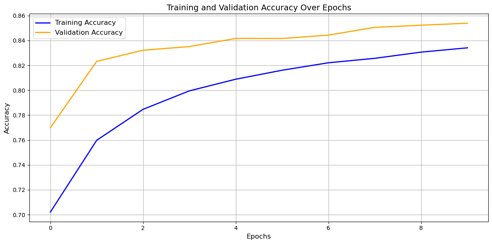
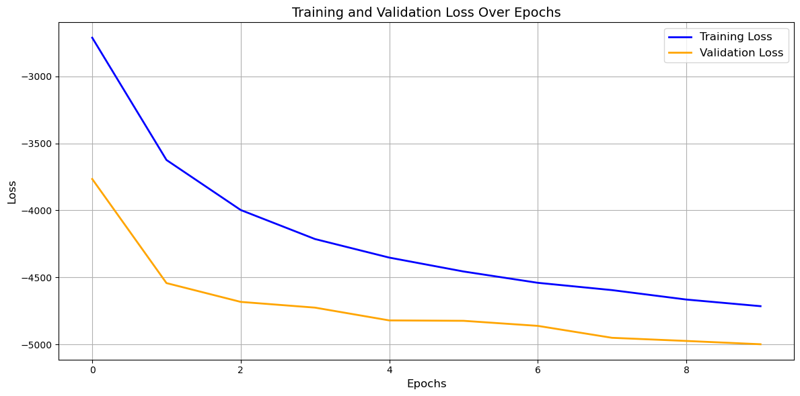
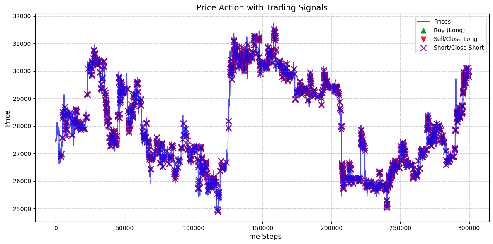
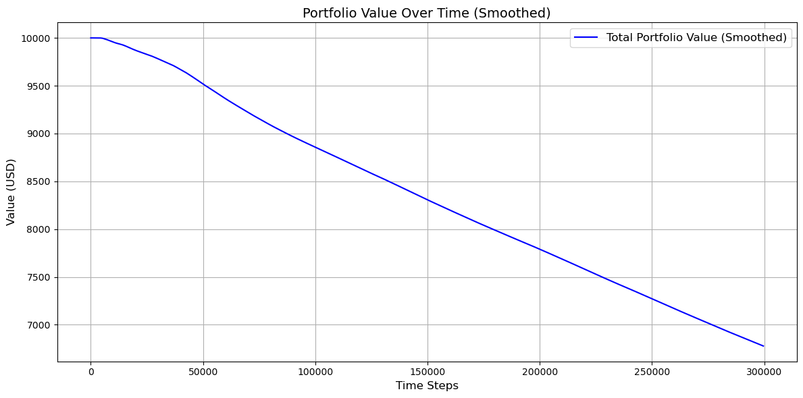
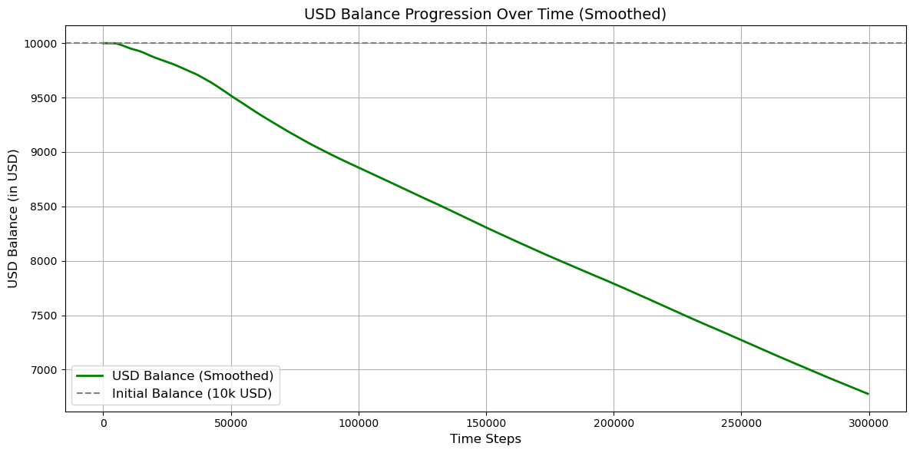
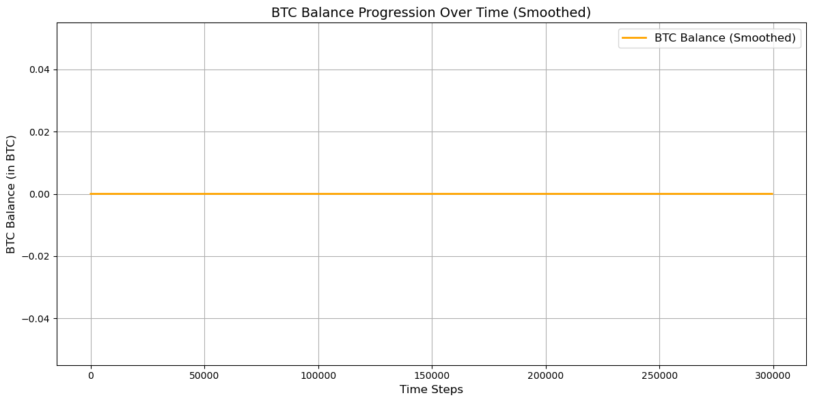

```python
from tensorflow.keras.models import Sequential
from tensorflow.keras.layers import LSTM, Dense, Dropout, BatchNormalization, Input, GaussianNoise, Bidirectional, Attention, MultiHeadAttention
from tensorflow.keras.optimizers import Adam, Nadam, AdamW
from tensorflow.keras.callbacks import EarlyStopping, ReduceLROnPlateau
from tensorflow.keras.models import Model
from tensorflow.keras.regularizers import l2
from sklearn.preprocessing import MinMaxScaler, RobustScaler
from sklearn.model_selection import TimeSeriesSplit
from sklearn.utils.class_weight import compute_class_weight
from scipy.ndimage import uniform_filter1d
from functools import partial
import tensorflow as tf
import numpy as np
import os
import builtins
```

    2025-01-21 18:26:50.198494: I tensorflow/core/platform/cpu_feature_guard.cc:210] This TensorFlow binary is optimized to use available CPU instructions in performance-critical operations.
    To enable the following instructions: AVX2 AVX_VNNI FMA, in other operations, rebuild TensorFlow with the appropriate compiler flags.


```python
# Set intra-op threads (for parallelizing within a single operation)
tf.config.threading.set_intra_op_parallelism_threads(24)  # Use all 24 threads

# Set inter-op threads (for parallelizing across independent operations)
tf.config.threading.set_inter_op_parallelism_threads(2)   # Adjust based on your workload

# Verify the settings
print("Intra-op threads:", tf.config.threading.get_intra_op_parallelism_threads())
print("Inter-op threads:", tf.config.threading.get_inter_op_parallelism_threads())
```

    Intra-op threads: 24
    Inter-op threads: 2


```python
os.environ['TF_ENABLE_ONEDNN_OPTS'] = '1'  # Enable oneDNN optimizations
```


```python
# Output path
output_path = '../export/rnn/'
```


```python
%run "../helpers/data-processing.ipynb"
```

    Missing values in the dataset


<div>
<style scoped>
    .dataframe tbody tr th:only-of-type {
        vertical-align: middle;
    }

    .dataframe tbody tr th {
        vertical-align: top;
    }

    .dataframe thead th {
        text-align: right;
    }
</style>
<table border="1" class="dataframe">
  <thead>
    <tr style="text-align: right;">
      <th></th>
      <th>Column</th>
      <th>Missing Count</th>
      <th>Missing Percentage</th>
      <th>Action</th>
    </tr>
  </thead>
  <tbody>
    <tr>
      <th>0</th>
      <td>date</td>
      <td>0</td>
      <td>0.000000</td>
      <td>No Missing Values</td>
    </tr>
    <tr>
      <th>1</th>
      <td>open</td>
      <td>0</td>
      <td>0.000000</td>
      <td>No Missing Values</td>
    </tr>
    <tr>
      <th>2</th>
      <td>high</td>
      <td>0</td>
      <td>0.000000</td>
      <td>No Missing Values</td>
    </tr>
    <tr>
      <th>3</th>
      <td>low</td>
      <td>0</td>
      <td>0.000000</td>
      <td>No Missing Values</td>
    </tr>
    <tr>
      <th>4</th>
      <td>close</td>
      <td>0</td>
      <td>0.000000</td>
      <td>No Missing Values</td>
    </tr>
    <tr>
      <th>5</th>
      <td>Volume USDT</td>
      <td>0</td>
      <td>0.000000</td>
      <td>No Missing Values</td>
    </tr>
    <tr>
      <th>6</th>
      <td>tradecount</td>
      <td>0</td>
      <td>0.000000</td>
      <td>No Missing Values</td>
    </tr>
    <tr>
      <th>7</th>
      <td>ema_5</td>
      <td>0</td>
      <td>0.000000</td>
      <td>No Missing Values</td>
    </tr>
    <tr>
      <th>8</th>
      <td>ema_15</td>
      <td>0</td>
      <td>0.000000</td>
      <td>No Missing Values</td>
    </tr>
    <tr>
      <th>9</th>
      <td>ema_30</td>
      <td>0</td>
      <td>0.000000</td>
      <td>No Missing Values</td>
    </tr>
    <tr>
      <th>10</th>
      <td>ema_60</td>
      <td>0</td>
      <td>0.000000</td>
      <td>No Missing Values</td>
    </tr>
    <tr>
      <th>11</th>
      <td>ema_100</td>
      <td>0</td>
      <td>0.000000</td>
      <td>No Missing Values</td>
    </tr>
    <tr>
      <th>12</th>
      <td>ema_200</td>
      <td>0</td>
      <td>0.000000</td>
      <td>No Missing Values</td>
    </tr>
    <tr>
      <th>13</th>
      <td>WMA</td>
      <td>13</td>
      <td>0.000651</td>
      <td>Filled with median (26752.13)</td>
    </tr>
    <tr>
      <th>14</th>
      <td>MACD</td>
      <td>25</td>
      <td>0.001252</td>
      <td>Filled with median (-0.08)</td>
    </tr>
    <tr>
      <th>15</th>
      <td>MACD_Signal</td>
      <td>33</td>
      <td>0.001652</td>
      <td>Filled with median (0.00)</td>
    </tr>
    <tr>
      <th>16</th>
      <td>MACD_Hist</td>
      <td>33</td>
      <td>0.001652</td>
      <td>Filled with median (-0.10)</td>
    </tr>
    <tr>
      <th>17</th>
      <td>ATR</td>
      <td>14</td>
      <td>0.000701</td>
      <td>Filled with median (25.15)</td>
    </tr>
    <tr>
      <th>18</th>
      <td>HMA</td>
      <td>11</td>
      <td>0.000551</td>
      <td>Filled with median (26751.02)</td>
    </tr>
    <tr>
      <th>19</th>
      <td>KAMA</td>
      <td>9</td>
      <td>0.000451</td>
      <td>Filled with median (26751.57)</td>
    </tr>
    <tr>
      <th>20</th>
      <td>CMO</td>
      <td>14</td>
      <td>0.000701</td>
      <td>Filled with median (-0.12)</td>
    </tr>
    <tr>
      <th>21</th>
      <td>Z-Score</td>
      <td>154</td>
      <td>0.007711</td>
      <td>Filled with median (-0.01)</td>
    </tr>
    <tr>
      <th>22</th>
      <td>QStick</td>
      <td>9</td>
      <td>0.000451</td>
      <td>Filled with median (0.01)</td>
    </tr>
    <tr>
      <th>23</th>
      <td>hour</td>
      <td>0</td>
      <td>0.000000</td>
      <td>No Missing Values</td>
    </tr>
    <tr>
      <th>24</th>
      <td>day_of_week</td>
      <td>0</td>
      <td>0.000000</td>
      <td>No Missing Values</td>
    </tr>
  </tbody>
</table>
</div>


    Analyzing feature correlations...
    
    The following features were dropped due to high correlation (threshold: 90%):
    - HMA
    - WMA
    - MACD_Hist
    - KAMA
    - high
    - ema_15
    - Z-Score
    - low
    - close
    - ema_100
    - ema_60
    - open
    - ema_5
    - ema_200
    - ema_30
    
    Performing feature selection using RandomForestClassifier...
    
    Cross-validation accuracy scores: [0.99988 1.      1.     ]
    
    Mean accuracy: 1.0000
    
    The following features were selected based on feature importance:
    - date
    - price
    - Volume USDT
    - tradecount
    - MACD
    - MACD_Signal
    - ATR
    - CMO
    - QStick
    - price_change_ratio
    - high_low_spread
    
    Feature selection process completed.
    
    Shape of X: (1997210, 11)


<div>
<style scoped>
    .dataframe tbody tr th:only-of-type {
        vertical-align: middle;
    }

    .dataframe tbody tr th {
        vertical-align: top;
    }

    .dataframe thead th {
        text-align: right;
    }
</style>
<table border="1" class="dataframe">
  <thead>
    <tr style="text-align: right;">
      <th></th>
      <th>date</th>
      <th>price</th>
      <th>Volume USDT</th>
      <th>tradecount</th>
      <th>MACD</th>
      <th>MACD_Signal</th>
      <th>ATR</th>
      <th>CMO</th>
      <th>QStick</th>
      <th>price_change_ratio</th>
      <th>high_low_spread</th>
    </tr>
  </thead>
  <tbody>
    <tr>
      <th>0</th>
      <td>1.577837e+09</td>
      <td>7180.720</td>
      <td>509146.0</td>
      <td>140.0</td>
      <td>0.728704</td>
      <td>-0.152219</td>
      <td>4.684925</td>
      <td>4.193879</td>
      <td>0.120</td>
      <td>0.000000</td>
      <td>3.69</td>
    </tr>
    <tr>
      <th>1</th>
      <td>1.577837e+09</td>
      <td>7178.470</td>
      <td>713540.0</td>
      <td>148.0</td>
      <td>0.736887</td>
      <td>-0.182091</td>
      <td>4.698380</td>
      <td>0.859360</td>
      <td>0.528</td>
      <td>-0.000313</td>
      <td>3.76</td>
    </tr>
    <tr>
      <th>2</th>
      <td>1.577837e+09</td>
      <td>7179.440</td>
      <td>497793.0</td>
      <td>104.0</td>
      <td>0.846578</td>
      <td>-0.117923</td>
      <td>4.609025</td>
      <td>11.466626</td>
      <td>0.493</td>
      <td>0.000135</td>
      <td>5.60</td>
    </tr>
    <tr>
      <th>3</th>
      <td>1.577837e+09</td>
      <td>7177.175</td>
      <td>698627.0</td>
      <td>193.0</td>
      <td>0.650488</td>
      <td>-0.343494</td>
      <td>4.398181</td>
      <td>-7.962104</td>
      <td>-0.425</td>
      <td>-0.000315</td>
      <td>6.16</td>
    </tr>
    <tr>
      <th>4</th>
      <td>1.577837e+09</td>
      <td>7175.160</td>
      <td>241980.0</td>
      <td>124.0</td>
      <td>0.987398</td>
      <td>-0.092457</td>
      <td>4.262656</td>
      <td>-6.795307</td>
      <td>-0.131</td>
      <td>-0.000281</td>
      <td>3.86</td>
    </tr>
    <tr>
      <th>...</th>
      <td>...</td>
      <td>...</td>
      <td>...</td>
      <td>...</td>
      <td>...</td>
      <td>...</td>
      <td>...</td>
      <td>...</td>
      <td>...</td>
      <td>...</td>
      <td>...</td>
    </tr>
    <tr>
      <th>1997205</th>
      <td>1.698019e+09</td>
      <td>29966.285</td>
      <td>482950.0</td>
      <td>635.0</td>
      <td>-4056.925846</td>
      <td>-1909.922487</td>
      <td>926.278065</td>
      <td>-97.689989</td>
      <td>13.189</td>
      <td>-0.000401</td>
      <td>5.00</td>
    </tr>
    <tr>
      <th>1997206</th>
      <td>1.698019e+09</td>
      <td>29970.500</td>
      <td>169682.0</td>
      <td>450.0</td>
      <td>-3657.565528</td>
      <td>-1988.042791</td>
      <td>996.882531</td>
      <td>-97.688910</td>
      <td>24.399</td>
      <td>0.000141</td>
      <td>5.83</td>
    </tr>
    <tr>
      <th>1997207</th>
      <td>1.698019e+09</td>
      <td>29975.100</td>
      <td>111271.0</td>
      <td>303.0</td>
      <td>-3095.229187</td>
      <td>-1922.717147</td>
      <td>1072.856572</td>
      <td>-97.688328</td>
      <td>32.045</td>
      <td>0.000153</td>
      <td>3.40</td>
    </tr>
    <tr>
      <th>1997208</th>
      <td>1.698019e+09</td>
      <td>29980.890</td>
      <td>169741.0</td>
      <td>631.0</td>
      <td>-2332.807178</td>
      <td>-1640.974425</td>
      <td>1154.492462</td>
      <td>-97.687019</td>
      <td>22.669</td>
      <td>0.000193</td>
      <td>8.21</td>
    </tr>
    <tr>
      <th>1997209</th>
      <td>1.698019e+09</td>
      <td>29988.730</td>
      <td>321595.0</td>
      <td>861.0</td>
      <td>-1326.581600</td>
      <td>-1044.992454</td>
      <td>1242.094190</td>
      <td>-97.685909</td>
      <td>18.319</td>
      <td>0.000261</td>
      <td>12.47</td>
    </tr>
  </tbody>
</table>
<p>1997210 rows × 11 columns</p>
</div>


    
    Shape of y: (1997210,)


    0    1
    1    0
    2    1
    3    0
    4    0
    Name: price_direction, dtype: int64


```python
# Enhanced loss function with directional profit incentive
def trading_loss(prices):
    def loss_fn(y_true, y_pred):
        # Base binary crossentropy
        bce_loss = tf.keras.losses.binary_crossentropy(y_true, y_pred)

        # Enhanced profit incentive
        direction_correct = tf.sign((y_pred - 0.5) * (y_true - 0.5))
        profit_multiplier = tf.abs(y_pred - 0.5) * 2  # 0-1 range
        profit_term = direction_correct * profit_multiplier * prices
        profit_reward = -0.3 * tf.reduce_mean(profit_term)  # Increased from 0.2 to 0.3

        # Confidence penalty adjusted
        confidence_penalty = 0.005 * tf.reduce_mean(tf.square(y_pred - 0.5))  # Reduced from 0.01

        return tf.reduce_mean(bce_loss + profit_reward + confidence_penalty)
    return loss_fn
```


```python
# Exclude date feature
X = X[:, 1:]
```


```python
# Scale features
scaler = RobustScaler()
X_scaled = scaler.fit_transform(X)
```


```python
# Reserve the last 15% as the test set
test_size = int(0.15 * len(X_scaled))
X_test, y_test = X_scaled[-test_size:], y[-test_size:]
X_train_val, y_train_val = X_scaled[:-test_size], y[:-test_size]
```


```python
# Reshape data for LSTM input: (samples, time_steps, features)
time_steps = 30  # Number of past time steps to use for prediction
X_train_val = np.array([X_train_val[i:i + time_steps] for i in range(len(X_train_val) - time_steps)])
y_train_val = y_train_val[time_steps:]
X_test = np.array([X_test[i:i + time_steps] for i in range(len(X_test) - time_steps)])
y_test = y_test[time_steps:]
```


```python
# Time-based split using TimeSeriesSplit
tscv = TimeSeriesSplit(n_splits=5)
```


```python
# Placeholder to store metrics for each split
split_metrics = []

for i, (train_idx, val_idx) in enumerate(tscv.split(X_train_val)):
    print(f"\nSplit {i + 1}/{tscv.n_splits}")

    # Split the data
    X_train, X_val = X_train_val[train_idx], X_train_val[val_idx]
    y_train, y_val = y_train_val[train_idx], y_train_val[val_idx]

    # Align prices for this split
    prices_train = prices[time_steps:time_steps + len(X_train)]
    prices_val = prices[time_steps + len(X_train):time_steps + len(X_train) + len(X_val)]

    # Balance the classes
    class_weights = compute_class_weight('balanced', classes=np.unique(y_train), y=y_train)
    class_weight_dict = {i: class_weights[i] for i in range(len(class_weights))}

    # Build the RNN model
    model = Sequential([
        Input(shape=(time_steps, X_train.shape[2])),
        Bidirectional(LSTM(64, return_sequences=True, kernel_regularizer=l2(0.01))),
        GaussianNoise(0.02),  # Added input noise
        Dropout(0.4),  # Increased from 0.3
        BatchNormalization(),
        Bidirectional(LSTM(32, return_sequences=False, kernel_regularizer=l2(0.01))),
        Dropout(0.35),  # Adjusted from 0.3
        BatchNormalization(),
        Dense(16, activation='relu'),
        Dense(1, activation='sigmoid')
    ])

    # Modify optimizer settings
    optimizer = AdamW(learning_rate=0.0001,  # Increased from 0.00005
                      weight_decay=1e-4,  # Increased regularization
                      clipnorm=1.0)  # Added gradient clipping

    # Compile the model
    model.compile(
        optimizer = optimizer,
        loss=trading_loss(prices_train),
        metrics=['accuracy']
    )

    # Early stopping and learning rate scheduler to avoid overfitting
    early_stopping = EarlyStopping(monitor='val_loss', patience=5, restore_best_weights=True)
    lr_scheduler = ReduceLROnPlateau(monitor='val_loss', factor=0.5, patience=3)


    # Train the model with class weights
    history = model.fit(
        X_train, y_train,
        validation_data=(X_val, y_val),
        epochs=10,
        batch_size=256,
        class_weight=class_weight_dict,
        callbacks=[early_stopping, lr_scheduler],
        verbose=1
    )

    # Evaluate the model on the validation set
    val_loss, val_accuracy = model.evaluate(X_val, y_val, verbose=0)
    print(f"Validation Accuracy for Split {i + 1}: {val_accuracy:.4f}")
    print(f"Validation Loss for Split {i + 1}: {val_loss:.4f}")

    # Save metrics for analysis
    split_metrics.append({
        "split": i + 1,
        "val_loss": val_loss,
        "val_accuracy": val_accuracy
    })
```

    
    Split 1/5
    Epoch 1/10
    1106/1106 ━━━━━━━━━━━━━━━━━━━━ 382s 343ms/step - accuracy: 0.6363 - loss: -580.9387 - val_accuracy: 0.6850 - val_loss: -917.1485 - learning_rate: 1.0000e-04
    Epoch 2/10
    1106/1106 ━━━━━━━━━━━━━━━━━━━━ 391s 354ms/step - accuracy: 0.7212 - loss: -1083.5035 - val_accuracy: 0.6977 - val_loss: -993.4938 - learning_rate: 1.0000e-04
    Epoch 3/10
    1106/1106 ━━━━━━━━━━━━━━━━━━━━ 381s 345ms/step - accuracy: 0.7422 - loss: -1209.2341 - val_accuracy: 0.7072 - val_loss: -1046.5178 - learning_rate: 1.0000e-04
    Epoch 4/10
    1106/1106 ━━━━━━━━━━━━━━━━━━━━ 395s 357ms/step - accuracy: 0.7582 - loss: -1295.0199 - val_accuracy: 0.7156 - val_loss: -1090.0415 - learning_rate: 1.0000e-04
    Epoch 5/10
    1106/1106 ━━━━━━━━━━━━━━━━━━━━ 419s 379ms/step - accuracy: 0.7693 - loss: -1356.7241 - val_accuracy: 0.7217 - val_loss: -1121.0856 - learning_rate: 1.0000e-04
    Epoch 6/10
    1106/1106 ━━━━━━━━━━━━━━━━━━━━ 439s 397ms/step - accuracy: 0.7794 - loss: -1411.3363 - val_accuracy: 0.7310 - val_loss: -1168.6016 - learning_rate: 1.0000e-04
    Epoch 7/10
    1106/1106 ━━━━━━━━━━━━━━━━━━━━ 404s 365ms/step - accuracy: 0.7918 - loss: -1472.4525 - val_accuracy: 0.7310 - val_loss: -1168.5403 - learning_rate: 1.0000e-04
    Epoch 8/10
    1106/1106 ━━━━━━━━━━━━━━━━━━━━ 564s 510ms/step - accuracy: 0.7998 - loss: -1515.6624 - val_accuracy: 0.7338 - val_loss: -1184.9120 - learning_rate: 1.0000e-04
    Epoch 9/10
    1106/1106 ━━━━━━━━━━━━━━━━━━━━ 575s 520ms/step - accuracy: 0.8051 - loss: -1543.8126 - val_accuracy: 0.7387 - val_loss: -1210.1948 - learning_rate: 1.0000e-04
    Epoch 10/10
    1106/1106 ━━━━━━━━━━━━━━━━━━━━ 514s 465ms/step - accuracy: 0.8099 - loss: -1570.6610 - val_accuracy: 0.7355 - val_loss: -1192.9648 - learning_rate: 1.0000e-04
    Validation Accuracy for Split 1: 0.7387
    Validation Loss for Split 1: -1210.1949
    
    Split 2/5
    Epoch 1/10
    2211/2211 ━━━━━━━━━━━━━━━━━━━━ 1297s 584ms/step - accuracy: 0.6505 - loss: -1033.4443 - val_accuracy: 0.7154 - val_loss: -1609.9891 - learning_rate: 1.0000e-04
    Epoch 2/10
    2211/2211 ━━━━━━━━━━━━━━━━━━━━ 1182s 535ms/step - accuracy: 0.7311 - loss: -1724.1240 - val_accuracy: 0.7718 - val_loss: -2042.8600 - learning_rate: 1.0000e-04
    Epoch 3/10
    2211/2211 ━━━━━━━━━━━━━━━━━━━━ 1188s 538ms/step - accuracy: 0.7609 - loss: -1960.2014 - val_accuracy: 0.7970 - val_loss: -2242.3286 - learning_rate: 1.0000e-04
    Epoch 4/10
    2211/2211 ━━━━━━━━━━━━━━━━━━━━ 1251s 566ms/step - accuracy: 0.7820 - loss: -2128.6848 - val_accuracy: 0.8059 - val_loss: -2316.3093 - learning_rate: 1.0000e-04
    Epoch 5/10
    2211/2211 ━━━━━━━━━━━━━━━━━━━━ 1273s 576ms/step - accuracy: 0.7942 - loss: -2226.6921 - val_accuracy: 0.8135 - val_loss: -2374.3159 - learning_rate: 1.0000e-04
    Epoch 6/10
    2211/2211 ━━━━━━━━━━━━━━━━━━━━ 1138s 515ms/step - accuracy: 0.8051 - loss: -2308.6663 - val_accuracy: 0.8130 - val_loss: -2371.5874 - learning_rate: 1.0000e-04
    Epoch 7/10
    2211/2211 ━━━━━━━━━━━━━━━━━━━━ 1186s 537ms/step - accuracy: 0.8124 - loss: -2367.5249 - val_accuracy: 0.8225 - val_loss: -2448.6257 - learning_rate: 1.0000e-04
    Epoch 8/10
    2211/2211 ━━━━━━━━━━━━━━━━━━━━ 1202s 544ms/step - accuracy: 0.8186 - loss: -2417.7290 - val_accuracy: 0.8230 - val_loss: -2451.9443 - learning_rate: 1.0000e-04
    Epoch 9/10
    2211/2211 ━━━━━━━━━━━━━━━━━━━━ 1267s 573ms/step - accuracy: 0.8224 - loss: -2445.1248 - val_accuracy: 0.8286 - val_loss: -2496.1182 - learning_rate: 1.0000e-04
    Epoch 10/10
    2211/2211 ━━━━━━━━━━━━━━━━━━━━ 1267s 573ms/step - accuracy: 0.8265 - loss: -2477.1814 - val_accuracy: 0.8296 - val_loss: -2503.9417 - learning_rate: 1.0000e-04
    Validation Accuracy for Split 2: 0.8296
    Validation Loss for Split 2: -2503.9412
    
    Split 3/5
    Epoch 1/10
    3316/3316 ━━━━━━━━━━━━━━━━━━━━ 2090s 628ms/step - accuracy: 0.6707 - loss: -2163.4670 - val_accuracy: 0.7699 - val_loss: -3766.1870 - learning_rate: 1.0000e-04
    Epoch 2/10
    3316/3316 ━━━━━━━━━━━━━━━━━━━━ 2018s 608ms/step - accuracy: 0.7511 - loss: -3490.0757 - val_accuracy: 0.8232 - val_loss: -4542.2935 - learning_rate: 1.0000e-04
    Epoch 3/10
    3316/3316 ━━━━━━━━━━━━━━━━━━━━ 2020s 609ms/step - accuracy: 0.7798 - loss: -3923.8716 - val_accuracy: 0.8322 - val_loss: -4682.5254 - learning_rate: 1.0000e-04
    Epoch 4/10
    3316/3316 ━━━━━━━━━━━━━━━━━━━━ 1991s 600ms/step - accuracy: 0.7969 - loss: -4174.6533 - val_accuracy: 0.8351 - val_loss: -4725.2422 - learning_rate: 1.0000e-04
    Epoch 5/10
    3316/3316 ━━━━━━━━━━━━━━━━━━━━ 1916s 578ms/step - accuracy: 0.8072 - loss: -4328.3521 - val_accuracy: 0.8417 - val_loss: -4820.5127 - learning_rate: 1.0000e-04
    Epoch 6/10
    3316/3316 ━━━━━━━━━━━━━━━━━━━━ 1962s 592ms/step - accuracy: 0.8141 - loss: -4426.1655 - val_accuracy: 0.8416 - val_loss: -4823.5610 - learning_rate: 1.0000e-04
    Epoch 7/10
    3316/3316 ━━━━━━━━━━━━━━━━━━━━ 1962s 592ms/step - accuracy: 0.8212 - loss: -4527.3652 - val_accuracy: 0.8443 - val_loss: -4861.2432 - learning_rate: 1.0000e-04
    Epoch 8/10
    3316/3316 ━━━━━━━━━━━━━━━━━━━━ 2084s 629ms/step - accuracy: 0.8247 - loss: -4580.4170 - val_accuracy: 0.8506 - val_loss: -4950.2920 - learning_rate: 1.0000e-04
    Epoch 9/10
    3316/3316 ━━━━━━━━━━━━━━━━━━━━ 2038s 615ms/step - accuracy: 0.8300 - loss: -4656.7666 - val_accuracy: 0.8523 - val_loss: -4973.7285 - learning_rate: 1.0000e-04
    Epoch 10/10
    3316/3316 ━━━━━━━━━━━━━━━━━━━━ 2053s 619ms/step - accuracy: 0.8324 - loss: -4691.2148 - val_accuracy: 0.8539 - val_loss: -4998.2983 - learning_rate: 1.0000e-04
    Validation Accuracy for Split 3: 0.8539
    Validation Loss for Split 3: -4998.2886
    
    Split 4/5
    Epoch 1/10
    4421/4421 ━━━━━━━━━━━━━━━━━━━━ 3050s 688ms/step - accuracy: 0.6792 - loss: -2946.5376 - val_accuracy: 0.7724 - val_loss: -4846.8340 - learning_rate: 1.0000e-04
    Epoch 2/10
    4421/4421 ━━━━━━━━━━━━━━━━━━━━ 2987s 676ms/step - accuracy: 0.7728 - loss: -4848.8345 - val_accuracy: 0.8025 - val_loss: -5419.6929 - learning_rate: 1.0000e-04
    Epoch 3/10
    4421/4421 ━━━━━━━━━━━━━━━━━━━━ 3017s 682ms/step - accuracy: 0.7966 - loss: -5308.2314 - val_accuracy: 0.8158 - val_loss: -5668.6904 - learning_rate: 1.0000e-04
    Epoch 4/10
    4421/4421 ━━━━━━━━━━━━━━━━━━━━ 3012s 681ms/step - accuracy: 0.8095 - loss: -5549.8906 - val_accuracy: 0.8253 - val_loss: -5839.4888 - learning_rate: 1.0000e-04
    Epoch 5/10
    4421/4421 ━━━━━━━━━━━━━━━━━━━━ 3002s 679ms/step - accuracy: 0.8179 - loss: -5708.3628 - val_accuracy: 0.8292 - val_loss: -5915.7549 - learning_rate: 1.0000e-04
    Epoch 6/10
    4421/4421 ━━━━━━━━━━━━━━━━━━━━ 3103s 702ms/step - accuracy: 0.8242 - loss: -5821.3428 - val_accuracy: 0.8378 - val_loss: -6075.2700 - learning_rate: 1.0000e-04
    Epoch 7/10
    1631/4421 ━━━━━━━━━━━━━━━━━━━━ 30:26 655ms/step - accuracy: 0.8279 - loss: -5889.4800


    ---------------------------------------------------------------------------

    KeyboardInterrupt                         Traceback (most recent call last)

    Cell In[12], line 51
         47 lr_scheduler = ReduceLROnPlateau(monitor='val_loss', factor=0.5, patience=3)
         50 # Train the model with class weights
    ---> 51 history = model.fit(
         52     X_train, y_train,
         53     validation_data=(X_val, y_val),
         54     epochs=10,
         55     batch_size=256,
         56     class_weight=class_weight_dict,
         57     callbacks=[early_stopping, lr_scheduler],
         58     verbose=1
         59 )
         61 # Evaluate the model on the validation set
         62 val_loss, val_accuracy = model.evaluate(X_val, y_val, verbose=0)


    File ~/miniconda3/envs/NUPMaster/lib/python3.12/site-packages/keras/src/utils/traceback_utils.py:117, in filter_traceback.<locals>.error_handler(*args, **kwargs)
        115 filtered_tb = None
        116 try:
    --> 117     return fn(*args, **kwargs)
        118 except Exception as e:
        119     filtered_tb = _process_traceback_frames(e.__traceback__)


    File ~/miniconda3/envs/NUPMaster/lib/python3.12/site-packages/keras/src/backend/tensorflow/trainer.py:368, in TensorFlowTrainer.fit(self, x, y, batch_size, epochs, verbose, callbacks, validation_split, validation_data, shuffle, class_weight, sample_weight, initial_epoch, steps_per_epoch, validation_steps, validation_batch_size, validation_freq)
        366 for step, iterator in epoch_iterator:
        367     callbacks.on_train_batch_begin(step)
    --> 368     logs = self.train_function(iterator)
        369     callbacks.on_train_batch_end(step, logs)
        370     if self.stop_training:


    File ~/miniconda3/envs/NUPMaster/lib/python3.12/site-packages/keras/src/backend/tensorflow/trainer.py:216, in TensorFlowTrainer._make_function.<locals>.function(iterator)
        212 def function(iterator):
        213     if isinstance(
        214         iterator, (tf.data.Iterator, tf.distribute.DistributedIterator)
        215     ):
    --> 216         opt_outputs = multi_step_on_iterator(iterator)
        217         if not opt_outputs.has_value():
        218             raise StopIteration


    File ~/miniconda3/envs/NUPMaster/lib/python3.12/site-packages/tensorflow/python/util/traceback_utils.py:150, in filter_traceback.<locals>.error_handler(*args, **kwargs)
        148 filtered_tb = None
        149 try:
    --> 150   return fn(*args, **kwargs)
        151 except Exception as e:
        152   filtered_tb = _process_traceback_frames(e.__traceback__)


    File ~/miniconda3/envs/NUPMaster/lib/python3.12/site-packages/tensorflow/python/eager/polymorphic_function/polymorphic_function.py:833, in Function.__call__(self, *args, **kwds)
        830 compiler = "xla" if self._jit_compile else "nonXla"
        832 with OptionalXlaContext(self._jit_compile):
    --> 833   result = self._call(*args, **kwds)
        835 new_tracing_count = self.experimental_get_tracing_count()
        836 without_tracing = (tracing_count == new_tracing_count)


    File ~/miniconda3/envs/NUPMaster/lib/python3.12/site-packages/tensorflow/python/eager/polymorphic_function/polymorphic_function.py:878, in Function._call(self, *args, **kwds)
        875 self._lock.release()
        876 # In this case we have not created variables on the first call. So we can
        877 # run the first trace but we should fail if variables are created.
    --> 878 results = tracing_compilation.call_function(
        879     args, kwds, self._variable_creation_config
        880 )
        881 if self._created_variables:
        882   raise ValueError("Creating variables on a non-first call to a function"
        883                    " decorated with tf.function.")


    File ~/miniconda3/envs/NUPMaster/lib/python3.12/site-packages/tensorflow/python/eager/polymorphic_function/tracing_compilation.py:139, in call_function(args, kwargs, tracing_options)
        137 bound_args = function.function_type.bind(*args, **kwargs)
        138 flat_inputs = function.function_type.unpack_inputs(bound_args)
    --> 139 return function._call_flat(  # pylint: disable=protected-access
        140     flat_inputs, captured_inputs=function.captured_inputs
        141 )


    File ~/miniconda3/envs/NUPMaster/lib/python3.12/site-packages/tensorflow/python/eager/polymorphic_function/concrete_function.py:1322, in ConcreteFunction._call_flat(self, tensor_inputs, captured_inputs)
       1318 possible_gradient_type = gradients_util.PossibleTapeGradientTypes(args)
       1319 if (possible_gradient_type == gradients_util.POSSIBLE_GRADIENT_TYPES_NONE
       1320     and executing_eagerly):
       1321   # No tape is watching; skip to running the function.
    -> 1322   return self._inference_function.call_preflattened(args)
       1323 forward_backward = self._select_forward_and_backward_functions(
       1324     args,
       1325     possible_gradient_type,
       1326     executing_eagerly)
       1327 forward_function, args_with_tangents = forward_backward.forward()


    File ~/miniconda3/envs/NUPMaster/lib/python3.12/site-packages/tensorflow/python/eager/polymorphic_function/atomic_function.py:216, in AtomicFunction.call_preflattened(self, args)
        214 def call_preflattened(self, args: Sequence[core.Tensor]) -> Any:
        215   """Calls with flattened tensor inputs and returns the structured output."""
    --> 216   flat_outputs = self.call_flat(*args)
        217   return self.function_type.pack_output(flat_outputs)


    File ~/miniconda3/envs/NUPMaster/lib/python3.12/site-packages/tensorflow/python/eager/polymorphic_function/atomic_function.py:251, in AtomicFunction.call_flat(self, *args)
        249 with record.stop_recording():
        250   if self._bound_context.executing_eagerly():
    --> 251     outputs = self._bound_context.call_function(
        252         self.name,
        253         list(args),
        254         len(self.function_type.flat_outputs),
        255     )
        256   else:
        257     outputs = make_call_op_in_graph(
        258         self,
        259         list(args),
        260         self._bound_context.function_call_options.as_attrs(),
        261     )


    File ~/miniconda3/envs/NUPMaster/lib/python3.12/site-packages/tensorflow/python/eager/context.py:1500, in Context.call_function(self, name, tensor_inputs, num_outputs)
       1498 cancellation_context = cancellation.context()
       1499 if cancellation_context is None:
    -> 1500   outputs = execute.execute(
       1501       name.decode("utf-8"),
       1502       num_outputs=num_outputs,
       1503       inputs=tensor_inputs,
       1504       attrs=attrs,
       1505       ctx=self,
       1506   )
       1507 else:
       1508   outputs = execute.execute_with_cancellation(
       1509       name.decode("utf-8"),
       1510       num_outputs=num_outputs,
       (...)
       1514       cancellation_manager=cancellation_context,
       1515   )


    File ~/miniconda3/envs/NUPMaster/lib/python3.12/site-packages/tensorflow/python/eager/execute.py:53, in quick_execute(op_name, num_outputs, inputs, attrs, ctx, name)
         51 try:
         52   ctx.ensure_initialized()
    ---> 53   tensors = pywrap_tfe.TFE_Py_Execute(ctx._handle, device_name, op_name,
         54                                       inputs, attrs, num_outputs)
         55 except core._NotOkStatusException as e:
         56   if name is not None:


    KeyboardInterrupt: 


```python
# Aggregate results across splits
mean_val_accuracy = np.mean([m["val_accuracy"] for m in split_metrics])
mean_val_loss = np.mean([m["val_loss"] for m in split_metrics])

print("\n--- Cross-Validation Results ---")
print(f"Mean Validation Accuracy: {mean_val_accuracy:.4f}")
print(f"Mean Validation Loss: {mean_val_loss:.4f}")
```

    
    --- Cross-Validation Results ---
    Mean Validation Accuracy: 0.8074
    Mean Validation Loss: -2904.1416


```python
# Prepare test dataset and evaluation variables
test_dataset = tf.data.Dataset.from_tensor_slices((X_test, y_test))
test_dataset = test_dataset.batch(128).prefetch(tf.data.experimental.AUTOTUNE)
```


```python
X_test_evaluate = X_test  # Assign X_test for evaluation
y_test_evaluate = y_test  # Assign y_test for evaluation
```


```python
# Evaluate the model on the test set
test_loss, test_accuracy = model.evaluate(X_test, y_test, verbose=0)
print(f"Test Accuracy: {test_accuracy:.2f}")
```

    Test Accuracy: 0.82


```python
# Predict probabilities for the entire test set
predicted_probas = model.predict(X_test).flatten()
```

    9361/9361 ━━━━━━━━━━━━━━━━━━━━ 38s 4ms/step


```python
# Smooth predicted probabilities
smoothed_probas = uniform_filter1d(predicted_probas, size=5)
```


```python
print("Training set size:", X_train.shape, y_train.shape)
print("Validation set size:", X_val.shape, y_val.shape)
print("Test set size:", X_test.shape, y_test.shape)
```

    Training set size: (1131733, 30, 10) (1131733,)
    Validation set size: (282933, 30, 10) (282933,)
    Test set size: (299551, 30, 10) (299551,)


```python
# Slice prices to match each split
prices_train = prices[time_steps:time_steps + len(X_train)]  # Prices corresponding to training data
prices_val = prices[time_steps + len(X_train):time_steps + len(X_train) + len(X_val)]  # Validation prices
prices_test = prices[-len(X_test):]  # Remaining prices for test set
```


```python
# Adjusted thresholds
# buy_threshold = 0.8
# sell_threshold = 0.2

# Adjust thresholds based on validation data
buy_threshold = np.percentile(predicted_probas, 90)  # Try top 10%
sell_threshold = np.percentile(predicted_probas, 10)  # Try bottom 10%

print(f"Dynamic Buy Threshold: {buy_threshold}")
print(f"Dynamic Sell Threshold: {sell_threshold}")
```

    Dynamic Buy Threshold: 1.0
    Dynamic Sell Threshold: 7.337645913483521e-17


```python
# Maximum fraction of the portfolio to trade
max_trade_fraction = 0.1  # up to 10% in the most confident case
```


```python
# Minimum confidence required to trade
min_confidence = 0.3
```


```python
%run "../helpers/evaluate_tf.ipynb"
```

    2341/2341 ━━━━━━━━━━━━━━━━━━━━ 357s 152ms/step - accuracy: 0.8322 - loss: -5971.2979
    Test Accuracy: 82.36%
    9361/9361 ━━━━━━━━━━━━━━━━━━━━ 33s 3ms/step
    Confusion Matrix:
    Predicted       0
    Actual           
    0          146590
    1          152961


    

    


    

    


```python
# Starting portfolio values
usd_balance = 10000.0  # Starting USD balance
btc_balance = 0.0      # Starting BTC balance
buy_fee = 0.0025  # 0.25% buy fee
sell_fee = 0.004  # 0.40% sell fee

# Add risk management parameters
stop_loss_pct = 0.97  # 3% stop loss
take_profit_pct = 1.05  # 5% take profit
max_position_size = 0.25  # 25% of portfolio

# Add variables to track short positions
btc_shorted = 0.0  # Amount of BTC borrowed for short selling
short_entry_price = 0.0  # Price at which short position was opened

# Track balances and actions
usd_balances = []
btc_balances = []
actions = []
trade_percentages = []

# --- Initialize Trade Counters ---
buy_count = 0
sell_count = 0
short_count = 0
stop_loss_count = 0
take_profit_count = 0

# --- Initialize Trading Data for Plotting ---
trading_data = pd.DataFrame({
    'prices': prices_test,
    'Action': ['None'] * len(prices_test),
    'USD Balance': [0.0] * len(prices_test),
    'BTC Balance': [0.0] * len(prices_test),
    'Total Portfolio Value': [0.0] * len(prices_test)
})

# --- Initialize Balance Histories for Plotting ---
total_capital_history = []
usd_balance_history = []
btc_balance_history = []
```


```python
# Loop over prices_test and use precomputed probabilities
for t in range(len(prices_test)):
    # Default action is 'None'
    action = 'None'
    trade_percentage = 0.0

    # Use precomputed probability
    predicted_proba = smoothed_probas[t]

    # Compute confidence: ranges from 0 (proba = 0.5) to 0.5 (proba = 0 or 1)
    confidence = abs(predicted_proba - 0.5)  # 0.0 → not sure, 0.5 → extremely sure

    # Current price
    current_price = prices_test[t]

    # Check exit conditions first
    if btc_balance > 0:
        # Check stop loss or take profit
        current_value = btc_balance * current_price
        if current_value <= entry_value * stop_loss_pct:
            # Execute stop loss
            usd_balance += current_value * (1 - sell_fee)
            btc_balance = 0
            action = 'StopLoss (Long)'
            stop_loss_count += 1
        elif current_value >= entry_value * take_profit_pct:
            # Execute take profit
            usd_balance += current_value * (1 - sell_fee)
            btc_balance = 0
            action = 'TakeProfit (Long)'
            take_profit_count += 1

    # Check exit conditions for short positions
    if btc_shorted > 0:
        current_short_value = btc_shorted * current_price
        if current_short_value >= short_entry_value * stop_loss_pct:
            # Execute stop loss for short position
            usd_balance -= current_short_value * (1 + buy_fee)  # Buy back BTC to cover short
            btc_shorted = 0
            action = 'StopLoss (Short)'
            stop_loss_count += 1
        elif current_short_value <= short_entry_value * take_profit_pct:
            # Execute take profit for short position
            usd_balance -= current_short_value * (1 + buy_fee)  # Buy back BTC to cover short
            btc_shorted = 0
            action = 'TakeProfit (Short)'
            take_profit_count += 1

    if confidence > min_confidence and btc_balance == 0:
        # Turn confidence into a fraction of max_trade_fraction
        # e.g. if confidence=0.4, fraction_to_trade=0.2*(0.4/0.5)=0.16 (i.e. 16% of USD)
        fraction_to_trade = min(max_trade_fraction * (confidence / 0.5), max_position_size)

        # Long Entry (Buy)
        if predicted_proba > buy_threshold and usd_balance > 1e-3:
            # Buy if proba > buy_threshold. The fraction_to_trade goes from 0 to max_trade_fraction (0 to 20%)
            usd_spent = fraction_to_trade * usd_balance
            # Convert to BTC, minus the buy fee
            btc_bought = (usd_spent * (1 - buy_fee)) / current_price
            usd_balance -= usd_spent
            btc_balance += btc_bought
            entry_value = btc_balance * current_price  # Track entry value
            action = 'Buy'
            trade_percentage = fraction_to_trade  # record how much fraction we traded
            buy_count += 1

        # Short Entry (Sell)
        elif predicted_proba < sell_threshold and usd_balance > 1e-3 and btc_balance == 0:
            # Borrow BTC to sell short
            btc_shorted = fraction_to_trade * (usd_balance / current_price)
            usd_balance += btc_shorted * current_price * (1 - sell_fee)  # Receive USD from short sale
            short_entry_value = btc_shorted * current_price  # Track entry value for short position
            short_entry_price = current_price  # Track entry price for short position
            action = 'Sell (Short)'
            trade_percentage = fraction_to_trade
            short_count += 1

        # Close Long Position (Sell)        
        elif predicted_proba < sell_threshold and btc_balance > 1e-6:
            # Sell if proba < sell_threshold. fraction_to_trade is again 0 to 20% based on confidence
            btc_to_sell = fraction_to_trade * btc_balance
            usd_gained = btc_to_sell * prices_test[t] * (1 - sell_fee)
            btc_balance -= btc_to_sell
            usd_balance += usd_gained
            action = 'Sell (Long)'
            trade_percentage = fraction_to_trade  # record how much fraction we traded
            sell_count += 1

    # --- Record Data for Plotting ---
    trading_data.loc[t, 'Action'] = action
    trading_data.loc[t, 'USD Balance'] = usd_balance
    trading_data.loc[t, 'BTC Balance'] = btc_balance
    trading_data.loc[t, 'Total Portfolio Value'] = usd_balance + btc_balance * current_price
    
    # Record balances and actions
    total_capital_history.append(usd_balance + btc_balance * current_price)
    usd_balance_history.append(usd_balance)
    btc_balance_history.append(btc_balance)
```


```python
# --- Final Portfolio Status ---
final_btc_price = prices_test[-1]
remaining_btc_value = btc_balance * final_btc_price

# Close any remaining long position
if btc_balance > 0:
    final_value = btc_balance * final_btc_price * (1 - sell_fee)
    usd_balance += final_value
    btc_balance = 0

# Close any remaining short position
if btc_shorted > 0:
    final_value = btc_shorted * final_btc_price * (1 + buy_fee)
    usd_balance -= final_value
    btc_shorted = 0

# Calculate final portfolio value
total_portfolio_value = usd_balance + remaining_btc_value
profit_loss = ((total_portfolio_value - 10000) / 10000) * 100
```


```python
# Print final portfolio status
print("Final Portfolio Status:")
print(f"  USD Balance: ${usd_balance:.2f}")
print(f"  BTC Balance: {btc_balance:.6f} BTC")
print(f"  BTC Value (in USD at last price): ${remaining_btc_value:.2f}")
print(f"  Total Portfolio Value (USD): ${total_portfolio_value:.2f}")
print(f"  Profit/Loss: {profit_loss:.2f}%")
print(f"  Total Trades Executed: {buy_count + sell_count + short_count}")
print(f"    Buy Trades: {buy_count}")
print(f"    Sell Trades: {sell_count}")
print(f"    Short Trades: {short_count}")
print(f"    Stop-Loss Triggers: {stop_loss_count}")
print(f"    Take-Profit Triggers: {take_profit_count}")
```

    Final Portfolio Status:
      USD Balance: $3866.55
      BTC Balance: 0.000000 BTC
      BTC Value (in USD at last price): $0.00
      Total Portfolio Value (USD): $3866.55
      Profit/Loss: -61.33%
      Total Trades Executed: 1599
        Buy Trades: 0
        Sell Trades: 0
        Short Trades: 1599
        Stop-Loss Triggers: 1599
        Take-Profit Triggers: 0


```python
# --- Plotting ---
import matplotlib.pyplot as plt
```


```python
# Plot prices and actions
plt.figure(figsize=(12, 6))
plt.plot(trading_data['prices'], label='Prices', color='blue', alpha=0.7, linewidth=1.5)

# Highlight trade actions
buy_indices = trading_data[trading_data['Action'] == 'Buy'].index
sell_long_indices = trading_data[trading_data['Action'].isin(['Sell (Long)', 'StopLoss (Long)', 'TakeProfit (Long)'])].index
sell_short_indices = trading_data[trading_data['Action'].isin(['Sell (Short)', 'StopLoss (Short)', 'TakeProfit (Short)'])].index

plt.scatter(buy_indices, trading_data.loc[buy_indices, 'prices'],
            color='green', label='Buy (Long)', marker='^', s=80, alpha=0.9)
plt.scatter(sell_long_indices, trading_data.loc[sell_long_indices, 'prices'],
            color='red', label='Sell/Close Long', marker='v', s=80, alpha=0.9)
plt.scatter(sell_short_indices, trading_data.loc[sell_short_indices, 'prices'],
            color='purple', label='Short/Close Short', marker='x', s=100, alpha=0.9)

plt.title('Price Action with Trading Signals', fontsize=14)
plt.xlabel('Time Steps', fontsize=12)
plt.ylabel('Price', fontsize=12)
plt.legend()
plt.grid(True, linestyle='--', alpha=0.6)
plt.tight_layout()
plt.show()
```


    

    


```python
# --- Calculate Cumulative Moving Averages ---
cumulative_average_total = pd.Series(total_capital_history).expanding(min_periods=1).mean()
cumulative_average_usd = pd.Series(usd_balance_history).expanding(min_periods=1).mean()
cumulative_average_btc = pd.Series(btc_balance_history).expanding(min_periods=1).mean()
```


```python
# --- Plot Portfolio Value Progression ---
plt.figure(figsize=(12, 6))
plt.plot(cumulative_average_total, label="Total Portfolio Value (Smoothed)", color='blue')
plt.title("Portfolio Value Over Time (Smoothed)", fontsize=14)
plt.xlabel("Time Steps", fontsize=12)
plt.ylabel("Value (USD)", fontsize=12)
plt.legend(fontsize=12)
plt.grid(True)
plt.tight_layout()
plt.show()
```


    

    


```python
# --- Plot USD Balance Progression ---
plt.figure(figsize=(12, 6))
plt.plot(cumulative_average_usd, label="USD Balance (Smoothed)", color='green', linewidth=2)
plt.axhline(y=10000, color='gray', linestyle='--', label="Initial Balance (10k USD)")
plt.title("USD Balance Progression Over Time (Smoothed)", fontsize=14)
plt.xlabel("Time Steps", fontsize=12)
plt.ylabel("USD Balance (in USD)", fontsize=12)
plt.legend(fontsize=12)
plt.grid(True)
plt.tight_layout()
plt.show()
```


    

    


```python
# --- Plot BTC Balance Progression ---
plt.figure(figsize=(12, 6))
plt.plot(cumulative_average_btc, label="BTC Balance (Smoothed)", color='orange', linewidth=2)
plt.title("BTC Balance Progression Over Time (Smoothed)", fontsize=14)
plt.xlabel("Time Steps", fontsize=12)
plt.ylabel("BTC Balance (in BTC)", fontsize=12)
plt.legend(fontsize=12)
plt.grid(True)
plt.tight_layout()
plt.show()
```


    

    


```python
# Free-up memory
plt.close('all')
```


```python
import numpy as np
import pandas as pd
from sklearn.metrics import accuracy_score, classification_report, confusion_matrix
import matplotlib.pyplot as plt

# Ensure reproducibility
np.random.seed(42)

# Placeholder for your dataset (X, y)
# Replace these with your actual input_data
# X_train, X_val, X_test, y_train, y_val, y_test should already be defined

# Test set evaluation
def evaluate_on_test_set(model, X_test, y_test):
    """Evaluate the model on the test set and return metrics."""
    y_pred = model.predict(X_test)
    y_test = np.array(y_test).astype(int)
    y_pred = (y_pred > 0.5).astype(int).flatten()

    test_accuracy = accuracy_score(y_test, y_pred)
    report = classification_report(y_test, y_pred)
    cm = confusion_matrix(y_test, y_pred)
    return {
        'accuracy': test_accuracy,
        'report': report,
        'confusion_matrix': cm
    }

# Confidence analysis
def analyze_prediction_confidence(model, X_test, y_test):
    """Analyze prediction confidence and return plots."""
    try:
        predicted_proba = model.predict_proba(X_test)
        confidence_scores = np.max(predicted_proba, axis=1)

        plt.figure(figsize=(10, 6))
        plt.hist(confidence_scores, bins=20, color='blue', alpha=0.7, edgecolor='black')
        plt.title("Prediction Confidence Distribution")
        plt.xlabel("Confidence")
        plt.ylabel("Frequency")
        plt.grid(alpha=0.6)
        plt.show()

        correct_predictions = (model.predict(X_test) > 0.5).astype(int).flatten() == y_test
        plt.figure(figsize=(10, 6))
        plt.scatter(confidence_scores, correct_predictions, alpha=0.3, color='orange')
        plt.title("Confidence vs Correctness")
        plt.xlabel("Confidence")
        plt.ylabel("Correct Prediction")
        plt.grid(alpha=0.6)
        plt.show()
    except AttributeError:
        print("Model does not have a predict_proba method.")

# Data leakage check
def check_data_leakage(X_train, X_test):
    """Check for input_data leakage between training and test sets."""
    if not isinstance(X_train, (pd.DataFrame, np.ndarray)) or not isinstance(X_test, (pd.DataFrame, np.ndarray)):
        print("X_train and X_test should be DataFrames or NumPy arrays for leakage check.")
        return

    # Convert to DataFrames if they are NumPy arrays
    if isinstance(X_train, np.ndarray):
        X_train = pd.DataFrame(X_train)
    if isinstance(X_test, np.ndarray):
        X_test = pd.DataFrame(X_test)

    common_features = set(X_train.columns) & set(X_test.columns)
    if len(common_features) != X_train.shape[1]:
        print("Warning: Feature mismatch between train and test sets.")
    else:
        print("No apparent input_data leakage detected in features.")

# Evaluate robustness with noisy input_data
def evaluate_with_noise(model, X_test, y_test, noise_level=0.01):
    """Evaluate model's robustness with noisy input_data and return accuracy."""
    if not isinstance(X_test, np.ndarray):
        try:
            X_test = X_test.values  # Convert to numpy array if possible
        except AttributeError:
            print("X_test cannot be converted to a numpy array.")
            return None
    X_noisy = X_test + noise_level * np.random.normal(size=X_test.shape)
    y_pred_noisy = (model.predict(X_noisy) > 0.5).astype(int).flatten()
    noisy_accuracy = accuracy_score(y_test, y_pred_noisy)
    return noisy_accuracy

# Run all checks
def check_model_overfitting(model, X_train, X_val, X_test, y_train, y_val, y_test, noise_level=0.01):
    """Run all evaluations to check for model overfitting."""
    print("\n--- Evaluating on Test Set ---")
    test_results = evaluate_on_test_set(model, X_test, y_test)
    print(f"Test Set Accuracy: {test_results['accuracy']}")
    print("Classification Report (Test Set):\n", test_results['report'])
    print("Confusion Matrix (Test Set):\n", test_results['confusion_matrix'])

    print("\n--- Analyzing Prediction Confidence ---")
    analyze_prediction_confidence(model, X_test, y_test)

    print("\n--- Checking for Data Leakage ---")
    check_data_leakage(X_train, X_test)

    print("\n--- Evaluating with Noise ---")
    noisy_accuracy = evaluate_with_noise(model, X_test, y_test, noise_level)
    print(f"Accuracy with {noise_level * 100:.1f}% Noise:", noisy_accuracy)

# Usage example (replace `model` with your trained model)
noise_level = 0.01  # Define the noise level
check_model_overfitting(model, X_train, X_val, X_test, y_train, y_val, y_test, noise_level)
```

    
    --- Evaluating on Test Set ---
    9361/9361 ━━━━━━━━━━━━━━━━━━━━ 27s 3ms/step
    Test Set Accuracy: 0.8236160119645737
    Classification Report (Test Set):
                   precision    recall  f1-score   support
    
               0       0.82      0.82      0.82    146590
               1       0.83      0.82      0.83    152961
    
        accuracy                           0.82    299551
       macro avg       0.82      0.82      0.82    299551
    weighted avg       0.82      0.82      0.82    299551
    
    Confusion Matrix (Test Set):
     [[120545  26045]
     [ 26791 126170]]
    
    --- Analyzing Prediction Confidence ---
    Model does not have a predict_proba method.
    
    --- Checking for Data Leakage ---


    ---------------------------------------------------------------------------

    ValueError                                Traceback (most recent call last)

    Cell In[36], line 109
        107 # Usage example (replace `model` with your trained model)
        108 noise_level = 0.01  # Define the noise level
    --> 109 check_model_overfitting(model, X_train, X_val, X_test, y_train, y_val, y_test, noise_level)


    Cell In[36], line 101, in check_model_overfitting(model, X_train, X_val, X_test, y_train, y_val, y_test, noise_level)
         98 analyze_prediction_confidence(model, X_test, y_test)
        100 print("\n--- Checking for Data Leakage ---")
    --> 101 check_data_leakage(X_train, X_test)
        103 print("\n--- Evaluating with Noise ---")
        104 noisy_accuracy = evaluate_with_noise(model, X_test, y_test, noise_level)


    Cell In[36], line 64, in check_data_leakage(X_train, X_test)
         62 # Convert to DataFrames if they are NumPy arrays
         63 if isinstance(X_train, np.ndarray):
    ---> 64     X_train = pd.DataFrame(X_train)
         65 if isinstance(X_test, np.ndarray):
         66     X_test = pd.DataFrame(X_test)


    File ~/miniconda3/envs/NUPMaster/lib/python3.12/site-packages/pandas/core/frame.py:827, in DataFrame.__init__(self, data, index, columns, dtype, copy)
        816         mgr = dict_to_mgr(
        817             # error: Item "ndarray" of "Union[ndarray, Series, Index]" has no
        818             # attribute "name"
       (...)
        824             copy=_copy,
        825         )
        826     else:
    --> 827         mgr = ndarray_to_mgr(
        828             data,
        829             index,
        830             columns,
        831             dtype=dtype,
        832             copy=copy,
        833             typ=manager,
        834         )
        836 # For data is list-like, or Iterable (will consume into list)
        837 elif is_list_like(data):


    File ~/miniconda3/envs/NUPMaster/lib/python3.12/site-packages/pandas/core/internals/construction.py:314, in ndarray_to_mgr(values, index, columns, dtype, copy, typ)
        308     _copy = (
        309         copy_on_sanitize
        310         if (dtype is None or astype_is_view(values.dtype, dtype))
        311         else False
        312     )
        313     values = np.array(values, copy=_copy)
    --> 314     values = _ensure_2d(values)
        316 else:
        317     # by definition an array here
        318     # the dtypes will be coerced to a single dtype
        319     values = _prep_ndarraylike(values, copy=copy_on_sanitize)


    File ~/miniconda3/envs/NUPMaster/lib/python3.12/site-packages/pandas/core/internals/construction.py:592, in _ensure_2d(values)
        590     values = values.reshape((values.shape[0], 1))
        591 elif values.ndim != 2:
    --> 592     raise ValueError(f"Must pass 2-d input. shape={values.shape}")
        593 return values


    ValueError: Must pass 2-d input. shape=(1131733, 30, 10)


```python

```
